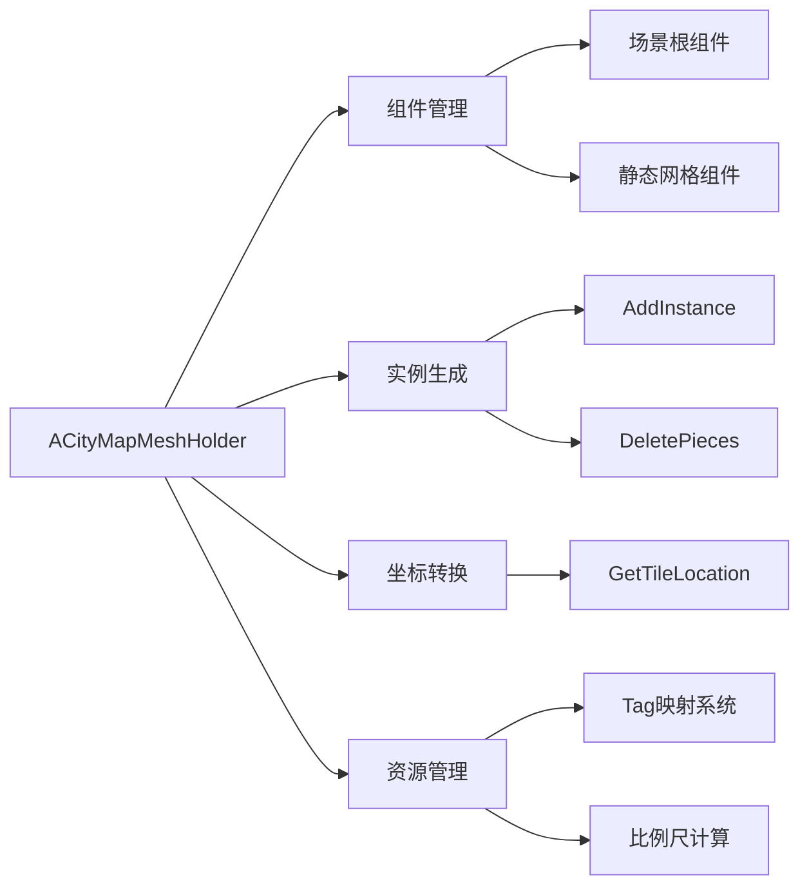

# CityMapMeshHolder 模块说明文档
## 概述
本模块为虚幻引擎Carla项目提供城市道路网格实例化管理功能，主要负责道路网格的生成、更新和销毁操作。核心类ACityMapMeshHolder继承自AActor，包含网格实例化、坐标转换、资源管理等功能，支持编辑器环境下的实时更新。

## 核心功能架构

## 核心方法说明
### 1. 构造函数
ACityMapMeshHolder::ACityMapMeshHolder(const FObjectInitializer& ObjectInitializer)
初始化流程
创建静态场景根组件（Mobility=Static）

预初始化所有标签类型的静态网格容器

禁用Actor Tick功能

关键参数
ObjectInitializer：虚幻引擎对象初始化器

NUMBER_OF_TAGS：通过CityMapMeshTag::GetNumberOfTags()获取标签总数

### 2. PostInitializeComponents
void ACityMapMeshHolder::PostInitializeComponents()
运行时逻辑
检查当前关卡有效性

检测附加道路部件是否存在

自动触发地图生成流程（当无附加部件时）

错误处理
输出错误日志：Please regenerate the road in edit mode...

### 3. AddInstance 方法组
基础版本
void AddInstance(ECityMapMeshTag Tag, uint32 X, uint32 Y)
使用默认旋转创建实例

旋转版本
void AddInstance(ECityMapMeshTag Tag, uint32 X, uint32 Y, float Angle)
Z轴旋转角度参数（弧度制）

高级版本
void AddInstance(ECityMapMeshTag Tag, FTransform Transform)
实例生成流程
配置生成参数：ESpawnActorCollisionHandlingMethod::AlwaysSpawn

生成AStaticMeshActor

设置静态属性：Mobility=Static

附加道路标签：UCarlaSettings::CARLA_ROAD_TAG

### 4. DeletePieces
void ACityMapMeshHolder::DeletePieces()
清理操作
销毁所有UInstancedStaticMeshComponent组件

遍历并销毁带CARLA_ROAD_TAG标签的附加Actor

设计特点
逆向遍历删除确保索引安全
// 示例1：传统数组遍历
for(int32 i=0; i<oldcomponents.Num(); i++) {
    oldcomponents[i]->DestroyComponent();
}

// 示例2：逆向遍历删除
for(int32 i=roadpieces.Num()-1; i>=0; i--) {
    if(roadpieces[i]->ActorHasTag(...)) {
        roadpieces[i]->Destroy();
    }
}
  ### 存在的问题
索引管理复杂：需要手动控制索引范围，易出现越界

逆向遍历不直观：i--方式不符合自然阅读顺序

空指针风险：未检查数组元素有效性

删除元素后迭代器失效：直接删除元素可能导致后续索引错位

  ### 改进方案与分步讲解
优化目标
提高代码可读性

增强空指针安全性

避免迭代器失效

利用现代C++特性

### 改进示例1：范围for循环
// 原始代码
for(int32 i=0; i<oldcomponents.Num(); i++) {
    oldcomponents[i]->DestroyComponent();
}

// 改进代码
for (UInstancedStaticMeshComponent* Component : oldcomponents) {
    if (IsValid(Component)) {
        Component->DestroyComponent();
    }
}
优化点	说明
消除索引变量	使用范围for循环自动处理迭代
自动类型推导	使用auto/具体类型避免冗余类型声明
空指针检查	添加IsValid()安全检查
更清晰的语义	直接表达"遍历所有元素"的意图

### 5. UpdateMapScale
void ACityMapMeshHolder::UpdateMapScale()
比例计算规则
获取基础网格标签对应的静态网格

使用网格包围盒X轴尺寸作为地图比例基准

错误回退机制：比例设为1.0f

依赖关系
需要正确配置CityMapMeshTag::GetBaseMeshTag()对应的网格资源

编辑器集成
PostEditChangeProperty
void ACityMapMeshHolder::PostEditChangeProperty(FPropertyChangedEvent&)
编辑响应流程
删除现有部件

重新计算比例尺

触发地图更新

条件编译
仅在WITH_EDITOR宏定义时生效

坐标系统
GetTileLocation
FVector GetTileLocation(uint32 X, uint32 Y) const
转换公式
复制
WorldLocation = (X * MapScale, Y * MapScale, 0.0f)
设计规范
Z轴固定为地面层

使用浮点精度计算避免累积误差

数据管理
Tag映射系统
方法	功能
SetStaticMesh	建立Mesh-Tag双向映射
GetTag	通过Mesh反向查询标签
TagMap	内部维护的映射表
特性
支持动态更新映射关系

自动处理空指针情况

使用示例
典型工作流
// 初始化生成器
ACityMapMeshHolder* Holder = ...;

// 生成十字路口
Holder->AddInstance(RoadIntersection, 5, 5);
Holder->AddInstance(RoadTwoLanes, 5, 6, PI/2);
Holder->AddInstance(RoadTwoLanes, 5, 4, PI/2);

// 批量生成道路
for(int i=0; i<10; ++i) {
    Holder->AddInstance(RoadFourLanes, i, 3);
}

// 编辑器属性更新后自动触发重建
性能优化建议
实例合并：替换为InstancedStaticMeshComponent提升渲染效率

空间分区：实现基于位置的网格加载/卸载

异步生成：复杂地图采用分帧生成策略

资源池：复用已生成的静态网格Actor

调试技巧
// 打印当前地图信息
UE_LOG(LogCarla, Display, TEXT("MapScale: %.2f"), MapScale);

// 可视化调试
DrawDebugBox(GetWorld(), GetTileLocation(X,Y), FVector(MapScale/2), FColor::Green);
自定义标签系统
继承ECityMapMeshTag扩展新类型
重写GetNumberOfTags()返回总数
实现对应的SetStaticMesh配置

坐标系统扩展
// 支持Z轴高度
FVector GetTileLocation3D(uint32 X, uint32 Y, float Z) {
    return {X*MapScale, Y*MapScale, Z};
}

//2
# CityMapMeshTag 模块说明文档
## 概述
本模块为虚幻引擎（Unreal Engine）的Carla项目提供城市道路网格标签处理功能，包含基础标签获取、交叉路口尺寸定义以及枚举标签转字符串功能。所有定义均在 CityMapMeshTag 命名空间下。

## 函数说明
### 1. GetBaseMeshTag
ECityMapMeshTag CityMapMeshTag::GetBaseMeshTag()
功能
获取基础道路网格标签类型

返回值
ECityMapMeshTag::RoadTwoLanes_LaneLeft - 表示默认的双车道左车道道路类型

典型用途
初始化道路生成系统时作为默认道路配置

道路网络生成的基准参考类型

### 2. GetRoadIntersectionSize
uint32 CityMapMeshTag::GetRoadIntersectionSize()
功能
获取道路交叉口的基准尺寸

返回值
5u (uint32类型) - 表示交叉口的边长尺寸（单位需根据项目约定，通常为米）

注意
该值可能对应交叉路口地面网格的边长参数

用于生成标准十字路口的尺寸计算

### 3. ToString

FString CityMapMeshTag::ToString(ECityMapMeshTag Tag)
功能
将枚举标签转换为可读字符串

参数
Tag (ECityMapMeshTag) - 需要转换的道路网格枚举标签

返回值
对应枚举值的字符串名称

若枚举类型未找到则返回 "Invalid"

实现细节
使用 FindObject 在内存中查找 ECityMapMeshTag 枚举类型

通过虚幻引擎的反射系统获取枚举值的字符串表示

包含错误处理机制，确保非法枚举值的容错性

典型用途
调试时输出可读的标签信息

日志记录时保存枚举类型信息

可视化界面显示标签类型

## 使用示例

// 获取基础道路标签
ECityMapMeshTag BaseTag = CityMapMeshTag::GetBaseMeshTag();

// 获取交叉口尺寸参数
uint32 IntersectionSize = CityMapMeshTag::GetRoadIntersectionSize();

// 枚举值转字符串
FString TagName = CityMapMeshTag::ToString(ECityMapMeshTag::RoadFourLanes_LaneLeft);
// 输出结果："RoadFourLanes_LaneLeft"
