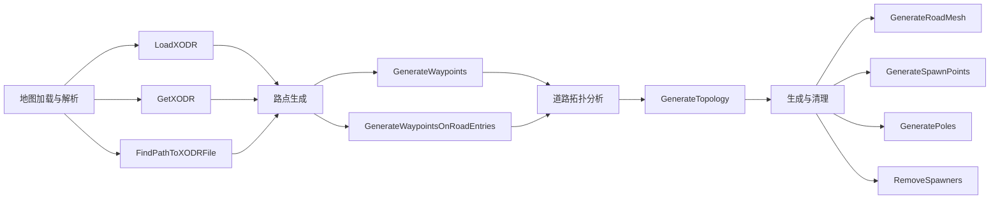

# OpenDrive 模块说明文档
# 目录
- [项目概述](#项目概述)
- [结构化设计](#结构化设计)
- [主要功能模块](#主要功能模块)
  - [1. 地图加载与解析](#1-地图加载与解析)
  - [2. 路点生成](#2-路点生成)
  - [3. 道路拓扑分析](#3-道路拓扑分析)
  - [4. 生成与清理](#4-生成与清理)
- [模块架构图](#模块架构图)
- [关键类与接口说明](#关键类与接口说明)
  - [1. UOpenDrive 类](#1-UOpenDrive类)
  - [2. UOpenDriveMap类](#2-UOpenDriveMap类)
  - [3. AOpenDriveActor类](#3-AOpenDriveActor类)
  - [4. AOpenDriveGenerator类](#4-AOpenDriveGenerator类)
- [用户定制](#用户定制)
## 项目概述
`OpenDrive` 模块主要涉及车辆模拟中的地图数据处理和路径规划，依赖于 Carla 引擎提供的 OpenDrive 格式（XODR）。该项目的核心是处理模拟世界中的道路网络数据，使用 OpenDrive 文件格式（.xodr）来表示道路的拓扑结构、车道、交叉路口以及其他与交通相关的信息。通过这个模块，用户可以方便地加载、管理和操作 OpenDrive 文件，从而为自动驾驶和路径规划提供支持。

## 结构化设计

`OpenDrive` 模块采用面向对象的设计，功能模块之间解耦，便于扩展和维护。该模块由多个类和函数组成，每个组件处理不同的任务。例如，`UOpenDrive` 类用于解析和加载 OpenDrive 文件，`UOpenDriveMap` 类用于管理地图数据并提供路径生成和路径计算功能。
该设计模式使得不同的操作（如路径生成、地图解析和路径计算）可以独立进行，同时也简化了后续的功能扩展。

## 主要功能模块
 
### 1. 地图加载与解析
UOpenDrive 类提供了用于加载和解析 OpenDrive 文件（XODR）的方法：

LoadXODR：从指定路径加载 OpenDrive 数据。

GetXODR：从世界实例获取与当前地图相关的 OpenDrive 数据。

FindPathToXODRFile：查找指定地图的 OpenDrive 文件路径。

```cpp
// 加载OpenDrive文件
FString UOpenDrive::LoadXODR(const FString &MapName) {
    return FFileHelper::LoadFileToString(*FindPathToXODRFile(MapName));
}
// 获取当前世界的OpenDrive数据
FString UOpenDrive::GetXODR(const UWorld *World) {
    return LoadXODR(World->GetMapName());
}
// 查找OpenDrive文件路径
FString UOpenDrive::FindPathToXODRFile(const FString &MapName) {
    return FPaths::ProjectContentDir() + TEXT("Carla/Maps/OpenDrive/") + MapName + TEXT(".xodr");
}
```
### 2. 路点生成
UOpenDriveMap 类提供了多个函数来生成地图中的路点：

GenerateWaypoints：基于给定的距离生成路点。

GenerateWaypointsOnRoadEntries：根据每条道路的入口生成路点。

```cpp
// 生成路点
TArray<FWaypoint> UOpenDriveMap::GenerateWaypoints(float Distance) const {
    return Map->GenerateWaypoints(Distance);
}

// 生成道路入口路点
TArray<FWaypoint> UOpenDriveMap::GenerateWaypointsOnRoadEntries() const {
    return Map->GenerateWaypointsOnRoadEntries();
}
```
### 3. 道路拓扑分析
GenerateTopology：生成道路的拓扑结构，将道路连接信息表示为 FWaypointConnection 数组，描述道路间的连接关系。

```cpp
// 生成道路拓扑
TArray<FWaypointConnection> UOpenDriveMap::GenerateTopology() const {
    return Map->GenerateTopology();
}
```
### 4. 生成与清理
该模块负责在地图上生成和清理道路网格、生成器等对象：

GenerateRoadMesh：生成道路网格，基于 OpenDrive 数据创建场景中的可视化道路模型。

GenerateSpawnPoints：生成车辆生成点。

GeneratePoles：生成路上的杆子（例如交通标志杆）。

RemoveSpawners：清理生成点。

```cpp
void AOpenDriveGenerator::GenerateRoadMesh()
// 生成道路网格
void AOpenDriveGenerator::GenerateRoadMesh() {
    auto Meshes = carla::opendrive::OpenDriveParser::Load(carla::rpc::FromLongFString(UOpenDrive::GetXODR(GetWorld())))->GenerateChunkedMesh();
    for (auto &Mesh : Meshes) { /* 生成网格 */ }
}
// 生成车辆生成点
void AOpenDriveGenerator::GenerateSpawnPoints() {
    for (auto &Wp : CarlaMap->GenerateWaypointsOnRoadEntries()) {
        GetWorld()->SpawnActor<AVehicleSpawnPoint>(); // 创建生成点
    }
}
// 生成交通标志杆
void AOpenDriveGenerator::GeneratePoles() {
    for (auto &Wp : CarlaMap->GenerateWaypointsOnRoadEntries()) {
        ATrafficSignPost* Pole = GetWorld()->SpawnActor<ATrafficSignPost>(); // 创建交通标志杆
        if (Pole) {
            Pole->SetActorLocation(CarlaMap->ComputeTransform(Wp).GetLocation() + FVector(0.f, 0.f, 10.f)); // 设置位置
            Pole->SetActorRotation(CarlaMap->ComputeTransform(Wp).GetRotation()); // 设置旋转
        }
    }
}
// 清理生成点
void AOpenDriveGenerator::RemoveSpawners() {
    for (auto &Spawner : VehicleSpawners) Spawner->Destroy();
    VehicleSpawners.Empty();
}
```
## 模块架构图
`OpenDrive` 模块的架构基于 Carla 引擎和 OpenDrive 格式，分为多个功能组件。每个组件独立执行特定任务，这有助于提高计算效率并支持后续扩展。




## 关键类与接口说明

### 1. UOpenDrive类
UOpenDrive 类是加载和处理 OpenDrive 数据的核心类，提供了对 OpenDrive 文件的加载和解析操作，能够将 XODR 文件转换为 Carla 可使用的地图数据。

```cpp
UCLASS(BlueprintType, Blueprintable)
class CARLA_API UOpenDrive : public UBlueprintFunctionLibrary
{
    GENERATED_BODY()
    
public:
    UFUNCTION(BlueprintCallable, Category="CARLA|OpenDrive")
    static FString GetXODR(const UWorld *World);
}
```
### 2. UOpenDriveMap类
UOpenDriveMap 类用于存储和操作 OpenDrive 数据。它提供了生成路点、计算路点位置、计算路点变换等功能。

```cpp
UCLASS(BlueprintType, Blueprintable)
class CARLA_API UOpenDriveMap : public UObject
{
    GENERATED_BODY()
    
public:
    UFUNCTION(BlueprintCallable)
    bool Load(const FString &XODRContent);
    
    UFUNCTION(BlueprintCallable)
    TArray<FWaypoint> GenerateWaypoints(float ApproxDistance = 100.0f) const;
}
```
### 3. AOpenDriveActor类
AOpenDriveActor 类用于将 OpenDrive 数据可视化，生成道路网格，并在场景中添加相应的对象（如生成器、路标等）。

```cpp
UCLASS()
class CARLA_API AOpenDriveActor : public AActor
{
    GENERATED_BODY()
    
public:
    void BuildRoutes();
    void AddSpawners();
    void RemoveRoutes();
}
```
### 4. AOpenDriveGenerator类
AOpenDriveGenerator 类负责生成与 OpenDrive 数据相关的场景内容，包括道路网格、生成点、杆子等。它从 OpenDrive 文件中提取数据并将其转化为 Unreal Engine 中的可视化对象。

```cpp
UCLASS()
class CARLA_API AOpenDriveGenerator : public AActor
{
    GENERATED_BODY()

public:
    bool LoadOpenDrive(const FString &OpenDrive);
    void GenerateAll();
}
```
## 用户定制
用户可以通过自定义 OpenDrive 文件来调整地图的生成和显示效果。用户可以通过设置不同的生成参数（如道路精度、生成点高度等）来控制生成内容的样式和布局。此外，用户还可以调整生成的道路网格和交通标志的显示与隐藏，以满足特定的场景需求。
