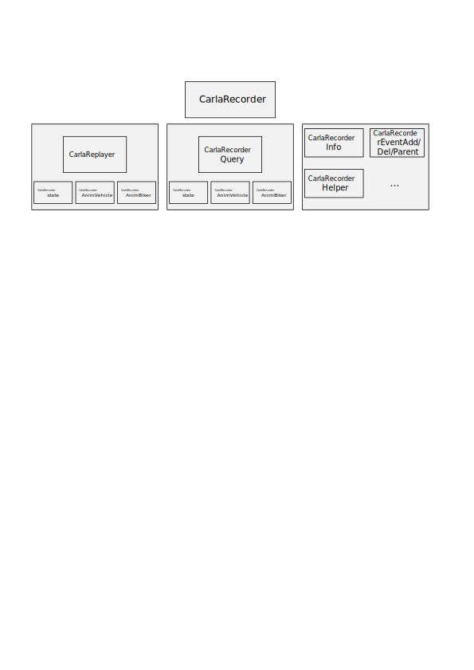

---

# CARLA Recorder 模块说明文档

本文档详细介绍了 CARLA 模拟器中 CarlaRecorder 模块的主要功能、核心类与方法定义及其模块间依赖关系，旨在帮助开发者理解其录像与回放机制，并把握模块层次结构。

---

## 📑 目录

1. [模块概述](#模块概述)
2. [主要类与职责](#主要类与职责)
3. [功能说明](#功能说明)
4. [关键数据结构](#关键数据结构)
5. [依赖模块与层级流程](#依赖模块与层级流程)
6. [附录：包结构](#附录包结构)
7. [附加模块：CarlaRecorderAnimBiker](#附加模块carlarecorderanimbiker)

---

## 模块概述

CarlaRecorder 模块主要负责 CARLA 中仿真数据的录制与回放操作。包括对车辆、行人、光照、碰撞等实体状态的记录、存储与回放控制。其实现涉及数据包编码、查询分析、时间控制等多个子模块。

---

## 主要类与职责

| 类名                   | 文件                                    | 说明                                     |
| -------------------- | ------------------------------------- | -------------------------------------- |
| `ACarlaRecorder`     | `CarlaRecorder.h / CarlaRecorder.cpp` | 主要控制类，继承自 Unreal 的 `AActor`，提供录像/回放接口。 |
| `CarlaReplayer`      | `CarlaReplayer.h`                     | 实现回放控制，包括时间倍率、忽略特定角色等设置。               |
| `CarlaRecorderQuery` | `CarlaRecorderQuery.h`                | 用于分析已录制文件的数据，如碰撞信息、阻塞信息等。              |

---

## 功能说明

### 初始化

```cpp
ACarlaRecorder::ACarlaRecorder()
```

* 设置 TickGroup 为 `TG_PrePhysics`
* 默认禁用录像功能

### 录像控制

```cpp
void Enable()
void Disable()
void Ticking(float DeltaSeconds)
```

* `Ticking()` 方法被定期调用以采集仿真状态
* 使用 `PlatformTime` 与 `VisualTime` 跟踪物理时间与视觉时间
* 与 `CarlaEpisode` 和 `FActorRegistry` 联动获取仿真环境信息

### 回放控制

```cpp
std::string ReplayFile(std::string Name, double TimeStart, double Duration, uint32_t FollowId, bool ReplaySensors)
void SetReplayerTimeFactor(double TimeFactor)
void SetReplayerIgnoreHero(bool IgnoreHero)
void SetReplayerIgnoreSpectator(bool IgnoreSpectator)
void StopReplayer(bool KeepActors)
```

* 通过 `ReplayFile()` 加载文件并控制回放参数
* 支持设置时间倍率与忽略特定角色
* `StopReplayer()` 控制是否保留回放后生成的角色对象

### 查询功能

```cpp
std::string ShowFileInfo(std::string Name, bool bShowAll)
std::string ShowFileCollisions(std::string Name, char Type1, char Type2)
std::string ShowFileActorsBlocked(std::string Name, double MinTime, double MinDistance)
```

* `QueryInfo()`：查看录制文件的基础信息
* `QueryCollisions()`：查询特定对象类型之间的碰撞事件
* `QueryBlocked()`：查找因距离/时间被阻挡的实体

---

## 关键数据结构

| 结构体                         | 描述                                          |
| --------------------------- | ------------------------------------------- |
| `CarlaRecorderPlatformTime` | 记录平台物理时间信息，用于时间对齐                           |
| `CarlaRecorderVisualTime`   | 存储视觉时间戳，与画面帧同步                              |
| `CarlaRecorderPacketId`     | 枚举各类数据包标识，如 FrameStart、Collision、EventAdd 等 |

---

## 依赖模块与层级流程

### 模块依赖流程图

```


```

### 各级说明

* **ACarlaRecorder（顶层控制器）**
  提供录像和回放的主要接口，是模块的入口类。它控制 Replayer 和 Query 子模块的使用。

* **CarlaReplayer（回放控制器）**
  管理回放过程，控制时间倍率、跟踪 ID、忽略设置等，依赖多个状态与动画模块：

  * **CarlaRecorderState**：保存每一帧的对象状态信息
  * **CarlaRecorderAnimVehicle**：记录车辆动画数据（速度、油门、转向等）
  * **CarlaRecorderAnimBiker**：记录骑行者动画数据

* **CarlaRecorderQuery（数据查询器）**
  用于从录制文件中分析碰撞、阻塞等行为，依赖：

  * **CarlaRecorderCollision**：存储碰撞事件
  * **CarlaRecorderWalkerBones**：记录行人骨骼信息
  * **CarlaRecorderAnimBiker**：查询骑行者动画行为

* **CarlaRecorderInfo / Event 系列**

  * `CarlaRecorderInfo`：包含帧开始、结束、平台时间等全局信息
  * `EventAdd` / `EventDel` / `EventParent`：记录实体的创建、销毁与父子关系

* **CarlaRecorderHelper**
  提供通用辅助函数，如读取头信息、数据解码、ID 映射等

---

## 附录：包结构

```
Carla/
 ├── Source/
 │   └── Carla/
 │       └── Recorder/
 │            ├── CarlaRecorder.cpp
 │            ├── CarlaRecorder.h
 │            ├── CarlaRecorderQuery.h
 │            ├── CarlaRecorder[模块].h (多个)
 │            └── CarlaReplayer.h
```

---

## 🔄 附加模块：CarlaRecorderAnimBiker

该模块用于记录骑行者（骑车人）的动画数据，是 `Recorder` 系统中专门处理骑行者运动状态的子模块。

### 主要结构体与类

| 名称                        | 类型       | 说明                          |
| ------------------------- | -------- | --------------------------- |
| `CarlaRecorderAnimBiker`  | `struct` | 表示单个骑行者的动画状态记录，包含速度、引擎转速等属性 |
| `CarlaRecorderAnimBikers` | `class`  | 管理多个骑行者动画记录集合，支持批量读写与清空操作   |

### 核心方法说明

#### `CarlaRecorderAnimBiker`

* `void Write(std::ostream &OutFile) const`
  将 `DatabaseId`、`ForwardSpeed`、`EngineRotation` 写入输出流

* `void Read(std::istream &InFile)`
  从输入流读取上述属性以恢复对象状态

#### `CarlaRecorderAnimBikers`

* `void Add(const CarlaRecorderAnimBiker &Biker)`
  添加单个动画记录项到内部容器

* `void Clear()`
  清空所有骑行者记录

* `void Write(std::ostream &OutFile) const`
  写入数据包头、记录数量及所有骑行者对象数据到输出流

* `void Read(std::istream &InFile)`
  从输入流批量读取骑行者记录数据

* `const std::vector<CarlaRecorderAnimBiker>& GetBikers()`
  提供访问骑行者记录集合的只读引用

### 数据格式规范

该模块使用的数据包类型标识为 `CarlaRecorderPacketId::AnimBiker`，在录制/回放过程中可通过该标识对包类型进行分类处理。

---

