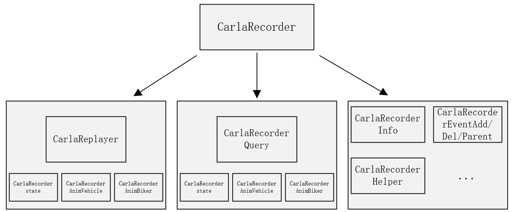

---

# CARLA Recorder 模块说明文档

本文档详细介绍了 CARLA 模拟器中 CarlaRecorder 模块的主要功能、核心类与方法定义及其模块间依赖关系，旨在帮助开发者理解其录像与回放机制，并把握模块层次结构。

---

## 目录

1. [模块概述](#模块概述)
2. [主要类与职责](#主要类与职责)
3. [功能说明](#功能说明)
   - [初始化](#初始化)
   - [录像控制](#录像控制)
   - [回放控制](#回放控制)
   - [查询功能](#查询功能)
4. [关键数据结构](#关键数据结构)
5. [依赖模块与层级流程](#依赖模块与层级流程)
6. [附录：包结构](#附录包结构)
7. [附加模块：CarlaRecorderAnimBiker](#附加模块carlarecorderanimbiker)
8. [附加模块：CarlaRecorderAnimVehicles](#附加模块CarlaRecorderAnimVehicles)
9. [附加模块：CarlaRecorderAnimVehiclesWheels](#附加模块CarlaRecorderAnimVehiclesWheels)
10. [常见问题与调试建议](#常见问题与调试建议)
---

## 模块概述

CarlaRecorder 模块是 CARLA 模拟器中实现仿真状态完整复现的关键组件。它负责在仿真运行时对车辆、行人、光照条件、碰撞等状态数据进行高效记录，并支持后续的精准回放。其核心功能包括数据采集、压缩编码、文件读写、时间控制及信息查询等。该模块特别适用于实验复现、调试定位及行为重构等应用场景。

---

## 主要类与职责 

| 类名                   | 文件                                    | 说明               | 调用位置   |
| -------------------- | ------------------------------------- | -------------------------------------- |-------------------- | 
| `ACarlaRecorder`     | `CarlaRecorder.h / CarlaRecorder.cpp` | 主要控制类，继承自 Unreal `AActor`，提供录像/回放接口。 | 在主控制器（如 GameMode）中启动      |
| `CarlaReplayer`      | `CarlaReplayer.h`                     | 实现回放控制，包括时间倍率、忽略特定角色等设置。               |由 ACarlaRecorder::ReplayFile() 触发      |
| `CarlaRecorderQuery` | `CarlaRecorderQuery.h`                | 用于分析已录制文件的数据，如碰撞信息、阻塞信息等。              | 用于脚本分析或命令行查询工具 |

---

## 功能说明

### 初始化

```cpp
ACarlaRecorder::ACarlaRecorder()
```

设置 TickGroup 为 `TG_PrePhysics`

默认禁用录像功能

### 录像控制

```cpp
void Enable()
void Disable()
void Ticking(float DeltaSeconds)
```

```cpp
// 录像流程
if (Recorder.IsEnabled()) {
    Recorder.Ticking(DeltaSeconds);
        └──> 调用 Snapshot -> 记录实体状态 -> 写入数据包
}
```


`Ticking()` 方法被定期调用以采集仿真状态

使用 `PlatformTime` 与 `VisualTime` 跟踪物理时间与视觉时间

与 `CarlaEpisode` 和 `FActorRegistry` 联动获取仿真环境信息

### 示例：如何开始一次录像
```cpp
// 开启录像
CarlaRecorder.Enable();
// 运行一段时间后关闭
CarlaRecorder.Disable();
```

### 回放控制

```cpp
std::string ReplayFile(std::string Name, double TimeStart, double Duration, uint32_t FollowId, bool ReplaySensors)
void SetReplayerTimeFactor(double TimeFactor)
void SetReplayerIgnoreHero(bool IgnoreHero)
void SetReplayerIgnoreSpectator(bool IgnoreSpectator)
void StopReplayer(bool KeepActors)
```

通过 `ReplayFile()` 加载文件并控制回放参数

支持设置时间倍率与忽略特定角色
`SetReplayerTimeFactor()`：设置播放倍速
`StopReplayer()` 控制是否保留回放后生成的角色对象

### 查询功能

```cpp
std::string ShowFileInfo(std::string Name, bool bShowAll)
std::string ShowFileCollisions(std::string Name, char Type1, char Type2)
std::string ShowFileActorsBlocked(std::string Name, double MinTime, double MinDistance)
```

` ShowFileInfo()`：查看录制文件的基础信息

` ShowFileCollisions()`：查询特定对象类型之间的碰撞事件

`ShowFileActorsBlocked()`：查找因距离/时间被阻挡的实体

---

## 关键数据结构

| 结构体                         | 描述                                          |
| --------------------------- | ------------------------------------------- |
| `CarlaRecorderPlatformTime` | 记录平台物理时间信息，用于时间对齐                           |
| `CarlaRecorderVisualTime`   | 存储视觉时间戳，与画面帧同步                              |
| `CarlaRecorderPacketId`     | 枚举各类数据包标识，如 FrameStart、Collision、EventAdd 等 |

---

## 依赖模块与层级流程

### 模块依赖流程图





### 各级说明

**ACarlaRecorder（顶层控制器）**
  提供录像和回放的主要接口，是模块的入口类。它控制 Replayer 和 Query 子模块的使用。

**CarlaReplayer（回放控制器）**
  管理回放过程，控制时间倍率、跟踪 ID、忽略设置等，依赖多个状态与动画模块：

**CarlaRecorderState**：保存每一帧的对象状态信息

**CarlaRecorderAnimVehicle**：记录车辆动画数据（速度、油门、转向等）

**CarlaRecorderAnimBiker**：记录骑行者动画数据

**CarlaRecorderQuery（数据查询器）**
  用于从录制文件中分析碰撞、阻塞等行为，依赖：

**CarlaRecorderCollision**：存储碰撞事件

**CarlaRecorderWalkerBones**：记录行人骨骼信息

**CarlaRecorderAnimBiker**：查询骑行者动画行为

**CarlaRecorderInfo / Event 系列**

CarlaRecorderInfo：包含帧开始、结束、平台时间等全局信息

EventAdd/EventDel/EventParent：记录实体的创建、销毁与父子关系

**CarlaRecorderHelper**
  提供通用辅助函数，如读取头信息、数据解码、ID 映射等

---

## 附录：包结构

```
Carla/
 ├── Source/
 │   └── Carla/
 │       └── Recorder/
 │            ├── CarlaRecorder.cpp
 │            ├── CarlaRecorder.h
 │            ├── CarlaRecorderQuery.h
 │            ├── CarlaRecorder[模块].h (多个)
 │            └── CarlaReplayer.h
```

---

##  附加模块：CarlaRecorderAnimBiker

该模块用于记录骑行者（骑车人）的动画数据，是 `Recorder` 系统中专门处理骑行者运动状态的子模块。

### 主要结构体与类

| 名称                        | 类型       | 说明                          |
| ------------------------- | -------- | --------------------------- |
| `CarlaRecorderAnimBiker`  | `struct` | 表示单个骑行者的动画状态记录，包含速度、引擎转速等属性 |
| `CarlaRecorderAnimBikers` | `class`  | 管理多个骑行者动画记录集合，支持批量读写与清空操作   |

### 核心方法说明

#### `CarlaRecorderAnimBiker`

`void Write(std::ostream &OutFile) const`
  将 `DatabaseId`、`ForwardSpeed`、`EngineRotation` 写入输出流

`void Read(std::istream &InFile)`
  从输入流读取上述属性以恢复对象状态

#### `CarlaRecorderAnimBikers`

`void Add(const CarlaRecorderAnimBiker &Biker)`
  添加单个动画记录项到内部容器

`void Clear()`
  清空所有骑行者记录

`void Write(std::ostream &OutFile) const`
  写入数据包头、记录数量及所有骑行者对象数据到输出流

`void Read(std::istream &InFile)`
  从输入流批量读取骑行者记录数据

`const std::vector<CarlaRecorderAnimBiker>& GetBikers()`
  提供访问骑行者记录集合的只读引用

### 数据格式规范

该模块使用的数据包类型标识为 `CarlaRecorderPacketId::AnimBiker`，在录制/回放过程中可通过该标识对包类型进行分类处理。

---

#  附加模块：CarlaRecorderAnimVehicles

---

## 模块概览

该模块用于记录和管理多个车辆的动画信息，支持序列化读写操作，主要用于仿真环境中的数据回放、状态还原等功能场景。

---

## CarlaRecorderAnimVehicle 结构体

用于表示单个车辆在某一时刻的动画状态信息。

### 成员变量说明

| 成员名          | 类型         | 说明               |
| ------------ | ---------- | ---------------- |
| `DatabaseId` | `uint32_t` | 数据库中该车辆的唯一标识符    |
| `Steering`   | `float`    | 转向角度值（如方向盘偏转）    |
| `Throttle`   | `float`    | 油门开度（0\~1）       |
| `Brake`      | `float`    | 刹车开度（0\~1）       |
| `bHandbrake` | `bool`     | 手刹状态（true 表示已拉起） |
| `Gear`       | `int32_t`  | 当前挡位（如 -1 表示倒档）  |

### 成员函数说明

| 函数名                    | 参数类型 | 返回值类型  | 说明            |
| ---------------------- | ---- | ------ | ------------- |
| `Read(std::istream&)`  | 输入流  | `void` | 从输入流中读取该结构体内容 |
| `Write(std::ostream&)` | 输出流  | `void` | 将该结构体内容写入输出流中 |

---

##  CarlaRecorderAnimVehicles 类

用于管理多个车辆动画信息对象，并提供读写与集合操作功能。

### 成员函数说明

| 函数名                                    | 参数类型     | 返回值类型                                          | 说明                  |
| -------------------------------------- | -------- | ---------------------------------------------- | ------------------- |
| `Add(const CarlaRecorderAnimVehicle&)` | 单个车辆信息对象 | `void`                                         | 添加一个车辆动画信息到集合中      |
| `Clear()`                              | 无        | `void`                                         | 清空集合                |
| `Write(std::ostream&)`                 | 输出流      | `void`                                         | 将所有车辆动画信息写入输出流（如文件） |
| `Read(std::istream&)`                  | 输入流      | `void`                                         | 从输入流读取多个车辆动画信息      |
| `GetVehicles()`                        | 无        | `const std::vector<CarlaRecorderAnimVehicle>&` | 获取只读车辆动画信息集合引用      |

### 成员变量说明（私有）

| 成员名        | 类型                                      | 说明                 |
| ---------- | --------------------------------------- | ------------------ |
| `Vehicles` | `std::vector<CarlaRecorderAnimVehicle>` | 用于存储所有车辆的动画信息结构体集合 |

---

## 内存与对齐优化

使用 `#pragma pack(push, 1)` 和 `#pragma pack(pop)` 精确控制结构体的字节对齐方式（1 字节对齐），以确保与二进制数据一致，便于持久化与传输。
使用 `#pragma once` 避免头文件重复包含，保证编译效率与正确性。

---

## 模块功能总结

| 功能           | 描述                                |
| ------------ | --------------------------------- |
| 单车动画信息的读取与写入 | 结构体支持从/向文件流中高效读取或写入车辆动画状态         |
| 多车数据集合管理     | 类封装 vector 操作，支持添加、清空、读取与输出多个车辆状态 |
| 二进制数据对齐      | 使用 1 字节对齐方式确保跨平台或跨系统的二进制数据兼容性     |

---

# 附加模块CarlaRecorderAnimVehiclesWheels

该模块属于 **CARLA 模拟器** 车辆动画记录系统的一部分，主要用于序列化和反序列化车辆 **车轮动画信息**（如方向盘角度、轮胎转速等），支持多车辆场景下的录制与回放。

本模块包含以下关键组件：

`WheelInfo`: 单个车轮状态信息结构体

`CarlaRecorderAnimWheels`: 单辆车的轮胎状态记录

`CarlaRecorderAnimVehicleWheels`: 多辆车的轮胎状态集合与操作接口

---

## 1. `struct WheelInfo`

表示单个车轮的动画状态。该结构体通过 `#pragma pack(push, 1)` 控制内存对齐为 1 字节，以便高效序列化。

### 成员变量

| 成员              | 类型                      | 描述           |
| --------------- | ----------------------- | ------------ |
| `Location`      | `EVehicleWheelLocation` | 枚举，表示车轮位置    |
| `SteeringAngle` | `float`                 | 转向角（单位：角度）   |
| `TireRotation`  | `float`                 | 轮胎旋转角（单位：角度） |

### 方法

#### `void Write(std::ostream &OutFile) const`

将 `WheelInfo` 写入二进制输出流。

#### `void Read(std::istream &InFile)`

从输入流中读取数据，填充 `WheelInfo` 字段。

---

## 2. `struct CarlaRecorderAnimWheels`

表示单辆车的所有车轮动画状态集合。

### 成员变量

| 成员名           | 类型                       | 描述         |
| ------------- | ------------------------ | ---------- |
| `DatabaseId`  | `uint32_t`               | 数据库中车辆唯一标识 |
| `WheelValues` | `std::vector<WheelInfo>` | 所有车轮的信息集合  |

### 方法

#### `void Write(std::ostream &OutFile)`

写入车辆 ID 和所有轮胎信息到输出流。

#### `void Read(std::istream &InFile)`

读取车辆 ID 与车轮信息，构建完整对象。

---

## 3. `class CarlaRecorderAnimVehicleWheels`

负责管理 **多辆车的轮胎动画信息**，可用于录制与回放。

### 成员变量

| 成员名             | 类型                                     | 描述         |
| --------------- | -------------------------------------- | ---------- |
| `VehicleWheels` | `std::vector<CarlaRecorderAnimWheels>` | 存储多辆车的轮胎数据 |

### 方法

#### `void Add(const CarlaRecorderAnimWheels &InObj)`

添加一辆车的轮胎动画数据。

#### `void Clear(void)`

清空所有记录。

#### `void Write(std::ostream &OutFile)`

按以下格式序列化写入数据：

1. 数据包 ID（枚举 `CarlaRecorderPacketId::AnimVehicleWheels`）
2. 占位区（写入后回填实际包大小）
3. 车辆数
4. 每辆车的 `CarlaRecorderAnimWheels`
5. 回填实际包大小

#### `void Read(std::istream &InFile)`

读取车辆数量与每辆车的轮胎信息。

#### `const std::vector<CarlaRecorderAnimWheels>& GetVehicleWheels()`

返回所有车辆轮胎数据的引用。

## 常见问题与调试建议

- **问题：录像文件无法加载**
  - 请检查路径是否正确，录制时是否成功写入磁盘。
  - 使用 `ShowFileInfo()` 方法检查文件结构是否完整。

- **问题：回放时某些角色未出现**
  - 检查是否设置了 `IgnoreHero` 或 `IgnoreSpectator` 为 true。
  - 确认相关角色在录制期间已生成并被记录。

- **调试建议：**
  - 使用 `QueryCollisions()` 对回放数据进行验证，分析实体是否按预期交互。

---
