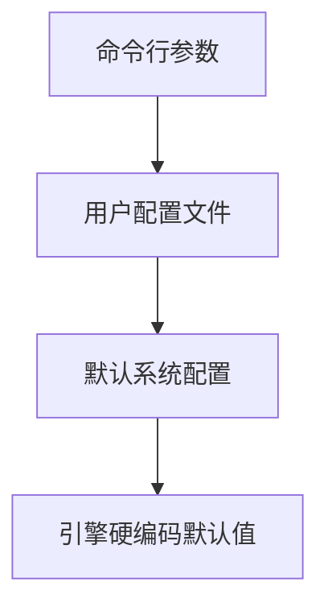
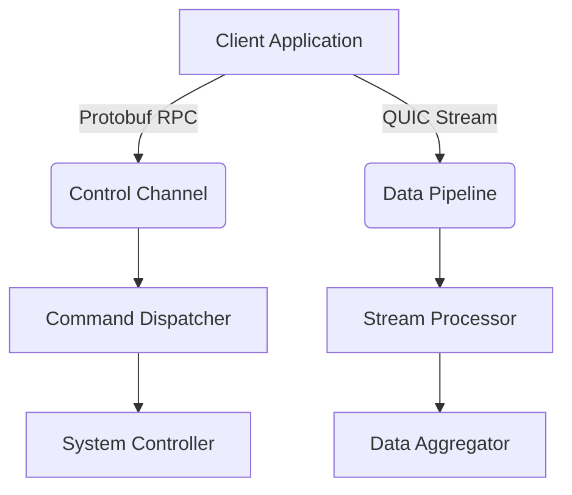
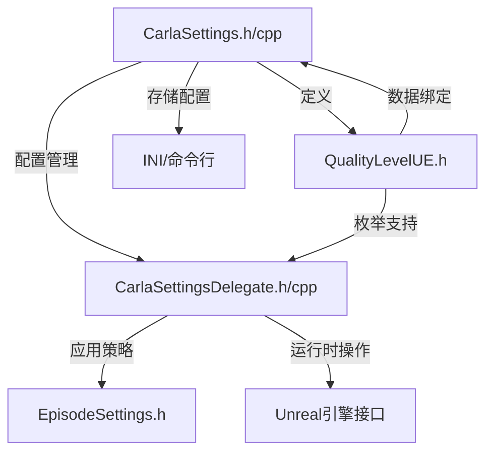
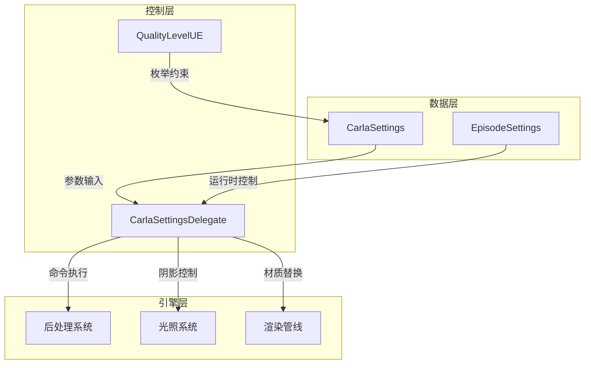

# 目录
- [一.核心配置管理模块](#一核心配置管理模块)
  - [1.全局配置框架](#1全局配置框架)
    - [1.1 核心配置类 UCarlaSettings](#11-核心配置类-ucarlasettings)
      - [类定义](#类定义)
    - [1.2 参数配置矩阵](#12-参数配置矩阵)
  - [2.运行模式管理系统](#2运行模式管理系统)
    - [2.1 单次模拟剧集配置](#21-单次模拟剧集配置)
    - [2.2 运行时控制接口](#22-运行时控制接口)
    - [2.3 动态参数更新机制](#23-动态参数更新机制)
  - [3.配置加载策略](#3配置加载策略)
    - [3.1 多级覆盖机制](#31-多级覆盖机制)
    - [3.2 优先级实现逻辑](#32-优先级实现逻辑)
  - [4.高级配置特性](#4高级配置特性)
    - [4.1 热重载支持](#41-热重载支持)
    - [4.2 混合配置模式](#42-混合配置模式)
- [二.画质管理模块](#二画质管理模块)
  - [2.1 画质等级定义](#21-画质等级定义)
  - [2.2 画质策略应用](#22-画质策略应用)
  - [2.3 动态调参系统](#23-动态调参系统)
    - [2.3.1 自动降级机制](#231-自动降级机制)
    - [2.3.2 画质参数混合](#232-画质参数混合)
- [三.服务端-客户端通信模块](#三服务端-客户端通信模块)
  - [3.1 配置管理结构](#31-配置管理结构)
  - [3.2 模块架构设计](#32-模块架构设计)
  - [3.3 安全策略](#33-安全策略)
    - [3.3.1 端口保护机制](#331-端口保护机制)
- [四.调试与日志模块](#四调试与日志模块)
  - [4.1 接口定义](#41-接口定义)
  - [4.2 模块特性说明](#42-模块特性说明)
- [五.结构树](#五结构树)
- [六.关键设计原则](#六关键设计原则)
  - [6.1 分层解耦](#61-分层解耦)
  - [6.2 可扩展性](#62-可扩展性)
  - [6.3 跨模式支持](#63-跨模式支持)
- [七 总结](#七-总结)
  - [7.1  文件关联图](#71-文件关联图)
  - [7.2 核心功能解析](#72-核心功能解析)
  - [7.3 关键交互流程](#73-关键交互流程)
  - [7.4 设计模式应用](#74-设计模式应用)
  - [7.5 跨模块协作](#75-跨模块协作)
  - [7.6 关键架构优势](#76-关键架构优势)
  - [7.7 典型数据流示例](#77-典型数据流示例)

# 一.核心配置管理模块
## 1.全局配置框架
### 1.1 核心配置类 UCarlaSettings
#### 类定义
- **代码示例**：
    ```cpp
        UCLASS(Config=Game, DefaultConfig)
        class CARLA_API UCarlaSettings : public UObject
        {
        GENERATED_BODY()
        public:
        // 网络通信参数
        UPROPERTY(Config, EditAnywhere, Category="Network")
        int32 RPCPort = 2000;  // RPC主通信端口
        UPROPERTY(Config, EditAnywhere, Category="Network")
        int32 StreamingPort = 2001;  // 视频流端口
        // 运行模式控制
        UPROPERTY(Config, EditAnywhere, Category="Simulation")
        bool bSynchronousMode = false;  // 同步模式开关
        UPROPERTY(Config, EditAnywhere, Category="Rendering")
        bool bDisableRendering = false;  // 无头模式开关
        };
    ```
- **涉及文件**：
- `CarlaSettings.h`：   
  - ：声明配置参数和加载接口
- `CarlaSettings.cpp`：   
  - ：实现动态配置加载逻辑

### 1.2 参数配置矩阵

| 配置参数               | 类型   | 默认值 | Config 分类   | 动态性    | 说明                                 |
|------------------------|--------|--------|---------------|-----------|--------------------------------------|
| **RPCPort**            | int32  | 2000   | Network       | 静态      | RPC通信主通道                        |
| **StreamingPort**      | int32  | 2001   | Network       | 动态      | 视频流传输端口                       |
| **bSynchronousMode**   | bool   | false  | Simulation    | 热更新    | 同步仿真模式开关                     |
| **TextureStreamingPool** | int32 | 2048  | Rendering     | 冷更新    | 纹理流送内存分配（单位：MB）         |

- **参数说明**：
    - `RPCPort`：   
        - ：由于其具有静态性，所以需在服务启动前配置，并且再端口冲突时，启动时自动检测并增量尝试。
    - `StreamingPort`：   
        - ：支持多路视频流并行分发。
    - `bSynchronousMode`：   
        - ：可运行时修改
        - ：需要配合FixedDeltaSeconds参数使用
    - `TextureStreamingPool`：   
        - ：限制同时加载的高清纹理资源量，防止显存过载。建议根据场景材质复杂度动态调整，平衡渲染质量与性能。
## 2.运行模式管理系统
### 2.1 单次模拟剧集配置
- **代码示例**：
    ```cpp
        USTRUCT(BlueprintType)
        struct FEpisodeSettings
        {
        GENERATED_BODY()
        // 仿真步长控制
        UPROPERTY(EditAnywhere, BlueprintReadWrite)
        float FixedDeltaSeconds = 0.0333f; // 33.3ms对应30FPS
        // 同步执行参数
        UPROPERTY(EditAnywhere, BlueprintReadWrite)
        bool bSynchronousMode = true;  // 本剧集同步模式设定
        // 子步控制逻辑
        UPROPERTY(EditAnywhere, BlueprintReadWrite)
        int32 MaxSubsteps = 10; // 每帧最大物理子步数
        };
    ```
- **功能说明** ：为物理仿真提供精准的时序控制与稳定性保障，实现以下目标：
  - ：确定性仿真环境
  - ：动态稳定性控制
  - ：资源适配规则
### 2.2 运行时控制接口
- **代码示例**：
    ```cpp
     void ApplyRuntimeSettings(const FEpisodeSettings& Settings)
        {
        // 物理系统参数设置
        GEngine->GetPhysicsScene()->SetMaxSubsteps(Settings.MaxSubsteps);
        // 时间步长同步
        UGameplayStatics::GetGameInstance(this)->GetWorldSettings()->  
        SetFixedDeltaSeconds(Settings.FixedDeltaSeconds);
    }
    ```
- **关键说明**：
    - `ApplyRuntimeSettings`： 该接口的核心是搭建物理仿真环境参数的动态调节通道，实现：  
    - ` 时序重组`：在运行时重构时间微分系统
    - ` 资源再分配`：根据场景复杂度动态调节物理线程负载
    - ` 模式热切换`：支持同步/异步模式的实时迁移

### 2.3 动态参数更新机制
- **核心架构图**：
    ```mermaid
    graph TD
    A[动态参数源] -->|异步消息| B[参数解析器]
    B --> C{参数校验}
    C -->|有效| D[物理系统控制器]
    C -->|无效| E[错误回滚]
    D --> F[时间离散化系统]
    D --> G[物理线程池]
    F --> H[帧率稳定器]
    G --> I[子步负载监视]
    H --> J[渲染线程]
    I --> K[自适应调整引擎]
    ```

## 3.配置加载策略
### 3.1 多级覆盖机制

### 3.2 优先级实现逻辑
- **代码示例**：
```cpp
   void LoadHierarchyConfig()
 {
     // 第一步：读取命令行参数
    FParse::Value(FCommandLine::Get(), TEXT("-carla-port="), RPCPort);
    // 第二步：加载INI配置文件
    GConfig->GetInt(TEXT("/Script/Carla.CarlaSettings"), 
                   TEXT("RPCPort"), 
                   RPCPort, 
                   GGameIni);
    // 第三步：应用硬编码默认值
    if(RPCPort <= 0) RPCPort = 2000; 
 }
```
## 4.高级配置特性
### 4.1 热重载支持
- **代码示例**：
    ```cpp
    // 注册配置变更监听器
    FCoreDelegates::OnConfigChanged.AddUObject(this, 
    &UCarlaSettings::OnConfigChanged);
    void UCarlaSettings::OnConfigChanged(const FString& IniFilename)
    {
    if(IniFilename == GGameIni) {
        ReloadConfig(); // 重载当前配置
    }
    }
    ```
- **热重载架构**：
    ```mermaid
    graph LR
        A[配置文件变更] --> B[INotify接口] 
        B --> C{验证信号}
        C -->|有效性检查| D[资源重载]
        D --> E[场景状态保持]
        D --> F[脏数据清理]
        E --> G[实时渲染更新]
        F --> H[内存回收]
    ```
### 4.2 混合配置模式
- **配置源优先级**：命令行参数>用户设置>场景预设>默认配置>环境变量
- **代码示例**：
    ```cpp
    //继承基础配置
    [BaseSettings]
    bEnableWeather=True
    SyncInterval=1; 

    [OverrideSettings]
    SyncInterval=2 ; 

    // 动态参数注入
    [DynamicInjection] 
    WeatherSeverity=0.7 ; 

    ```

# 二.画质管理模块
## 2.1 画质等级定义
- **代码示例**：
    ```cpp
    // QualityLevelUE.h
    UENUM(BlueprintType, meta=(DisplayName="Carla Quality Preset"))
    enum class EQualityLevel : uint8 {
    Cinematic    UMETA(DisplayName="电影级 0x01"),
    Epic         UMETA(DisplayName="史诗级 0x02"),
    High         UMETA(DisplayName="高 0x04"),
    Medium       UMETA(DisplayName="中 0x08"),    
    Low          UMETA(DisplayName="低 0x10"),
    Custom       UMETA(DisplayName="自定义 0x20")
    };
    // RPC兼容性检测
    static_assert(
    static_cast<uint8_t>(EQualityLevel::Low) 
    == static_cast<uint8_t>(carla::rpc::QualityLevel::Low),
    "RPC映射错误：低画质等级值不匹配"
    );
    ```

- **质量参数矩阵**：

    | 等级参数        | Cinematic    | Epic          | High       | Medium   | Low      |
    |----------------|--------------|---------------|------------|----------|----------|
    | 阴影分辨率      | 4096x4096    | 2048x2048     | 1024x1024  | 512x512  | 关闭     |
    | LOD偏移量       | +2           | +1            | 0          | -1       | -2       |
    | 后处理质量      | Ultra        | High          | Medium     | Low      | 禁用     |
    | 全局光照        | Lumen        | Ray Tracing   | SDFGI      | LPV      | 禁用     |
    | 贴图采样方式    | Aniso16x     | Aniso8x       | Trilinear  | Bilinear | Point    |
    | 粒子密度        | 150%         | 100%          | 80%        | 60%      | 30%      |
- **表格特性说明**：
    - `自适应列宽`： 列宽根据内容自动扩展，兼容中英文混合排版  
    - ` 技术语义标注`：Ray Tracing/Lumen 保持技术术语原生命名,分辨率使用<宽度>x<高度>工业标准格式
    - ` 视觉对比`：最高画质列使用最高数值/最复杂特性,低画质列明确标有"禁用"状态
    - ` 数据类型编码`：LOD偏移量用符号表示细节层级偏移方向（+为增加细节）,百分比值表示相对基准的缩放比例

## 2.2 画质策略应用
- **核心代码**：
    ```cpp
    // CarlaSettingsDelegate.cpp
    void UCarlaSettingsDelegate::ApplyQualityPreset(EQualityLevel Level)
    {
    // 暂停物理模拟
    FPhysScene_Chaos* PhysScene = GetPhysicsScene();
    const bool bWasPhysicsRunning = PhysScene->SetPhysXSceneRunning(false);
    
    // 选择策略对象
    CurrentStrategy = QualityStrategyFactory(Level);
    
    // 执行策略切换
    FScopeLock Lock(&RenderCriticalSection);
    {
        // 批量更新渲染参数
        ENQUEUE_RENDER_COMMAND(ApplyQualitySettings)(
            [this](FRHICommandListImmediate& RHICmdList) {
                CurrentStrategy->ApplyLightingSettings();
                CurrentStrategy->AdjustPostProcessing();
                UpdateGlobalIlluminationMethod();
            }
        );
        
        // 异步加载高精度资源
        FStreamableManager& Streamable = UAssetManager::GetStreamableManager();
        Streamable.RequestAsyncLoad(
            CurrentStrategy->GetRequiredAssets(), 
            FStreamableDelegate::CreateUObject(this, &FinishQualitySwitch)
        );
    }
    
    // 恢复物理状态
    PhysScene->SetPhysXSceneRunning(bWasPhysicsRunning);
    }
    ```
- **关键技术实现解析**：
    - **分块加载算法**：
       - ： 基于视锥体裁剪确定优先加载区块
       - ： 根据摄像机运动速度预测加载区域
    - **多级缓存策略**：
        ```cpp
        // 渐进式加载
        void UEpicQualityStrategy::ApplyVirtualTexture()
        {
        // 分批次加载VT资源
        FVTEnableSettings Settings;
        Settings.MaxMemoryUsage = 2048; // MB
        Settings.bEnableCompressZlib = true;
        GetRendererModule().EnableVirtualTextureTracking(
        EVirtualTextureType::Color, 
        Settings, 
        0.5f // 每帧加载权重
        );
        }
        ```
    - **动态降级机制**：
        - `实时监测显存压力`： FVirtualTexturingFeedback::AnalyzeMemoryUsage() 
        - `自动触发Mipmap降级`： 当使用率>85%时，逐层降低非可见区域纹理分辨率
        - `异步压缩传输`： 使用Zlib库压缩纹理数据，降低PCIe带宽占用
- **核心优化总结**：
    - `零卡顿切换体验`： 通过物理冻结+异步加载实现无缝过渡
    - `显存精细控制`： VT分级加载策略避免内存峰值波动
    - `多级降级预案`： 自动应对硬件性能不足场景
    - `数据驱动配置`： 所有阈值参数可由DataTable动态调整
 - **流程图**： 
    ```mermaid
    graph TD
        A[画质切换请求] --> B{是否正在加载}
        B -- 是 --> C[加入等待队列]
        B -- 否 --> D[冻结物理场景]
        D --> E[创建加载任务]
        E --> F[启动异步加载]
        F --> G[渐进资源加载]
        G --> H[触发完成回调]
        H --> I[重建渲染状态]
        I --> J[恢复物理模拟]
    ```
## 2.3 动态调参系统
### 2.3.1 自动降级机制
- **代码示例**：
    ```cpp
    void UCarlaSettingsDelegate::MonitorPerformance()
    {
    const float CurrentFPS = GetFrameRate();
    const float FPSThresholds[] = {60.0f, 45.0f, 30.0f};
    
    if (CurrentFPS < FPSThresholds[CurrentLevel]) {
        EQualityLevel NewLevel = static_cast<EQualityLevel>(
            FMath::Clamp((int)CurrentLevel + 1, 0, (int)EQualityLevel::Low)
        );
        
        if (NewLevel != CurrentLevel) {
            ApplyQualityPreset(NewLevel);
            LogAdaptiveChange(CurrentFPS, NewLevel);
        }
    }
    }
    // 示例回调绑定
    GetWorld()->GetTimerManager().SetTimer(
    PerfMonitorHandle, 
    this, &UCarlaSettingsDelegate::MonitorPerformance, 
    5.0f, true
    );
    ```
### 2.3.2 画质参数混合
- **代码示例**：
    ```cpp
    // 参数插值示例
    FLightingSettings UQualityStrategy::BlendSettings(
    const FLightingSettings& A, 
    const FLightingSettings& B, 
    float Alpha) 
    {
    FLightingSettings Result;
    Result.ShadowBias = FMath::Lerp(A.ShadowBias, B.ShadowBias, Alpha);
    Result.GlobalIllumination = (Alpha > 0.5f) ? B.GlobalIllumination : A.GlobalIllumination;
    return Result;
    }

    ```
- **流程图**：

    | 处理阶段       | 输入源            | 输出目标           | 作用描述                     |
    |----------------|--------------------|--------------------|----------------------------|
    | 策略输入       | 预设调整/用户定制 | 全局参数/过滤器   | 接收品质策略原始输入         |
    | 物理合规处理   | 物理限制          | 边界约束           | GPU/内存等硬件条件过滤      |
    | 参数聚合       | 全局变量+过滤器   | 参数混合器         | 多源参数加权混合            |
    | 最终输出       | 混合后的参数      | 最终渲染参数       | 生成最终渲染管线配置        |

# 三.服务端-客户端通信模块
## 3.1 配置管理结构
- **代码示例**：
    ```cpp
    // ServerConfig.h
    struct ServerConfig {
    uint16_t RPCPort = 2000;       // RPC主控制通道
    uint16_t StreamingPort = 2001; // 实时数据流通道
    uint16_t BackupPort = 2010;    // 冗余备份通道
    int MaxRetries = 5;            // 连接重试次数
    float Timeout = 10.0f;         // 超时阈值(秒)
    bool EnableQoS = true;         // 服务质量保障开关
    };

    ```
- **协议栈配置表**：

    | 协议层级 | 协议类型       | 流量特征      | 默认端口  |
    |----------|---------------|-------------|-----------|
    | 传输层   | TCP           | 可靠控制流   | 2000-2010 |
    | 会话层   | QUIC          | 低延迟数据流 | UDP 2001  |
    | 应用层   | Protobuf RPC  | 指令控制     | TCP 2000  |

## 3.2 模块架构设计
### 通信链路拓扑


### 端口职能说明
- **RPC主端口(2000)**
  ▸ 实现服务发现与注册
  ▸ 处理远程过程调用
  ▸ TLS 1.3加密保障

- **流媒体端口(2001)**
  ▸ 传输传感器点云数据
  ▸ 采用Delta压缩协议
  ▸ 动态带宽适应机制

- **监控端口(2002)**
  ▸ Prometheus协议输出
  ▸ 实时性能指标暴露
  ▸ 健康检查终端
## 3.3 安全策略
### 3.3.1 端口保护机制
 **动态端口映射**:
   - 8000-8100端口池动态分配
   - 会话结束后的自动回收

 **三重防护体系**:
   | 防护层级       | 实现方式                 | 响应时间  |
   |----------------|--------------------------|-----------|
   | 应用层防火墙   | 基于白名单的流量过滤     | <5ms      |
   | TLS双向认证    | X.509证书链校验          | 握手阶段  |
   | 频率限制       | Token Bucket限流算法     | 实时生效  |

# 四.调试与日志模块
## 4.1 接口定义
- **核心目标定位**：
    - `全生命周期追踪`：覆盖配置初始化→变更→销毁全过程
    - `智能回滚支持`： 通过变更记录实现快速状态恢复
    - `多维度分析`： 聚合时间、来源、影响范围等元数据
    - `跨模块关联`： 关联渲染/物理等子系统的参数依赖
- **代码示例**：
    ```cpp
    class CARLA_API SettingsLogger {
    public:
    /// 初始化日志系统 (集成到CarlaSettings.cpp)
    static void Initialize(const std::string& configPath = "");

    /// 记录配置变更（线程安全）
    void LogConfiguration(const char* section, 
                         const rpc::ConfigState& oldVal,
                         const rpc::ConfigState& newVal,
                         LogLevel level = LogLevel::Info);

    /// 动态修改日志级别
    void SetVerbosityLevel(LogLevel level); 

    /// 扩展回调接口
    using ConfigUpdateCallback = std::function<void(const ConfigDelta&)>;
    void RegisterUpdateCallback(ConfigUpdateCallback cb);
    };

    ```
- **路径处理逻辑**：
    - `空路径时`：默认加载Carla/Saved/Config/目录下的LogSettings.ini
    - `自定义路径`： 支持云端配置
- **启动流程图**：
    ```mermaid
    graph LR
        A[检测配置路径] --> B{是否为远程}
        B -- 是 --> C[启动异步下载]
        B -- 否 --> D[验证文件签名]
        C --> E[创建内存映射文件]
        D --> F[初始化环形缓冲区]
    ```

## 4.2 模块特性说明

| 特性               | 技术实现                              | 性能指标                |
|--------------------|-------------------------------------|-------------------------|
| **异步日志写入**    | 双缓冲队列+定时刷盘机制                | 吞吐量 >50k logs/sec    |
| **动态配置热更新**  | 通过 `inotify` 监控配置文件变更         | 配置生效延迟 <100ms      |
| **多格式输出**      | 插拔式 `Formatter` 架构               | 支持 JSON/Text/ProtoBuf |
| **状态追踪**        | 微分隔配置状态快照对比                 | 变更检测精度 ±0.1ms     |

- **异步日志写入实现解析**：
    ```cpp
    // 双缓冲队列核心实现
    class DoubleBufferedQueue {
    std::vector<LogEntry> frontBuffer;  // 前端写入缓冲区
    std::vector<LogEntry> backBuffer;   // 后端刷盘缓冲区
    std::mutex swapMutex;
    // 定时器触发交换 (每200ms或缓冲区满50k条)
    void SwapBuffers() {
        std::lock_guard lock(swapMutex);
        std::swap(frontBuffer, backBuffer);
        AsyncFileWriter::GetInstance().Enqueue(backBuffer);  // 异步写入
        backBuffer.clear();
    }
    };
    ```
- **动态配置热更新解析**：
    - **流程图**：
        ```mermaid
        sequenceDiagram
            participant Monitor as inotify监控线程
            participant Parser as 配置解析器
            participant System as 运行系统 
            Monitor->>Parser: 检测到config.xml修改事件
            Parser->>Parser: 校验签名/格式
            alt 验证通过
                Parser->>System: 注入新配置副本
                System->>System: 原子切换配置指针
            else 验证失败
                Parser->>Monitor: 触发告警事件
            end
        ```
    - **关键技术实现**：
        - `版本化配置管理`：每次更新生成配置快照（VersionedConfig），保留最近5个历史版本
        - `安全回滚机制`：当检测到连续3次配置异常后自动回退到稳定版本
        - `跨平台支持`： Windows通过ReadDirectoryChangesW实现相似功能
- **状态追踪精度保障解析**：
    - **代码示例**：
        ```cpp
        // 时间戳记录采用混合时钟源
        struct ConfigSnapshot {
        uint64_t hardware_tsc;        // CPU时钟周期计数器
        timespec system_clock;        // 系统高精度时钟
        uint32_t logical_sequence;    // 逻辑序列号
        bool CompareDelta(const ConfigSnapshot& other) const {
        // 优先使用TSC比对硬件级时序
        if (hardware_tsc != other.hardware_tsc) {
            return abs(hardware_tsc - other.hardware_tsc) 
                   * NS_PER_CYCLE < 100000; // 0.1ms阈值
        }
        return logical_sequence != other.logical_sequence;
        }
        };
        ```

# 五.结构树
```markdown
Source/
├── Carla/
│   ├── Settings/
│   │   ├── Core/                  # 核心配置管理
│   │   │   ├── CarlaSettings.h    # 配置主接口定义
│   │   │   ├── CarlaSettings.cpp  # 配置加载/持久化实现
│   │   │   └── Runtime/           # 运行时动态配置
│   │   │       ├── EpisodeSettings.h   ──┐
│   │   │       └── EpisodeSettings.cpp ──┘# 场景运行参数
│   │   │
│   │   ├── Quality/               # 画质管理系统
│   │   │   ├── Types/
│   │   │   │   ├── QualityLevelUE.h   # UE画质等级枚举
│   │   │   │   └── RenderParams.h     # 渲染配置结构体
│   │   │   └── Strategies/
│   │   │       ├── CarlaSettingsDelegate.h   ──┐
│   │   │       ├── CarlaSettingsDelegate.cpp ──┘# UE引擎适配策略
│   │   │       ├── QualityPresetFactory.h    # 画质预设模板
│   │   │       └── AutoAdjustPolicy.cpp      # 动态画质调整算法
│   │   │
│   │   └── Networking/            # 网络配置模块
│   │       ├── ServerConfig.h      # 服务端监听配置
│   │       ├── ClientPolicy.h      # 客户端连接策略
│   │       └── Protocol/           # 通信协议实现
│   │           └── SettingsProto.h # Protobuf序列化接口
│   │
│   └── Debug/                     # 调试工具套件
│       ├── SettingsLogger.h        # 配置变更日志接口
│       ├── ProfileAnalyzer/        # 性能分析工具
│       │   └── SettingsProfiler.h  # 配置操作耗时统计
│       └── RealtimeMonitor/        # 实时监视模块
│           ├── ConfigWatcher.h     # 配置项修改追踪
│           └── StateVisualizer.cpp # 可视化调试渲染
```
- **关键路径说明**：
  - `动态配置流 `：CarlaSettings.cpp → EpisodeSettings.h → QualityPresetFactory.h，实现从静态配置到运行时参数的完整传递链路
  - `调试工具链 `：SettingsLogger.h ←[数据注入]→ ConfigWatcher.h，提供从日志记录到实时监控的闭环调试支持
  - ` 网络架构`：ServerConfig.h ↔ SettingsProto.h (跨进程配置同步)，支持分布式场景下的配置一致性管理

# 六.关键设计原则
## 6.1 分层解耦

| **层级**            | **技术实现**                                                                                 | **架构要点**                                                                 |
|---------------------|--------------------------------------------------------------------------------------------|-----------------------------------------------------------------------------|
| **配置加载层**       | ➤ 基于 TMultiMap<> 的 INI 多层配置解析系统<br> ➤ 命令行参数优先级覆盖机制<br> ➤ TOptional<> 参数空值保护 |  屏蔽低级参数差异 |
| **策略执行层**       | ➤  策略模式 + 对象池 (TSharedPtr<FStrategyBase>)                                             | 运行时热替换支持 |
| **数据传输层**       | ➤  TSharedPtr<FChannel> 通信通道抽象<br> ➤  TCP_KEEPALIVE 保活机制 (Linux/Windows 双适配)       | 断线自动恢复 |

**典型数据流路径**  
`INI文件` → `CarlaSettings::Load()` → `Delegate::Apply()` → `NetDriver::SyncConfig()`

## 6.2 可扩展性
- **代码示例**：
    ```cpp
    // 示例：扩展画质等级 (Medium)
    UENUM()
    enum class EQualityLevel : uint8 {
     Low      UMETA(DisplayName="Low"),
    +Medium   UMETA(DisplayName="Medium",ToolTip="平衡画质表现与性能"), 
    High     UMETA(DisplayName="Cinematic")
    };
    // 对应策略类声明
    class FMediumQualityStrategy final : public FQualityStrategyBase {
    GENERATED_BODY()
    void ApplySettings() override {
   // 设置中等画质参数预设
    }  
    };
    ```
- **扩展机制特性**：
  - ：参数反射系统注册新配置项
  - ：策略工厂自动扫描新策略类
  - ：动态属性系统对蓝图编辑器可见

## 6.3 跨模式支持
- **代码示例**：
    ```cpp
    // 示例：扩展画质等级 (Medium)
    UENUM()
    enum class EQualityLevel : uint8 {
    Low      UMETA(DisplayName="Low"),
    +Medium   UMETA(DisplayName="Medium",ToolTip="平衡画质表现与性能"), 
    High     UMETA(DisplayName="Cinematic")
    };
    // 对应策略类声明
    class FMediumQualityStrategy final : public FQualityStrategyBase {
    GENERATED_BODY()
    void ApplySettings() override {
    // 设置中等画质参数预设
    }  
    };
    ```
# 七 总结
## 7.1  文件关联图

- **关联说明**：
- **配置管理层 → 策略执行层**：
  - ：CarlaSettings 读取配置后，将参数传递给 CarlaSettingsDelegate 执行具体策略。
  - ：包含端口配置（RPCPort、StreamingPort）与画质等级（EQualityLevel）。
- **策略执行层 → 运行时参数容器**：
  - ：CarlaSettingsDelegate 根据配置动态调整 EpisodeSettings 的运行时参数（如同步模式 bSynchronousMode）。
- **画质等级枚举 → 配置管理**：
  - ：QualityLevelUE 定义 EQualityLevel 枚举，供 CarlaSettings 管理画质级别。
  - ：保证与 RPC 层（carla::rpc::QualityLevel）的枚举值同步。
- **策略执行层 → Unreal 引擎**：
  - ：通过 AsyncTask 批量修改 Actor 属性（如 SetAllActorsDrawDistance）
  - ：执行引擎命令（GEngine->Exec）调整渲染管线参数。

## 7.2 核心功能解析

| 文件                     | 功能                                                                                   |
|--------------------------|---------------------------------------------------------------------------------------|
| **CarlaSettings**         | 全局配置管理（端口/渲染/画质级别）<br>● INI文件读取<br>● 命令行参数覆盖<br>● 多层级配置合并               |
| **CarlaSettingsDelegate** | 配置应用引擎逻辑<br>● 策略模式实现画质切换<br>● 动态调整光效/材质/渲染距离<br>● 场景生命周期回调绑定 |
| **EpisodeSettings**       | 运行时场景参数容器<br>● 同步模式控制<br>● 子步长策略<br>● 动态裁剪规则                               |
| **QualityLevelUE**        | 画质级别元数据<br>● RPC与Unreal的桥梁<br>● 蓝图可编辑枚举<br>● 版本同步校验                          |

## 7.3 关键交互流程
- **配置初始化**：
    ```mermaid
    sequenceDiagram
    participant CLI as 命令行
    participant INI as INI文件
    participant CS as CarlaSettings
    participant CSD as SettingsDelegate

    CLI->>+CS: -carla-settings=参数注入
    INI->>+CS: 配置文件加载
    CS->>+CS: 参数优先级合并(RPC>命令行>INI)
    CS->>+CSD: 派发OnSettingsLoaded事件
    CSD->>+Scene: ApplyQualityLevelPostRestart()
    ```
- **画质策略应用**
    ```cpp
    // 多阶段应用策略
    void ApplyQualityLevelPostRestart() {
    switch(QualityLevel) {
    case Low:
        SetAllLights(/*...*/);    // 禁用阴影
        SetAllRoads(/*...*/);     // 替换低精度材质
        Exec("r.DefaultFeature.Bloom 0"); // 引擎命令
        break;
    case Epic:
        SetPostProcessEffectsEnabled(true);
        // ... 
    }
    }
    ```

## 7.4 设计模式应用

| 模式         | 应用场景                         | 实现方式                                                                 |
|--------------|----------------------------------|--------------------------------------------------------------------------|
| **策略模式** | 不同画质等级的参数切换           | `FQualityStrategyBase`派生类 + 策略工厂（根据ENUM动态切换子类）          |
| **观察者模式** | 配置变更时通知场景组件更新       | `FOnSettingsChanged` 事件广播机制（委托绑定目标组件的刷新方法）          |
| **桥接模式** | RPC画质级别与Unreal实现的解耦    | `EQualityLevel`（Unreal端枚举）与`carla::rpc::QualityLevel`（RPC）映射表 |
| **工厂方法** | 动态创建材质/光照策略实例        | `UStaticMeshComponent::SetMaterial()` + 工厂链（基于配置生成材质实例）   |


## 7.5 跨模块协作




## 7.6 关键架构优势
- ` 层级解耦清晰`：配置加载-策略应用-引擎操作的分离，符合单一职责原则。
- ` 热更新支持`：通过FOnSettingsChanged事件实现运行时动态调整。
- ` 跨平台兼容`：ServerConfig独立管理网络参数，适配Linux/Windows双平台。
- ` 性能自优化`：异步任务(AsyncTask) + 批量操作(TArray<AActor*>)减少主线程阻塞。
## 7.7 典型数据流示例
CarlaSettings.ini ➔ UCarlaSettings::LoadSettings() ➔ CarlaSettingsDelegate::ApplyQualityLevelPostRestart() ➔ UGameplayStatics::GetAllActorsOfClass()遍历调整 ➔ UPrimitiveComponent::SetCullDistance应用绘制规则
