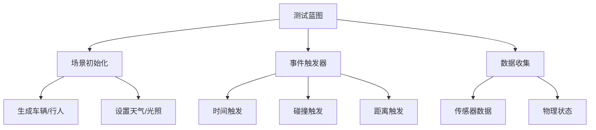
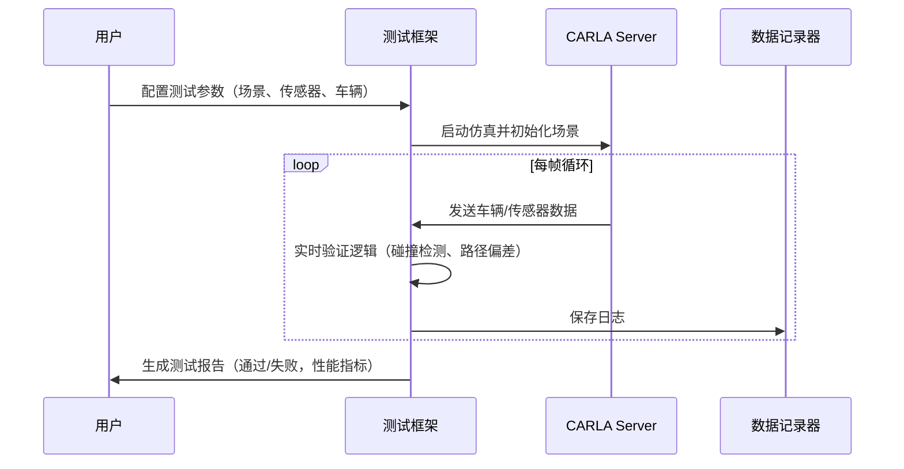

# CARLA 仿真测试框架说明文档

## 目录

1. [项目概述](#1-项目概述)
2. [核心组件与蓝图结构](#2-核心组件与蓝图结构)
   - [2.1 核心组件](#21-核心组件)
   - [2.2 蓝图结构](#22-蓝图结构)
3. [关键功能实现](#3-关键功能实现)
   - [3.1 场景测试（避障验证）](#31-场景测试避障验证)
   - [3.2 传感器数据验证（LiDAR点云）](#32-传感器数据验证lidar点云)
   - [3.3 交通流压力测试](#33-交通流压力测试)
4. [工作流程](#4-工作流程)
5. [优化与扩展建议](#5-优化与扩展建议)
   - [5.1 性能优化](#51-性能优化)
   - [5.2 扩展建议](#52-扩展建议)
6. [总结](#6-总结)

---

<!-- 请在正文对应位置添加以下锚点声明 -->
<!--
## 1. 项目概述
<span id="1-项目概述"></span>

## 2. 核心组件与蓝图结构
<span id="2-核心组件与蓝图结构"></span>

### 2.1 核心组件
<span id="21-核心组件"></span>

### 2.2 蓝图结构
<span id="22-蓝图结构"></span>

## 3. 关键功能实现
<span id="3-关键功能实现"></span>

### 3.1 场景测试（避障验证）
<span id="31-场景测试避障验证"></span>

### 3.2 传感器数据验证（LiDAR点云）
<span id="32-传感器数据验证lidar点云"></span>

### 3.3 交通流压力测试
<span id="33-交通流压力测试"></span>

（后续章节同理添加锚点）
-->
## 1. 项目概述
**CARLA 测试框架** 是一个基于开源自动驾驶仿真平台的多层次验证系统，旨在通过可重复的仿真环境验证自动驾驶算法、传感器性能及交通场景逻辑。  
- **核心目标**：  
  - 验证车辆在复杂场景（如避障、路口交互、恶劣天气）中的决策能力。  
  - 评估传感器（LiDAR、摄像头、雷达）数据质量与实时性。  
  - 测试交通管理器（Traffic Manager）的车辆行为控制效果。  
- **支持测试类型**：  
  - 功能测试 | 性能测试 | 回归测试 | 压力测试  

---

## 2. 核心组件与蓝图结构

### 2.1 核心组件
| 组件                | 功能描述                                                                 |
|---------------------|--------------------------------------------------------------------------|
| **场景管理器**      | 加载/卸载场景，控制天气、光照、NPC行为等参数。                          |
| **传感器系统**      | 管理摄像头、LiDAR、IMU等传感器数据采集与同步。                          |
| **交通管理器**      | 控制NPC车辆的路径规划、速度调整、避障逻辑。                             |
| **数据记录器**      | 将仿真数据（传感器输出、车辆状态）保存为 `.log` 或 `.csv` 格式。         |
| **测试评估模块**    | 根据预设规则（如碰撞次数、路径偏差）自动判定测试结果。                   |

### 2.2 蓝图结构


---

## 3. 关键功能实现

### 3.1 场景测试（避障验证）
```python
# 生成障碍物与测试车辆
obstacle = world.spawn_actor(barrier_bp, carla.Transform(location))
vehicle = world.spawn_actor(vehicle_bp, spawn_point)
vehicle.set_autopilot(True)

# 检测碰撞事件
def on_collision(event):
    if event.actor == vehicle:
        print("避障失败！碰撞发生。")
world.on_tick(on_collision)
```

### 3.2 传感器数据验证（LiDAR点云）
```python
# 绑定LiDAR并检查点云密度
lidar_bp = world.get_blueprint_library().find('sensor.lidar.ray_cast')
lidar_bp.set_attribute('points_per_second', '100000')
lidar.listen(lambda data: np.save("pointcloud.npy", np.frombuffer(data.raw_data, dtype=np.float32))

# 分析点云
points = np.load("pointcloud.npy").reshape(-1, 4)
print(f"有效点数：{len(points)}，范围：{np.max(points[:, :3])}米")
```

### 3.3 交通流压力测试
```python
tm = client.get_trafficmanager()
tm.set_global_speed_limit(30)  # 全局限速30km/h
tm.set_hybrid_physics_mode(True)  # 混合物理模式（远距离车辆低精度模拟）

# 生成100辆NPC车辆
for i in range(100):
    vehicle = world.spawn_actor(bp, spawn_points[i])
    tm.ignore_lights_percentage(vehicle, 100)  # 所有车辆忽略红灯
```

---

## 4. 工作流程


---

## 5. 优化与扩展建议

### 5.1 性能优化
| 方法                | 效果                               | 实现示例                          |
|---------------------|-----------------------------------|---------------------------------|
| **并行测试**        | 同时运行多个轻量级场景             | 使用Docker容器部署多CARLA实例    |
| **LOD优化**         | 减少远距离模型细节                 | 配置静态网格体LOD参数            |
| **异步数据记录**    | 避免I/O阻塞主线程                  | 使用多线程队列保存数据           |

### 5.2 扩展建议
- **集成第三方工具**：  
  - 连接ROS2节点实现硬件在环（HIL）测试。  
  - 使用TensorFlow/PyTorch实时验证感知模型输出。  
- **自定义测试协议**：  
  - 支持OpenSCENARIO 2.0标准场景描述。  
  - 开发Web界面远程管理测试任务。  

---

## 6. 总结
CARLA测试框架通过灵活的Python API与蓝图系统，提供了从单车辆功能验证到大规模交通流压力测试的全套解决方案。  
- **优势**：  
  - 高可扩展性：支持自定义传感器、场景、评估规则。  
  - 开源生态：可集成ROS、Autoware等自动驾驶工具链。  
- **挑战**：  
  - 硬件资源需求较高（GPU显存、CPU多核并行）。  
  - 复杂场景调试需深入理解虚幻引擎与物理引擎交互机制。  

**未来方向**：结合AI强化学习实现自动化探索极端测试场景。  

--- 