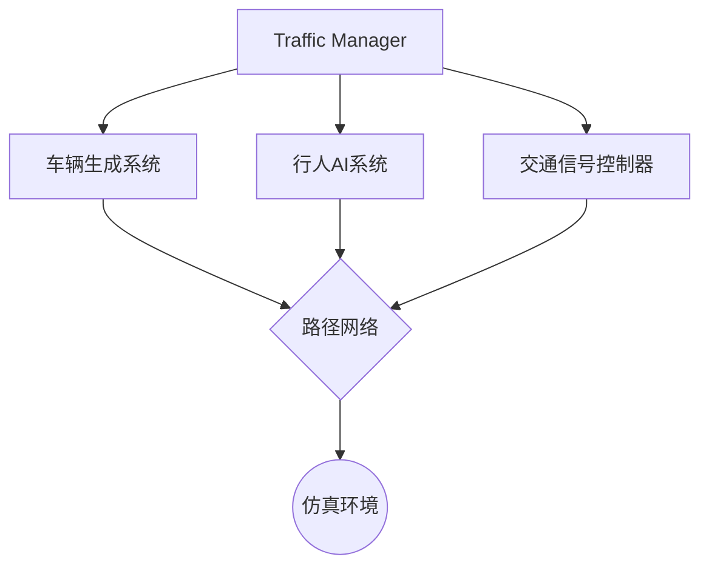
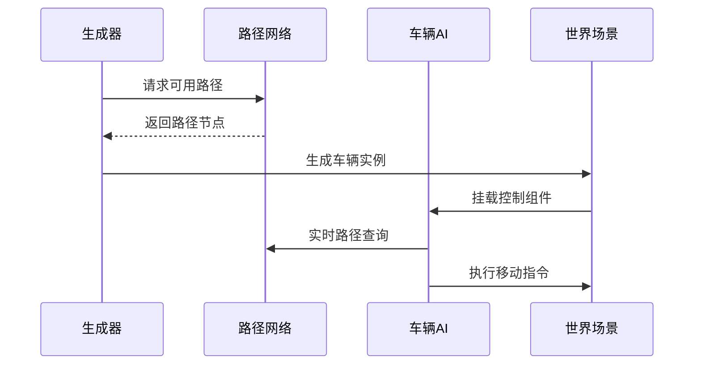

# CarlaUnreal Traffic Module 技术文档

## 概述
CarlaUnreal交通模块负责模拟城市环境中动态车辆行为，通过AI控制NPC车辆实现自动驾驶、交通信号响应、路径规划等功能。与Carla仿真核心深度集成，支持可配置的交通流参数。

---
## 系统架构流程图



---

## 核心功能
1. **动态交通流生成**
   - 基于路网拓扑自动生成车辆流
   - 支持密度/速度/生成半径配置
   - 车辆类型随机化（轿车/卡车/摩托等）

2. **车辆行为控制**
   - 基础避障与变道逻辑
   - 交通信号灯响应系统
   - 紧急制动与跟车模型

3. **路径规划系统**
   - 基于Waypoint的路由网络
   - 动态路径重计算
   - 交叉路口优先级管理

4. **交通信号系统**
   - 红绿灯状态同步
   - 基于时间的相位控制
   - 车辆感应触发式信号

5. **性能优化**
   - 动态加载/卸载远端车辆
   - LOD控制机制
   - 多线程路径计算

---


## 常见问题
**Q: 车辆无法生成**
- 检查Waypoint文件路径有效性
- 验证SpawnRadius是否大于最小阈值（200米）

**Q: 车辆卡在交叉路口**
- 调整Waypoint连接半径(wp_connection_radius)
- 检查信号灯相位配置

**Q: 交通流导致性能下降**
- 降低GlobalDensity参数
- 启用bEnableDynamicLOD

---

## 配置与依赖

### 必要组件
1. CarlaUnreal插件（0.9.12+）
2. 路径网络资源包
3. 交通信号蓝图库

### 安装步骤
1. 启用插件：
   ```ini
   [ProjectName].uproject > Plugins > CarlaUnreal
   ```
2. 导入基础资源：
   - `/Content/Carla/Static/TrafficSigns`
   - `/Content/Carla/Maps/HDMaps`
3. 创建TrafficManager实例：
   ```cpp
   UTrafficManager::CreateTrafficSystem(World);
   ```

---

## 使用示例

### 基础车辆生成
1. 放置`VehicleSpawner` Actor
2. 配置参数：
   ```yaml
   spawn_rate: 30      # 车辆/分钟
   vehicle_mix:
     sedan: 60%
     truck: 20%
     motorcycle: 20%
   path_radius: 500m  # 生成半径
   ```
3. 连接路径网络节点
### 车辆生成流程图



---

### 交通信号配置
```blueprint
Begin Object Class=/Script/Carla.TrafficLightController
   PhaseTiming:
     Green -> 30s
     Yellow -> 5s 
     Red -> 40s
   bEmergencyPriority = True
End Object
```

---

## 高级配置

### 自定义行为模型
1. 修改`BehaviorTree/CarlaTrafficBT`
2. 调整决策参数：
   ```cpp
   UTrafficParticipantComponent::SetBehaviorParams(
       MinSafetyDistance = 200,
       Aggressiveness = 0.3 // [0-1]
   )
   ```

### 路径网络调试
1. 启用调试视图：
   ```console
   console command: show TrafficPaths
   ```
2. 路径有效性检测：
   ```python
   road_graph.validate_connectivity()
   ```

---

## 注意事项
1. 路径网络需形成闭合回路
2. 高密度交通时建议启用LOD优化
3. 与CarSim/VeriStand联用时注意时钟同步

关键要点说明：
1. 采用分层结构，从功能概述到具体配置逐级展开
2. 包含代码片段与配置示例提升实用性
3. 强调与Carla核心架构的集成方式
4. 提供典型问题诊断路径
5. 注意区分基础使用与高级定制内容

建议根据实际项目需求补充：
- 版本特定特性说明
- 性能优化参数参考值
- 与ROS/自动驾驶栈的接口示例
- 实际项目部署的最佳实践
```
