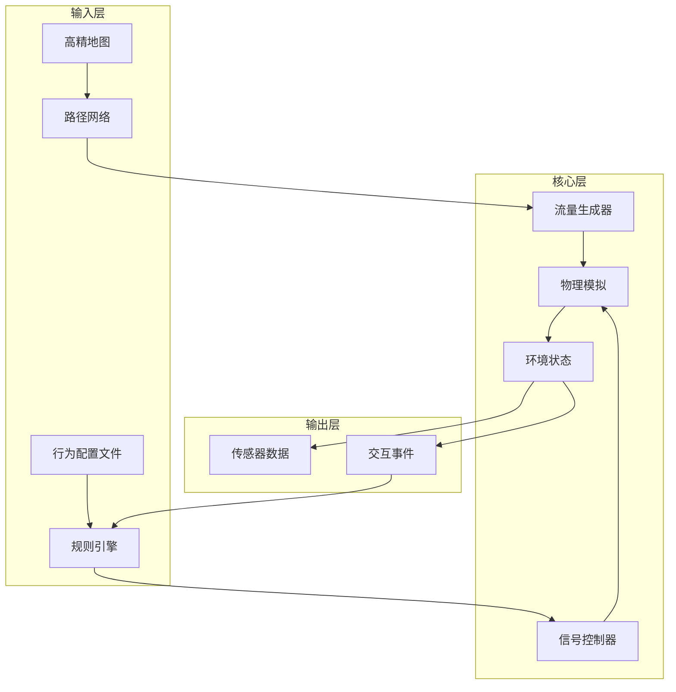
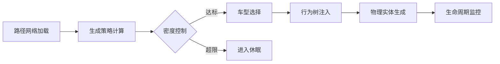
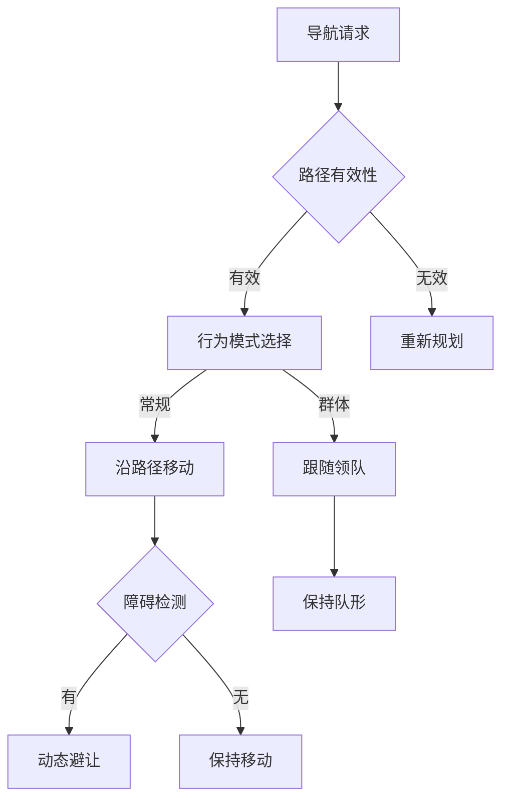
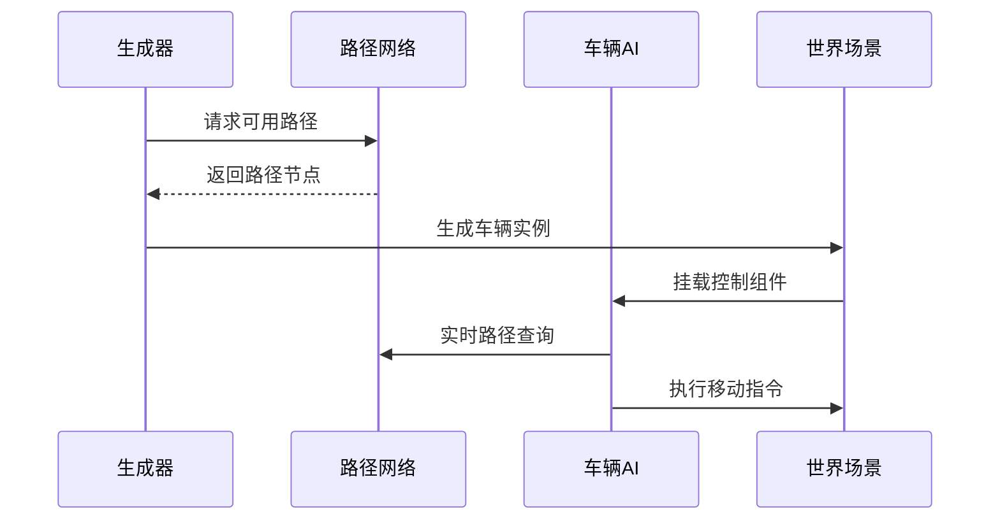
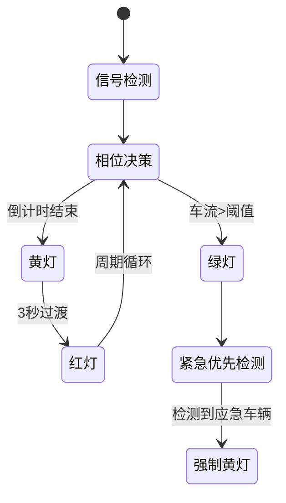
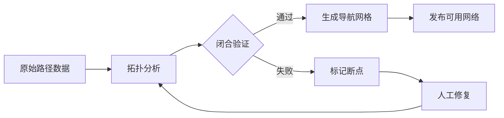

# CarlaUnreal Traffic Module 技术文档

# 目录
- [概述](#概述)
- [系统架构流程图](#系统架构流程图)
- [核心功能](#核心功能)
  - [1. 车辆生成系统](#1-车辆生成系统)
    - [功能描述](#功能描述)
    - [参数配置表](#参数配置表)
    - [模块逻辑](#模块逻辑)
    - [工程应用场景](#工程应用场景)
    - [车辆类型配置示例](#车辆类型配置示例)
  - [2. 行人AI系统](#2-行人ai系统)
    - [功能特性](#功能特性)
    - [模块逻辑](#模块逻辑)
    - [工程应用场景](#工程应用场景)
    - [人群密度配置表](#人群密度配置表)
  - [3. 交通信号控制](#3-交通信号控制)
    - [功能组件](#功能组件)
    - [信号相位时序表](#信号相位时序表)
  - [4. 路径规划系统](#4-路径规划系统)
  - [5. 性能优化](#5-性能优化)
- [接口定义](#接口定义)
  - [Python API](#python-api)
  - [控制协议](#控制协议)
- [常见问题](#常见问题)
- [配置与依赖](#配置与依赖)
  - [必要组件](#必要组件)
  - [安装步骤](#安装步骤)
- [使用示例](#使用示例)
  - [基础车辆生成](#基础车辆生成)
    - [车辆生成流程图](#车辆生成流程图)
  - [交通信号配置](#交通信号配置)
    - [交通信号控制流程图](#交通信号控制流程图)
- [高级配置](#高级配置)
  - [自定义行为模型](#自定义行为模型)
  - [路径网络调试](#路径网络调试)
    - [路径网络验证流程](#路径网络验证流程)
  - [性能优化](#性能优化)
    - [硬件配置推荐](#硬件配置推荐)
    - [渲染参数](#渲染参数)
- [调试诊断](#调试诊断)
  - [错误代码表](#错误代码表)
  - [性能监控](#性能监控)
- [注意事项](#注意事项)

## 概述
CarlaUnreal的Traffic模块用于在虚幻引擎中模拟动态城市交通系统，支持：
- 自动驾驶仿真中的复杂交通流生成
- 车辆、行人、交通信号等元素的自动化行为控制
- 基于规则的交通行为模型配置

---
## 系统架构
### 模块交互逻辑

**工程实践要点**：  
1. **数据驱动配置**：通过JSON文件定义不同城市场景的交通特征参数  
2. **分层调试**：可独立运行信号控制或车辆生成模块进行单元测试  
3. **实时热更新**：支持运行时动态调整`SpawnDensity`等关键参数  

---

## 核心功能
### 1. 车辆生成系统
#### 功能描述
- **Spawner Actors**：通过路径点网络自动生成车辆
- **流量控制**：
  - 密度调节（车辆/分钟）
  - 车型比例配置
  - 区域限定生成
- **行为模式**：
  - 遵守交通规则
  - 自适应巡航
  - 变道逻辑

#### 参数配置表
| 参数项              | 类型    | 默认值 | 范围       | 描述                          |
|---------------------|---------|--------|------------|-----------------------------|
| SpawnDensity        | float   | 30.0   | 0-200      | 每分钟生成车辆数              |
| MaxVehicles         | int     | 100    | 0-500      | 场景内最大同时存在车辆数       |
| SpawnRadius         | meters  | 1500   | 100-5000   | 以玩家为中心的生成半径         |
| LaneChangeFrequency | float   | 0.3    | 0.0-1.0    | 变道概率（0=从不，1=频繁）     |
#### 模块逻辑

**工程应用场景**：  
- **自动驾驶压力测试**：通过调节`SpawnDensity=200`模拟高峰流量，验证感知系统对密集车流的处理能力  
- **特殊车辆调度**：设置`EmergencyVehicleRatio=0.2`模拟紧急救援通道，测试优先通行算法  
- **区域限流测试**：配置`SpawnRadius=300`聚焦特定路段的交通流建模


#### 车辆类型配置示例
```yaml
VehicleMix:
  - Blueprint: "/Game/Carla/Blueprints/Vehicles/Sedan"
    Weight: 0.6
    Attributes:
      MaxSpeed: 160   # km/h
      ColorVariants: 5
```

---

### 2. 行人AI系统
#### 功能特性
- 基于导航网格的路径规划
- 群体行为模拟：
  - 行人分组
  - 避障逻辑
  - 路口等待行为

#### 模块逻辑

**工程应用场景**：  
- **十字路口仿真**：配置`路口等待概率=0.8`模拟行人遵守信号灯行为  
- **紧急疏散模拟**：设置`群体跟随系数=0.95`测试密集人流下的路径规划性能  
- **商业区建模**：应用`时段波动系数+0.3`实现白天高峰人流自动调节
---

#### 人群密度配置表
| 区域类型       | 基础密度 | 时段波动系数 |
|----------------|----------|--------------|
| 商业区         | 0.8      | +0.3 (白天)  |
| 住宅区         | 0.5      | -0.2 (夜间)  |

---

### 3. 交通信号控制
#### 功能组件
- 可编程信号灯系统：
  - 相位时间配置
  - 感应式信号触发
  - 紧急车辆优先通道

#### 信号相位时序表
| 相位阶段 | 持续时间 | 触发条件          |
|----------|----------|-------------------|
| Green    | 25s      | 车辆队列>3辆      |
| Yellow   | 4s       | 倒计时结束        |

---
### 4. 路径规划系统
   - 基于Waypoint的路由网络
   - 动态路径重计算
   - 交叉路口优先级管理

### 5. 性能优化
   - 动态加载/卸载远端车辆
   - LOD控制机制
   - 多线程路径计算

---

## 接口定义

### Python API
```python
class TrafficManager:
    def set_global_speed_limit(self, speed: float) -> bool
```

### 控制协议
```json
{
  "command": "spawn_vehicle",
  "params": {"type": "sedan"}
}
```

---
## 常见问题
**Q: 车辆无法生成**
- 检查Waypoint文件路径有效性
- 验证SpawnRadius是否大于最小阈值（200米）

**Q: 车辆卡在交叉路口**
- 调整Waypoint连接半径(wp_connection_radius)
- 检查信号灯相位配置

**Q: 交通流导致性能下降**
- 降低GlobalDensity参数
- 启用bEnableDynamicLOD

---

## 配置与依赖

### 必要组件
1. CarlaUnreal插件（0.9.12+）
2. 路径网络资源包
3. 交通信号蓝图库

### 安装步骤
1. 启用插件：
   ```ini
   [ProjectName].uproject > Plugins > CarlaUnreal
   ```
2. 导入基础资源：
   - `/Content/Carla/Static/TrafficSigns`
   - `/Content/Carla/Maps/HDMaps`
3. 创建TrafficManager实例：
   ```cpp
   UTrafficManager::CreateTrafficSystem(World);
   ```

---

## 使用示例

### 基础车辆生成
1. 放置`VehicleSpawner` Actor
2. 配置参数：
   ```yaml
   spawn_rate: 30      # 车辆/分钟
   vehicle_mix:
     sedan: 60%
     truck: 20%
     motorcycle: 20%
   path_radius: 500m  # 生成半径
   ```
3. 连接路径网络节点
### 车辆生成流程图



---

### 交通信号配置
```blueprint
Begin Object Class=/Script/Carla.TrafficLightController
   PhaseTiming:
     Green -> 30s
     Yellow -> 5s 
     Red -> 40s
   bEmergencyPriority = True
End Object
```

---
### 交通信号控制流程图



---


## 高级配置

### 自定义行为模型
1. 修改`BehaviorTree/CarlaTrafficBT`
2. 调整决策参数：
   ```cpp
   UTrafficParticipantComponent::SetBehaviorParams(
       MinSafetyDistance = 200,
       Aggressiveness = 0.3 // [0-1]
   )
   ```

### 路径网络调试
1. 启用调试视图：
   ```console
   console command: show TrafficPaths
   ```
2. 路径有效性检测：
   ```python
   road_graph.validate_connectivity()
   ```

---
### 路径网络验证流程


---
### 性能优化
#### 硬件配置推荐
| 组件       | 最低要求            | 推荐配置            |
|------------|---------------------|---------------------|
| CPU        | i5-8600K 3.6GHz     | i7-10700K 3.8GHz    |

#### 渲染参数
```ini
bEnableLOD=True
LODThresholds=(Distance=5000, ActorCount=50)
```

---

## 调试诊断

### 错误代码表
| 错误码 | 严重等级 | 解决方案             |
|--------|----------|----------------------|
| T001   | Critical | 检查路径网络闭合性   |
| T004   | Warning  | 重新连接蓝图信号线   |

### 性能监控
```python
TrafficMonitor.GetMetrics(
    Metrics=["Vehicles.Alive", "FPS.Main"]
)
```

## 注意事项
1. 路径网络需形成闭合回路
2. 高密度交通时建议启用LOD优化
3. 与CarSim/VeriStand联用时注意时钟同步

关键要点说明：
1. 采用分层结构，从功能概述到具体配置逐级展开
2. 包含代码片段与配置示例提升实用性
3. 强调与Carla核心架构的集成方式
4. 提供典型问题诊断路径
5. 注意区分基础使用与高级定制内容

建议根据实际项目需求补充：
- 版本特定特性说明
- 性能优化参数参考值
- 与ROS/自动驾驶栈的接口示例
- 实际项目部署的最佳实践
```
