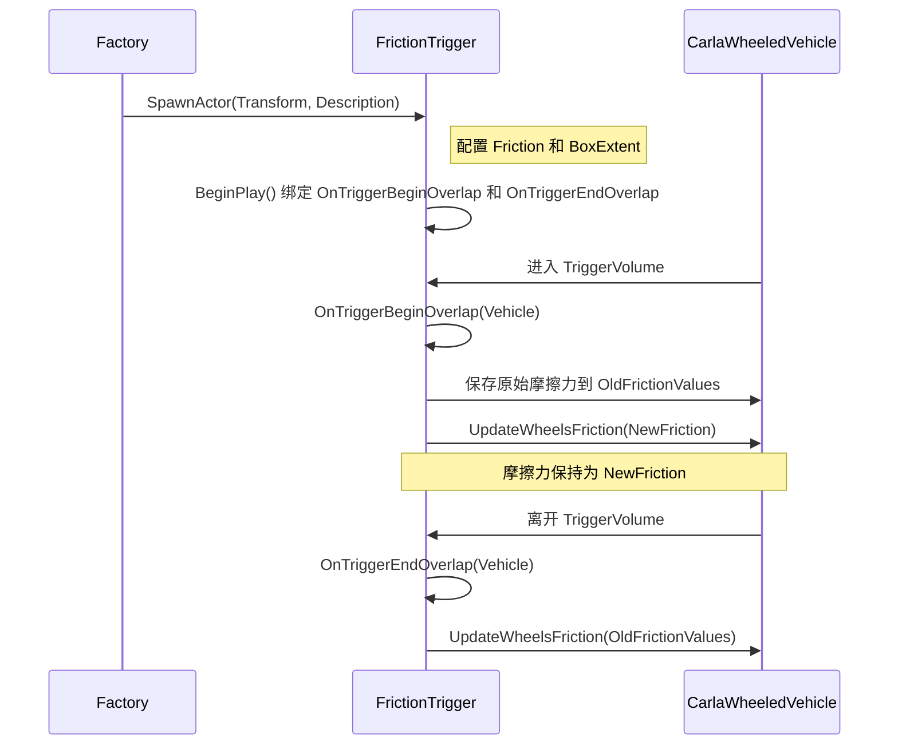

# CarlaUnreal Trigger 模块技术文档

## 目录
- [模块概述](#模块概述)
- [核心功能](#核心功能)
- [类与方法详解](#类与方法详解)
- [数据结构与配置](#数据结构与配置)
- [关键流程](#关键流程)
- [注意事项](#注意事项)
- [示例配置](#示例配置)
- [附录](#附录)

## 模块概述
Trigger 模块是 CarlaUnreal 插件中的核心组件，旨在为 CARLA 模拟器提供灵活的触发器机制。它允许用户在模拟环境中定义触发区域，并根据特定条件（如车辆重叠事件）执行预定义操作，从而增强场景交互性和真实性。目前，模块主要实现基于摩擦力的触发器功能（`AFrictionTrigger`），用于动态调整车辆在特定区域内的车轮摩擦力，模拟不同路面条件（如湿滑路面、砂石路面）对车辆物理行为的影响。

模块通过工厂类 `ATriggerFactory` 提供触发器的创建和管理功能，与 CARLA 的核心类（如 `UCarlaEpisode` 和 `ACarlaWheeledVehicle`）深度集成，支持在 **Unreal Engine 编辑器**、**蓝图** 中动态配置。未来可扩展至其他触发器类型，如速度限制或信号触发。

## 核心功能

### 1. 触发器实例化与配置
- **工厂类生成触发器**
  ```cpp
  FActorSpawnResult SpawnActor(const FTransform &SpawnAtTransform, const FActorDescription &ActorDescription);
  ```
  根据变换信息（位置和旋转）及描述参数生成 `AFrictionTrigger` 实例。

- **配置方式**
  - 通过代码动态配置
  - 在蓝图中可视化配置

### 2. 动态摩擦力调整
- **重叠事件检测与响应**
  ```cpp
  void OnTriggerBeginOverlap(AActor* OverlappedActor, AActor* OtherActor);
  void OnTriggerEndOverlap(AActor* OverlappedActor, AActor* OtherActor);
  ```
  实时检测车辆进入和离开触发区域。

- **摩擦力管理**
  - 车辆进入时保存原始摩擦力并应用预设值
  - 车辆离开时恢复原始摩擦力

### 3. 与 CARLA 模拟器集成
- **关卡与车辆交互**
  - 通过 `UCarlaEpisode` 获取当前场景所有信息，比如地图、车辆、天气等
  - 与 `ACarlaWheeledVehicle` 的物理组件交互，调整车轮摩擦属性

### 4. 蓝图支持
- **事件绑定与属性调整**
  - 支持在蓝图中绑定触发事件
  - 实时修改触发器属性（如摩擦力、区域大小）

## 类与方法详解

### AFrictionTrigger 类
继承自 `AActor`，是 Trigger 模块的核心实现类，用于定义基于摩擦力的触发区域。

#### 关键方法
| 方法 | 功能描述 |
|------|----------|
| `OnTriggerBeginOverlap(...)` | 当车辆进入触发区域时触发，保存原始摩擦力并设置为预定义值 |
| `OnTriggerEndOverlap(...)` | 当车辆离开触发区域时触发，恢复车辆的原始摩擦力 |
| `UpdateWheelsFriction(...)` | 更新指定车辆的车轮摩擦力系数 |
| `SetEpisode(const UCarlaEpisode&)` | 设置当前关卡引用，以便访问关卡数据和车辆实例 |
| `SetBoxExtent(const FVector&)` | 设置触发区域的盒体范围（X/Y/Z 轴） |
| `SetFriction(float)` | 设置触发区域的目标摩擦力值，可在运行时或编辑器中调整 |
| `BeginPlay()` | 重写函数，在 Actor 开始运行时初始化事件绑定 |
| `EndPlay(...)` | 重写函数，在 Actor 结束时清理事件绑定 |

#### 成员变量说明
| 变量 | 类型 | 描述 |
|------|------|------|
| `Friction` | `float` | 触发区域的目标摩擦力值，默认 1.0，可在编辑器中编辑 |
| `TriggerVolume` | `UBoxComponent*` | 定义触发区域的碰撞盒体组件，支持可视化调试 |
| `Episode` | `const UCarlaEpisode*` | 指向当前关卡实例的指针，用于获取车辆和场景信息 |
| `OldFrictionValues` | `TArray<float>` | 存储进入触发区域的车辆原始摩擦力值，用于后续恢复 |

### ATriggerFactory 类
继承自 `ACarlaActorFactory`，负责触发器的创建和管理，提供工厂模式的实例化支持。

#### 关键方法
| 方法 | 功能描述 |
|------|----------|
| `GetDefinitions()` | 返回支持的触发器类型定义列表（目前仅含 `AFrictionTrigger`） |
| `SpawnActor(const FTransform&, const FActorDescription&)` | 根据变换和描述信息生成并配置触发器实例，返回生成结果 |

## 数据结构与配置

### 1. 触发器描述结构体
```cpp
struct FActorDescription {
    UClass* Class;                    // 触发器类（如 AFrictionTrigger）
    TMap<FString, FString> Variations;// 配置参数键值对（如 friction、extent）
};
```
- `Class`：指定要生成的触发器类，目前固定为 `AFrictionTrigger`
- `Variations`：存储触发器的配置参数，如摩擦力和区域范围

### 2. 配置参数映射表
| 参数名称 | 类型 | 描述 | 默认值 |
|----------|------|------|--------|
| `friction` | `float` | 触发区域的摩擦力值 | 1.0 |
| `extent_x` | `float` | 触发区域 X 轴范围（厘米） | 100.0 |
| `extent_y` | `float` | 触发区域 Y 轴范围（厘米） | 100.0 |
| `extent_z` | `float` | 触发区域 Z 轴范围（厘米） | 100.0 |


## 关键流程

### 触发器生成流程
1. **工厂类调用**
   - 通过 `ATriggerFactory::SpawnActor` 创建触发器实例
   - `FActorDescription` 提供变换信息和描述参数

2. **属性配置**
   - 解析 `Variations` 中的 `friction` 和 `extent` 参数
   - 调用 `SetFriction` 和 `SetBoxExtent` 设置属性

3. **事件绑定**
   - 在 `BeginPlay` 中为 `TriggerVolume` 绑定重叠事件回调

### 摩擦力调整流程


## 注意事项

1. **触发器类型限制**
   - 当前仅支持 `AFrictionTrigger`，未来可扩展其他类型（如速度触发器）

2. **车辆兼容性**
   - 仅对 `ACarlaWheeledVehicle` 类型车辆生效，其他 `Actor` 类型会被忽略

3. **碰撞配置**
   - 确保 `TriggerVolume` 的碰撞类型为 `OverlapAll` 并启用 `GenerateOverlapEvents`


4. **参数格式**
   - 配置参数在 `FActorDescription::Variations` 中需为 **字符串形式**

## 示例配置

### C++ 代码示例
```cpp
#include "TriggerFactory.h"
#include "FrictionTrigger.h"

void AYourActor::SetupFrictionTrigger()
{
    ATriggerFactory* TriggerFactory = GetWorld()->SpawnActor<ATriggerFactory>(); // 生成触发器工厂

    FTransform Transform(FVector(0.0f, 0.0f, 50.0f)); // 设置位置 (0, 0, 50)

    FActorDescription Description; // 配置触发器描述
    Description.Class = AFrictionTrigger::StaticClass(); // 设置触发器类
    Description.Variations.Add("friction", "0.5"); // 摩擦力 0.5
    Description.Variations.Add("extent_x", "200.0"); // X 轴范围 200
    Description.Variations.Add("extent_y", "200.0"); // Y 轴范围 200
    Description.Variations.Add("extent_z", "50.0"); // Z 轴范围 50

    FActorSpawnResult Result = TriggerFactory->SpawnActor(Transform, Description); // 生成触发器

    if (Result.Actor) // 记录生成结果
    {
        UE_LOG(LogTemp, Log, TEXT("FrictionTrigger spawned at %s"), *Transform.GetLocation().ToString());
    }
}
```

### 命令行调用
```bash
UE4Editor-Cmd.exe ProjectName -run=TriggerFactory -TriggerType=friction -Friction=0.5 -ExtentX=200.0 -ExtentY=200.0 -ExtentZ=50.0
```

## 附录

### 依赖项
- **Unreal Engine**
  - Actor 系统
  - 碰撞检测
  - 物理引擎
- **CARLA 模拟器**
  - `UCarlaEpisode`
  - `ACarlaWheeledVehicle` 类

### 调试支持
- **日志输出**
  ```cpp
  UE_LOG(LogCarla, Warning, TEXT("FrictionTrigger: Vehicle entered with friction %f"), Friction);
  ```
- **编辑器可视化**
  - 通过 `TriggerVolume->SetHiddenInGame(false)` 在编辑器中显示触发区域线框

### 问题与解决方案
| 问题现象 | 可能原因 | 解决方案 |
|----------|----------|----------|
| 触发器未响应事件 | 碰撞类型未设为 `OverlapAll` | 检查 `TriggerVolume` 的碰撞设置 |
| 摩擦力未正确恢复 | `OldFrictionValues` 未保存 | 验证 `OnTriggerBeginOverlap` 逻辑 |
| 触发器生成失败 | 配置参数格式错误 | 确保 `Variations` 使用字符串值 |
| 触发区域不可见 | 组件未正确初始化 | 检查 `TriggerVolume` 的配置 |