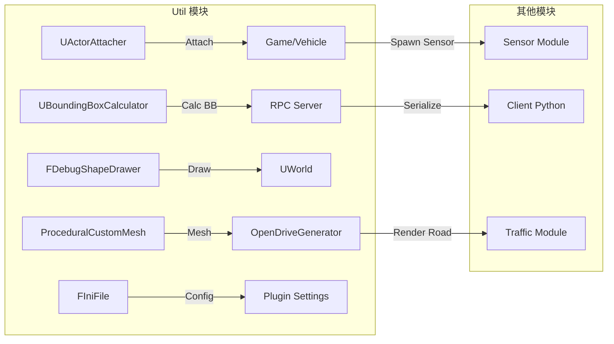

# Util模块技术文档

## 1. 概述

  CARLA的Util模块提供了一系列底层的C++工具类，用于简化对Unreal世界中各种对象、集合体、导航、随机数以及调试绘制等功能的操作。Util模块位于源码路径`Unreal/CarlaUE4/Plugins/Carla/Source/Carla/Util`下，包含29个源文件和头文件，涵盖从附件管理、随机引擎到导航网络、文件解析、调试绘制等多方面工具。

### 1.1 Util模块与其它模块的调用关系图

- `UActorAttacher` 为 Game 与 Vehicle 模块提供动态附加接口；
- `UBoundingBoxCalculator` 在 RPC Server 中被调用，用于生成网络序列化的包围盒数据；
- `FDebugShapeDrawer` 直接作用于 UWorld，渲染调试原语；
- `ProceduralCustomMesh` 与 OpenDriveGenerator、RoadPainterWrapper 协作，呈现场景几何；
- `FIniFile` 在插件启动时读取外部配置，并在各模块初始化时注入参数。

### 1.2 Util模块关键流程图

```mermaid
flowchart TD
  subgraph 模块初始化
    A1[FIniFile: 读取 .ini 配置]
    A2[ObjectRegister: 注册全局管理对象]
    A1 --> A2
    A3[RandomEngine: 初始化随机数引擎]
    A2 --> A3
    A4[NoWorldOffsetSceneComponent: 设置世界坐标稳定]
    A3 --> A4
  end

  subgraph 仿真执行循环
    B1[FCarlaEngine Tick]
    B1 --> B2[UActorAttacher: 附加传感器至车辆]
    B2 --> B3[RandomEngine: 生成随机参数]
    B3 --> B4[UBoundingBoxCalculator: 计算各 Actor 包围盒]
    B4 --> B5[FDebugShapeDrawer: 绘制调试形状]
    B5 --> B6[ProceduralCustomMesh: 动态生成自定义网格]
    B6 --> B7[NavigationMesh: 更新/重构导航网格]
    B7 --> B8[RayTracer: 执行射线检测]
    B8 --> B9[FCarlaServer: 聚合 & RPC 序列化]
  end
```

### 1.3 Util模块关键类表
| 子模块                                      | 功能简介                                                                                       | 源码位置                                                                                                       |
|-------------------------------------------|----------------------------------------------------------------------------------------------|--------------------------------------------------------------------------------------------------------------|
| ActorAttacher                             | 将任意 `USceneComponent`（相机、传感器等）动态附加到 `AActor` 上                                  | `Util/ActorAttacher.h`<br>`Util/ActorAttacher.cpp`                                                            |
| EmptyActor                                | 提供一个空的 `AActor` 占位类，用于测试或性能基准                                                 | `Util/EmptyActor.h`<br>`Util/EmptyActor.cpp`                                                                  |
| NoWorldOffsetSceneComponent               | 定义不随世界坐标偏移的场景组件，用于 UI 或调试可视化                                              | `Util/NoWorldOffsetSceneComponent.h`<br>`Util/NoWorldOffsetSceneComponent.cpp`                                |
| ActorWithRandomEngine & RandomEngine      | 封装 C++ 标准随机数引擎，支持可复现随机行为                                                       | `Util/ActorWithRandomEngine.h`<br>`Util/ActorWithRandomEngine.cpp`<br>`Util/RandomEngine.h`<br>`Util/RandomEngine.cpp` |
| ScopedStack                               | 基于 RAII 的作用域栈管理工具，可跟踪嵌套调用或状态                                               | `Util/ScopedStack.h`                                                                                         |
| BoundingBox & BoundingBoxCalculator       | 定义 `FBoundingBox` 结构，并提供包围盒到世界/屏幕坐标的转换计算                                     | `Util/BoundingBox.h`<br>`Util/BoundingBox.cpp`<br>`Util/BoundingBoxCalculator.h`<br>`Util/BoundingBoxCalculator.cpp` |
| DebugShapeDrawer                          | 在场景中绘制线框、点、面等调试几何体                                                            | `Util/DebugShapeDrawer.h`<br>`Util/DebugShapeDrawer.cpp`                                                      |
| ProceduralCustomMesh                      | 运行时生成或修改 `UProceduralMeshComponent` 的自定义网格                                          | `Util/ProceduralCustomMesh.h`                                                                                 |
| RayTracer                                 | 封装射线检测接口，用于碰撞检测和视线跟踪                                                          | `Util/RayTracer.h`<br>`Util/RayTracer.cpp`                                                                    |
| NavigationMesh                            | 与 Unreal 导航网格系统交互，支持路径查询                                                         | `Util/NavigationMesh.h`<br>`Util/NavigationMesh.cpp`                                                          |
| RoadPainterWrapper                        | 动态调用 Unreal 道路绘制接口，在关卡中绘制道路或车道线                                             | `Util/RoadPainterWrapper.h`<br>`Util/RoadPainterWrapper.cpp`                                                  |
| EnvironmentObject                         | 封装地图中静态物体（建筑、路牌、信号灯等）的通用接口                                                | `Util/EnvironmentObject.h`                                                                                   |
| IniFile                                   | 读取/写入 Unreal 风格的 `.ini` 配置文件                                                          | `Util/IniFile.h`                                                                                              |
| ObjectRegister                            | 全局对象注册器，管理插件内部可被索引的对象                                                         | `Util/ObjectRegister.h`<br>`Util/ObjectRegister.cpp`                                                          |
| NonCopyable                               | 禁止拷贝、仅允许移动的基类模板，用于防止资源误拷贝                                                 | `Util/NonCopyable.h`                                                                                          |
| ListView                                  | 封装 Unreal Slate/UMG 列表视图控件的常用操作                                                       | `Util/ListView.h`                                                                                             |

## 2. Util核心功能类
### 2.1 UActorAttacher：Actor 附加器
#### 2.1.1 概要
`UActorAttacher`是 CARLA Unreal 插件中用于在运行时将“子” Actor（如传感器、摄像头等）附加到“父” Actor（如车辆、建筑物等）上的静态工具类，支持三种常用的附加模式：
- 刚性附加（Rigid）：调用 `Child->AttachToActor(Parent, FAttachmentTransformRules::KeepRelativeTransform)`；
- 弹簧臂附加（SpringArm）：调用`UActorAttacher_AttachActorsWithSpringArm(Child, Parent)`；
- “幽灵”弹簧臂附加（SpringArmGhost）：调用`UActorAttacher_AttachActorsWithSpringArmGhost(Child, Parent)`。

在内部，`AttachActors` 会根据传入的 `EAttachmentType` 枚举选择不同的实现分支，或调用 `Unreal` 原生的 `AttachToActor`，或动态创建并配置 `USpringArmComponent` 和 `UChildActorComponent`，实现带碰撞测试或不带碰撞测试的带臂附加效果。
最后将子 Actor 的所有者（Owner）设置为父 Actor，以便后续的生命周期和 RPC 权限管理

#### 2.1.2 关键方法详解
1. `AttachActors`
```cpp
UFUNCTION(BlueprintCallable, Category="CARLA|Actor Attacher")
static void AttachActors(AActor *Child, AActor *Parent, EAttachmentType AttachmentType);
```
- 作用：根据传入的AttachmentType分发到三种附加实现方式，最后执行`Child->SetOwner(Parent)`，将子 Actor 的所有者设为父 Actor
- 关键变量：
  - `Child`、`Parent`：要附加的子/父 Actor 指针：
  - `AttachmentType`：枚举值决定调用哪种附加方式。
- 使用场景：在仿真初始化或 `BeginPlay` 阶段将传感器、摄像头等以不同跟随模式挂载到车辆或其他移动 Actor 上。

2. `UActorAttacher_AttachActorsWithSpringArm`
```cpp
static void UActorAttacher_AttachActorsWithSpringArm(AActor *Child, AActor *Parent)
{
  // 1. 动态创建 SpringArmComponent
  auto SpringArm = NewObject<USpringArmComponent>(Parent);
  // 2. 计算子 Actor 相对位置并重置位置
  const auto ChildLocation = -Child->GetActorLocation();
  Child->SetActorLocation(FVector::ZeroVector);
  // 3. 配置弹簧臂属性
  SpringArm->TargetOffset = FVector(0,0,30.0f);
  SpringArm->bDoCollisionTest = true;
  SpringArm->SetRelativeRotation(FRotationMatrix::MakeFromX(ChildLocation).Rotator());
  SpringArm->SetupAttachment(Parent->GetRootComponent());
  SpringArm->TargetArmLength = ChildLocation.Size();
  SpringArm->bEnableCameraRotationLag = true;
  SpringArm->CameraRotationLagSpeed = 8.0f;
  SpringArm->bInheritPitch = false;
  SpringArm->bInheritRoll  = false;
  SpringArm->bInheritYaw   = true;
  SpringArm->AttachToComponent(
      Parent->GetRootComponent(),
      FAttachmentTransformRules::KeepRelativeTransform);
  SpringArm->RegisterComponent();
  // 4. 创建并附加 ChildActorComponent
  auto ChildComp = NewObject<UChildActorComponent>(Parent);
  ChildComp->SetupAttachment(
      SpringArm,
      USpringArmComponent::SocketName);
  Child->AttachToComponent(
      ChildComp,
      FAttachmentTransformRules::KeepRelativeTransform);
  ChildComp->RegisterComponent();
}
```
- 作用：利用 `USpringArmComponent` 自动实现带碰撞测试的“弹簧臂”跟随，使子 Actor 始终保持与父 Actor 之间的指定距离和方向
- 关键变量：
  - `ChildLocation`：用于计算臂长和设置旋转方向；
  - `TargetOffset`、`bDoCollisionTest`、`TargetArmLength`、`CameraRotationLagSpeed`：分别决定臂的偏移、高度、碰撞行为及旋转滞后。
- 使用场景：驾驶视角摄像头或第三人称摄像机跟随，需保持一定距离并对地形碰撞自动校正。

### 2.2 AActorWithRandomEngine：随机引擎注入器
#### 2.2.1 概要
`AActorWithRandomEngine` 是 CARLA 插件中用于支持确定性随机行为的抽象 Actor 基类， 位于 `CarlaUE4/Plugins/Carla/Source/Carla/Util/ActorWithRandomEngine.*`。该类内置了一个 `URandomEngine` 实例，并通过固定或可配置的种子（Seed）初始化，从而实现可重现的随机数序列。并在 `Blueprint/C++` 中通过`GetRandomEngine`、`GetSeed`、`SetSeed` 提供访问与修改接口。

该类支持在编辑器中配置种子值，或启用自动生成随机种子。在构造阶段（Construction）或属性变更时，内部的随机引擎会根据当前种子重新初始化，确保每次仿真运行的随机行为可控且可复现。
#### 2.2.2 关键方法详解
1. `OnConstruction`
```cpp
void AActorWithRandomEngine::OnConstruction(const FTransform &Transform)
{
  Super::OnConstruction(Transform);
  if (bGenerateRandomSeed)
  {
    Seed = FMath::Rand();
  }
  if (RandomEngine)
  {
    RandomEngine->Initialize(Seed);
  }
}
```
- 作用：在 Actor 被放置或属性变更后调用，用于根据当前配置的种子值初始化随机引擎，确保每次 Actor 构建时，随机引擎的状态与当前种子一致，从而实现可控的随机行为。
- 关键变量：
  - `Transform`：Actor 在编辑器或运行时“放置”时的世界变换信息，包含位置、旋转、缩放，通常用于根据初始位置执行额外逻辑。

2. `SetSeed`
```cpp
void AActorWithRandomEngine::SetSeed(int32 InSeed)
{
  Seed = InSeed;
  if (RandomEngine)
  {
    RandomEngine->Initialize(Seed);
  }
}
```
- 作用：设置新的种子值，并重新初始化随机引擎，以改变随机行为的序列。
- 关键变量：
  - `InSeed`：从外部传入的新种子值，用于替换当前的 Seed;
  - `RandomEngine：内部使用的随机引擎实例，调用随机引擎的初始化方法，将其内部状态重置为基于新 Seed 的起始状态。
  - `seed`：当前使用的种子值，默认值为 123456789。

 #### 2.2.3 使用示例
```cpp
class AMyRandomActor : public AActorWithRandomEngine
{
    GENERATED_BODY()

public:
    virtual void BeginPlay() override
    {
        Super::BeginPlay();

        // 使用随机引擎生成一个 0 到 100 之间的整数
        int32 RandomValue = GetRandomEngine()->GetUniformIntInRange(0, 100);
        UE_LOG(LogTemp, Log, TEXT("Generated Random Value: %d"), RandomValue);
    }
};
// 创建一个继承自 AActorWithRandomEngine 的自定义 Actor
```
- 说明：此示例展示了如何在自定义的 `AMyRandomActor` 中复用 `AActorWithRandomEngine` 提供的随机引擎功能，并在游戏开始时生成一个 0–100 范围内的随机整数并输出日志。


## 2.3 BoundingBox相关类
### 2.3.1 FBoundingBox：边界框结构
#### 概要
`FBoundingBox`是一个BlueprintType的USTRUCT，用于在C++与BluePrint间传递和操作三维边界框信息。CARLA 中所有 Actor（车辆、行人、交通标志、静态网格等）均可通过该结构表示其局部边界框，方便后续在世界或摄像机坐标下进行投影、碰撞检测或可视化渲染。
#### 成员详解
```cpp
USTRUCT(BlueprintType)
struct CARLA_API FBoundingBox
{
  GENERATED_BODY()

  /// 边界框相对于其所有者的原点
  UPROPERTY(EditAnywhere, BlueprintReadWrite)
  FVector Origin = {0.0f, 0.0f, 0.0f};

  /// 边界框的半径范围（沿 X/Y/Z 方向的一半长度）
  UPROPERTY(EditAnywhere, BlueprintReadWrite)
  FVector Extent = {0.0f, 0.0f, 0.0f};

  /// 边界框的旋转（相对于父 Actor 的局部旋转）
  UPROPERTY(EditAnywhere, BlueprintReadWrite)
  FRotator Rotation = {0.0f, 0.0f, 0.0f};
};
```
- Origin：包围盒中心点在父 Actor 局部坐标系下的位置；
- Extent：包围盒在三个轴上的半尺寸，用于计算 Min/Max 边界；
- Rotation：包围盒相对于父 Actor 局部坐标系的欧拉旋转。该设计借鉴自 Unreal 引擎中 UBoxComponent 的中心/Extent/Rotation 表示。

### 2.3.2 UBoundingBoxCalculator：边界框计算器
#### 概要
`UBoundingBoxCalculator` 是一个派生自 `UBlueprintFunctionLibrary` 的静态函数集，负责根据不同 Actor 或网格类型，提取或合成对应的 FBoundingBox 信息。
#### 关键方法详解
| 方法名                                     | 功能简介                                                                                                                     | 参数说明                                                                                                                     | 返回值 / 输出                                                                                              |
|------------------------------------------|----------------------------------------------------------------------------------------------------------------------------|-----------------------------------------------------------------------------------------------------------------------------|----------------------------------------------------------------------------------------------------------|
| **GetActorBoundingBox**                  | 根据传入的 `AActor*` 类型动态分支：<br>– 车辆 → 调用 `GetVehicleBoundingBox`<br>– 行人 → 调用 `GetCharacterBoundingBox`<br>– 交通标志 → 合并触发体包围盒<br>– 其他 → 收集并合并所有网格组件包围盒。 | `const AActor* Actor` — 待计算边界的 Actor 指针<br>`uint8 InTagQueried` — 按标签筛选（默认 `0xFF`，不过滤） | `FBoundingBox` — Actor 局部空间包围盒                                                           |
| **GetVehicleBoundingBox**                | 提取车辆内部包围变换与半宽度，额外检测可能挂载的骨骼或子模型，通过 Socket 扩展范围后，应用组件到世界变换。                                     | `const ACarlaWheeledVehicle* Vehicle`<br>`uint8 InTagQueried`                                                               | `FBoundingBox` — 世界空间包围盒                                                                     |
| **GetCharacterBoundingBox**              | 基于 `UCapsuleComponent` 从半径与半高生成行人包围盒，并应用组件到世界空间的变换。                                                 | `const ACharacter* Character`<br>`uint8 InTagQueried`                                                                       | `FBoundingBox` — 世界空间包围盒                                                                     |
| **GetTrafficLightBoundingBox**           | 针对 `ATrafficLightBase` 中各灯体或触发体调用 `CombineBBsOfActor` 进行按距离与标签合并，按标签筛选后输出多段包围盒。                     | `const ATrafficLightBase* TrafficLight`<br>`TArray<FBoundingBox>& OutBB`<br>`TArray<uint8>& OutTag`<br>`uint8 InTagQueried` | —（通过 `OutBB`/`OutTag` 返回多个包围盒及对应标签）                                               |
| **GetStaticMeshBoundingBox**             | 直接使用 `UStaticMesh::GetBoundingBox()` 获得包围框，再封装为 `FBoundingBox`。                                                   | `const UStaticMesh* StaticMesh`                                                                                             | `FBoundingBox`                                                                                       |
| **GetSkeletalMeshBoundingBox**           | 遍历 LOD 0 顶点缓冲计算 Min/Max，进而求中心与半幅，返回精确顶点包围盒（当前动画姿势未考虑）。                                       | `const USkeletalMesh* SkeletalMesh`                                                                                         | `FBoundingBox`                                                                                       |
| **GetISMBoundingBox**                    | 对 `UInstancedStaticMeshComponent` 每个实例 (PerInstanceSMData) 应用父组件变换，逐个生成并返回 `FBoundingBox`。                | `UInstancedStaticMeshComponent* ISMComp`<br>`TArray<FBoundingBox>& OutBoundingBox`                                          | —（通过 `OutBoundingBox` 返回实例包围盒列表）                                                     |
| **GetBBsOfStaticMeshComponents**         | 遍历给定静态网格组件数组，按可见性与标签过滤后，提取并应用组件变换，累积输出包围盒与标签。                                          | `const TArray<UStaticMeshComponent*>& StaticMeshComps`<br>`TArray<FBoundingBox>& OutBB`<br>`TArray<uint8>& OutTag`<br>`uint8 InTagQueried` | —（通过 `OutBB`/`OutTag` 返回）                                                                     |
| **GetBBsOfSkeletalMeshComponents**       | 与上同，针对骨骼网格组件数组；对每个可见且符合标签的组件，调用 `GetSkeletalMeshBoundingBox` 并应用变换后输出。              | `const TArray<USkeletalMeshComponent*>& SkeletalMeshComps`<br>`TArray<FBoundingBox>& OutBB`<br>`TArray<uint8>& OutTag`<br>`uint8 InTagQueried` | —（通过 `OutBB`/`OutTag` 返回）                                                                     |
| **GetBoundingBoxOfActors**               | 对一组 `AActor*`，批量调用 `GetBBsOfActor` 并合并所有返回的包围盒列表，直接返回结果数组。                                       | `const TArray<AActor*>& Actors`<br>`uint8 InTagQueried`                                                                      | `TArray<FBoundingBox>`                                                                                |
| **GetBBsOfActor**                        | 对单个 `AActor*`：排除特殊蓝图或不可见组件，分类调用各 `Get*BoundingBox` 系列和 `Get*Components` 系列方法，返回所有包围盒。 | `const AActor* Actor`<br>`uint8 InTagQueried`                                                                                | `TArray<FBoundingBox>`                                                                                |
| **CombineBBs**                           | 通用合并 `TArray<FBoundingBox>` 中所有包围盒为最小包围；基于旋转/Extent 计算全局 Min/Max 再取中心与半幅。                       | `const TArray<FBoundingBox>& BBsToCombine`                                                                                  | `FBoundingBox`                                                                                       |
| **CombineBoxes**                         | 通用合并 `TArray<UBoxComponent*>`，先转换为 `FBoundingBox` 再调用通用合并逻辑，输出最小包围盒。                                 | `const TArray<UBoxComponent *>& BBsToCombine`                                                                                | `FBoundingBox`                                                                                       |
| **CombineBBsOfActor**                    | 针对单 Actor 静态网格组件的包围列表，按距离阈值与标签合并同类型近邻包围盒，不合并的单个也保留；统计后输出新包围盒与标签。          | `const AActor* Actor`<br>`TArray<FBoundingBox>& OutBB`<br>`TArray<uint8>& OutTag`<br>`float DistanceThreshold`<br>`uint8 TagToCombine` | —（通过 `OutBB`/`OutTag` 返回新组合结果）                                                         |
| **GetMeshCompsFromActorBoundingBox**     | 在指定距离阈值内（默认 10000）从 Actor 所有 `UStaticMeshComponent` 中筛选出位于给定 `FBoundingBox` 附近的组件列表。            | `const AActor* Actor`<br>`const FBoundingBox& InBB`<br>`TArray<UStaticMeshComponent*>& OutStaticMeshComps`                 | —（通过 `OutStaticMeshComps` 返回匹配组件）                                                        |

### 小结
- `FBoundingBox` 提供了统一的包围盒数据结构；
- `UBoundingBoxCalculator` 则围绕不同 Actor/组件类型提供了从局部到世界空间的包围盒提取、批量和合并能力；
- 组合该工具链，可支持 CARLA 中传感器感知、HUD 渲染、碰撞检测及数据采集等多种场景。
