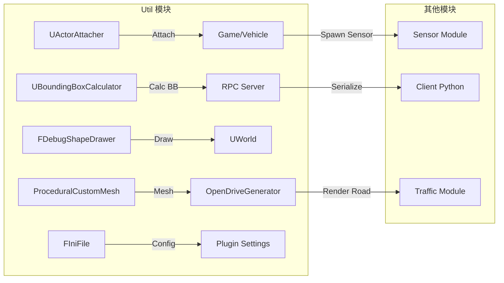

# Util模块技术文档

## 1. 概述

CARLA的Util模块提供了一系列底层的C++工具类，用于简化对Unreal世界中各种对象、集合体、导航、随机数以及调试绘制等功能的操作。Util模块位于源码路径`Unreal/CarlaUE4/Plugins/Carla/Source/Carla/Util`下，包含29个源文件和头文件，涵盖从附件管理、随机引擎到导航网络、文件解析、调试绘制等多方面工具。

### 1.1 Util模块与其它模块的调用关系图

- `UActorAttacher` 为 Game 与 Vehicle 模块提供动态附加接口；
- `UBoundingBoxCalculator` 在 RPC Server 中被调用，用于生成网络序列化的包围盒数据；
- `FDebugShapeDrawer` 直接作用于 UWorld，渲染调试原语；
- `ProceduralCustomMesh` 与 OpenDriveGenerator、RoadPainterWrapper 协作，呈现场景几何；
- `FIniFile` 在插件启动时读取外部配置，并在各模块初始化时注入参数。

### 1.2 Util模块关键流程图

```mermaid
flowchart TD
  subgraph 模块初始化
    A1[FIniFile: 读取 .ini 配置]
    A2[ObjectRegister: 注册全局管理对象]
    A1 --> A2
    A3[RandomEngine: 初始化随机数引擎]
    A2 --> A3
    A4[NoWorldOffsetSceneComponent: 设置世界坐标稳定]
    A3 --> A4
  end

  subgraph 仿真执行循环
    B1[FCarlaEngine Tick]
    B1 --> B2[UActorAttacher: 附加传感器至车辆]
    B2 --> B3[RandomEngine: 生成随机参数]
    B3 --> B4[UBoundingBoxCalculator: 计算各 Actor 包围盒]
    B4 --> B5[FDebugShapeDrawer: 绘制调试形状]
    B5 --> B6[ProceduralCustomMesh: 动态生成自定义网格]
    B6 --> B7[NavigationMesh: 更新/重构导航网格]
    B7 --> B8[RayTracer: 执行射线检测]
    B8 --> B9[FCarlaServer: 聚合 & RPC 序列化]
  end
```

## 2. Util核心功能类
### 2.1 UActorAttacher：Actor 附加器
#### 2.1.1 概要
`UActorAttacher`是 CARLA Unreal 插件中用于在运行时将“子” Actor（如传感器、摄像头等）附加到“父” Actor（如车辆、建筑物等）上的静态工具类，支持三种常用的附加模式：
- 刚性附加（Rigid）：调用 `Child->AttachToActor(Parent, FAttachmentTransformRules::KeepRelativeTransform)`；
- 弹簧臂附加（SpringArm）：调用`UActorAttacher_AttachActorsWithSpringArm(Child, Parent)`；
- “幽灵”弹簧臂附加（SpringArmGhost）：调用`UActorAttacher_AttachActorsWithSpringArmGhost(Child, Parent)`。

在内部，`AttachActors` 会根据传入的 `EAttachmentType` 枚举选择不同的实现分支，或调用 `Unreal` 原生的 `AttachToActor`，或动态创建并配置 `USpringArmComponent` 和 `UChildActorComponent`，实现带碰撞测试或不带碰撞测试的带臂附加效果。
最后将子 Actor 的所有者（Owner）设置为父 Actor，以便后续的生命周期和 RPC 权限管理

#### 2.1.2 关键方法详解
1. `AttachActors`
```cpp
UFUNCTION(BlueprintCallable, Category="CARLA|Actor Attacher")
static void AttachActors(AActor *Child, AActor *Parent, EAttachmentType AttachmentType);
```
- 作用：根据传入的AttachmentType分发到三种附加实现方式，最后执行`Child->SetOwner(Parent)`，将子 Actor 的所有者设为父 Actor
- 关键变量：
  - `Child`、`Parent`：要附加的子/父 Actor 指针：
  - `AttachmentType`：枚举值决定调用哪种附加方式。
- 使用场景：在仿真初始化或 `BeginPlay` 阶段将传感器、摄像头等以不同跟随模式挂载到车辆或其他移动 Actor 上。

2. `UActorAttacher_AttachActorsWithSpringArm`
```cpp
static void UActorAttacher_AttachActorsWithSpringArm(AActor *Child, AActor *Parent)
{
  // 1. 动态创建 SpringArmComponent
  auto SpringArm = NewObject<USpringArmComponent>(Parent);
  // 2. 计算子 Actor 相对位置并重置位置
  const auto ChildLocation = -Child->GetActorLocation();
  Child->SetActorLocation(FVector::ZeroVector);
  // 3. 配置弹簧臂属性
  SpringArm->TargetOffset = FVector(0,0,30.0f);
  SpringArm->bDoCollisionTest = true;
  SpringArm->SetRelativeRotation(FRotationMatrix::MakeFromX(ChildLocation).Rotator());
  SpringArm->SetupAttachment(Parent->GetRootComponent());
  SpringArm->TargetArmLength = ChildLocation.Size();
  SpringArm->bEnableCameraRotationLag = true;
  SpringArm->CameraRotationLagSpeed = 8.0f;
  SpringArm->bInheritPitch = false;
  SpringArm->bInheritRoll  = false;
  SpringArm->bInheritYaw   = true;
  SpringArm->AttachToComponent(
      Parent->GetRootComponent(),
      FAttachmentTransformRules::KeepRelativeTransform);
  SpringArm->RegisterComponent();
  // 4. 创建并附加 ChildActorComponent
  auto ChildComp = NewObject<UChildActorComponent>(Parent);
  ChildComp->SetupAttachment(
      SpringArm,
      USpringArmComponent::SocketName);
  Child->AttachToComponent(
      ChildComp,
      FAttachmentTransformRules::KeepRelativeTransform);
  ChildComp->RegisterComponent();
}
```
- 作用：利用 `USpringArmComponent` 自动实现带碰撞测试的“弹簧臂”跟随，使子 Actor 始终保持与父 Actor 之间的指定距离和方向
- 关键变量：
  - `ChildLocation`：用于计算臂长和设置旋转方向；
  - `TargetOffset`、`bDoCollisionTest`、`TargetArmLength`、`CameraRotationLagSpeed`：分别决定臂的偏移、高度、碰撞行为及旋转滞后。
- 使用场景：驾驶视角摄像头或第三人称摄像机跟随，需保持一定距离并对地形碰撞自动校正。
