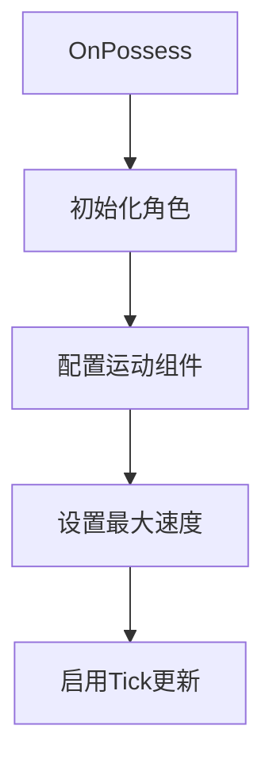
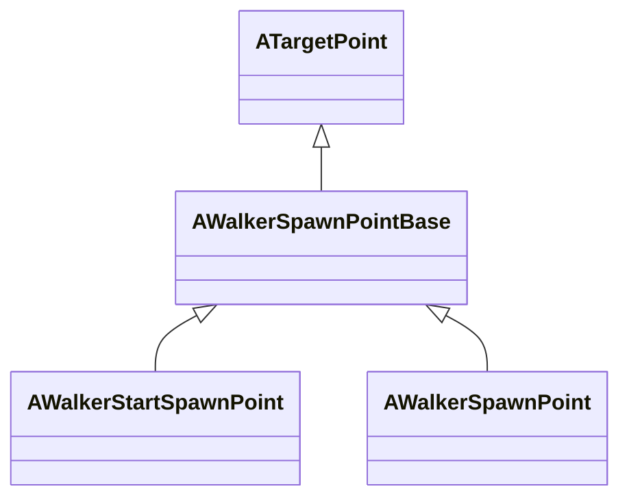

# 行人(Walker)模块说明文档

---

## 目录
- [1. 模块概述](#1-模块概述)
- [2. 核心类说明](#2-核心类说明)
  - [2.1 动画系统](#21-动画系统)
  - [2.2 行人基类](#22-行人基类)
  - [2.3 骨骼控制系统](#23-骨骼控制系统)
  - [2.4 运动控制参数](#24-运动控制参数)
  - [2.5 行人控制器](#25-行人控制器)
  - [2.6 生成点系统](#26-生成点系统)
- [3. 使用指南](#3-使用指南)
  - [3.1 基础控制流程](#31-基础控制流程)
  - [3.2 高级骨骼操作](#32-高级骨骼操作)
- [4. 注意事项](#4-注意事项)

---

## 1. 模块概述
在CARLA中，`Walker`模块用于模拟行人行为。行人可以通过动画系统和控制器进行控制，支持自然的行走、停止、转向等动作。此模块为Carla仿真平台提供完整的行人仿真解决方案，包含以下核心功能：

| 功能模块 | 关键组件 | 主要能力 |
|----------|----------|----------|
| 角色控制 | AWalkerBase | 基础属性管理、生命周期控制 |
| 动画系统 | UWalkerAnim | 姿势快照、动态混合控制 |
| 运动控制 | AWalkerController | 运动参数处理、物理模拟 |
| 骨骼系统 | FWalkerBoneControl | 多空间骨骼变换控制 |
| 生成系统 | AWalkerSpawnPoint | 生成点管理与路径规划 |

---

## 2. 核心类说明

### 2.1 动画系统

#### UWalkerAnim (`WalkerAnim.h`)
```cpp
UCLASS()
class CARLA_API UWalkerAnim : public UAnimInstance
```

##### 设计目的
- 实现动画混合与姿势捕捉的运行时控制
- 支持动态调整骨骼姿态

##### 关键属性
| 属性名 | 类型 | 默认值 | 说明 |
|--------|------|--------|------|
| Blend | float | 0.0 | 混合系数(0=完全动画，1=完全控制) |
| Snap | FPoseSnapshot | - | 存储骨骼层级变换数据 |

##### 核心方法
```cpp
// 从动画系统捕获当前姿势
void UpdatePoseFromAnimation()
{
    if(USkeletalMeshComponent* Mesh = GetSkelMeshComponent())
    {
        Mesh->SnapshotPose(Snap);
    }
}
```
#### 2.1.1 UWalkerAnim

`UWalkerAnim`类是行人动画实例，继承自`UAnimInstance`，用于处理行人的动画。

##### 2.1.1.1 构造函数

```cpp
UWalkerAnim(const FObjectInitializer &ObjectInitializer);
```

- 初始化动画实例。

##### 2.1.1.2 Blend

```cpp
UPROPERTY(Category="Walker Anim", BlueprintReadWrite, EditAnywhere)
float Blend = 0.0;
```

- 表示动画混合的比例。

##### 2.1.1.3 Snap

```cpp
UPROPERTY(Category="Walker Anim", BlueprintReadWrite, EditAnywhere)
FPoseSnapshot Snap;
```

- 当前的动画快照。
---

### 2.2 行人基类

#### AWalkerBase (`WalkerBase.h`)
```cpp
UCLASS()
class CARLA_API AWalkerBase : public ACharacter
```

##### 状态管理
| 属性 | 类型 | 默认 | 说明 |
|------|------|------|------|
| bAlive | bool | true | 生存状态标志位 |
| AfterLifeSpan | float | 10.0f | 死亡后存留时间(s) |
| bUsesWheelChair | bool | false | 轮椅模式开关 |

##### 生命周期控制
```cpp
UFUNCTION(BlueprintCallable)
void TriggerDestruction()
{
    if(!bAlive) return;
    bAlive = false;
    StartDeathLifeSpan();
}
```

---

### 2.3 骨骼控制系统

#### 控制参数结构
```cpp
// 输入结构（客户端->服务端）
USTRUCT()
struct FWalkerBoneControlIn {
    TMap<FString, FTransform> BoneTransforms;
};

// 输出结构（服务端->客户端） 
USTRUCT()
struct FWalkerBoneControlOut {
    TMap<FString, FWalkerBoneControlOutData> BoneTransforms;
};

// 变换数据三元组
struct FWalkerBoneControlOutData {
    FTransform World;    // 世界坐标系
    FTransform Component;// 组件坐标系
    FTransform Relative; // 骨骼相对坐标系
};
```

##### 坐标系对比
| 坐标系类型 | 计算基准 | 典型应用场景 |
|------------|----------|--------------|
| World | 全局原点 | 物理碰撞检测 |
| Component | 根骨骼原点 | 动画混合计算 |
| Relative | 父骨骼原点 | 骨骼链操作 |

#### 2.3.1 FWalkerBoneControlIn

`FWalkerBoneControlIn`结构体用于表示行人的骨骼控制输入。

##### 2.3.1.1 BoneTransforms

```cpp
UPROPERTY(Category = "Walker Bone Control", EditAnywhere, BlueprintReadWrite)
TMap<FString, FTransform> BoneTransforms;
```

- 行人的骨骼变换信息。

#### 2.3.2 FWalkerBoneControlOut

`FWalkerBoneControlOut`结构体用于表示行人的骨骼控制输出。

##### 2.3.2.1 BoneTransforms

```cpp
UPROPERTY(Category = "Walker Bone Control", EditAnywhere, BlueprintReadWrite)
TMap<FString, FWalkerBoneControlOutData> BoneTransforms;
```

- 行人的骨骼变换信息。
---

### 2.4 运动控制参数

#### FWalkerControl (`WalkerControl.h`)
```cpp
USTRUCT(BlueprintType)
struct FWalkerControl
```

##### 运动参数详解
| 参数 | 单位 | 有效范围 | 说明 |
|------|------|----------|------|
| Direction | - | 归一化向量 | 移动方向(XYZ分量) |
| Speed | cm/s | 0~4096 | 实际速度=Speed * Direction |
| Jump | bool | true/false | 跳跃触发信号 |

#### 2.4.1 FWalkerControl

`FWalkerControl`结构体用于表示行人的控制输入。

##### 2.4.1.1 Direction

```cpp
UPROPERTY(Category = "Walker Control", EditAnywhere, BlueprintReadWrite)
FVector Direction = {1.0f, 0.0f, 0.0f};
```

- 行人的移动方向。

##### 2.4.1.2 Speed

```cpp
UPROPERTY(Category = "Walker Control", EditAnywhere, BlueprintReadWrite)
float Speed = 0.0f;
```

- 行人的移动速度。

##### 2.4.1.3 Jump

```cpp
UPROPERTY(Category = "Walker Control", EditAnywhere, BlueprintReadWrite)
bool Jump = false;
```

- 是否跳跃。
---

### 2.5 行人控制器

#### AWalkerController (`WalkerController.h`)
```cpp
UCLASS()
class AWalkerController : public AController
```

##### 控制器生命周期


##### 核心方法说明
```cpp
// 骨骼数据获取流程
void GetBonesTransform(FWalkerBoneControlOut& OutData)
{
    1. 获取骨架网格体
    2. 遍历所有骨骼节点
    3. 计算三种空间变换
    4. 填充输出结构
}
```

#### 2.5.1 AWalkerController

`AWalkerController`类是行人控制器，继承自`AController`，用于控制行人的移动和动画。

##### 2.5.1.1 构造函数

```cpp
AWalkerController(const FObjectInitializer &ObjectInitializer);
```

- 设置`PrimaryActorTick.bCanEverTick`为`true`，表示这个Actor可以在每一帧都被更新。

##### 2.5.1.2 OnPossess

```cpp
void OnPossess(APawn *InPawn) override;
```

- 当`AWalkerController`“占有”一个`APawn`时调用此函数。
- 设置角色的最大行走速度和跳跃速度。

##### 2.5.1.3 Tick

```cpp
void Tick(float DeltaSeconds) override;
```

- 每帧调用，处理行人的移动和动画更新。
- 根据控制输入（方向和速度）添加角色的移动输入。

##### 2.5.1.4 GetMaximumWalkSpeed

```cpp
float GetMaximumWalkSpeed() const;
```

- 返回行人的最大行走速度（默认为4096.0f，约147 km/h）。

##### 2.5.1.5 ApplyWalkerControl

```cpp
void ApplyWalkerControl(const FWalkerControl &InControl);
```

- 应用控制输入到行人。

##### 2.5.1.6 GetWalkerControl

```cpp
const FWalkerControl GetWalkerControl() const;
```

- 获取当前的行人控制状态。

##### 2.5.1.7 GetBonesTransform

```cpp
void GetBonesTransform(FWalkerBoneControlOut &WalkerBones);
```

- 获取行人的骨骼变换信息。

##### 2.5.1.8 SetBonesTransform

```cpp
void SetBonesTransform(const FWalkerBoneControlIn &WalkerBones);
```

- 设置行人的骨骼变换信息。

##### 2.5.1.9 BlendPose

```cpp
void BlendPose(float Blend);
```

- 混合当前的行人姿态与另一种姿态。

##### 2.5.1.10 GetPoseFromAnimation

```cpp
void GetPoseFromAnimation();
```

- 从动画中获取当前的行人姿态。

---

### 2.6 生成点系统

#### 类继承结构


##### 生成点类型对比
| 类型 | 生成时机 | 用途 |
|------|----------|------|
| StartSpawnPoint | 场景加载时 | 初始行人位置 |
| SpawnPoint | 运行时动态生成 | 路径点/目标点 |

#### 2.6.1 AWalkerSpawnPointBase

`AWalkerSpawnPointBase`类是行人生成点的基类，继承自`ATargetPoint`。

#### 2.6.2 AWalkerStartSpawnPoint

`AWalkerStartSpawnPoint`类用于设置关卡中行人的生成点位置。

#### 2.6.3 AWalkerSpawnPoint

`AWalkerSpawnPoint`类用于设置关卡中行人的生成点位置。

---

## 3. 使用指南

### 3.1 基础控制流程

#### 初始化序列
```cpp
// 创建行人实例
AWalkerBase* Walker = SpawnWalkerActor();

// 绑定控制器
AWalkerController* Controller = AttachWalkerController(Walker);

// 配置基础参数
FWalkerControl Params;
Params.Direction = FVector(0.8f, 0.2f, 0.0f);
Params.Speed = 1500.0f;
Controller->ApplyWalkerControl(Params);
```

---

### 3.2 高级骨骼操作

#### 逆向运动学示例
```cpp
// 获取当前骨骼数据
FWalkerBoneControlOut BoneData;
Controller->GetBonesTransform(BoneData);

// 修改右手骨骼
FWalkerBoneControlIn NewPose;
NewPose.BoneTransforms.Add("hand_r", 
    FTransform(
        FRotator(0,45,0), 
        FVector::ZeroVector,
        FVector(1.0f)
);

// 应用新姿势
Controller->SetBonesTransform(NewPose);
Controller->BlendPose(0.7f); // 70%控制权重
```

---

## 4. 注意事项

### 性能优化建议
1. **骨骼操作开销**：单角色骨骼数建议<150个
2. **更新频率控制**：骨骼数据更新建议间隔≥0.1s
3. **混合系数管理**：避免全控制状态(Blend=1)持续超过5秒

### 常见问题排查
| 现象 | 可能原因 | 解决方案 |
|------|----------|----------|
| 角色不移动 | 控制器未正确绑定 | 检查OnPossess流程 |
| 骨骼变形异常 | 坐标系使用错误 | 验证Component空间数据 |
| 动画混合失效 | 未调用BlendPose | 确保设置混合系数 |

---