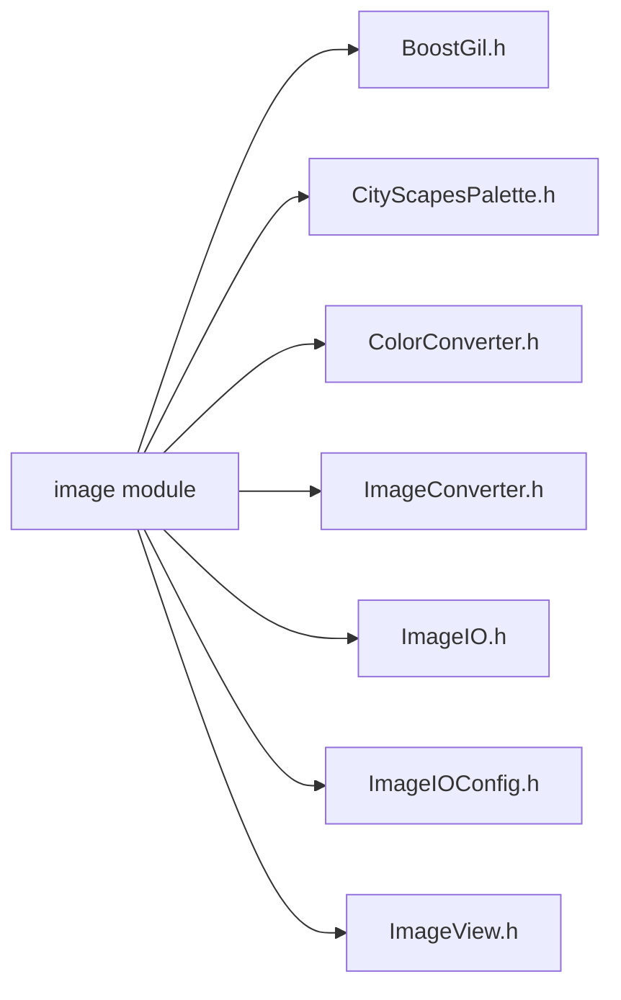
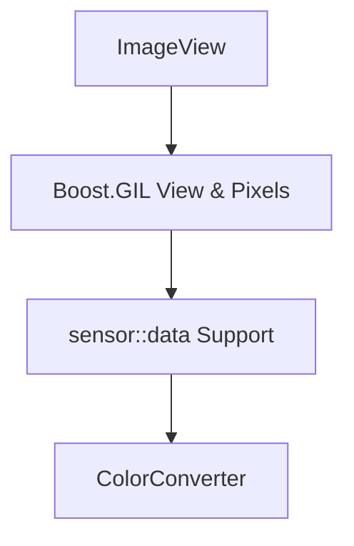
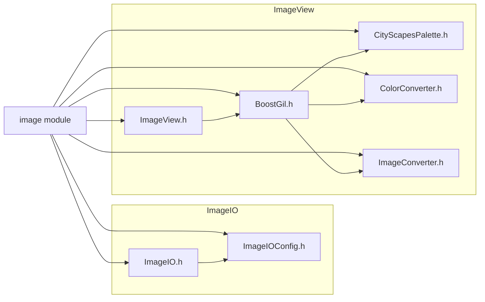

# image模块在carla模拟器中的作用分析

## 目录
- [1. calar结构](#1carla-结构)
- [2. image模块概述](#2image模块概述)
- [3. 详细分析](#3详细分析)
  - [3.1 BoostGil.h —— 底层支持](#31-boostgilh底层图像处理工具包)
  - [3.2 CityScapesPalette.h ——调色板](#32-cityscapespaletteh上色工具)
  - [3.3 ColorConverter.h](#33-colorconverterh颜色转换器)
  - [3.4 imageconverter.h](#34-imageconverterh格式转换接口)
  - [3.5 imageio系列](#35-imageio系列)
    - [3.5.1 imageIO.h](#351-imageioh-提供统一的图像-io-接口)
    - [3.5.2 imageIOconfig.h](#352-imageioconfgh--提供多格式支持的图像输入输出功能)
  - [3.6 imageviewh——提供图像视图和颜色转换功能](#36-imageviewh--高校操作图像数据)
- [4. 工作流程示例](#4工作流程示例)
- [5.问题与改进](#5.问题与改进)

## 1.carla 结构

**整体结构**：carla 是一个自动驾驶模拟器，其目录结构按功能模块划分。

**核心模块**包括：
- **client**：客户端通信与 API 接口  
- **sensor**：传感器数据采集（如摄像头、激光雷达）  
- **geom**：几何数据处理  
- **nav**：导航与路径规划  
- **image**：图像处理与转换（核心分析对象）  

 **接下来我将对其中的图像处理模块——image进行分析**

## 2.image模块概述

**功能**：颜色处理、格式转换、文件操作、调色板支持等。

**关键依赖**：`sensor`（数据来源）、`Buffer`（数据缓存管理）。

**image 结构**



## 3.详细分析

### 3.1 BoostGil.h——底层图像处理工具包

**文件功能**
- 1.引入Boost图像库——万能工具箱；
- 2.关掉编译器的一些不影响功能的警告；
- 3.提供像素级操作，比如裁剪图片、调整颜色。

```cpp
#if defined(__clang__)
#  pragma clang diagnostic push
#  pragma clang diagnostic ignored "-Wc++11-narrowing"
#  pragma clang diagnostic ignored "-Wunused-parameter"
#  pragma clang diagnostic ignored "-Wunused-local-typedef"
#endif
```
- 忽略不影响功能的警告，保持编译干净输出

```cpp
#include <boost/gil.hpp>
```
 **包含"Generic Image Library"头文件** 
- 图像数据内存管理/像素级操作/图像视图支持高校访问图像区域/颜色空间转换/图像算法

**设计意图** 
 - 1.提供Boost GIL接口，支持carla中摄像头传感器数据的底层图像处理
 - 2.作为'imageView.h'等文件的基础依赖，实现高效的图像视图操作

```plaintext
传感器数据 → ImageConverter（格式转换） → Boost GIL（像素处理） → 输出到 ImageIO（保存为文件）
```

### 3.2 CityScapesPalette.h——上色工具

**文件功能**
- 定义 Cityscapes 数据集的语义分割颜色调色板，用于将语义标签映射为可视化 RGB 颜色。（对比上色）
 
**核心组件**：
  - 1.`CITYSCAPES_PALETTE_MAP`：预定义的 RGB 颜色映射表，对应 Cityscapes 的 24 类语义标签。
    - `GetNumberOfTags()`计算颜色映射表的标签总数（数组行数）
    - `GetColor(uint8_t tag)`根据标签返回对应的 RGB 颜色值，使用取模运算防止越界

- 2.`CityScapesPalette` 类：提供接口获取颜色值和标签数量。

### 3.3 ColorConverter.h——颜色转换器

**文件功能**
- 提供多种颜色/数据转换器，支持灰度对数转换、深度值计算、语义标签可视化等核心功能。

**核心组件**：
  - `LogarithmicLinear`：对数线性转换，用于增强低光照图像。
  - `Depth`：将 RGB 编码的深度信息转换为标准化深度值。
  - `CityScapesPalette`：将语义标签映射为 Cityscapes 调色板颜色。

**关键设计：**
 - **输入要求：** 源像素的 R 通道为标签值（0-23）。
 - **颜色映射：** 通过 CityScapesPalette::GetColor 获取预定义颜色。

### 3.4 ImageConverter.h——格式转换接口

**文件功能**
- 提供通用的图像像素操作接口，支持像素复制和原地颜色空间转换（格式转换和颜色转换）。

**核心组件**：
  - `CopyPixels`：跨视图像素复制（支持不同像素格式）。
  - `ConvertInPlace`：原地图像颜色转换（如 RGB→灰度、语义标签可视化）。


### 3.5 ImageIO系列
#### 3.5.1 ImageIO.h ——提供统一的图像 I/O 接口

**文件功能**
- 提供图像文件的读取和写入接口，支持多种图像格式的扩展。

**核心组件**：
  - `ReadImage`：从文件读取图像数据到内存。
  - `WriteView`：将内存中的图像视图写入文件。

#### 3.5.2 ImageIOConfg.h —— 提供多格式支持的图像输入输出功能

**文件功能**

- **格式支持检查**：检测是否支持 PNG、JPEG 和 TIFF 格式。
- **图像格式扩展支持**：根据编译条件决定是否支持某种图像格式。
- **支持动态图像格式处理**：根据不同的文件扩展名选择合适的格式处理器进行图像读取与写入。
 

### 3.6 ImageView.h —— 高效操作图像数据

**文件功能**
- 提供对图像的访问和处理接口，支持从传感器图像创建视图，并提供多种颜色转换操作。

**核心组件**：
  - `MakeView`：创建图像视图，便于操作和修改图像数据，不用复制直接修改像素。
  - `MakeColorConvertedView`：执行不同类型的颜色转换，如灰度、调色板转换等。
 - `MakeViewFromSensorImage` ：为传感器图像类型创建视图，并转换为指定的目标像素类型。

 **模块交互关系**


## 4.工作流程示例



## 5.问题与改进

| 可能遇到的问题 | 改进建议 |
|----------------|----------|
| 格式不支持     | 更多格式支持<br>比如WebP格式压缩率更高 |
| 如果电脑没装PNG库，存图会失败 | 异常处理<br>存图失败时给出更明确的错误提示 |
| 颜色映射越界   | 如果物体类型编号超过调色表范围，颜色会循环（比如第25类会用第1类的颜色） |
| 性能瓶颈       | 处理4K图像时，纯CPU计算可能较慢<br>加GPU加速<br>用显卡处理大图转换（比如加CUDA代码） |
| 多线程优化     | 同时处理多张图片提升效率 |

### ✅5.1 增加图像格式支持：WebP 等

**改进措施**
增加对 WebP 格式的支持（依赖第三方库，如 libwebp）

**修改：ImageIOConfig.h**
```cpp
#ifdef USE_WEBP
#define SUPPORT_WEBP
#include <webp/decode.h>
#include <webp/encode.h>
#endif
```
**修改：ImageIO.h**
```cpp
#ifdef SUPPORT_WEBP
bool IsWebP(const std::string &filename) {
    return EndsWith(filename, ".webp");
}
void WriteWebP(const ViewType &view, const std::string &filename) {
    // 简单示例：实际需要处理 view 数据格式
    WebPEncodeRGBA(view.data(), view.width(), view.height(), view.stride(), 90, &output_buffer);
    SaveToFile(output_buffer, filename);
}
#endif
```
### ✅ 5.2 PNG库缺失时的异常处理

**改进措施：**
加入异常处理与友好错误提示。

**修改：ImageIO.h**
```cpp
try {
    WriteView(...);  // 写图操作
} catch (const std::exception &e) {
    std::cerr << "[Error] Failed to write image. Check if the required image library (e.g., PNG) is installed.\n";
    std::cerr << "Details: " << e.what() << std::endl;
}
```
### ✅ 5.3 颜色映射越界处理

**改进措施：**
提供一个默认颜色或高亮色来标记“未定义标签”。

**修改：CityScapesPalette.h**
```cpp
static Color GetColor(uint8_t tag) {
    if (tag >= kNumClasses) {
        return {255, 0, 255};  // 使用洋红色标示错误（不常见）
    }
    return CITYSCAPES_PALETTE_MAP[tag];
}
```

### ✅ 5.4 GPU 加速建议（CUDA 或 OpenCV GPU）
**改进措施：**
增加 CUDA 或 OpenCV GPU 模块做图像颜色转换、格式转换。

**使用 OpenCV CUDA 处理灰度转换（可在 ImageConverter.h 中拓展）**
```cpp
#ifdef USE_CUDA
cv::cuda::GpuMat gpu_input, gpu_output;
gpu_input.upload(cv::Mat(input_view));  // 上传数据到GPU
cv::cuda::cvtColor(gpu_input, gpu_output, cv::COLOR_RGB2GRAY);  // 转灰度
gpu_output.download(output_mat);  // 下载回来
#endif
```