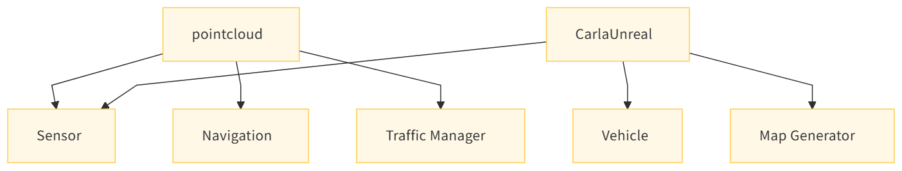

# CARLA 点云数据处理模块说明文档

## 目录

1. [项目概述](#1项目概述)
2. [头文件与命名空间](#2头文件与命名空间)
    1. [包含的头文件](#21包含的头文件)
    2. [命名空间定义](#22命名空间定义)
3. [PointCloudIO 类](#3pointcloudio类)
    1. [模板函数 Dump](#31模板函数-dump)
    2. [模板函数 SaveToDisk](#32模板函数-savetodisk)
    3. [私有静态函数 WriteHeader](#33私有静态函数-writeheader)
4. [总结](#4总结)

---

## 1 项目概述

在自动驾驶仿真与感知系统开发领域，精确且高效的点云数据处理能力至关重要。点云数据作为环境感知的关键输入，其处理效率和准确性直接影响到后续的感知算法性能与决策准确性。本模块专注于为CARLA仿真环境中的点云数据处理提供高效、便捷的工具，旨在帮助研究人员和开发者快速实现点云数据的输入输出操作，进而专注于核心算法的开发与优化，提升整体研发效率与成果质量。
#### 点云模块依赖图

## 2 头文件与命名空间

### i 包含的头文件

  * `#include "carla/FileSystem.h"` ：包含CARLA文件系统头文件，用于文件路径验证等文件操作功能。
  * `#include <fstream>` ：用于文件流操作，实现点云数据保存到磁盘文件的功能。
  * `#include <iterator>` ：用于迭代器操作，在遍历点云数据时提供支持。
  * `#include <iomanip>` ：用于输入输出操作中的格式控制，如设置输出精度等。

### ii 命名空间定义

  * `namespace carla` ：定义命名空间carla，用于组织与CARLA仿真相关的代码和数据。
  * `namespace pointcloud` ：在carla命名空间下进一步定义pointcloud命名空间，专门组织与点云处理相关的代码，提高代码的可读性和可维护性。

## 3 pointcloudio类

该类提供了处理点云数据输入输出的功能，包括将点云数据写入输出流和保存到磁盘文件。

### i 模板函数-dump

  * **功能** ：将点云数据写入到输出流中。
  * **参数** ：
    * `std::ostream &out` ：输出流对象，用于写入点云数据。
    * `PointIt begin` ：点云数据的起始迭代器，用于指定遍历的起点。
    * `PointIt end` ：点云数据的结束迭代器，用于指定遍历的终点。

  * **实现过程** ：
    1. 调用`WriteHeader`函数写入PLY文件的头部信息，包括文件格式、顶点数量等。
    2. 遍历从`begin`到`end`的点云数据，通过每个点对象的`WriteDetection`方法将点的信息写入到输出流`out`中，并在每个点的数据后添加换行符。

### ii 模板函数-savetodisk

  * **功能** ：将点云数据保存到磁盘文件中，文件格式为PLY。
  * **参数** ：
    * `std::string path` ：指定保存的文件路径。
    * `PointIt begin` ：点云数据的起始迭代器。
    * `PointIt end` ：点云数据的结束迭代器。

  * **实现过程** ：
    1. 使用`FileSystem::ValidateFilePath`函数验证文件路径是否以".ply"结尾，确保保存的文件为PLY格式。
    2. 创建`std::ofstream`输出文件流对象`out`，并打开指定路径的文件。
    3. 调用`Dump`函数，将点云数据写入到文件中。
    4. 返回保存文件的路径，以便后续操作使用。

### iii 私有静态函数-writeheader

  * **功能** ：写入PLY文件的头部信息。
  * **参数** ：
    * `std::ostream &out` ：输出流对象。
    * `PointIt begin` ：点云数据的起始迭代器。
    * `PointIt end` ：点云数据的结束迭代器。

  * **实现过程** ：
    1. 使用`DEBUG_ASSERT`宏断言确保点云数据的数量非负，提高程序的健壮性。
    2. 向输出流`out`中写入PLY文件的基本头部信息，包括"ply"、"format ascii 1.0"等。
    3. 计算点云中点的数量，通过`std::distance(begin, end)`得到，并将其写入头部信息中的"element vertex"字段。
    4. 调用`begin`所指向的点对象的`WritePlyHeaderInfo`方法，写入该点对象特定的头部信息，如坐标、颜色等属性的描述。
    5. 写入PLY文件头部的结束标志"end_header"。
    6. 设置输出流的格式为固定小数点后4位，以便后续数据输出时保持一致的精度。

## 4 总结

通过上述代码结构和功能说明，可以清晰地了解到该模块在CARLA仿真环境中对点云数据进行处理和存储的方式，方便开发者在需要处理点云数据时进行调用和扩展。