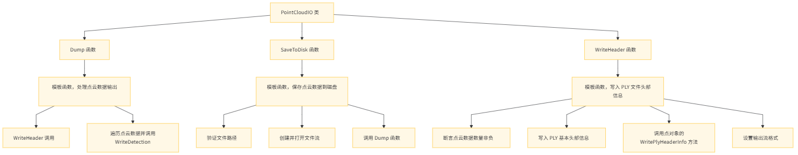
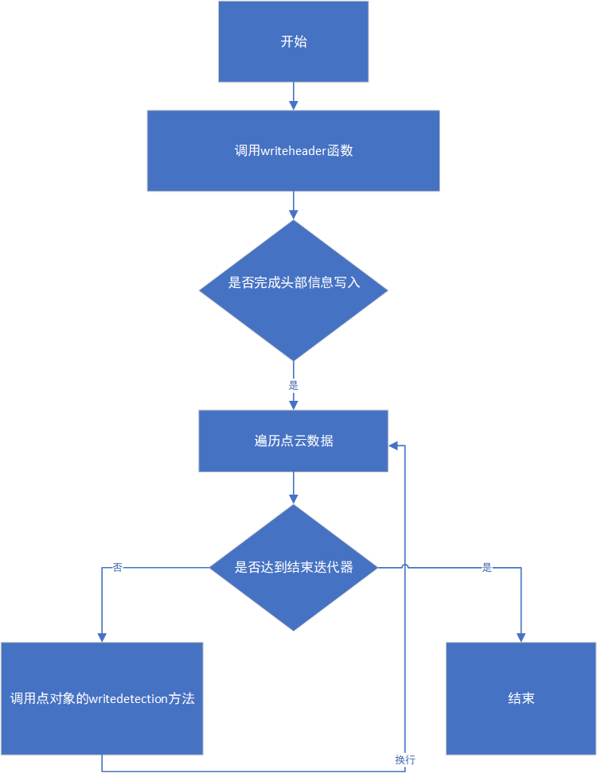
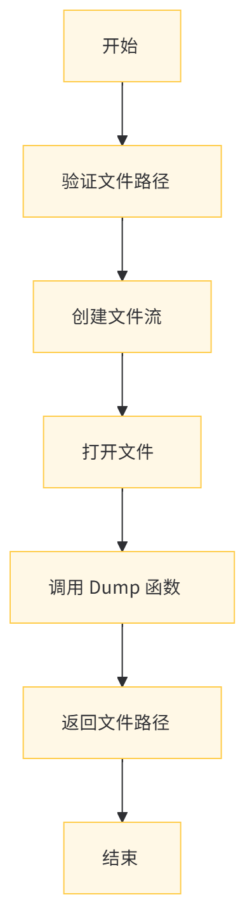

# CARLA 点云数据处理模块说明文档

## 目录

1. [项目概述](#项目概述)
2. [头文件与命名空间](#头文件与命名空间)
    1. [包含的头文件](#包含的头文件)
    2. [命名空间定义](#命名空间定义)
3. [PointCloudIO 类](#pointcloudio类)
    1. [模板函数 Dump](#模板函数`dump`)
    2. [模板函数 SaveToDisk](#模板函数 `SaveToDisk`)
    3. [私有静态函数 WriteHeader](#私有静态函数 `WriteHeader`)
4. [优化与扩展建议](#优化与扩展建议)
5. [总结](#总结)

---
<span id="项目概述"></span>
## 1 项目概述

点云数据是自动驾驶系统中重要的传感器数据之一，尤其是在仿真环境下，CARLA通过提供高度逼真的虚拟世界使得研究人员能够模拟传感器数据，从而进行算法开发、测试与验证。本模块的主要功能是提供点云数据的输入输出接口，主要聚焦于数据存储格式PLY（Polygon File Format），并确保数据可以高效、准确地读写。

该模块作为CARLA仿真系统的一部分，通过与其他系统（如导航、传感器和交通管理模块）紧密集成，能为后续感知、决策等模块提供清晰、准确的环境感知数据。
### 点云模块依赖图

该图展示了点云模块如何与其他核心模块交互：
- **传感器模块（Sensor）**：通过采集点云数据，为仿真系统提供实时环境感知。
- **导航模块（Navigation）**：借助点云数据，进行路径规划、障碍物检测等操作。
- **交通管理模块（Traffic Manager）**：通过点云数据优化交通流量与车辆行为控制。

### 点云数据重要性

在自动驾驶系统中，点云数据能够提供详细的三维环境模型，它对于精准的物体检测、障碍物避让以及路径规划至关重要，通过优化点云的输入输出（I/O）流程，能够大幅提升系统的实时性与稳定性

### 点云实现原理 
点云数据中的每个点代表了从传感器到被测物体的距离信息。这些距离是通过测量传感器发射信号（如激光）往返的时间（Time of Flight, ToF）来计算的。具体计算公式如下:
$$
\text{距离} = \frac{c \times t}{2}
$$

其中：

- c 是光速。

- t 是信号往返的时间。

  通过这种方法，传感器可以获取环境中的三维点云数据。这些数据随后会被处理和分析，以支持自动驾驶系统中的各种功能，如路径规划和障碍物检测。
---
<span id="头文件与命名空间"></span>
## 2 头文件与命名空间
<span id="包含的头文件"></span>
### i 包含的头文件

  * `#include "carla/FileSystem.h"` ：包含CARLA文件系统头文件，用于文件路径验证等文件操作功能。
  * `#include <fstream>` ：用于文件流操作，实现点云数据保存到磁盘文件的功能。
  * `#include <iterator>` ：用于迭代器操作，在遍历点云数据时提供支持。
  * `#include <iomanip>` ：用于输入输出操作中的格式控制，如设置输出精度等。
<span id="命名空间定义"></span>
### ii 命名空间定义

  * `namespace carla` ：定义命名空间carla，用于组织与CARLA仿真相关的代码和数据。
  * `namespace pointcloud` ：在carla命名空间下进一步定义pointcloud命名空间，专门组织与点云处理相关的代码，提高代码的可读性和可维护性。
<span id="pointcloudio类"></span>
## 3 pointcloudio类

该类提供了处理点云数据输入输出的功能，包括将点云数据写入输出流和保存到磁盘文件。`PointCloudIO`类是点云数据处理的核心，提供了点云数据的写入、保存和头部信息编写功能。


* **文字说明** ：
此结构图展示了 `PointCloudIO` 类的主要组成和依赖关系。`PointCloudIO` 类包含两个公开的模板函数 `Dump` 和 `SaveToDisk`，以及一个私有的静态模板函数 `WriteHeader`。`Dump` 函数用于将点云数据写入输出流，`SaveToDisk` 函数用于将点云数据保存到磁盘文件，而 `WriteHeader` 函数则负责写入 PLY 文件的头部信息。类依赖于 `FileSystem` 进行文件路径验证，依赖于 `std::ostream` 和 `std::ofstream` 进行文件流操作。

<span id="模板函数`dump`"></span>
### i 模板函数`dump`

  * **功能** ：该模板函数将点云数据写入到输出流中。模板参数`PointIt`表示点云数据的迭代器类型，`out`是输出流对象，`begin`和`end`分别表示点云数据的起始和结束迭代器。
  * **参数** ：
    * `std::ostream &out` ：输出流对象，用于写入点云数据。
    * `PointIt begin` ：点云数据的起始迭代器，用于指定遍历的起点。
    * `PointIt end` ：点云数据的结束迭代器，用于指定遍历的终点。

  * **实现过程** ：
    1. 调用`WriteHeader`函数写入PLY文件的头部信息，这些信息包括文件格式、点云数据的顶点数等。
    2. 遍历从`begin`到`end`的点云数据，通过每个点对象的`WriteDetection`方法将点的信息写入到输出流`out`中，并在每个点的数据后添加换行符。
* **代码示例** ：
```cpp
template <typename PointIt>
static void Dump(std::ostream &out, PointIt begin, PointIt end) {
  WriteHeader(out, begin, end);  // 写入头部信息
  for (; begin != end; ++begin) {
    begin->WriteDetection(out);  // 将每个点的信息写入输出流
    out << '\n';  // 每个点的信息后换行
  }
}
```
* **dump函数流程图** ：

* **文字说明** ：
此流程图展示了 Dump 函数的流程。首先调用 WriteHeader 函数写入 PLY 文件的头部信息。头部信息写入完成后，函数遍历从 begin 到 end 的点云数据，依次调用每个点对象的 WriteDetection 方法将点信息写入输出流，并在每个点的数据后添加换行符。遍历完成后，函数标志结束。
<span id="模板函数 `SaveToDisk`"></span>
### ii. 模板函数 `SaveToDisk`

#### 功能
将点云数据保存到磁盘上的PLY文件中。此函数接受一个文件路径，和点云数据的迭代器。

#### 过程
1. **验证文件路径**：调用`FileSystem::ValidateFilePath`函数，确保路径以`.ply`结尾。
2. **创建文件流**：使用`std::ofstream`创建一个文件输出流，打开指定路径的文件。
3. **调用`Dump`**：将点云数据通过`Dump`函数写入文件。
4. **返回路径**：返回保存的文件路径，方便后续操作。

#### 代码示例：
```cpp
template <typename PointIt>
static std::string SaveToDisk(std::string path, PointIt begin, PointIt end) {
  FileSystem::ValidateFilePath(path, ".ply");  // 验证路径
  std::ofstream out(path);  // 打开输出流
  Dump(out, begin, end);  // 写入数据
  return path;  // 返回文件路径
}
```
* **`SaveToDisk`函数流程图** ：

* 此流程图展示了 SaveToDisk 函数的工作流程。首先验证文件路径是否以 .ply 结尾，确保文件类型正确。然后创建输出文件流对象并打开指定路径的文件。接着调用 Dump 函数将点云数据写入文件。最后返回保存的文件路径，以便后续操作使用。
<span id="私有静态函数 `WriteHeader`"></span>
### iii. 私有静态函数 `WriteHeader`

#### 功能
该私有函数负责将PLY文件的头部信息写入到输出流。头部信息包括文件格式、点云数据的顶点数，以及每个点的数据格式。

#### 过程
1. **断言检查**：使用`DEBUG_ASSERT`确保点云数据的数量非负。通过`std::distance(begin, end)`计算点云的总数量。
2. **写入基本头部信息**：包括文件格式和顶点数量。
3. **点对象特定头部信息**：调用点对象的`WritePlyHeaderInfo`方法，写入每个点的属性，如坐标、颜色等。
4. **结束头部**：最后写入`end_header`，标记头部的结束。
5. **精度设置**：设置输出流的精度，固定为4位小数，确保数据格式一致。

#### 代码示例：
```cpp
template <typename PointIt> 
static void WriteHeader(std::ostream &out, PointIt begin, PointIt end) {
  DEBUG_ASSERT(std::distance(begin, end) >= 0);  // 检查数据有效性
  out << "ply\n"
      << "format ascii 1.0\n"
      << "element vertex " << std::to_string(static_cast<size_t>(std::distance(begin, end))) << "\n";
  begin->WritePlyHeaderInfo(out);  // 写入点对象的头部信息
  out << "\nend_header\n";  // 结束头部
  out << std::fixed << std::setprecision(4u);  // 设置精度
}
```

---
<span id="优化与扩展建议"></span>
## 4 优化与扩展建议

### 4.1 文件格式支持扩展

目前，模块仅支持将点云数据保存为PLY格式。如果需要支持其他格式（如PCD、XYZ等），可以扩展 `PointCloudIO` 类，添加新的方法以处理不同的文件格式。这可以通过在 `WriteHeader` 和 `Dump` 方法中增加不同格式的支持来实现。

### 4.2 异常处理与日志记录

当前代码的异常处理机制较为简单。建议增加对文件打开失败、写入错误等情况的处理，并使用日志记录工具输出详细的错误信息。这样可以帮助开发者更快地定位问题。

### 4.3 性能优化

在处理大规模点云数据时，当前方法可能会面临性能瓶颈。可以通过以下方式优化性能：

- **并行化写入操作**：使用多线程或并行算法来加速数据写入。
- **内存管理优化**：通过优化内存管理策略，减少不必要的内存分配和拷贝操作。

### 4.4 单元测试

为了确保代码的正确性和稳定性，建议为 `PointCloudIO` 类编写单元测试，特别是针对点云数据的写入与读取功能，确保其在不同情况下都能正常工作。

---
<span id="总结"></span>
## 5. 总结


该模块提供了一整套点云数据的输入输出接口，主要针对PLY文件格式的处理，能够高效地将点云数据保存到磁盘，并确保数据格式的正确性和一致性。通过组织良好的函数与类结构，能够轻松扩展和修改代码，以满足不同的需求。

此外，模块内部的文件操作、头部信息写入、数据精度控制等细节都经过精心设计，保证了点云数据在保存时的准确性和可读取性。这对于自动驾驶仿真系统中的数据存储和后续算法的调试与验证具有重要的意义。