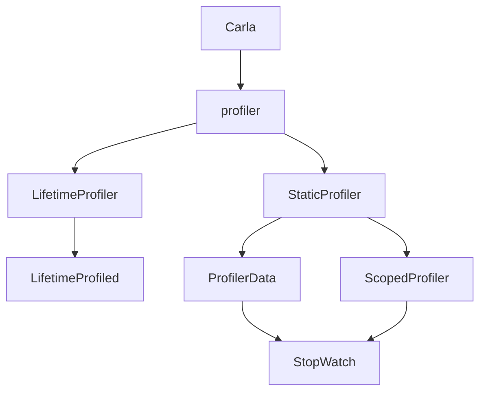

# Profiler模块说明文档

# 目录
- [概述](#概述)
- [模块关系](#模块关系)
- [结构化设计](#结构化设计)
- [用户定制](#用户定制)
- [架构](#架构)
  - [生命周期分析器](#生命周期分析器)
    - [生命周期分析器的内部结构](#生命周期分析器的内部结构)
  - [性能分析器](#性能分析器)
    - [性能分析器的内部结构](#性能分析器的内部结构)
- [使用Profiler](#使用profiler)
  - [生命周期分析器的使用](#生命周期分析器的使用)
  - [性能分析器的使用](#性能分析器的使用)
- [性能分析示例](#性能分析示例)
- [性能数据输出](#性能数据输出)
- [性能优化建议](#性能优化建议)
- [Profiler模块架构图](#profiler模块架构图)
- [与其他模块的交互](#与其他模块的交互)
  - [与Python脚本的交互](#与python脚本的交互)
  - [与Carla库的交互](#与carla库的交互)
  - [与虚幻插件的交互](#与虚幻插件的交互)
- [注意事项](#注意事项)

## 概述
Profiler模块是一个用于性能分析的工具，它可以帮助开发者了解代码的运行性能，包括对象的生命周期和性能数据的记录。该模块由两个主要部分组成：生命周期分析器（LifetimeProfiler）和性能分析器（Profiler）。通过使用Profiler模块，开发者可以轻松地监测和优化代码的性能。

## 模块关系
Profiler模块位于LibCarla库中，与Python脚本、Carla库、虚幻插件等模块紧密相关。它通过Boost.Python与Python脚本交互，通过LibCarla客户端与服务器端通信，从而在整个项目中发挥性能分析的作用。

## 结构化设计
Profiler模块的设计基于Carla的性能分析需求，提供了两种主要的分析功能：对象生命周期分析和性能数据记录。生命周期分析器用于跟踪对象的创建和销毁，而性能分析器则用于记录和输出性能数据，如执行时间、FPS等。

## 用户定制
用户可以通过定义宏`LIBCARLA_ENABLE_PROFILER`和`LIBCARLA_ENABLE_LIFETIME_PROFILER`来控制是否启用性能分析功能。此外，用户还可以通过宏`LIBCARLA_INITIALIZE_LIFETIME_PROFILER`和`CARLA_PROFILE_SCOPE`、`CARLA_PROFILE_FPS`来方便地初始化和使用性能分析工具。

## 架构

### 生命周期分析器
生命周期分析器由`LifetimeProfiler`类和`LifetimeProfiled`类组成。`LifetimeProfiler`类负责注册和注销对象，并记录对象的生命周期信息。`LifetimeProfiled`类是一个基类，用于在对象的构造和析构时自动注册和注销对象。

#### 生命周期分析器的内部结构
- **LifetimeProfiler类**：管理对象的注册和注销，记录未析构对象的信息。
- **LifetimeProfiled类**：在构造和析构时调用`LifetimeProfiler`的方法，实现对象的自动注册和注销。

### 性能分析器
性能分析器由`StaticProfiler`类、`ProfilerData`类和`ScopedProfiler`类组成。`StaticProfiler`类负责将性能数据写入文件，`ProfilerData`类用于存储和计算性能数据，`ScopedProfiler`类则用于在代码块的作用域内自动记录性能数据。

#### 性能分析器的内部结构
- **StaticProfiler类**：管理性能数据的文件输出，提供写入CSV格式数据的方法。
- **ProfilerData类**：存储性能数据，包括名称、是否打印FPS、调用次数、总时间、最大时间和最小时间。
- **ScopedProfiler类**：在构造时启动计时器，在析构时停止计时器并更新性能数据。

## 使用Profiler

### 生命周期分析器的使用
要使用生命周期分析器，只需在类中继承`LifetimeProfiled`类，并在构造函数中调用`LIBCARLA_INITIALIZE_LIFETIME_PROFILER`宏。例如：
```cpp
class MyObject : public carla::profiler::LifetimeProfiled {
public:
    MyObject() : LifetimeProfiled("MyObject") {}
    // ...
};
```

### 性能分析器的使用

性能分析器可以通过`CARLA_PROFILE_SCOPE`和`CARLA_PROFILE_FPS`宏来使用。`CARLA_PROFILE_SCOPE`用于记录代码块的执行时间，`CARLA_PROFILE_FPS`用于记录帧率信息。例如：

```cpp
void MyFunction() {
    CARLA_PROFILE_SCOPE("MyFunction", "profiler_name");
    // ...
}
```

## 性能分析示例

以下是一个使用Profiler模块进行性能分析的示例代码：

```cpp
#include "carla/profiler/LifetimeProfiled.h"
#include "carla/profiler/Profiler.h"

class MyObject : public carla::profiler::LifetimeProfiled {
public:
    MyObject() : LifetimeProfiled("MyObject") {}
    void DoWork() {
        CARLA_PROFILE_SCOPE("DoWork", "profiler_name");
        // 执行一些工作
    }
};

int main() {
    MyObject obj;
    obj.DoWork();
    return 0;
}
```

## 性能数据输出

性能数据将被输出到指定的CSV文件中，格式如下：

```
# LibCarla Profiler 0.9.13 (debug)
# context, average, maximum, minimum, units, times
MyFunction, 1.23, 2.34, 0.56, ms, 100
DoWork, 0.78, 1.23, 0.34, ms, 200
```

## 性能优化建议

- **减少不必要的对象创建和销毁**：通过重用对象或使用对象池来减少生命周期分析器的负担。
- **优化热点函数**：使用性能分析器识别耗时较长的函数，并进行优化。
- **调整性能分析器的采样频率**：根据需要调整性能分析器的采样频率，以平衡性能开销和数据精度。

## Profiler模块架构图




## 与其他模块的交互

### 与Python脚本的交互

Profiler模块通过Boost.Python与Python脚本交互，使得Python脚本能够调用C++中的性能分析功能。例如，Python脚本可以通过导入Carla库来使用Profiler模块：

```python
import carla

def my_function():
    # 使用Profiler模块进行性能分析
    pass
```

### 与Carla库的交互

Profiler模块与Carla库紧密集成，为Carla库中的各类功能提供性能分析支持。例如，在使用Carla的交通管理器（Traffic Manager）时，可以利用Profiler模块来分析其性能：

```cpp
#include "carla/trafficmanager/TrafficManager.h"
#include "carla/profiler/Profiler.h"

void analyze_traffic_manager_performance() {
    CARLA_PROFILE_SCOPE("TrafficManager", "performance");
    // 调用Traffic Manager的相关功能
}
```

### 与虚幻插件的交互

Profiler模块通过LibCarla客户端与虚幻插件（CarlaUnreal）进行通信，从而在整个项目中实现性能分析。例如，在虚幻插件中可以调用Profiler模块来分析游戏的性能：

```cpp
#include "Carla/Game/CarlaEngine.h"
#include "carla/profiler/Profiler.h"

void UCarlaEngine::AnalyzePerformance() {
    CARLA_PROFILE_SCOPE("CarlaEngine", "performance");
    // 分析CarlaEngine的性能
}
```

## 注意事项

- 在管理时钟的脚本完成之前禁用同步模式，以防止服务器阻塞。
- 在多客户端或多重模拟中，确保Profiler的正确配置和使用，以避免性能分析数据的混乱。