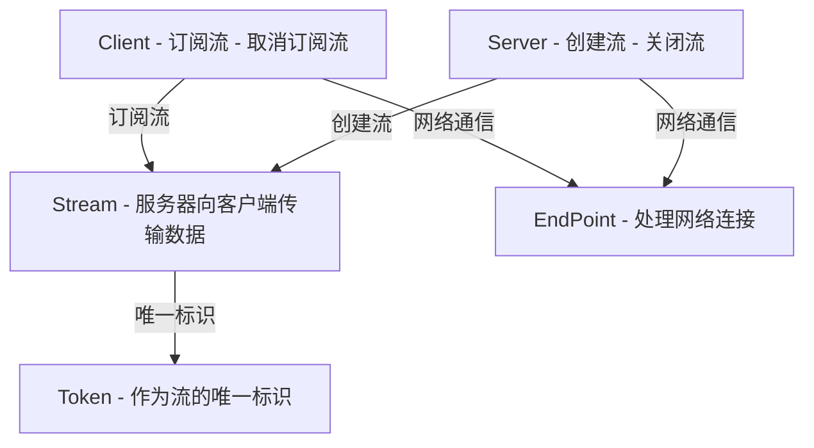

<h1><a href="#streaming">Streaming</a></h1>
<h1><a href="#什么是-streaming">什么是 Streaming?</a></h1>

- [结构化设计](#结构化设计)

## [架构](#架构)
- [概述](#概述)
- [数据流管理](#数据流管理)
- [事件驱动](#事件驱动)
- [流式计算](#流式计算)
- [异步处理](#异步处理)
- [缓存管理](#缓存管理)
- [流优化](#流优化)
- [配置管理](#配置管理)


## [使用Streaming](#使用streaming)
- [数据输入与输出](#数据输入与输出)
- [创建Streaming实例](#创建streaming实例)
- [配置流式任务](#配置流式任务)
- [停止Streaming](#停止streaming)

## [运行模式](#运行模式)
- [Streaming服务端和客户端](#streaming服务端和客户端)
- [多客户端并发](#多客户端并发)
- [多Streaming任务](#多streaming任务)
- [端点配置与多地址支持](#端点配置与多地址支持)

## [其他模式](#其他模式)
- [同步模式](#同步模式)
- [多端点 Streaming](#多端点-streaming)


# [Streaming](#streaming)


# [什么是 Streaming?](#什么是-streaming)

**Streaming** 是 **CARLA 仿真环境中的流式数据传输模块**，负责 **服务器端创建数据流、客户端订阅流，并进行高效的数据传输**。  
该模块适用于 **实时传感器数据传输、分布式仿真、远程数据处理** 等应用场景，并支持 **TCP/UDP、同步/异步模式、多客户端订阅** 等功能，确保仿真数据能够高效传输到多个订阅客户端。


## [结构化设计](#结构化设计)
结构化设计是一种 **模块化的软件架构方法**，通过 **高内聚、低耦合的方式** 组织系统，使其更易维护和扩展。

Streaming 组件采用 **结构化设计**，通过 **模块化拆分**，将数据流管理、客户端订阅和传输机制解耦，提高了系统的 **可扩展性** 和 **维护性**。

在 Streaming 组件中，**结构化设计** 体现在 **服务器（Server）、客户端（Client）、数据流（Stream）、Token 机制（Token）和通信端点（EndPoint）** 的 **分层管理**，实现 **清晰的模块拆分**，确保数据流的 **高效传输** 和 **动态管理**。

- **服务器（Server）** 负责 **数据流的创建和推送**，管理不同的数据流实例。  
- **客户端（Client）** 通过 **Token 机制** 订阅流，接收服务器推送的数据。  
- **数据流（Stream）** 作为 **数据传输通道**，确保服务器和客户端之间的流式通信。  
- **Token 机制（Token）** 用于 **流的访问控制**，确保客户端只能订阅 **授权的流**。  
- **通信端点（EndPoint）** 作为 **网络接口**，处理数据流的输入输出，确保流的高效传输和路由管理。

数据流组件 **独立于服务器和客户端运行**，避免强依赖关系，使得 Streaming 组件能够 **灵活适配多种实时数据场景**，如 **日志分析、视频流、金融交易和自动驾驶**。


# [架构](#架构)

## [概述](#概述)



该架构图展示了 **Client（客户端）**、**Server（服务器）**、**Stream（数据流）**、**Token（令牌）** 和 **EndPoint（端点）** 之间的交互关系。**服务器创建数据流（Stream），客户端通过网络端点（EndPoint）连接服务器并订阅流（使用唯一标识 Token），服务器向订阅的客户端推送数据。**


## [数据流管理](#数据流管理)


Streaming 组件的 **数据流管理** 主要关注 **数据的高效传输**、**流量控制** 和 **访问权限管理**，确保数据流的稳定性和可靠性。

### **关键概念**
- **流控制（Flow Control）**：通过 **异步传输机制（async_read / async_write）**，调整数据传输速率，防止 **客户端处理不过来** 或 **网络拥塞**。  
- **访问控制（Access Control）**：使用 `Token.h` 提供 **流访问权限管理**，确保 **只有授权的客户端才能订阅数据流**。  
- **高并发处理（Concurrency Management）**：`Server.h` 结合 `Boost.Asio` 提供 **异步并发能力**，支持多个客户端同时订阅数据流。

### **关键实现**
- **流式数据传输**：在 `Stream.h` 设计中，服务器通过 **数据流（Stream）** 进行持续数据推送，客户端通过 **Token 订阅流** 并消费数据。  
- **异步并发机制**：`Server.h` 使用 `Boost.Asio` 提供 **异步 I/O 处理**，通过 `AsyncRun()` 方法调度多个线程，提高系统吞吐量。  
- **访问权限管理**：`Token.h` 通过 `Token` 机制控制 **流的访问权限**，防止未授权客户端订阅数据流。

### **总结**
- **流控制** 预防网络拥塞，动态调整数据传输速率，确保客户端稳定接收数据。
- **访问控制** 通过 `Token` 机制限制数据流权限，防止未授权访问。
- **异步并发机制** 使用 `Boost.Asio` 进行线程管理，提高系统吞吐能力，支持多个客户端同时订阅数据流。


## [事件驱动](#事件驱动)

`streaming` 模块采用了 **事件驱动模型** 来管理客户端与服务器之间的异步通信。该模块利用 `Boost.Asio` 提供的 **异步 I/O 机制** 来处理事件，确保数据传输的 **高效性** 和 **非阻塞特性**。

### 事件触发机制

1. **客户端发送请求**  
   - 客户端调用 `Boost.Asio` 提供的 `async_write` 发送数据，写入完成后，系统触发 **写入完成事件**。

2. **服务器接收数据**  
   - 服务器调用 `async_read` 读取数据，并根据数据流管理机制触发 **数据接收事件**。
   - 服务器将数据推送到 `Stream.h` 进行流式传输，确保数据的高效分发。

3. **数据流与订阅机制**  
   - `Stream.h` 负责管理数据流，多个客户端可以通过流令牌 (`Token.h`) 订阅流。
   - 如果没有客户端订阅该流，服务器推送的数据会被丢弃，避免不必要的资源消耗。

4. **事件回调机制**  
   - `Boost.Asio` 的 `io_context.run()` 负责驱动整个事件循环，确保所有 I/O 事件（读、写、连接）都能 **异步执行**，不会阻塞主线程，提高系统吞吐量。


## [流式计算](#流式计算)

`streaming` 模块中的 `Stream.h` 文件实现了 **流式计算** 模型，专注于高效处理大规模、连续的数据流。该模块支持 **多客户端订阅流**，并结合 **Boost.Asio** 进行 **异步数据传输**，使系统能够在不等待数据完全到达的情况下，按数据块处理数据流。

### 核心概念

- **数据流（Data Stream）**：`Stream.h` 通过 `Stream` 类提供单向数据流，允许多个客户端订阅并接收数据。
- **流标识（Token-based Access）**：`Token.h` 定义了流标识机制，使客户端能够基于唯一令牌订阅特定数据流。
- **异步数据处理（Asynchronous Processing）**：`Server.h` 和 `EndPoint.h` 结合 `Boost.Asio`，采用 `async_read` 和 `async_write` 进行非阻塞的数据传输。

### 关键实现

- **数据传输**：
  - `Stream.h` 负责 **数据流的核心管理**，确保高效的数据传输和订阅机制。
  - `Client.h` 处理 **客户端连接**，通过 `Token.h` 订阅数据流。
  - `EndPoint.h` 采用 **Boost.Asio** 提供 **TCP/UDP 端口管理**，实现高效的异步通信。

- **流事件驱动**：
  - `Server.h` 结合 `Stream.h`，在数据流输入时触发事件，使处理器能够高效响应流数据。
  - 采用 **多线程（ThreadPool）** 机制，优化数据分发，提高吞吐量。

- **数据序列化**：
  - `Token.h` 结合 `MsgPack` 进行数据序列化，提升传输效率，支持跨平台数据交互。


## [异步处理](#异步处理)

1. **服务器异步运行**

   - Server.h 采用 Boost.Asio 提供的 io\_context 进行事件管理，AsyncRun(size\_t worker\_threads) 启动 **异步处理线程池**。
   - 服务器监听端口，并在 MakeStream() 时创建数据流，数据流可以被多个客户端订阅。

2. **客户端异步订阅**

   - Client.h 提供 Subscribe(const Token &token, Functor &&callback) 方法，允许客户端基于 **流令牌** 订阅流数据。
   - 订阅后，服务器端的数据会通过 **异步回调** 传输至客户端。

3. **数据流管理**

   - Stream.h 负责 **管理和分发数据流**，通过 Stream 进行 **非阻塞式数据推送**，多个客户端可同时订阅。
   - 如果没有客户端订阅，该流中的数据将被丢弃，防止无效数据传输。

4. **事件驱动与回调机制**

   - Boost.Asio 的 io\_context.run() 驱动 **事件循环**，确保服务器和客户端都能在高并发环境下 **异步** 处理数据流。
   - 服务器和客户端之间的数据交互采用 **回调机制**，在数据到达时自动触发 **数据处理回调**，确保高效的数据传输和处理。

5. **多线程优化**

   - Server.h 和 Client.h 采用 **线程池 (ThreadPool)**，在 AsyncRun(worker\_threads) 中指定线程数，以 **优化异步处理性能**，避免单线程阻塞问题。
   - 服务器端可以在多个线程上处理 **多个数据流请求**，提高吞吐量。

6. **网络端点管理**

   - EndPoint.h 负责 **动态创建 TCP/UDP 端点**，支持 make\_endpoint(address, port) 动态绑定端口，使服务器可以灵活监听多个地址。
   - boost::asio::ip::tcp::resolver 解析域名，支持 **跨网段通信**。


## [缓存管理](#缓存管理)

`streaming` 模块中的 **缓存管理（Buffer Management）** 旨在优化数据的存储和传输，减少 I/O 操作，提高系统吞吐量。

## 关键概念
- **数据缓冲（Buffering）**  
  `Stream.h` 使用 **流状态（MultiStreamState）** 来管理数据的存储和传输，并采用缓存策略，减少直接访问网络或磁盘的开销。只有被客户端订阅的数据流才会被缓存，等待合适的时机发送。未被客户端订阅的数据流不会长时间存储，而是直接丢弃，以优化资源使用。

- **流控制（Flow Control）**  
 服务器端 `Server.h` 通过 **低级 TCP 服务器（`low_level::Server<detail::tcp::Server>`）** 进行流控制，动态调整数据流速率，防止网络拥塞。令牌机制（Token）管理客户端订阅，影响数据传输策略。

- **缓存清理（Buffer Cleanup）**  
  `Server.h` 通过 **CloseStream()** 释放未使用的流，回收资源，避免内存占用。

## 关键实现
- **数据预存储**  
  `Client.h` 发送数据时，`Stream.h` 先将数据存入 **流状态管理器**，等待合适的时机发送，以减少网络开销。

- **分块处理**  
  缓存采用 **分块机制**（Chunking），一次处理固定大小的数据块，减少资源占用，提高吞吐率。

- **动态分配**  
  `Server.h` 结合 **低级 TCP 服务器** 进行动态内存管理，根据订阅情况调整缓冲区大小，提高资源利用率。

## 总结
- **缓存管理** 减少不必要的 I/O 操作，提高系统性能。  
- **流控制** 通过 **令牌订阅机制**，保证数据传输稳定，防止网络拥堵。  
- **缓存清理** 通过 **CloseStream() 释放未使用的流**，避免内存泄漏，保持系统长期稳定运行。  


## [流优化](#流优化)

`streaming` 模块中的 **流优化（Stream Optimization）** 主要关注数据流的管理和调度，以提升传输效率、减少延迟，并优化系统的整体吞吐量。

### 关键概念

- **数据流管理（Stream Management）**：`Stream.h` 主要提供 **单向数据流**，支持多个客户端订阅数据流，但如果没有客户端订阅，数据会被丢弃，以减少无效传输。
- **连接管理（Connection Management）**：`Server.h` 负责创建流，并管理端口连接，支持多个流的创建和管理。
- **超时机制（Timeout Mechanism）**：`Server.h` 允许设置超时时间，避免长时间无响应造成资源占用。

### 关键实现

- **流订阅机制（Stream Subscription Mechanism）**：客户端可以通过 **流令牌（Stream Token）** 订阅数据流，确保数据只发送给有订阅的客户端，减少带宽浪费。
- **线程池优化（Thread Pool Optimization）**：`Server.h` 使用 `carla::ThreadPool` 进行并发处理，提高流的并发能力和数据传输效率。
- **基于 `boost::asio` 的异步传输（Asynchronous Transmission with Boost.Asio）**：底层使用 `boost::asio` 进行非阻塞数据传输，优化网络吞吐。

### 总结

- `streaming` 模块主要提供 **流的管理、订阅和并发处理**。
- **线程池和异步传输** 提高了流的并发能力，减少阻塞，提高吞吐量。


## [配置管理](#配置管理)

## **概述**

`streaming` 模块用于在服务器和客户端之间建立高效的数据流通信，依赖 `boost::asio` 进行网络传输，并使用 `carla::ThreadPool` 进行线程管理。现介绍该模块的配置方式，包括网络端口设置、线程池管理和依赖项安装等。


## **环境要求**

`streaming` 模块依赖以下组件：

- **Boost.Asio**（用于网络通信）
- **MsgPack**（用于数据序列化）
- **carla::ThreadPool**（用于线程管理）

安装 Boost 和 MsgPack（Ubuntu 示例）：

```bash
sudo apt-get install libboost-all-dev
sudo apt-get install libmsgpack-dev
```

如果使用 `vcpkg` 进行依赖管理：

```bash
vcpkg install boost-asio msgpack
```


## **配置项**

### **1. 网络配置**

- `Server.h` 和 `EndPoint.h` 负责端点管理。
- 服务器支持多种方式配置端口：

**默认端口（8080）**

```cpp
carla::streaming::Server server(8080);
server.Run();
```

**指定 IP 地址和端口**

```cpp
carla::streaming::Server server("192.168.1.100", 8080);
server.Run();
```

**使用动态端点解析**

```cpp
auto endpoint = carla::streaming::make_endpoint<boost::asio::ip::tcp>("127.0.0.1", 8080);
```

**服务器获取本地端点**

```cpp
server.GetLocalEndpoint();
```

**客户端订阅流**

```cpp
client.Subscribe(token, [](auto msg) { std::cout << msg << std::endl; });
```


### **2. 线程池管理**

服务器和客户端使用 `carla::ThreadPool` 进行并发调度。

**同步运行服务器**

```cpp
server.Run();
```

**多线程异步执行（4 线程）**

```cpp
server.AsyncRun(4);
```

**客户端使用异步模式**

```cpp
client.AsyncRun(4);
```


### **3. 超时设置**

服务器支持超时机制，防止连接长时间无响应。

```cpp
server.SetTimeout(time_duration);
```


## **示例配置**

### **服务器端配置示例**

```cpp
// 包含Carla Streaming库中的Server头文件
#include "carla/streaming/Server.h"

// 主函数
int main() {
    // 创建一个Carla流媒体服务器实例，监听端口8080
    carla::streaming::Server server(8080);
    
    // 启动服务器，开始监听和处理客户端连接
    server.Run();
    
    // 序正常结束，返回0
    return 0;
}
```

### **客户端订阅示例**

```cpp
// 包含Carla Streaming库中的Client头文件
#include "carla/streaming/Client.h"

// 主函数
int main() {
    // 创建一个Carla流媒体客户端实例，连接到本地IP地址127.0.0.1
    carla::streaming::Client client("127.0.0.1");

    // 创建一个流媒体令牌（Token），用于订阅特定的数据流
    carla::streaming::Token token;

    // 使用客户端订阅指定的数据流，并提供一个回调函数来处理接收到的消息
    client.Subscribe(token, [](auto msg) {
        // 当接收到消息时，打印消息内容到控制台
        std::cout << "Received: " << msg << std::endl;
    });

    // 启动客户端，开始接收和处理数据流
    client.Run();

    // 程序正常结束，返回0
    return 0;
}
```


## **总结**

- `streaming` 模块提供 **灵活的网络配置**，支持 **本地和远程端点**。
- **线程池管理** 提供 **同步与异步执行模式**，支持高并发数据流处理。
- 服务器支持 **超时机制**，防止无效连接长期占用资源。
- 依赖 `Boost.Asio` 进行 **异步网络通信**，用户需确保 **正确安装依赖**。

该模块适用于 **高吞吐量、低延迟** 的流式数据传输场景，例如 **自动驾驶仿真、远程传感器数据采集、实时流处理**。


# [使用 Streaming](#使用-streaming)

Streaming 组件用于在服务器和客户端之间进行高效的数据流传输。它依赖 `boost::asio` 进行网络通信，并使用 `carla::ThreadPool` 进行线程管理。


## [数据输入与输出](#数据输入与输出)

Streaming 主要用于 **服务器向客户端单向发送数据**，多个客户端可以通过流令牌（Token）订阅相同的流。如果没有客户端订阅，该流中的数据将被丢弃。

| **主题**           | **描述**                                                 |
|-------------------|--------------------------------------------------------|
| **流（Stream）**    | 服务器向客户端传输数据的通道。                                   |
| **流令牌（Token）**   | 用于标识和订阅数据流的唯一标识符。                               |
| **端点（EndPoint）** | 定义 TCP/UDP 通信地址，包括 IP+端口 或仅端口的形式。         |

### 示例代码
```cpp
Stream my_stream = server.MakeStream(); // 创建流
Token my_token = server.GetToken(1); // 获取流的 Token
client.Subscribe(my_token, [](auto msg) { 
    std::cout << "收到数据: " << msg << std::endl; 
});
```


## [创建 Streaming 实例](#创建-streaming-实例)

Streaming 由 **服务器（Server）** 和 **客户端（Client）** 组成。

| **主题**      | **描述**                                           |
|--------------|--------------------------------------------------|
| **Server**  | 创建和管理流，负责数据流的生成与推送。                     |
| **Client**  | 订阅流，接收服务器推送的数据，并进行数据处理。               |

### 服务器端（Server）
```cpp
Server server(8000); // 创建监听 8000 端口的服务器
server.Run(); // 启动服务器
Stream stream = server.MakeStream(); // 创建新的流
```

### 客户端（Client）
```cpp
Client client("127.0.0.1"); // 连接到服务器
client.Run(); // 启动客户端
client.Subscribe(my_token, [](auto msg) {
    std::cout << "收到消息：" << msg << std::endl;
});
```


## [配置流式任务](#配置流式任务)

Streaming 支持**同步模式**和**异步模式**，可调整服务器与客户端的运行方式。

| **主题**      | **描述**                                       |
|--------------|--------------------------------------------|
| **同步模式**  | 服务器和客户端以阻塞方式运行，适用于严格时序同步的任务。 |
| **异步模式**  | 服务器和客户端运行在独立的线程池中，提高并发能力。   |

### 启动服务器（同步模式）
```cpp
server.Run(); // 以同步模式运行
```

### 启动服务器（异步模式）
```cpp
server.AsyncRun(4); // 以 4 个线程运行
```

### 启动客户端（异步模式）
```cpp
client.AsyncRun(4); // 以 4 个线程运行
```

### 配置服务器超时
```cpp
server.SetTimeout(boost::posix_time::seconds(10)); // 设置 10 秒超时
```


## [停止 Streaming](#停止-streaming)

Streaming 组件在 **服务器关闭时会自动停止**，但手动管理资源可确保所有订阅的客户端和服务器任务都正常释放。

| **主题**       | **描述**                        |
|--------------|------------------------------|
| **停止客户端** | 取消订阅流，避免继续接收数据。       |
| **停止服务器** | 关闭流 ID，停止数据流传输。       |
| **销毁连接**   | 释放所有客户端连接，避免资源泄漏。 |

### 停止客户端
```cpp
client.UnSubscribe(my_token); // 取消订阅流
```

### 停止服务器
```cpp
server.CloseStream(1); // 关闭流 ID 为 1 的数据流
```

### 销毁所有客户端连接
```cpp
client.apply_batch([carla::command::DestroyActor(x) for x in client_list]);
```


**注意：关闭 Streaming 服务器后，所有仍然订阅的客户端将无法接收新的数据。如果不主动销毁客户端，它们仍然存在，只是无法获取新的流数据。**


**补充说明**
> - 使用 `server.SetTimeout(x)` 设置超时参数，防止长时间挂起。
> - 服务器默认运行在 `8000` 端口，可根据需要调整。
> - 异步模式适用于高吞吐量应用，确保 `worker_threads` 数量适配任务需求。


# [运行模式](#运行模式)


## [Streaming 服务器端和客户端](#streaming-服务器端和客户端)


### 概述
Streaming 模块采用客户端-服务器 (Client-Server) 架构，服务器端 `Server` 负责创建和管理数据流，客户端 `Client` 负责订阅流并接收数据。  
该架构允许多个客户端同时连接到服务器并接收同一数据流，实现高效的数据共享。

---

### 服务器端（Server）
`Server` 主要功能：
- 管理数据流：创建、关闭数据流，并管理流的生命周期。
- 支持多客户端订阅：不同客户端可以同时订阅同一流，数据仅发送给已订阅的客户端。
- 控制运行模式：支持同步 (`Run()`) 和异步 (`AsyncRun(worker_threads)`) 运行。

#### 代码解析
```cpp
class Server {
public:
    // 构造函数，接受一个端口号并创建一个服务器实例
    explicit Server(uint16_t port)
      : _server(_pool.io_context(), make_endpoint<protocol_type>(port)) {}

    // 构造函数，接受一个IP地址和端口号并创建一个服务器实例
    explicit Server(const std::string &address, uint16_t port)
      : _server(_pool.io_context(), make_endpoint<protocol_type>(address, port)) {}

    // 创建一个新的数据流，并返回该流的实例
    Stream MakeStream() {
      return _server.MakeStream();
    }

    // 关闭指定ID的数据流
    void CloseStream(stream_id id) {
      return _server.CloseStream(id);
    }

    // 启动服务器，开始处理连接和数据流
    void Run() {
      _pool.Run();
    }

private:
    // 线程池，用于处理异步操作
    ThreadPool _pool;
    // 服务器实例，用于管理数据流和连接
    ServerType _server;
};
```

#### 示例
```cpp
// 创建服务器并监听 8080 端口
carla::streaming::Server server(8080);
server.Run();  // 运行服务器
```


### 客户端（Client）
`Client` 主要功能：
- 订阅服务器流：通过 `Subscribe(token, callback)` 订阅流，并传入回调函数处理数据。
- 取消订阅：调用 `UnSubscribe(token)` 停止接收流数据。
- 控制运行模式：支持同步 (`Run()`) 和异步 (`AsyncRun(worker_threads)`) 运行。

#### 代码解析
```cpp
class Client {
public:
    // 订阅指定令牌（Token）对应的数据流，并提供一个回调函数来处理接收到的消息
    void Subscribe(const Token &token, Functor &&callback) {
      // 使用客户端实例订阅数据流，并将回调函数与数据流关联
      _client.Subscribe(_service.io_context(), token, std::forward<Functor>(callback));
    }

    // 取消订阅指定令牌（Token）对应的数据流
    void UnSubscribe(const Token &token) {
      // 使用客户端实例取消订阅数据流
      _client.UnSubscribe(token);
    }

    // 启动客户端，开始处理数据流和回调
    void Run() {
      // 运行服务以处理异步操作
      _service.Run();
    }

private:
    // 服务实例，用于管理异步操作和事件循环
    ServiceType _service;
    // 客户端实例，用于管理数据流的订阅和取消订阅
    ClientType _client;
};
```

#### 示例
```cpp
// 创建Carla流媒体客户端
carla::streaming::Client client;

// 从服务器获取令牌
Token token = server.GenerateToken();

// 订阅数据流并设置回调
client.Subscribe(token, [](auto data) {
    std::cout << "Received Data: " << data << std::endl;
});

// 启动客户端
client.Run();

// 如果需要非阻塞运行，可以使用多线程
// std::thread clientThread([&client]() { client.Run(); });
// clientThread.detach();
```


## [多客户端并发](#多客户端并发)

### 概述
Streaming 模块支持多个客户端同时订阅同一个流，数据流可被多个客户端共享，不影响彼此。  
在 `Stream.h` 中，`Stream` 采用 `MultiStreamState` 机制，允许多个客户端同时接收同一数据流。

### 代码解析
```cpp
using Stream = detail::Stream<detail::MultiStreamState>;
```

#### 示例
```cpp
// 多个客户端订阅同一流
client1.Subscribe(token, callback);
client2.Subscribe(token, callback);
client3.Subscribe(token, callback);
```


## [多Streaming任务](#多Streaming任务)

### 概述
服务器支持多个 `Stream` 并行运行，每个 `Stream` 由唯一 `Token` 识别，不同客户端可以订阅不同的流，互不干扰。

#### 代码解析
```cpp
// 定义一个函数 MakeStream，用于创建新的 Streaming 流
Stream MakeStream() {
  return _server.MakeStream(); // 调用服务器对象的 MakeStream 方法，返回一个新的流
}
```

#### 示例
```cpp
// 创建两个独立的 Streaming 流
Stream stream1 = server.MakeStream(); // 通过服务器创建第一个流
Stream stream2 = server.MakeStream(); // 通过服务器创建第二个流

```


## [端点配置与多地址支持](#端点配置与多地址支持)

### 概述
Streaming 支持灵活的 **端点 (EndPoint)** 配置，可以使用 IP 地址或端口定义服务器端和客户端的连接方式。

#### 代码解析
```cpp
// 静态内联函数 make_endpoint，用于根据提供的 IP 地址和端口号创建一个完全定义的端点
static inline auto make_endpoint(const std::string &address, uint16_t port) {
    return detail::EndPoint<Protocol, detail::FullyDefinedEndPoint>(
        {make_address(address), port} // 将字符串地址转换为 boost::asio::ip::address 并与端口号组合，生成端点
    );
}

```

#### 示例
```cpp
// 创建一个 Streaming 服务器，监听本机 127.0.0.1（即 localhost）上的 8080 端口
Server server("127.0.0.1", 8080);

// 启动服务器，使其开始运行并接受客户端的连接
server.Run();

```


## 总结
- Streaming 服务器和客户端实现高效的数据传输，支持同步/异步模式。
- 服务器支持多客户端并发，多个客户端可订阅同一流，数据并行分发。
- 服务器支持多个 Streaming 任务，每个任务由 `Token` 识别，客户端可分别订阅不同流。
- 服务器和客户端支持灵活的端点配置，允许自定义 IP 地址、端口，适用于不同的网络环境。


# [其他模式](#其他模式)
## [同步模式](#同步模式)

在同步模式下，服务器端的 `Server` 类可以通过 `SetSynchronousMode` 方法控制是否以同步方式运行。同步模式主要用于需要严格按照时序进行数据传输的场景，比如模拟器同步数据流。

在 `Server.h` 文件中，可以看到 `SetSynchronousMode(bool is_synchro)` 方法，它用于控制服务器端的同步模式开关：
```cpp
// 设置服务器的同步模式
void SetSynchronousMode(bool is_synchro) {
  _server.SetSynchronousMode(is_synchro);
}
```
此外，`Run()` 方法用于同步启动服务器，而 `AsyncRun(size_t worker_threads)` 则支持异步多线程运行。

```cpp
// 以同步方式运行服务器
void Run() {
  _pool.Run();
}

// 以异步方式运行服务器，指定工作线程数量
void AsyncRun(size_t worker_threads) {
  _pool.AsyncRun(worker_threads);
}
```

## [多端点 Streaming](#多端点-streaming)

多端点 Streaming 主要依赖 `EndPoint.h` 中的 `EndPoint` 相关类，该类提供了 `FullyDefinedEndPoint` 和 `PartiallyDefinedEndPoint` 两种端点类型。

在 `Server.h` 中，`Server` 类使用 `make_endpoint<protocol_type>(address, port)` 方法创建端点，并支持外部地址绑定：
```cpp
// 服务器构造函数，绑定到指定地址和端口
explicit Server(const std::string &address, uint16_t port)
  : _server(_pool.io_context(), make_endpoint<protocol_type>(address, port)) {}
```

对于客户端 `Client.h`，客户端通过 `Subscribe(const Token &token, Functor &&callback)` 订阅流，并在 `UnSubscribe(const Token &token)` 取消订阅。

```cpp
// 客户端订阅数据流
template <typename Functor>
void Subscribe(const Token &token, Functor &&callback) {
  _client.Subscribe(_service.io_context(), token, std::forward<Functor>(callback));
}

// 取消订阅数据流
void UnSubscribe(const Token &token) {
  _client.UnSubscribe(token);
}
```

这些机制确保了服务器和多个客户端之间的高效数据传输，并允许多个客户端同时订阅同一个数据流，从而实现多端点 Streaming。
