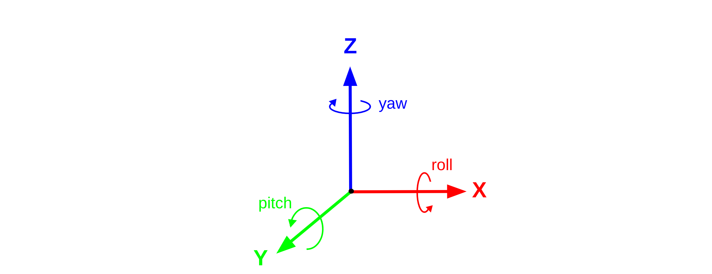

# [Python API 参考](https://carla.readthedocs.io/en/latest/python_api/) 
此参考包含 Python API 的所有详细信息。要查阅特定 Carla 版本的先前参考，请使用右下角的面板更改文档版本。<br>这会将整个文档更改为之前的状态。请记住， <i>最新</i> 版本是 `dev` 分支，可能会显示任何 Carla 打包版本中不可用的功能。<hr>  

## carla.AckermannControllerSettings<a name="carla.AckermannControllerSettings"></a>
管理 Ackermann PID 控制器的设置。

### 实例变量
- <a name="carla.AckermannControllerSettings.speed_kp"></a>**<font color="#f8805a">speed_kp</font>** (_float_)  
速度 PID 控制器的比例项。  
- <a name="carla.AckermannControllerSettings.speed_ki"></a>**<font color="#f8805a">speed_ki</font>** (_float_)  
速度 PID 控制器的积分项。  
- <a name="carla.AckermannControllerSettings.speed_kd"></a>**<font color="#f8805a">speed_kd</font>** (_float_)  
速度 PID 控制器的微分项。  
- <a name="carla.AckermannControllerSettings.accel_kp"></a>**<font color="#f8805a">accel_kp</font>** (_float_)  
加速度 PID 控制器的比例项。  
- <a name="carla.AckermannControllerSettings.accel_ki"></a>**<font color="#f8805a">accel_ki</font>** (_float_)  
加速度 PID 控制器的积分项。  
- <a name="carla.AckermannControllerSettings.accel_kd"></a>**<font color="#f8805a">accel_kd</font>** (_float_)  
加速度 PID 控制器的微分项。  

### 方法
- <a name="carla.AckermannControllerSettings.__init__"></a>**<font color="#7fb800">\__init__</font>**(<font color="#00a6ed">**self**</font>, <font color="#00a6ed">**speed_kp**=0.15</font>, <font color="#00a6ed">**speed_ki**=0.0</font>, <font color="#00a6ed">**speed_kd**=0.25</font>, <font color="#00a6ed">**accel_kp**=0.01</font>, <font color="#00a6ed">**accel_ki**=0.0</font>, <font color="#00a6ed">**accel_kd**=0.01</font>)  
    - **Parameters:**
        - `speed_kp` (_float_)  
        - `speed_ki` (_float_)  
        - `speed_kd` (_float_)  
        - `accel_kp` (_float_)  
        - `accel_ki` (_float_)  
        - `accel_kd` (_float_)  

##### 魔术方法
- <a name="carla.AckermannControllerSettings.__eq__"></a>**<font color="#7fb800">\__eq__</font>**(<font color="#00a6ed">**self**</font>, <font color="#00a6ed">**other**=[carla.AckermannControllerSettings](#carla.AckermannControllerSettings)</font>)  
- <a name="carla.AckermannControllerSettings.__ne__"></a>**<font color="#7fb800">\__ne__</font>**(<font color="#00a6ed">**self**</font>, <font color="#00a6ed">**other**=[carla.AckermannControllerSettings](#carla.AckermannControllerSettings)</font>)  
- <a name="carla.AckermannControllerSettings.__str__"></a>**<font color="#7fb800">\__str__</font>**(<font color="#00a6ed">**self**</font>)  

---

## carla.Actor<a name="carla.Actor"></a>
Carla 将参与者定义为在模拟中发挥作用或可以移动的任何物体。其中包括：行人、车辆、传感器和交通标志（将交通灯视为其中的一部分）。参与者在模拟中由 [carla.World](#carla.World) 生成，并且需要创建 [carla.ActorBlueprint](#carla.ActorBlueprint) 。这些蓝图属于 Carla 提供的库，请在 [此处](bp_library.md) 找到有关它们的更多信息。

### 实例变量
- <a name="carla.Actor.attributes"></a>**<font color="#f8805a">attributes</font>** (_dict_)  
包含该参与者所基于蓝图属性的字典。 
- <a name="carla.Actor.id"></a>**<font color="#f8805a">id</font>** (_int_)  
该参与者的标识符。在给定的情节中是唯一的。  
- <a name="carla.Actor.type_id"></a>**<font color="#f8805a">type_id</font>** (_str_)  
该参与者所基于的蓝图的标识符，例如 `vehicle.ford.mustang`。  
- <a name="carla.Actor.is_alive"></a>**<font color="#f8805a">is_alive</font>** (_bool_)  
返回此对象是否是使用此参与者句柄销毁的。  
- <a name="carla.Actor.is_active"></a>**<font color="#f8805a">is_active</font>** (_bool_)  
返回此参与者是否处于活动状态 (True) 或非活动状态 (False)。  
- <a name="carla.Actor.is_dormant"></a>**<font color="#f8805a">is_dormant</font>** (_bool_)  
返回此参与者是否处于休眠状态 (True) 或非休眠状态 (False) - 与 is_active 相反。  
- <a name="carla.Actor.parent"></a>**<font color="#f8805a">parent</font>** (_[carla.Actor](#carla.Actor)_)  
参与者可以附加到他们将跟随的父参与者，这就是所说的参与者。  
- <a name="carla.Actor.semantic_tags"></a>**<font color="#f8805a">semantic_tags</font>** (_list(int)_)  
蓝图列表组件为此参与者提供的语义标签列表。例如，交通灯可以用 `Pole` 和 `TrafficLight`。这些标签由语义分割传感器使用。在[此处](ref_sensors.md#semantic-segmentation-camera) 查找有关此传感器和其他传感器的更多信息。  
- <a name="carla.Actor.actor_state"></a>**<font color="#f8805a">actor_state</font>** (_[carla.ActorState](#carla.ActorState)_)  
返回 [carla.ActorState](#carla.ActorState)，它可以识别参与者是否处于活动、休眠或无效状态。  
- <a name="carla.Actor.bounding_box"></a>**<font color="#f8805a">bounding_box</font>** (_[carla.BoundingBox](#carla.BoundingBox)_)  
包含参与者几何形状的边界框。它的位置和旋转是相对于它所附着的参与者的。  

### 方法
- <a name="carla.Actor.add_angular_impulse"></a>**<font color="#7fb800">add_angular_impulse</font>**(<font color="#00a6ed">**self**</font>, <font color="#00a6ed">**angular_impulse**</font>)  
在参与者的质心处应用角冲量。此方法适用于瞬时扭矩，通常应用一次。使用 __<font color="#7fb800">add_torque()</font>__ 在一段时间内施加旋转力。
    - **参数:**
        - `angular_impulse` (_[carla.Vector3D](#carla.Vector3D)<small> - degrees*s</small>_) - 全局坐标中的角冲量矢量。  
- <a name="carla.Actor.add_force"></a>**<font color="#7fb800">add_force</font>**(<font color="#00a6ed">**self**</font>, <font color="#00a6ed">**force**</font>)  
在参与者的质心处施加力。此方法适用于在一定时间内施加的力。使用 __<font color="#7fb800">add_impulse()</font>__ 施加仅持续瞬间的冲量。  
    - **参数:**
        - `force` (_[carla.Vector3D](#carla.Vector3D)<small> - N</small>_) - 全局坐标中的力矢量。  
- <a name="carla.Actor.add_impulse"></a>**<font color="#7fb800">add_impulse</font>**(<font color="#00a6ed">**self**</font>, <font color="#00a6ed">**impulse**</font>)  
在参与者的质心处施加冲量。此方法适用于瞬时力，通常应用一次。使用 __<font color="#7fb800">add_force()</font>__ 在一段时间内施加力。  
    - **参数:**
        - `impulse` (_[carla.Vector3D](#carla.Vector3D)<small> - N*s</small>_) - 全局坐标中的冲量矢量。 
- <a name="carla.Actor.add_torque"></a>**<font color="#7fb800">add_torque</font>**(<font color="#00a6ed">**self**</font>, <font color="#00a6ed">**torque**</font>)  
在参与者的质心处应用扭矩。此方法适用于在一定时间内施加的扭矩。使用 __<font color="#7fb800">add_angular_impulse()</font>__ 施加仅持续瞬间的扭矩。  
    - **参数:**
        - `torque` (_[carla.Vector3D](#carla.Vector3D)<small> - 度</small>_) - 全局坐标中的扭矩矢量。  
- <a name="carla.Actor.destroy"></a>**<font color="#7fb800">destroy</font>**(<font color="#00a6ed">**self**</font>)  
告诉模拟器销毁这个参与者，如果成功则 <b>True</b> 。如果已经被破坏则没有任何效果。
    - **返回:** _bool_  
    - **警告:** <font color="#ED2F2F">_T此方法会阻止脚本，直到模拟器完成销毁为止。
_</font>  
- <a name="carla.Actor.disable_constant_velocity"></a>**<font color="#7fb800">disable_constant_velocity</font>**(<font color="#00a6ed">**self**</font>)  
禁用之前为 [carla.Vehicle](#carla.Vehicle) 参与者设置的任何恒定速度。  
- <a name="carla.Actor.enable_constant_velocity"></a>**<font color="#7fb800">enable_constant_velocity</font>**(<font color="#00a6ed">**self**</font>, <font color="#00a6ed">**velocity**</font>)  
将车辆的速度矢量设置为随时间变化的恒定值。所得到的速度将近似于 `velocity` 所设置的速度，与 __<font color="#7fb800">set_target_velocity()</font>__ 一样。  
    - **参数:**
        - `velocity` (_[carla.Vector3D](#carla.Vector3D)<small> - m/s</small>_) - Velocity vector in local space.  
    - **注意:** <font color="#8E8E8E">_只有 [carla.Vehicle](#carla.Vehicle) 参与者可以使用此方法。  
_</font>  
    - **警告:** <font color="#ED2F2F">_为 交通管理器管理的车辆启用恒定速度可能会导致冲突。此方法会覆盖交通管理器对速度的任何更改。  
_</font>  

##### 获取器
- <a name="carla.Actor.get_acceleration"></a>**<font color="#7fb800">get_acceleration</font>**(<font color="#00a6ed">**self**</font>)  
返回客户端在最后一个tick期间收到的参与者的三维加速度向量。该方法不调用模拟器。  
    - **返回:** _[carla.Vector3D](#carla.Vector3D)<small> - m/s<sup>2</sup></small>_  
- <a name="carla.Actor.get_angular_velocity"></a>**<font color="#7fb800">get_angular_velocity</font>**(<font color="#00a6ed">**self**</font>)  
返回客户端在最后一个tick期间接收到的参与者的角速度向量。该方法不调用模拟器。  
    - **返回：** _[carla.Vector3D](#carla.Vector3D)<small> - deg/s</small>_  
- <a name="carla.Actor.get_location"></a>**<font color="#7fb800">get_location</font>**(<font color="#00a6ed">**self**</font>)  
返回客户端在上一次tick期间接收到的参与者的位置。该方法不调用模拟器。  
    - **返回：** _[carla.Location](#carla.Location)<small> - 米</small>_  
    - **设置器:** _[carla.Actor.set_location](#carla.Actor.set_location)_  
- <a name="carla.Actor.get_transform"></a>**<font color="#7fb800">get_transform</font>**(<font color="#00a6ed">**self**</font>)  
返回客户端在最后一个tick期间接收到的参与者的变换（位置和旋转）。该方法不调用模拟器。  
    - **返回:** _[carla.Transform](#carla.Transform)_  
    - **设置器:** _[carla.Actor.set_transform](#carla.Actor.set_transform)_  
- <a name="carla.Actor.get_velocity"></a>**<font color="#7fb800">get_velocity</font>**(<font color="#00a6ed">**self**</font>)  
返回客户端在最后一个tick期间接收到的参与者的速度向量。该方法不调用模拟器。  
    - **返回：** _[carla.Vector3D](#carla.Vector3D)<small> - m/s</small>_  
- <a name="carla.Actor.get_world"></a>**<font color="#7fb800">get_world</font>**(<font color="#00a6ed">**self**</font>)  
返回该参与者所属的世界。  
    - **返回:** _[carla.World](#carla.World)_  

##### 设置器
- <a name="carla.Actor.set_enable_gravity"></a>**<font color="#7fb800">set_enable_gravity</font>**(<font color="#00a6ed">**self**</font>, <font color="#00a6ed">**enabled**</font>)  
启用或禁用参与者的重力。 __默认__ 为 True。  
    - **参数：**
        - `enabled` (_bool_)  
- <a name="carla.Actor.set_location"></a>**<font color="#7fb800">set_location</font>**(<font color="#00a6ed">**self**</font>, <font color="#00a6ed">**location**</font>)  
将参与者传送到给定位置。  
    - **参数：**
        - `location` (_[carla.Location](#carla.Location)<small> - 米</small>_)  
    - **获取器：** _[carla.Actor.get_location](#carla.Actor.get_location)_  
- <a name="carla.Actor.set_simulate_physics"></a>**<font color="#7fb800">set_simulate_physics</font>**(<font color="#00a6ed">**self**</font>, <font color="#00a6ed">**enabled**=True</font>)  
启用或禁用此参与者上的物理模拟。  
    - **参与者：**
        - `enabled` (_bool_)  
- <a name="carla.Actor.set_target_angular_velocity"></a>**<font color="#7fb800">set_target_angular_velocity</font>**(<font color="#00a6ed">**self**</font>, <font color="#00a6ed">**angular_velocity**</font>)  
设置参与者的角速度矢量。这是在物理步骤之前应用的，因此最终的角速度将受到摩擦等外力的影响。  
    - **参数：**
        - `angular_velocity` (_[carla.Vector3D](#carla.Vector3D)<small> - deg/s</small>_)  
- <a name="carla.Actor.set_target_velocity"></a>**<font color="#7fb800">set_target_velocity</font>**(<font color="#00a6ed">**self**</font>, <font color="#00a6ed">**velocity**</font>)  
设置参与者的速度向量。这是在物理步骤之前应用的，因此最终的角速度将受到摩擦等外力的影响。  
    - **参数：**
        - `velocity` (_[carla.Vector3D](#carla.Vector3D)_)  
- <a name="carla.Actor.set_transform"></a>**<font color="#7fb800">set_transform</font>**(<font color="#00a6ed">**self**</font>, <font color="#00a6ed">**transform**</font>)  
将参与者传送到给定的变换（位置和旋转）。 
    - **参数：**
        - `transform` (_[carla.Transform](#carla.Transform)_)  
    - **获取器：** _[carla.Actor.get_transform](#carla.Actor.get_transform)_  

##### 魔术方法
- <a name="carla.Actor.__str__"></a>**<font color="#7fb800">\__str__</font>**(<font color="#00a6ed">**self**</font>)  

---

## carla.ActorAttribute<a name="carla.ActorAttribute"></a>
Carla 为参与者提供了一个蓝图库，可以通过 [carla.BlueprintLibrary](#carla.BlueprintLibrary) 进行访问。每个蓝图都有一系列内部定义的属性。其中一些是可以修改的，另一些则是不可修改的。为可设置的值提供了推荐值列表。  

### 实例变量
- <a name="carla.ActorAttribute.id"></a>**<font color="#f8805a">id</font>** (_str_)  
库中属性的名称和标识符。 
- <a name="carla.ActorAttribute.is_modifiable"></a>**<font color="#f8805a">is_modifiable</font>** (_bool_)  
如果属性的值可以修改，则为 <b>True</b> 。
- <a name="carla.ActorAttribute.recommended_values"></a>**<font color="#f8805a">recommended_values</font>** (_list(str)_)  
设计蓝图的人员建议的值列表。  
- <a name="carla.ActorAttribute.type"></a>**<font color="#f8805a">type</font>** (_[carla.ActorAttributeType](#carla.ActorAttributeType)_)  
属性的参数类型。  

### 方法
- <a name="carla.ActorAttribute.as_bool"></a>**<font color="#7fb800">as_bool</font>**(<font color="#00a6ed">**self**</font>)  
将属性读取为布尔值。  
- <a name="carla.ActorAttribute.as_color"></a>**<font color="#7fb800">as_color</font>**(<font color="#00a6ed">**self**</font>)  
将属性读取为 [carla.Color](#carla.Color)。 
- <a name="carla.ActorAttribute.as_float"></a>**<font color="#7fb800">as_float</font>**(<font color="#00a6ed">**self**</font>)  
将属性读取为浮点型。  
- <a name="carla.ActorAttribute.as_int"></a>**<font color="#7fb800">as_int</font>**(<font color="#00a6ed">**self**</font>)  
将属性读取为 int。  
- <a name="carla.ActorAttribute.as_str"></a>**<font color="#7fb800">as_str</font>**(<font color="#00a6ed">**self**</font>)  
将属性读取为字符串。  

##### 魔术方法
- <a name="carla.ActorAttribute.__bool__"></a>**<font color="#7fb800">\__bool__</font>**(<font color="#00a6ed">**self**</font>)  
- <a name="carla.ActorAttribute.__eq__"></a>**<font color="#7fb800">\__eq__</font>**(<font color="#00a6ed">**self**</font>, <font color="#00a6ed">**other**=bool / int / float / str / [carla.Color](#carla.Color) / [carla.ActorAttribute](#carla.ActorAttribute)</font>)  
如果此参与者的属性 和`other` 相同，则返回 true。  
    - **返回：** _bool_  
- <a name="carla.ActorAttribute.__float__"></a>**<font color="#7fb800">\__float__</font>**(<font color="#00a6ed">**self**</font>)  
- <a name="carla.ActorAttribute.__int__"></a>**<font color="#7fb800">\__int__</font>**(<font color="#00a6ed">**self**</font>)  
- <a name="carla.ActorAttribute.__ne__"></a>**<font color="#7fb800">\__ne__</font>**(<font color="#00a6ed">**self**</font>, <font color="#00a6ed">**other**=bool / int / float / str / [carla.Color](#carla.Color) / [carla.ActorAttribute](#carla.ActorAttribute)</font>)  
如果此 actor 的属性和 `other` 不同，则返回 true。  
    - **返回：** _bool_  
- <a name="carla.ActorAttribute.__nonzero__"></a>**<font color="#7fb800">\__nonzero__</font>**(<font color="#00a6ed">**self**</font>)  
如果此参与者的属性不为零或 null，则返回 true。  
    - **返回:** _bool_  
- <a name="carla.ActorAttribute.__str__"></a>**<font color="#7fb800">\__str__</font>**(<font color="#00a6ed">**self**</font>)  

---

## carla.ActorAttributeType<a name="carla.ActorAttributeType"></a>
Carla 在 [carla.BlueprintLibrary](#carla.BlueprintLibrary) 中为参与者提供了一个蓝图库，每个蓝图具有不同的属性。此类将 [carla.ActorAttribute](#carla.ActorAttribute) 中的类型定义为一系列枚举。所有这些信息均在内部管理，并在此处列出，以便更好地理解 Carla 的工作原理。 

### 实例变量
- <a name="carla.ActorAttributeType.Bool"></a>**<font color="#f8805a">Bool</font>**  
- <a name="carla.ActorAttributeType.Int"></a>**<font color="#f8805a">Int</font>**  
- <a name="carla.ActorAttributeType.Float"></a>**<font color="#f8805a">Float</font>**  
- <a name="carla.ActorAttributeType.String"></a>**<font color="#f8805a">String</font>**  
- <a name="carla.ActorAttributeType.RGBColor"></a>**<font color="#f8805a">RGBColor</font>**  

---

## carla.ActorBlueprint<a name="carla.ActorBlueprint"></a>
Carla 为 Actor 提供了一个蓝图库，可以通过 [carla.BlueprintLibrary](#carla.BlueprintLibrary)进行查阅。其中每一个都包含蓝图的标识符和一系列可以修改或不可修改的属性。该类是库和参与者创建之间的中间步骤。参与者需要一个参与者蓝图才能产生。这些将所述蓝图的信息及其属性和一些标签存储在对象中以对其进行分类。然后，用户可以自定义一些属性并最终通过 [carla.World](#carla.World)生成参与者。  

### 实例变量
- <a name="carla.ActorBlueprint.id"></a>**<font color="#f8805a">id</font>** (_str_)  
库内所述蓝图的标识符。例如 `walker.pedestrian.0001`。  
- <a name="carla.ActorBlueprint.tags"></a>**<font color="#f8805a">tags</font>** (_list(str)_)  
每个蓝图具有的有助于描述它们的标签列表。例如 `['0001', 'pedestrian', 'walker']`。  

### 方法
- <a name="carla.ActorBlueprint.has_attribute"></a>**<font color="#7fb800">has_attribute</font>**(<font color="#00a6ed">**self**</font>, <font color="#00a6ed">**id**</font>)  
如果蓝图包含该 `id` 属性，则返回 <b>True</b>。  
    - **参数：**
        - `id` (_str_) - 例如 `gender` 将为行人的蓝图返回 **True** 。  
    - **返回：** _bool_  
- <a name="carla.ActorBlueprint.has_tag"></a>**<font color="#7fb800">has_tag</font>**(<font color="#00a6ed">**self**</font>, <font color="#00a6ed">**tag**</font>)  
如果蓝图已列出指定`tag`的内容，则返回 <b>True</b> 。  
    - **参数：**
        - `tag` (_str_) - 例如： 'walker'。  
    - **返回：** _bool_  
- <a name="carla.ActorBlueprint.match_tags"></a>**<font color="#7fb800">match_tags</font>**(<font color="#00a6ed">**self**</font>, <font color="#00a6ed">**wildcard_pattern**</font>)  
如果为此蓝图列出的任何标记匹配 `wildcard_pattern`，则返回 <b>True</b> 。匹配遵循 [fnmatch](https://docs.python.org/2/library/fnmatch.html) 标准。
    - **参数：**
        - `wildcard_pattern` (_str_)  
    - **返回：** _bool_  

##### 获取器
- <a name="carla.ActorBlueprint.get_attribute"></a>**<font color="#7fb800">get_attribute</font>**(<font color="#00a6ed">**self**</font>, <font color="#00a6ed">**id**</font>)  
返回参与者的属性以及 `id` 标识符（如果存在）。  
    - **参与者：**
        - `id` (_str_)  
    - **返回：** _[carla.ActorAttribute](#carla.ActorAttribute)_  
    - **设置器：** _[carla.ActorBlueprint.set_attribute](#carla.ActorBlueprint.set_attribute)_  

##### 设置器
- <a name="carla.ActorBlueprint.set_attribute"></a>**<font color="#7fb800">set_attribute</font>**(<font color="#00a6ed">**self**</font>, <font color="#00a6ed">**id**</font>, <font color="#00a6ed">**value**</font>)<button class="SnipetButton" id="carla.ActorBlueprint.set_attribute-snipet_button">snippet &rarr;</button>  
如果 `id` 属性是可修改的，将其值改为 `value`。  
    - **参数：**
        - `id` (_str_) - 要更改属性的标识符。 
        - `value` (_str_) - 所述属性的新值。 
    - **获取器：** _[carla.ActorBlueprint.get_attribute](#carla.ActorBlueprint.get_attribute)_  

##### Dunder 方法
- <a name="carla.ActorBlueprint.__iter__"></a>**<font color="#7fb800">\__iter__</font>**(<font color="#00a6ed">**self**</font>)  
在蓝图有的 [carla.ActorAttribute](#carla.ActorAttribute) 之上进行迭代。
- <a name="carla.ActorBlueprint.__len__"></a>**<font color="#7fb800">\__len__</font>**(<font color="#00a6ed">**self**</font>)  
返回此蓝图的属性数量。  
- <a name="carla.ActorBlueprint.__str__"></a>**<font color="#7fb800">\__str__</font>**(<font color="#00a6ed">**self**</font>)  

---

## carla.ActorList<a name="carla.ActorList"></a>
一个类，它包含现场出现的每个参与者并提供对他们的访问。该列表由服务器自动创建和更新，可以使用 [carla.World](#carla.World) 返回。

### 方法
- <a name="carla.ActorList.filter"></a>**<font color="#7fb800">filter</font>**(<font color="#00a6ed">**self**</font>, <font color="#00a6ed">**wildcard_pattern**</font>)  
筛选匹配`wildcard_pattern`的参与者列表，以对抗变量 __<font color="#f8805a">type_id</font>__ (它标识用于生成它们的蓝图)。匹配遵循 [fnmatch](https://docs.python.org/2/library/fnmatch.html) 标准。 
    - **参数：**
        - `wildcard_pattern` (_str_)  
    - **返回：** _list_  
- <a name="carla.ActorList.find"></a>**<font color="#7fb800">find</font>**(<font color="#00a6ed">**self**</font>, <font color="#00a6ed">**actor_id**</font>)  
使用其标识符查找参与者并返回它，如果不存在则返回<b>None</b>。 
    - **参数：**
        - `actor_id` (_int_)  
    - **返回：** _[carla.Actor](#carla.Actor)_  

##### Dunder 方法
- <a name="carla.ActorList.__getitem__"></a>**<font color="#7fb800">\__getitem__</font>**(<font color="#00a6ed">**self**</font>, <font color="#00a6ed">**pos**=int</font>)  
返回与列表中`pos`位置相对应的参与者。
    - **返回：** _[carla.Actor](#carla.Actor)_  
- <a name="carla.ActorList.__iter__"></a>**<font color="#7fb800">\__iter__</font>**(<font color="#00a6ed">**self**</font>)  
在包含 [carla.Actor](#carla.Actor) 的列表上进行迭代。
- <a name="carla.ActorList.__len__"></a>**<font color="#7fb800">\__len__</font>**(<font color="#00a6ed">**self**</font>)  
返回列出的参与者数量。  
    - **返回：** _int_  
- <a name="carla.ActorList.__str__"></a>**<font color="#7fb800">\__str__</font>**(<font color="#00a6ed">**self**</font>)  
在列出的每个参与者上解析ID。
    - **返回：** _str_  

---

## carla.ActorSnapshot<a name="carla.ActorSnapshot"></a>
包含参与者在特定时刻的所有信息的类。这些对象包含在 [carla.WorldSnapshot](#carla.WorldSnapshot) 中，并在每个时钟周期发送到客户端一次。 

### 实例变量
- <a name="carla.ActorSnapshot.id"></a>**<font color="#f8805a">id</font>** (_int_)  
快照本身的标识符。  

### 方法

##### 获取器
- <a name="carla.ActorSnapshot.get_acceleration"></a>**<font color="#7fb800">get_acceleration</font>**(<font color="#00a6ed">**self**</font>)  
返回在该tick中为参与者注册的加速度向量。  
    - **返回：** _[carla.Vector3D](#carla.Vector3D)<small> - m/s<sup>2</sup></small>_  
- <a name="carla.ActorSnapshot.get_angular_velocity"></a>**<font color="#7fb800">get_angular_velocity</font>**(<font color="#00a6ed">**self**</font>)  
返回为该tick中的参与者注册的角速度向量。
    - **返回：** _[carla.Vector3D](#carla.Vector3D)<small> - rad/s</small>_  
- <a name="carla.ActorSnapshot.get_transform"></a>**<font color="#7fb800">get_transform</font>**(<font color="#00a6ed">**self**</font>)  
返回该 tick 中参与者的参与者变换（位置和旋转）。 
    - **返回：** _[carla.Transform](#carla.Transform)_  
- <a name="carla.ActorSnapshot.get_velocity"></a>**<font color="#7fb800">get_velocity</font>**(<font color="#00a6ed">**self**</font>)  
返回在该tick中为参与者注册的速度向量。  
    - **返回：** _[carla.Vector3D](#carla.Vector3D)<small> - m/s</small>_  

---

## carla.ActorState<a name="carla.ActorState"></a>
定义参与者状态的类。  

### 实例变量
- <a name="carla.ActorState.Invalid"></a>**<font color="#f8805a">Invalid</font>**  
如果出现问题，参与者就是无效的。  
- <a name="carla.ActorState.Active"></a>**<font color="#f8805a">Active</font>**  
当一个参与者可视化并且可以影响其他参与者时，它就是活跃的。 
- <a name="carla.ActorState.Dormant"></a>**<font color="#f8805a">Dormant</font>**  
当参与者不被可视化并且不会通过物理影响其他参与者时，参与者就处于休眠状态。例如，如果参与者位于大地图中已卸载的图块上，则参与者处于休眠状态。 

---

## carla.AttachmentType<a name="carla.AttachmentType"></a>
定义参与者与其父级之间的附件选项的类。当生成参与者时，它们可以附加到另一个参与者上，这样它们的位置就会相应改变。这对于传感器特别有用。 [carla.World.spawn_actor](#carla.World.spawn_actor) 中的片段显示了一些传感器在生成时连接到汽车上。请注意，附件类型在类中声明为枚举。 

### 实例变量
- <a name="carla.AttachmentType.Rigid"></a>**<font color="#f8805a">Rigid</font>**  
通过此固定附件，对象严格遵循其父位置。这是推荐的附件，用于从模拟中检索精确数据。  
- <a name="carla.AttachmentType.SpringArm"></a>**<font color="#f8805a">SpringArm</font>**  
一种附件，可根据其父级扩展或缩回参与者的位置。仅建议在需要平滑运动的模拟中记录视频时使用此附件。SpringArms 是一个虚幻引擎组件，因此 [check the UE 文档](https://docs.unrealengine.com/en-US/Gameplay/HowTo/UsingCameras/SpringArmComponents/index.html) 以了解有关它们的更多信息。 <br><b style="color:red;">警告：</b> 当参与者在Z轴上产生相对平移时，<b>SpringArm</b> 附件呈现出奇怪的行为。（比如：<code>child_location = Location(0,0,2)</code>）。 
- <a name="carla.AttachmentType.SpringArmGhost"></a>**<font color="#f8805a">SpringArmGhost</font>**  
一个与前一个类似的附件，但它不会进行碰撞测试，这意味着它不会扩展或收缩参与者的位置。**ghost** 一词是因为这样相机就可以穿过墙壁和其他几何形状。此附件仅建议用于记录需要平滑移动的模拟视频。SpringArms 是一个虚幻引擎组件，请 [查看虚幻引擎文档](https://docs.unrealengine.com/en-US/Gameplay/HowTo/UsingCameras/SpringArmComponents/index.html) 以了解更多信息。<br><b style="color:red;">警告：</b>当参与者在Z轴上产生相对平移时，<b>SpringArm</b>附件会出现奇怪的行为（比如<code>child_location = Location(0,0,2)</code>）。 

---

## carla.BlueprintLibrary<a name="carla.BlueprintLibrary"></a>
包含为参与者生成提供的蓝图的类。它的主要应用是返回生成参与者所需的 [carla.ActorBlueprint](#carla.ActorBlueprint) 对象。每个蓝图都有一个标识符和属性，这些属性可能是可修改的，也可能是不可修改的。该库由服务器自动创建，可以通过 [carla.World](#carla.World) 访问。

  [这](bp_library.md) 是包含每个可用蓝图及其细节的参考。  

### 方法
- <a name="carla.BlueprintLibrary.filter"></a>**<font color="#7fb800">filter</font>**(<font color="#00a6ed">**self**</font>, <font color="#00a6ed">**wildcard_pattern**</font>)  
根据此库中包含的每个蓝图的id和标记过滤与通配符模式 `wildcard_pattern` 匹配的蓝图列表，并将结果作为新的结果返回。匹配遵循 [fnmatch](https://docs.python.org/2/library/fnmatch.html) 标准。
    - **参数：**
        - `wildcard_pattern` (_str_)  
    - **返回：** _[carla.BlueprintLibrary](#carla.BlueprintLibrary)_  
- <a name="carla.BlueprintLibrary.filter_by_attribute"></a>**<font color="#7fb800">filter_by_attribute</font>**(<font color="#00a6ed">**self**</font>, <font color="#00a6ed">**name**</font>, <font color="#00a6ed">**value**</font>)  
根据此库中包含的每个蓝图，筛选具有与值 `value` 匹配的给定属性的蓝图列表，并将结果作为新的结果返回。匹配遵循 [fnmatch](https://docs.python.org/2/library/fnmatch.html) 标准。
    - **参数：**
        - `name` (_str_)  
        - `value` (_str_)  
    - **返回：** _[carla.BlueprintLibrary](#carla.BlueprintLibrary)_  
- <a name="carla.BlueprintLibrary.find"></a>**<font color="#7fb800">find</font>**(<font color="#00a6ed">**self**</font>, <font color="#00a6ed">**id**</font>)  
返回与该标识符对应的蓝图。
    - **参数：**
        - `id` (_str_)  
    - **返回：** _[carla.ActorBlueprint](#carla.ActorBlueprint)_  

##### Dunder 方法
- <a name="carla.BlueprintLibrary.__getitem__"></a>**<font color="#7fb800">\__getitem__</font>**(<font color="#00a6ed">**self**</font>, <font color="#00a6ed">**pos**=int</font>)  
返回存储在包含蓝图的数据结构内`pos`位置的蓝图。 
    - **返回:** _[carla.ActorBlueprint](#carla.ActorBlueprint)_  
- <a name="carla.BlueprintLibrary.__iter__"></a>**<font color="#7fb800">\__iter__</font>**(<font color="#00a6ed">**self**</font>)  
在存储库 [carla.ActorBlueprint](#carla.ActorBlueprint) 上进行迭代。
- <a name="carla.BlueprintLibrary.__len__"></a>**<font color="#7fb800">\__len__</font>**(<font color="#00a6ed">**self**</font>)  
返回构成库的蓝图数量。 
    - **返回：** _int_  
- <a name="carla.BlueprintLibrary.__str__"></a>**<font color="#7fb800">\__str__</font>**(<font color="#00a6ed">**self**</font>)  
解析要字符串化的每个蓝图的标识符。 
    - **返回：** _string_  

---

## carla.BoundingBox<a name="carla.BoundingBox"></a>
边界框包含场景中参与者或元素的几何体。它们可以被[carla.DebugHelper](#carla.DebugHelper) 或 [carla.Client](#carla.Client) 用于绘制它们的形状以进行调试。看看 [carla.DebugHelper.draw_box](#carla.DebugHelper.draw_box)，其中使用世界快照绘制红绿灯的边界框。


### 实例变量
- <a name="carla.BoundingBox.extent"></a>**<font color="#f8805a">extent</font>** (_[carla.Vector3D](#carla.Vector3D)<small> - 米</small>_)  
从长方体中心到一个顶点的矢量。每个轴中的值等于该轴框大小的一半。`extent.x * 2` 将返回框在x轴上的大小。 
- <a name="carla.BoundingBox.location"></a>**<font color="#f8805a">location</font>** (_[carla.Location](#carla.Location)<small> - 米</small>_)  
边界框的中心。  
- <a name="carla.BoundingBox.rotation"></a>**<font color="#f8805a">rotation</font>** (_[carla.Rotation](#carla.Rotation)_)  
边界框的朝向。 

### 方法
- <a name="carla.BoundingBox.__init__"></a>**<font color="#7fb800">\__init__</font>**(<font color="#00a6ed">**self**</font>, <font color="#00a6ed">**location**</font>, <font color="#00a6ed">**extent**</font>)  
    - **参数：**
        - `location` (_[carla.Location](#carla.Location)_) - 相对于其父框的中心。 
        - `extent` (_[carla.Vector3D](#carla.Vector3D)<small> - 米</small>_) - 包含每个轴的长方体大小的一半的矢量。 
- <a name="carla.BoundingBox.contains"></a>**<font color="#7fb800">contains</font>**(<font color="#00a6ed">**self**</font>, <font color="#00a6ed">**world_point**</font>, <font color="#00a6ed">**transform**</font>)  
如果在世界空间中传递的点在此边界框内，则返回**True**。
    - **Parameters:**
        - `world_point` (_[carla.Location](#carla.Location)<small> - 米</small>_) - 要检查的世界空间中的点。 
        - `transform` (_[carla.Transform](#carla.Transform)_) - 包含将此对象的局部空间转换为世界空间所需的位置和旋转。 
    - **返回：** _bool_  

##### 获取器
- <a name="carla.BoundingBox.get_local_vertices"></a>**<font color="#7fb800">get_local_vertices</font>**(<font color="#00a6ed">**self**</font>)  
返回一个列表，其中包含该对象的顶点在局部空间中的位置。 
    - **返回：** _list([carla.Location](#carla.Location))_  
- <a name="carla.BoundingBox.get_world_vertices"></a>**<font color="#7fb800">get_world_vertices</font>**(<font color="#00a6ed">**self**</font>, <font color="#00a6ed">**transform**</font>)  
返回一个列表，其中包含该对象的顶点在世界空间中的位置。  
    - **参数：**
        - `transform` (_[carla.Transform](#carla.Transform)_) - 包含将此对象的本地空间转换为世界空间所需的位置和旋转。  
    - **返回：** _list([carla.Location](#carla.Location))_  

##### Dunder 方法
- <a name="carla.BoundingBox.__eq__"></a>**<font color="#7fb800">\__eq__ </font>**(<font color="#00a6ed">**self**</font>, <font color="#00a6ed">**other**=[carla.BoundingBox](#carla.BoundingBox)</font>)  
如果此和另一个`other`的位置和范围相等，则返回true。
    - **返回：** _bool_  
- <a name="carla.BoundingBox.__ne__"></a>**<font color="#7fb800">\__ne__</font>**(<font color="#00a6ed">**self**</font>, <font color="#00a6ed">**other**=[carla.BoundingBox](#carla.BoundingBox)</font>)  
如果此和其他`other`的位置或范围不同，则返回true。
    - **返回：** _bool_  
- <a name="carla.BoundingBox.__str__"></a>**<font color="#7fb800">\__str__</font>**(<font color="#00a6ed">**self**</font>)  
将边界框的位置和范围解析为字符串。  
    - **返回：** _str_  

##### 魔术方法
- <a name="carla.CAMData.__str__"></a>**<font color="#7fb800">\__str__</font>**(<font color="#00a6ed">**self**</font>)  

---

## carla.CAMEvent<a name="carla.CAMEvent"></a>
<small style="display:block;margin-top:-20px;">继承自 _[carla.SensorData](#carla.SensorData)_</small></br>
定义 **sensor.other.v2x** 提供的数据的类。这是一种集合类型，用于组合返回多个 [CAMData](#carlacamdata)。

### 方法

##### 获取器
- <a name="carla.CAMEvent.get_message_count"></a>**<font color="#7fb800">get_message_count</font>**(<font color="#00a6ed">**self**</font>)  
获取接受到的 CAM 数量。  
    - **返回：** _int_  

##### 魔术方法
- <a name="carla.CAMEvent.__get_item__"></a>**<font color="#7fb800">\__get_item__</font>**(<font color="#00a6ed">**self**</font>, <font color="#00a6ed">**pos**=int</font>)  
- <a name="carla.CAMEvent.__iter__"></a>**<font color="#7fb800">\__iter__</font>**(<font color="#00a6ed">**self**</font>)  
在获取到的 [CAMData](#carlacamdata) 数据上迭代。 
- <a name="carla.CAMEvent.__len__"></a>**<font color="#7fb800">\__len__</font>**(<font color="#00a6ed">**self**</font>)  

---

## carla.CityObjectLabel<a name="carla.CityObjectLabel"></a>
包含可用于过滤 [carla.World.get_level_bbs](#carla.World.get_level_bbs)() 返回的边界框的不同标签的枚举声明。这些值对应于场景中元素所具有的 [语义标签](ref_sensors.md#semantic-segmentation-camera) 。  

### 实例变量
- <a name="carla.CityObjectLabel.None"></a>**<font color="#f8805a">None</font>**  
- <a name="carla.CityObjectLabel.Buildings"></a>**<font color="#f8805a">Buildings</font>**  
- <a name="carla.CityObjectLabel.Fences"></a>**<font color="#f8805a">Fences</font>**  
- <a name="carla.CityObjectLabel.Other"></a>**<font color="#f8805a">Other</font>**  
- <a name="carla.CityObjectLabel.Pedestrians"></a>**<font color="#f8805a">Pedestrians</font>**  
- <a name="carla.CityObjectLabel.Poles"></a>**<font color="#f8805a">Poles</font>**  
- <a name="carla.CityObjectLabel.RoadLines"></a>**<font color="#f8805a">RoadLines</font>**  
- <a name="carla.CityObjectLabel.Roads"></a>**<font color="#f8805a">Roads</font>**  
- <a name="carla.CityObjectLabel.Sidewalks"></a>**<font color="#f8805a">Sidewalks</font>**  
- <a name="carla.CityObjectLabel.TrafficSigns"></a>**<font color="#f8805a">TrafficSigns</font>**  
- <a name="carla.CityObjectLabel.Vegetation"></a>**<font color="#f8805a">Vegetation</font>**  
- <a name="carla.CityObjectLabel.Vehicles"></a>**<font color="#f8805a">Vehicles</font>**  
- <a name="carla.CityObjectLabel.Walls"></a>**<font color="#f8805a">Walls</font>**  
- <a name="carla.CityObjectLabel.Sky"></a>**<font color="#f8805a">Sky</font>**  
- <a name="carla.CityObjectLabel.Ground"></a>**<font color="#f8805a">Ground</font>**  
- <a name="carla.CityObjectLabel.Bridge"></a>**<font color="#f8805a">Bridge</font>**  
- <a name="carla.CityObjectLabel.RailTrack"></a>**<font color="#f8805a">RailTrack</font>**  
- <a name="carla.CityObjectLabel.GuardRail"></a>**<font color="#f8805a">GuardRail</font>**  
- <a name="carla.CityObjectLabel.TrafficLight"></a>**<font color="#f8805a">TrafficLight</font>**  
- <a name="carla.CityObjectLabel.Static"></a>**<font color="#f8805a">Static</font>**  
- <a name="carla.CityObjectLabel.Dynamic"></a>**<font color="#f8805a">Dynamic</font>**  
- <a name="carla.CityObjectLabel.Water"></a>**<font color="#f8805a">Water</font>**  
- <a name="carla.CityObjectLabel.Terrain"></a>**<font color="#f8805a">Terrain</font>**  
- <a name="carla.CityObjectLabel.Any"></a>**<font color="#f8805a">Any</font>**  

---

## carla.Client<a name="carla.Client"></a>
客户端将 Carla 连接到运行模拟的服务器。服务器和客户端都包含 Carla 库 (libcarla)，但存在一些差异，允许它们之间进行通信。可以创建许多客户端，每个客户端都会连接到模拟内的 RPC 服务器以发送命令。模拟在服务器端运行。一旦建立连接，客户端将仅接收从模拟检索的数据。行人是例外。客户端负责管理行人，因此，如果您与多个客户端一起运行模拟，可能会出现一些问题。例如，如果您通过不同的客户端生成行人，则可能会发生冲突，因为每个客户端只知道它负责的客户端。

客户端还具有记录功能，可以在运行模拟时保存模拟的所有信息。这使得服务器可以随意重放以获取信息并进行实验。[以下](adv_recorder.md) 是有关如何使用此记录器的一些信息。

### 方法
- <a name="carla.Client.__init__"></a>**<font color="#7fb800">\__init__</font>**(<font color="#00a6ed">**self**</font>, <font color="#00a6ed">**host**=127.0.0.1</font>, <font color="#00a6ed">**port**=2000</font>, <font color="#00a6ed">**worker_threads**=0</font>)<button class="SnipetButton" id="carla.Client.__init__-snipet_button">snippet &rarr;</button>  
客户端构造器。  
    - **参数：**
        - `host` (_str_) - 运行Carla 模拟器实例的IP地址。默认值为localhost（127.0.0.1）。  
        - `port` (_int_) - 运行Carla 模拟器实例的TCP端口。默认为 2000 和随后的2001 。 
        - `worker_threads` (_int_) - 用于后台更新的工作线程数。如果为 0，则使用所有可用的并发性。
- <a name="carla.Client.apply_batch"></a>**<font color="#7fb800">apply_batch</font>**(<font color="#00a6ed">**self**</font>, <font color="#00a6ed">**commands**</font>)  
在单个模拟步上执行命令列表，不检索任何信息。如果需要有关每个命令的响应信息，请使用 __<font color="#7fb800">apply_batch_sync()</font>__ 方法。[下面](https://github.com/carla-simulator/carla/blob/master/PythonAPI/examples/generate_traffic.py) 是一个关于如何删除 Carla 中出现的参与者的示例。一次列出所有参与者 [carla.ActorList](#carla.ActorList) 。
    - **参数：**
        - `commands` (_list_) - 要批量执行的命令列表。每个命令都不同，并且有自己的参数。它们显示在此页面底部列出。
- <a name="carla.Client.apply_batch_sync"></a>**<font color="#7fb800">apply_batch_sync</font>**(<font color="#00a6ed">**self**</font>, <font color="#00a6ed">**commands**</font>, <font color="#00a6ed">**due_tick_cue**=False</font>)<button class="SnipetButton" id="carla.Client.apply_batch_sync-snipet_button">snippet &rarr;</button>  
在单个模拟步上阻塞式地执行命令列表，直到命令链接起来，并返回 <b>command.Response</b> 列表。可用于确定单个命令是否成功的响应。[该链接](https://github.com/OpenHUTB/carla_doc/blob/master/src/examples/generate_traffic.py) 是一个用来生成参与者的示例代码。
    - **参数：**
        - `commands` (_list_) - 要批量执行的命令列表。可用的命令列在方法 **<font color="#7fb800">apply_batch()</font>** 的正上方。 
        - `due_tick_cue` (_bool_) - 一个布尔参数，用于指定是否执行 Carla。在 __同步模式__ 下应用批处理后进行 [carla.World.tick](#carla.World.tick)（默认情况下为 __False__ ）。
    - **返回：** _list(command.Response)_  
- <a name="carla.Client.generate_opendrive_world"></a>**<font color="#7fb800">generate_opendrive_world</font>**(<font color="#00a6ed">**self**</font>, <font color="#00a6ed">**opendrive**</font>, <font color="#00a6ed">**parameters**=(2.0, 50.0, 1.0, 0.6, true, true)</font>, <font color="#00a6ed">**reset_settings**=True</font>)  
使用从OpenDRIVE文件的内容生成的基本三维拓扑加载新世界。此内容作为`string`参数传递。它类似于`client.load_world(map_name)`，但允许在服务器端自定义OpenDRIVE映射。汽车可以在地图上行驶，但除了道路和人行道之外，没有任何图形。
    - **参数：**
        - `opendrive` (_str_) - OpenDRIVE文件的内容为字符串`string`，__而不是`.xodr`的路径__。  
        - `parameters` (_[carla.OpendriveGenerationParameters](#carla.OpendriveGenerationParameters)_) - 网格生成的其他设置。如果没有提供，将使用默认值。 
        - `reset_settings` (_bool_) - 选项可将剧集设置重置为默认值，设置为false 可保留当前设置。这对于在更改映射时保持同步模式和保持确定性场景非常有用。
- <a name="carla.Client.load_world"></a>**<font color="#7fb800">load_world</font>**(<font color="#00a6ed">**self**</font>, <font color="#00a6ed">**map_name**</font>, <font color="#00a6ed">**reset_settings**=True</font>, <font color="#00a6ed">**map_layers**=[carla.MapLayer.All](#carla.MapLayer.All)</font>)  
使用 `map_name` 使用默认设置创建新世界。当今世界的所有参与者都将被摧毁。
    - **参数：**
        - `map_name` (_str_) - 要在这个世界上使用的地图的名称。接受完整路径和地图名称，例如“/Game/Calla/Maps/Town01”或“Town01”。请记住，这些路径是动态的。
        - `reset_settings` (_bool_) - 选项可将情节设置重置为默认值，设置为false可保留当前设置。这对于在更改映射时保持同步模式和保持确定性场景非常有用。
        - `map_layers` (_[carla.MapLayer](#carla.MapLayer)_) - 将加载的地图的图层。默认情况下，将加载所有图层。此参数的作用类似于标志掩码。
    - **警告：** <font color="#ED2F2F">_`map_layers` 仅对"Opt"地图可用。
_</font>  
- <a name="carla.Client.reload_world"></a>**<font color="#7fb800">reload_world</font>**(<font color="#00a6ed">**self**</font>, <font color="#00a6ed">**reset_settings**=True</font>)  
重新加载当前世界，请注意，将使用同一地图使用默认设置创建一个新世界。世界上所有参与者都将被销毁，__但__ 交通管理器实例将继续存在。
    - **参数：**
        - `reset_settings` (_bool_) - 选项可将情节设置重置为默认值，设置为false可保留当前设置。这对于在更改映射时保持同步模式和保持确定性场景非常有用。
    - **Raises:** 对应的运行时错误 RuntimeError。   
- <a name="carla.Client.replay_file"></a>**<font color="#7fb800">replay_file</font>**(<font color="#00a6ed">**self**</font>, <font color="#00a6ed">**name**</font>, <font color="#00a6ed">**start**</font>, <font color="#00a6ed">**duration**</font>, <font color="#00a6ed">**follow_id**</font>, <font color="#00a6ed">**replay_sensors**</font>)  
根据地图名`map_name`加载具有默认设置的新世界。当前世界中的所有参与者都将被销毁，__但__ 交通管理器实例将继续存在。
    - **参数：**
        - `name` (_str_) - 包含模拟信息的文件的名称。
        - `start` (_float<small> - seconds</small>_) - 开始播放模拟的时间。负数表示从结尾开始读取，在记录结束前10秒为-10。
        - `duration` (_float<small> - seconds</small>_) - 将使用信息 `name` 文件重新执行的时间。如果到达终点，模拟将继续。
        - `follow_id` (_int_) - 要跟随的参与者的 ID。如果此值为0，则禁用相机。
        - `replay_sensors` (_bool_) - 用于在播放期间启用或禁用传感器生成的标志。
- <a name="carla.Client.request_file"></a>**<font color="#7fb800">request_file</font>**(<font color="#00a6ed">**self**</font>, <font color="#00a6ed">**name**</font>)  
由 [carla.Client.get_required_files](#carla.Client.get_required_files) 返回需要文件的一个请求。  
    - **参数：**
        - `name` (_str_) - 您请求的文件的名称。
- <a name="carla.Client.show_recorder_actors_blocked"></a>**<font color="#7fb800">show_recorder_actors_blocked</font>**(<font color="#00a6ed">**self**</font>, <font color="#00a6ed">**filename**</font>, <font color="#00a6ed">**min_time**</font>, <font color="#00a6ed">**min_distance**</font>)  
在终端中显示视为被堵塞的参与者注册信息。当参与者在一段时间内没有移动最小距离时，即`min_distance`和`min_time`，则视为被堵塞。
    - **参数：**
        - `filename` (_str_) - 要加载的记录文件的名称。 
        - `min_time` (_float<small> - seconds</small>_) - 参与者在被认为被堵塞之前必须移动最短距离的最短时间。默认值为60秒。
        - `min_distance` (_float<small> - 厘米</small>_) - 参与者必须移动的最小距离才能不被视为被堵塞。默认值为100厘米。
    - **返回：** _string_  
- <a name="carla.Client.show_recorder_collisions"></a>**<font color="#7fb800">show_recorder_collisions</font>**(<font color="#00a6ed">**self**</font>, <font color="#00a6ed">**filename**</font>, <font color="#00a6ed">**category1**</font>, <font color="#00a6ed">**category2**</font>)  
在终端中显示记录器记录的碰撞。可以通过指定所涉及参与者的类型来过滤这些内容。类别将在`category1`和`category1`中指定：`h`表示英雄参与者，一种可以手动控制或由用户管理的车辆。`v`表示车辆，`w`表示行人，`t`表示红绿灯，`o`表示其他，`a`表示所有。如果您只想看到车辆和行人之间的碰撞，请将`category1`设置为`v`，将`category2`设置为`w`，反之亦然。如果要查看所有碰撞（过滤掉），可以对两个参数都使用`a`。 
    - **参数：**
        - `filename` (_str_) - 记录文件的名称或绝对路径，具体取决于您之前的选择。
        - `category1` (_single char_) - 指定冲突中涉及的第1类参与者的字符变量。
        - `category2` (_single char_) - 指定冲突中涉及的第2类参与者的字符变量。
    - **返回：** _string_  
- <a name="carla.Client.show_recorder_file_info"></a>**<font color="#7fb800">show_recorder_file_info</font>**(<font color="#00a6ed">**self**</font>, <font color="#00a6ed">**filename**</font>, <font color="#00a6ed">**show_all**</font>)  
解析记录器保存的信息将并以文本形式显示在终端中（帧、时间、事件、状态、位置…）。可以使用`show_all`参数指定显示的信息。[以下](ref_recorder_binary_file_format.md) 是有关如何读取记录器文件的更多信息。
    - **参数：**
        - `filename` (_str_) - 记录的文件的名称或绝对路径，具体取决于您之前的选择。
        - `show_all` (_bool_) - 如果为 __True__ ，则返回为每帧存储的所有信息（红绿灯状态、所有参与者的位置、方向和动画数据…）。如果为 __False__ ，则返回关键事件和帧的摘要。 
    - **返回：** _string_  
- <a name="carla.Client.start_recorder"></a>**<font color="#7fb800">start_recorder</font>**(<font color="#00a6ed">**self**</font>, <font color="#00a6ed">**filename**</font>, <font color="#00a6ed">**additional_data**=False</font>)  
启用记录功能，该功能将开始保存服务器重放模拟所需的所有信息。
    - **参数：**
        - `filename` (_str_) - 用于写入记录数据的文件的名称。一个简单的名称会将记录保存在“CarlaUE4/Saved/recording.log”中。否则，如果名称中出现某个文件夹，则会将其视为绝对路径。
        - `additional_data` (_bool_) - 启用或禁用记录用于再现模拟的非必要数据（边界框位置、物理控制参数等）。
- <a name="carla.Client.stop_recorder"></a>**<font color="#7fb800">stop_recorder</font>**(<font color="#00a6ed">**self**</font>)  
停止正在进行的记录。如果您在文件名中指定了一个路径，则记录文件将在那里。如果没有，请查看`CarlaUE4/Saved/`内部。
- <a name="carla.Client.stop_replayer"></a>**<font color="#7fb800">stop_replayer</font>**(<font color="#00a6ed">**self**</font>, <font color="#00a6ed">**keep_actors**</font>)  
停止当前重放。 
    - **参数：**
        - `keep_actors` (_bool_) - 如果你想自动删除重放中的所有参与者，则为 True，如果你想保留他们，则为 False。

##### 获取器
- <a name="carla.Client.get_available_maps"></a>**<font color="#7fb800">get_available_maps</font>**(<font color="#00a6ed">**self**</font>)  
返回一个字符串列表，其中包含服务器上可用映射的路径。这些路径是动态的，它们将在模拟过程中创建，因此在文件中查找时找不到它们。此方法可能的返回结果之一是：
  ['/Game/Carla/Maps/Town01',
  '/Game/Carla/Maps/Town02',
  '/Game/Carla/Maps/Town03',
  '/Game/Carla/Maps/Town04',
  '/Game/Carla/Maps/Town05',
  '/Game/Carla/Maps/Town06',
  '/Game/Carla/Maps/Town07'].  
    - **返回：** _list(str)_  
- <a name="carla.Client.get_client_version"></a>**<font color="#7fb800">get_client_version</font>**(<font color="#00a6ed">**self**</font>)  
通过在“version.h”文件中查阅客户端libcarla版本，返回该版本。客户端和服务器都可以使用不同的libcarla版本，但可能会出现一些与意外不兼容有关的问题。 
    - **返回：** _str_  
- <a name="carla.Client.get_required_files"></a>**<font color="#7fb800">get_required_files</font>**(<font color="#00a6ed">**self**</font>, <font color="#00a6ed">**folder**</font>, <font color="#00a6ed">**download**=True</font>)  
询问服务器客户端需要哪些文件才能使用当前地图。如果文件不在缓存中，则自动下载文件。
    - **参数：**
        - `folder` (_str_) - 指定要在服务器地图上查看的文件夹。该参数为空将递归搜索服务器中的所有地图文件夹，如果您不熟悉服务器地图文件夹结构，建议这样做。 
        - `download` (_bool_) - 如果为 `True`，则下载缓存中尚未存在的文件。缓存可以在`HOME\carlaCache`或`USERPROFILE\carlaCache`中找到，具体取决于操作系统。
- <a name="carla.Client.get_server_version"></a>**<font color="#7fb800">get_server_version</font>**(<font color="#00a6ed">**self**</font>)  
通过在`version.h`文件中查阅服务器libcarla版本，返回该版本。客户端和服务器都应该使用相同的libcarla版本。  
    - **返回：** _str_  
- <a name="carla.Client.get_trafficmanager"></a>**<font color="#7fb800">get_trafficmanager</font>**(<font color="#00a6ed">**self**</font>, <font color="#00a6ed">**client_connection**=8000</font>)  
返回与指定端口相关的交通管理器实例。如果该实例不存在，则会创建该实例。 
    - **参数：**
        - `client_connection` (_int_) - 将由交通管理器使用的端口。默认值为`8000`。 
    - **返回：** _[carla.TrafficManager](#carla.TrafficManager)_  
- <a name="carla.Client.get_world"></a>**<font color="#7fb800">get_world</font>**(<font color="#00a6ed">**self**</font>)  
返回模拟中当前处于活动状态的世界对象。该世界稍后将用于加载地图。
    - **返回：** _[carla.World](#carla.World)_  

##### 设置器
- <a name="carla.Client.set_files_base_folder"></a>**<font color="#7fb800">set_files_base_folder</font>**(<font color="#00a6ed">**self**</font>, <font color="#00a6ed">**path**</font>)  
    - **参数：**
        - `path` (_str_) - 返回模拟中当前处于活动状态的世界对象。该世界稍后将用于加载地图。 
- <a name="carla.Client.set_replayer_ignore_hero"></a>**<font color="#7fb800">set_replayer_ignore_hero</font>**(<font color="#00a6ed">**self**</font>, <font color="#00a6ed">**ignore_hero**</font>)  
    - **参数：**
        - `ignore_hero` (_bool_) - 在播放记录的模拟过程中启用或禁用英雄车辆的播放。
- <a name="carla.Client.set_replayer_ignore_spectator"></a>**<font color="#7fb800">set_replayer_ignore_spectator</font>**(<font color="#00a6ed">**self**</font>, <font color="#00a6ed">**ignore_spectator**</font>)  
    - **参数：**
        - `ignore_spectator` (_bool_) - 确定回放程序是否会复制记录的观察者运动。
- <a name="carla.Client.set_replayer_time_factor"></a>**<font color="#7fb800">set_replayer_time_factor</font>**(<font color="#00a6ed">**self**</font>, <font color="#00a6ed">**time_factor**=1.0</font>)  
使用时，会随意修改重新模拟的时间速度。当播放时，它可以使用多次。
    - **参数：**
        - `time_factor` (_float_) - 1.0表示正常时间速度。大于1.0表示快速运动（2.0表示双倍速度），小于1.0表示慢速运动（0.5表示一半速度）。  
- <a name="carla.Client.set_timeout"></a>**<font color="#7fb800">set_timeout</font>**(<font color="#00a6ed">**self**</font>, <font color="#00a6ed">**seconds**</font>)  
设置在阻止网络调用并引发超时超时错误之前允许网络调用的最长时间。
    - **参数：**
        - `seconds` (_float<small> - seconds</small>_) - 新的超时值。默认值为5秒。

---

## carla.CollisionEvent<a name="carla.CollisionEvent"></a>
<small style="display:block;margin-top:-20px;">从 _[carla.SensorData](#carla.SensorData)_ 继承</small></br>
为<b>sensor.other.collision</b>定义碰撞数据的类。传感器为检测到的每个碰撞创建一个碰撞数据。每个碰撞传感器每帧每个碰撞产生一个碰撞事件。通过与多个其他参与者的碰撞，可以在单个帧中产生多个碰撞事件。点击 [此处](ref_sensors.md#collision-detector) 了解更多信息。  

### 实例变量
- <a name="carla.CollisionEvent.actor"></a>**<font color="#f8805a">actor</font>** (_[carla.Actor](#carla.Actor)_)  
传感器连接到的参与者，也就是测量碰撞的参与者。
- <a name="carla.CollisionEvent.other_actor"></a>**<font color="#f8805a">other_actor</font>** (_[carla.Actor](#carla.Actor)_)  
第二个参与碰撞的参与者。
- <a name="carla.CollisionEvent.normal_impulse"></a>**<font color="#f8805a">normal_impulse</font>** (_[carla.Vector3D](#carla.Vector3D)<small> - N*s</small>_)  
碰撞产生的正常冲量。

---

## carla.Color<a name="carla.Color"></a>
定义32位RGBA颜色的类。  

### 实例变量
- <a name="carla.Color.r"></a>**<font color="#f8805a">r</font>** (_int_)  
红色 (0-255)。 
- <a name="carla.Color.g"></a>**<font color="#f8805a">g</font>** (_int_)  
绿色 (0-255)。 
- <a name="carla.Color.b"></a>**<font color="#f8805a">b</font>** (_int_)  
蓝色 (0-255)。
- <a name="carla.Color.a"></a>**<font color="#f8805a">a</font>** (_int_)  
Alpha 通道 (0-255)。  

### 方法
- <a name="carla.Color.__init__"></a>**<font color="#7fb800">\__init__</font>**(<font color="#00a6ed">**self**</font>, <font color="#00a6ed">**r**=0</font>, <font color="#00a6ed">**g**=0</font>, <font color="#00a6ed">**b**=0</font>, <font color="#00a6ed">**a**=255</font>)  
初始化颜色，默认为黑色。  
    - **参数：**
        - `r` (_int_)  
        - `g` (_int_)  
        - `b` (_int_)  
        - `a` (_int_)  

##### Dunder 方法
- <a name="carla.Color.__eq__"></a>**<font color="#7fb800">\__eq__</font>**(<font color="#00a6ed">**self**</font>, <font color="#00a6ed">**other**=[carla.Color](#carla.Color)</font>)  
- <a name="carla.Color.__ne__"></a>**<font color="#7fb800">\__ne__</font>**(<font color="#00a6ed">**self**</font>, <font color="#00a6ed">**other**=[carla.Color](#carla.Color)</font>)  
- <a name="carla.Color.__str__"></a>**<font color="#7fb800">\__str__</font>**(<font color="#00a6ed">**self**</font>)  

---

## carla.ColorConverter<a name="carla.ColorConverter"></a>
定义可应用于 [carla.Image](#carla.Image) 的转换模式的类，以显示 [carla.Sensor](#carla.Sensor) 提供的信息。深度转换会导致精度损失，因为传感器将深度检测为浮点数，然后将其转换为 0 到 255 之间的灰度值。查看 [carla.Sensor.listen](#carla.Sensor.listen) 中的片段，了解如何创建和保存图像的示例<b>sensor.camera.semantic_segmentation</b>的数据。

### 实例变量
- <a name="carla.ColorConverter.CityScapesPalette"></a>**<font color="#f8805a">CityScapesPalette</font>**  
使用蓝图库提供的标签将图像转换为分段地图。由 [语义分割相机](ref_sensors.md#semantic-segmentation-camera) 使用。
- <a name="carla.ColorConverter.Depth"></a>**<font color="#f8805a">Depth</font>**  
将图像转换为线性深度图。由 [深度相机](ref_sensors.md#depth-camera) 使用。
- <a name="carla.ColorConverter.LogarithmicDepth"></a>**<font color="#f8805a">LogarithmicDepth</font>**  
使用对数刻度将图像转换为深度图，从而在小距离上获得更好的精度，但在距离较远时会丢失精度。
- <a name="carla.ColorConverter.Raw"></a>**<font color="#f8805a">Raw</font>**  
未对图像应用任何更改。由 [RGB 相机](ref_sensors.md#rgb-camera) 使用。

---

## carla.CustomV2XData<a name="carla.CustomV2XData"></a>
<small style="display:block;margin-top:-20px;">继承自 _[carla.SensorData](#carla.SensorData)_</small></br>
这是定义自定义V2X消息的数据类型。作为 [CustomV2XEvent](#carlacustomv2xevent) 的一部分接收。

### 实例变量
- <a name="carla.CustomV2XData.power"></a>**<font color="#f8805a">power</font>** (_float - 毫瓦分贝 dBm_)  
接收功率。 

### 方法
- <a name="carla.CustomV2XData.get"></a>**<font color="#7fb800">get</font>**(<font color="#00a6ed">**self**</font>)  
获取自定义消息。返回包含消息的嵌套字典。它有两个主键： - `Header` : dict - `Message`: str.  
    - **返回：** _dict_  

##### 魔术方法
- <a name="carla.CustomV2XData.__str__"></a>**<font color="#7fb800">\__str__</font>**(<font color="#00a6ed">**self**</font>)  

---

## carla.CustomV2XEvent<a name="carla.CustomV2XEvent"></a>
<small style="display:block;margin-top:-20px;">继承自 _[carla.SensorData](#carla.SensorData)_</small></br>
定义**sensor.other.v2x_custom**提供的数据的类。这是一种集合类型，用于组合返回多个 [CustomV2XData](#carlacustomv2xdata) 。  

### 方法

##### 获取器
- <a name="carla.CustomV2XEvent.get_message_count"></a>**<font color="#7fb800">get_message_count</font>**(<font color="#00a6ed">**self**</font>)  
获取接受到的 CAM 数量。  
    - **返回：** _int_  

##### 魔术方法
- <a name="carla.CustomV2XEvent.__get_item__"></a>**<font color="#7fb800">\__get_item__</font>**(<font color="#00a6ed">**self**</font>, <font color="#00a6ed">**pos**=int</font>)  
- <a name="carla.CustomV2XEvent.__iter__"></a>**<font color="#7fb800">\__iter__</font>**(<font color="#00a6ed">**self**</font>)  
在获取的 [CustomV2XData](#carlacustomv2xdata) 数据上进行迭代。
- <a name="carla.CustomV2XEvent.__len__"></a>**<font color="#7fb800">\__len__</font>**(<font color="#00a6ed">**self**</font>)  

---

## carla.DVSEvent<a name="carla.DVSEvent"></a>
定义 DVS 事件的类。事件是一个四元组，因此是一个由 4 个元素组成的元组，其中`x`、像素`y`坐标位置、时间戳`t`和事件极性`pol`。在 [这里](ref_sensors.md) 了解更多关于它们的信息。

### 实例变量
- <a name="carla.DVSEvent.x"></a>**<font color="#f8805a">x</font>** (_int_)  
X 像素坐标。
- <a name="carla.DVSEvent.y"></a>**<font color="#f8805a">y</font>** (_int_)  
Y 像素坐标。  
- <a name="carla.DVSEvent.t"></a>**<font color="#f8805a">t</font>** (_int_)  
事件发生时刻的时间戳。
- <a name="carla.DVSEvent.pol"></a>**<font color="#f8805a">pol</font>** (_bool_)  
事件的极性。__True__ 表示正数， __False__ 表示负数。

### 方法

##### Dunder 方法
- <a name="carla.DVSEvent.__str__"></a>**<font color="#7fb800">\__str__</font>**(<font color="#00a6ed">**self**</font>)  

---

## carla.DVSEventArray<a name="carla.DVSEventArray"></a>
在 [carla.DVSEvent](#carla.DVSEvent) 中定义事件流的类。此类流是任意大小的数组，具体取决于事件的数量。为了方便起见，该类还存储视野、图像的高度和宽度以及时间戳。在 [这里](ref_sensors.md) 了解更多关于它们的信息。

### 实例变量
- <a name="carla.DVSEventArray.fov"></a>**<font color="#f8805a">fov</font>** (_float<small> - 度</small>_)  
图像的水平视野。 
- <a name="carla.DVSEventArray.height"></a>**<font color="#f8805a">height</font>** (_int_)  
图像高度（以像素为单位）。
- <a name="carla.DVSEventArray.width"></a>**<font color="#f8805a">width</font>** (_int_)  
图像宽度（以像素为单位）。
- <a name="carla.DVSEventArray.raw_data"></a>**<font color="#f8805a">raw_data</font>** (_字节_)  

### 方法
- <a name="carla.DVSEventArray.to_array"></a>**<font color="#7fb800">to_array</font>**(<font color="#00a6ed">**self**</font>)  
按以下顺序将事件流转换为 int 值数组<code>[x, y, t, pol]</code>。
- <a name="carla.DVSEventArray.to_array_pol"></a>**<font color="#7fb800">to_array_pol</font>**(<font color="#00a6ed">**self**</font>)  
返回一个数组，该数组具有流中所有事件的极性。 
- <a name="carla.DVSEventArray.to_array_t"></a>**<font color="#7fb800">to_array_t</font>**(<font color="#00a6ed">**self**</font>)  
返回一个数组，其中包含流中所有事件的时间戳。
- <a name="carla.DVSEventArray.to_array_x"></a>**<font color="#7fb800">to_array_x</font>**(<font color="#00a6ed">**self**</font>)  
返回流中所有事件的X像素坐标的数组。
- <a name="carla.DVSEventArray.to_array_y"></a>**<font color="#7fb800">to_array_y</font>**(<font color="#00a6ed">**self**</font>)  
返回流中所有事件的Y像素坐标数组。
- <a name="carla.DVSEventArray.to_image"></a>**<font color="#7fb800">to_image</font>**(<font color="#00a6ed">**self**</font>)  
按照以下模式转换图像：蓝色表示正事件，红色表示负事件。

##### 魔术方法
- <a name="carla.DVSEventArray.__getitem__"></a>**<font color="#7fb800">\__getitem__</font>**(<font color="#00a6ed">**self**</font>, <font color="#00a6ed">**pos**=int</font>)  
- <a name="carla.DVSEventArray.__iter__"></a>**<font color="#7fb800">\__iter__</font>**(<font color="#00a6ed">**self**</font>)  
在 [carla.DVSEvent](#carla.DVSEvent) 作为检索的数据上迭代。
- <a name="carla.DVSEventArray.__len__"></a>**<font color="#7fb800">\__len__</font>**(<font color="#00a6ed">**self**</font>)  
- <a name="carla.DVSEventArray.__setitem__"></a>**<font color="#7fb800">\__setitem__</font>**(<font color="#00a6ed">**self**</font>, <font color="#00a6ed">**pos**=int</font>, <font color="#00a6ed">**color**=[carla.Color](#carla.Color)</font>)  
- <a name="carla.DVSEventArray.__str__"></a>**<font color="#7fb800">\__str__</font>**(<font color="#00a6ed">**self**</font>)  

---

## carla.DebugHelper<a name="carla.DebugHelper"></a>
[carla.World](#carla.World) 的辅助类部分，定义创建调试形状的方法。默认情况下，形状持续 1 秒。它们可以是永久性的，但要考虑到这样做所需的资源。查看此类的可用片段，了解如何在 Carla 中轻松调试。

### 方法
- <a name="carla.DebugHelper.draw_arrow"></a>**<font color="#7fb800">draw_arrow</font>**(<font color="#00a6ed">**self**</font>, <font color="#00a6ed">**begin**</font>, <font color="#00a6ed">**end**</font>, <font color="#00a6ed">**thickness**=0.1</font>, <font color="#00a6ed">**arrow_size**=0.1</font>, <font color="#00a6ed">**color**=(255,0,0)</font>, <font color="#00a6ed">**life_time**=-1.0</font>)  
从开始`begin`到结束`end`绘制一个指向该方向的箭头。 
    - **参数：**
        - `begin` (_[carla.Location](#carla.Location)<small> - 米</small>_) - 坐标系中箭头开始的点。
        - `end` (_[carla.Location](#carla.Location)<small> - 米</small>_) -  坐标系中箭头结束并指向的点。
        - `thickness` (_float<small> - 米</small>_) - 线的密度。  
        - `arrow_size` (_float<small> - 米</small>_) - 箭头尖端的大小。
        - `color` (_[carla.Color](#carla.Color)_) - 用于为对象着色的 RGB 代码。默认为红色。
        - `life_time` (_float<small> - seconds</small>_) - 形状的生命周期。默认情况下它只持续一帧。将其设置<code>0</code>为永久形状。 
- <a name="carla.DebugHelper.draw_box"></a>**<font color="#7fb800">draw_box</font>**(<font color="#00a6ed">**self**</font>, <font color="#00a6ed">**box**</font>, <font color="#00a6ed">**rotation**</font>, <font color="#00a6ed">**thickness**=0.1</font>, <font color="#00a6ed">**color**=(255,0,0)</font>, <font color="#00a6ed">**life_time**=-1.0</font>)<button class="SnipetButton" id="carla.DebugHelper.draw_box-snipet_button">snippet &rarr;</button>  
绘制一个框，通常用于对象碰撞体。  
    - **参数：**
        - `box` (_[carla.BoundingBox](#carla.BoundingBox)_) - 包含每个轴的位置和框长度的对象。
        - `rotation` (_[carla.Rotation](#carla.Rotation)<small> - 度 (pitch,yaw,roll)</small>_) - 根据虚幻引擎轴系的边界框方向。
        - `thickness` (_float<small> - 米</small>_) - 定义边界框的线的密度。
        - `color` (_[carla.Color](#carla.Color)_) - 用于为对象着色的 RGB 代码。默认为红色。
        - `life_time` (_float<small> - 秒</small>_) - 形状的生命周期。默认情况下它只持续一帧。将其设置<code>0</code>为永久形状。
- <a name="carla.DebugHelper.draw_hud_arrow"></a>**<font color="#7fb800">draw_hud_arrow</font>**(<font color="#00a6ed">**self**</font>, <font color="#00a6ed">**begin**</font>, <font color="#00a6ed">**end**</font>, <font color="#00a6ed">**thickness**=0.1</font>, <font color="#00a6ed">**arrow_size**=0.1</font>, <font color="#00a6ed">**color**=(255,0,0)</font>, <font color="#00a6ed">**life_time**=-1.0</font>)  
在HUD上从头`begin`到尾`end`画一个箭头，这个箭头只能在服务器端看到。
    - **参数：**
        - `begin` (_[carla.Location](#carla.Location)<small> - 米</small>_) - 坐标系统中箭头起始的点。
        - `end` (_[carla.Location](#carla.Location)<small> - 米</small>_) - 坐标系统中箭头结束并指向的点。  
        - `thickness` (_float<small> - 米</small>_) - 线的密度。  
        - `arrow_size` (_float<small> - 米</small>_) - 箭尖的大小。
        - `color` (_[carla.Color](#carla.Color)_) - RGB编码为对象上色。默认为红色。  
        - `life_time` (_float<small> - seconds</small>_) - 形状的生命周期。默认情况下，它只持续一帧。对于永久形状，将其设置为<code>0</code>。  
- <a name="carla.DebugHelper.draw_hud_box"></a>**<font color="#7fb800">draw_hud_box</font>**(<font color="#00a6ed">**self**</font>, <font color="#00a6ed">**box**</font>, <font color="#00a6ed">**rotation**</font>, <font color="#00a6ed">**thickness**=0.1</font>, <font color="#00a6ed">**color**=(255,0,0)</font>, <font color="#00a6ed">**life_time**=-1.0</font>)  
在 HUD 上绘制一个框，通常用于对象碰撞体。该框只能在服务器端看到。
    - **Parameters:**
        - `box` (_[carla.BoundingBox](#carla.BoundingBox)_) - 包含每个轴的框的位置和长度的对象。 
        - `rotation` (_[carla.Rotation](#carla.Rotation)<small> - degrees (pitch,yaw,roll)</small>_) - 根据虚幻引擎的轴系统确定边界框的方向。  
        - `thickness` (_float<small> - 米</small>_) - 定义边界框线的密度。 
        - `color` (_[carla.Color](#carla.Color)_) - RGB 编码为对象上色。默认为红色。
        - `life_time` (_float<small> - seconds</small>_) - 形状的生命周期。默认情况下，它只持续一帧。对于永久形状，将其设置为 <code>0</code>。 
- <a name="carla.DebugHelper.draw_hud_line"></a>**<font color="#7fb800">draw_hud_line</font>**(<font color="#00a6ed">**self**</font>, <font color="#00a6ed">**begin**</font>, <font color="#00a6ed">**end**</font>, <font color="#00a6ed">**thickness**=0.1</font>, <font color="#00a6ed">**color**=(255,0,0)</font>, <font color="#00a6ed">**life_time**=-1.0</font>)  
在HUD上开始`begin`和结束`end`之间画一条线。这条线只能在服务器端看到。
    - **参数：**
        - `begin` (_[carla.Location](#carla.Location)<small> - 米</small>_) - 坐标系统中直线开始的点。
        - `end` (_[carla.Location](#carla.Location)<small> - 米</small>_) - 坐标系统中直线结束的点。
        - `thickness` (_float<small> - 米</small>_) - 线的密度。
        - `color` (_[carla.Color](#carla.Color)_) - RGB 编码为对象上色。默认为红色。
        - `life_time` (_float<small> - 秒</small>_) - 形状的生命周期。默认情况下，它只持续一帧。对于永久形状，将其设置为<code>0</code>。
- <a name="carla.DebugHelper.draw_hud_point"></a>**<font color="#7fb800">draw_hud_point</font>**(<font color="#00a6ed">**self**</font>, <font color="#00a6ed">**location**</font>, <font color="#00a6ed">**size**=0.1</font>, <font color="#00a6ed">**color**=(255,0,0)</font>, <font color="#00a6ed">**life_time**=-1.0</font>)  
在 HUD 的位置`location`上绘制一个点。这个点只能在服务器端看到。 
    - **参数：**
        - `location` (_[carla.Location](#carla.Location)<small> - 米</small>_) - 点在坐标系中使物体居中。
        - `size` (_float<small> - 米</small>_) - 点的密度。
        - `color` (_[carla.Color](#carla.Color)_) - RGB 编码为对象上色。默认为红色。
        - `life_time` (_float<small> - seconds</small>_) - 形状的生命周期。默认情况下，它只持续一帧。对于永久形状，将其设置为<code>0</code>。 
- <a name="carla.DebugHelper.draw_line"></a>**<font color="#7fb800">draw_line</font>**(<font color="#00a6ed">**self**</font>, <font color="#00a6ed">**begin**</font>, <font color="#00a6ed">**end**</font>, <font color="#00a6ed">**thickness**=0.1</font>, <font color="#00a6ed">**color**=(255,0,0)</font>, <font color="#00a6ed">**life_time**=-1.0</font>)  
在开始`begin` 和结束 `end`之间绘制一条线。  
    - **参数：**
        - `begin` (_[carla.Location](#carla.Location)<small> - 米</small>_) -  坐标系中直线起点。
        - `end` (_[carla.Location](#carla.Location)<small> - 米</small>_) - 坐标系中直线终点。 
        - `thickness` (_float<small> - 米</small>_) - 线的密度。  
        - `color` (_[carla.Color](#carla.Color)_) - 用于为对象着色的 RGB 代码。默认为红色。
        - `life_time` (_float<small> - 秒</small>_) - 形状的生命周期。默认情况下它只持续一帧。将其设置<code>0</code>为永久形状。
- <a name="carla.DebugHelper.draw_point"></a>**<font color="#7fb800">draw_point</font>**(<font color="#00a6ed">**self**</font>, <font color="#00a6ed">**location**</font>, <font color="#00a6ed">**size**=0.1</font>, <font color="#00a6ed">**color**=(255,0,0)</font>, <font color="#00a6ed">**life_time**=-1.0</font>)  
绘制一个点 `location`。
    - **参数：**
        - `location` (_[carla.Location](#carla.Location)<small> - 米</small>_) - 在坐标系中点以将对象居中。
        - `size` (_float<small> - 米</small>_) - 点的密度。
        - `color` (_[carla.Color](#carla.Color)_) - 用于为对象着色的 RGB 代码。默认为红色。
        - `life_time` (_float<small> - seconds</small>_) - 形状的生命周期。默认情况下它只持续一帧。将其设置<code>0</code>为永久形状。
- <a name="carla.DebugHelper.draw_string"></a>**<font color="#7fb800">draw_string</font>**(<font color="#00a6ed">**self**</font>, <font color="#00a6ed">**location**</font>, <font color="#00a6ed">**text**</font>, <font color="#00a6ed">**draw_shadow**=False</font>, <font color="#00a6ed">**color**=(255,0,0)</font>, <font color="#00a6ed">**life_time**=-1.0</font>)<button class="SnipetButton" id="carla.DebugHelper.draw_string-snipet_button">snippet &rarr;</button>  
在模拟的给定位置绘制一个字符串，该字符串只能在服务器端看到。
    - **参数：**
        - `location` (_[carla.Location](#carla.Location)<small> - 米</small>_) - 模拟中文本居中的位置。
        - `text` (_str_) - 旨在向世界展示的文本。 
        - `draw_shadow` (_bool_) - 为字符串投射阴影，有助于可视化。默认情况下它是禁用的。
        - `color` (_[carla.Color](#carla.Color)_) - 用于为字符串着色的 RGB 代码。默认为红色。
        - `life_time` (_float<small> - seconds</small>_) - 形状的生命周期。默认情况下它只持续一帧。将其设置<code>0</code>为永久形状。

---

## carla.EnvironmentObject<a name="carla.EnvironmentObject"></a>
表示关卡中的几何图形的类，该几何图形可以是与其他环境对象（即：建筑物）形成的参与者的一部分。

### 实例变量
- <a name="carla.EnvironmentObject.transform"></a>**<font color="#f8805a">transform</font>** (_[carla.Transform](#carla.Transform)_)  
包含环境对象在世界空间中的位置和方向。
- <a name="carla.EnvironmentObject.bounding_box"></a>**<font color="#f8805a">bounding_box</font>** (_[carla.BoundingBox](#carla.BoundingBox)_)  
包含世界空间中每个轴的位置、旋转和边界框长度的对象。  
- <a name="carla.EnvironmentObject.id"></a>**<font color="#f8805a">id</font>** (_int_)  
用于标识关卡中对象的唯一 ID。  
- <a name="carla.EnvironmentObject.name"></a>**<font color="#f8805a">name</font>** (_string_)  
环境对象 EnvironmentObject 的名称。  
- <a name="carla.EnvironmentObject.type"></a>**<font color="#f8805a">type</font>** (_[carla.CityObjectLabel](#carla.CityObjectLabel)_)  
Semantic tag.  

### 方法

##### Dunder 方法
- <a name="carla.EnvironmentObject.__str__"></a>**<font color="#7fb800">\__str__</font>**(<font color="#00a6ed">**self**</font>)  
将环境对象解析为字符串并在命令行中显示它们。  
    - **返回：** _str_  

---

## carla.FloatColor<a name="carla.FloatColor"></a>
定义浮点 RGBA 颜色的类。

### 实例变量
- <a name="carla.FloatColor.r"></a>**<font color="#f8805a">r</font>** (_float_)  
红色。  
- <a name="carla.FloatColor.g"></a>**<font color="#f8805a">g</font>** (_float_)  
绿色。 
- <a name="carla.FloatColor.b"></a>**<font color="#f8805a">b</font>** (_float_)  
蓝色。  
- <a name="carla.FloatColor.a"></a>**<font color="#f8805a">a</font>** (_float_)  
Alpha 通道。

### 方法
- <a name="carla.FloatColor.__init__"></a>**<font color="#7fb800">\__init__</font>**(<font color="#00a6ed">**self**</font>, <font color="#00a6ed">**r**=0</font>, <font color="#00a6ed">**g**=0</font>, <font color="#00a6ed">**b**=0</font>, <font color="#00a6ed">**a**=1.0</font>)  
初始化颜色，默认为黑色。  
    - **参数：**
        - `r` (_float_)  
        - `g` (_float_)  
        - `b` (_float_)  
        - `a` (_float_)  

##### Dunder 方法
- <a name="carla.FloatColor.__eq__"></a>**<font color="#7fb800">\__eq__</font>**(<font color="#00a6ed">**self**</font>, <font color="#00a6ed">**other**=[carla.FloatColor](#carla.FloatColor)</font>)  
- <a name="carla.FloatColor.__ne__"></a>**<font color="#7fb800">\__ne__</font>**(<font color="#00a6ed">**self**</font>, <font color="#00a6ed">**other**=[carla.FloatColor](#carla.FloatColor)</font>)  

---

## carla.GBufferTextureID<a name="carla.GBufferTextureID"></a>
定义每个GBuffer纹理 (参见方法 `[carla.Sensor.listen_to_gbuffer](#carla.Sensor.listen_to_gbuffer)`)。 

### 实例变量
- <a name="carla.GBufferTextureID.SceneColor"></a>**<font color="#f8805a">SceneColor</font>**  
纹理“SceneColor”包含图像的最终颜色。
- <a name="carla.GBufferTextureID.SceneDepth"></a>**<font color="#f8805a">SceneDepth</font>**  
纹理“SceneDepth”包含深度缓冲区 - 以世界单位为线性。
- <a name="carla.GBufferTextureID.SceneStencil"></a>**<font color="#f8805a">SceneStencil</font>**  
纹理“SceneStencil”包含模板缓冲区。
- <a name="carla.GBufferTextureID.GBufferA"></a>**<font color="#f8805a">GBufferA</font>**  
纹理“GBufferA”包含 RGB 通道中的世界空间法线向量。Alpha 通道包含“每个对象的数据”。
- <a name="carla.GBufferTextureID.GBufferB"></a>**<font color="#f8805a">GBufferB</font>**  
纹理“GBufferB”分别包含 RGB 通道中的金属、镜面和粗糙度。Alpha 通道包含一个掩码，其中低 4 位表示着色模型，高 4 位包含选择性输出掩码。
- <a name="carla.GBufferTextureID.GBufferC"></a>**<font color="#f8805a">GBufferC</font>**  
纹理“GBufferC”包含 RGB 通道中的漫反射颜色，以及 Alpha 通道中的间接辐照度。
如果不允许静态闪电，Alpha 通道将包含环境光遮挡。
- <a name="carla.GBufferTextureID.GBufferD"></a>**<font color="#f8805a">GBufferD</font>**  
“GBufferD”的内容根据渲染对象的材质着色模型 (GBufferB) 的不同而有所不同：<br>
  - MSM_Subsurface (2), MSM_PreintegratedSkin (3), MSM_TwoSidedFoliage (6):<br>
    RGB: 次表面颜色。<br>
    A: 不透明度。<br>
  - MSM_ClearCoat (4):<br>
    R: 透明涂层。<br>
    G: 粗糙度。<br>
  - MSM_SubsurfaceProfile (5):<br>
    RGB: 次表面轮廓。<br>
  - MSM_Hair (7):<br>
    RG: 世界法线。<br>
    B: 背光值。<br>
  - MSM_Cloth (8):<br>
    RGB: 次表面颜色。<br>
    A: Cloth value.<br>
  - MSM_Eye (9):<br>
    RG: 眼切线。<br>
    B: 虹膜掩模。<br>
    A: 虹膜距离。
- <a name="carla.GBufferTextureID.GBufferE"></a>**<font color="#f8805a">GBufferE</font>**  
纹理“GBufferE”包含 RGBA 通道中预先计算的阴影因子。如果选择性输出掩码 (GBufferB) 没有设置其第 4 位，则此纹理不可用。
- <a name="carla.GBufferTextureID.GBufferF"></a>**<font color="#f8805a">GBufferF</font>**  
纹理“GBufferF”包含 RGB 通道中的世界空间切线和 Alpha 通道中的各向异性。如果选择性输出掩码 (GBufferB) 没有设置其第 5 位，则此纹理不可用。
- <a name="carla.GBufferTextureID.Velocity"></a>**<font color="#f8805a">Velocity</font>**  
纹理“速度”包含场景对象的屏幕空间速度。  
- <a name="carla.GBufferTextureID.SSAO"></a>**<font color="#f8805a">SSAO</font>**  
纹理“SSAO”包含屏幕空间环境光遮挡纹理。
- <a name="carla.GBufferTextureID.CustomDepth"></a>**<font color="#f8805a">CustomDepth</font>**  
纹理“CustomDepth”包含虚幻引擎自定义深度数据。
- <a name="carla.GBufferTextureID.CustomStencil"></a>**<font color="#f8805a">CustomStencil</font>**  
纹理“CustomStencil”包含虚幻引擎自定义模板数据。

---

## carla.GearPhysicsControl<a name="carla.GearPhysicsControl"></a>
通过定义档位以及何时运行该档位来提供对车辆变速箱详细信息的访问的类。[carla.VehiclePhysicsControl](#carla.VehiclePhysicsControl) 稍后将使用它来帮助模拟物理。

### 实例变量
- <a name="carla.GearPhysicsControl.ratio"></a>**<font color="#f8805a">ratio</font>** (_float_)  
齿轮的传动比。
- <a name="carla.GearPhysicsControl.down_ratio"></a>**<font color="#f8805a">down_ratio</font>** (_float_)  
当前 RPM 与自动变速箱应降档的 MaxRPM 之间的商。
- <a name="carla.GearPhysicsControl.up_ratio"></a>**<font color="#f8805a">up_ratio</font>** (_float_)  
当前 RPM 与自动变速箱应升档的 MaxRPM 之间的商。

### 方法
- <a name="carla.GearPhysicsControl.__init__"></a>**<font color="#7fb800">\__init__</font>**(<font color="#00a6ed">**self**</font>, <font color="#00a6ed">**ratio**=1.0</font>, <font color="#00a6ed">**down_ratio**=0.5</font>, <font color="#00a6ed">**up_ratio**=0.65</font>)  
    - **参数：**
        - `ratio` (_float_)  
        - `down_ratio` (_float_)  
        - `up_ratio` (_float_)  

##### Dunder 方法
- <a name="carla.GearPhysicsControl.__eq__"></a>**<font color="#7fb800">\__eq__</font>**(<font color="#00a6ed">**self**</font>, <font color="#00a6ed">**other**=[carla.GearPhysicsControl](#carla.GearPhysicsControl)</font>)  
- <a name="carla.GearPhysicsControl.__ne__"></a>**<font color="#7fb800">\__ne__</font>**(<font color="#00a6ed">**self**</font>, <font color="#00a6ed">**other**=[carla.GearPhysicsControl](#carla.GearPhysicsControl)</font>)  
- <a name="carla.GearPhysicsControl.__str__"></a>**<font color="#7fb800">\__str__</font>**(<font color="#00a6ed">**self**</font>)  

---

## carla.GeoLocation<a name="carla.GeoLocation"></a>
包含地理坐标模拟数据的类。[carla.Map](#carla.Map) 可以使用以下方法转换模拟位置 OpenDRIVE 文件中的 <b><georeference></b> 标记。

### 实例变量
- <a name="carla.GeoLocation.latitude"></a>**<font color="#f8805a">latitude</font>** (_float<small> - 度</small>_)  
地图上某个点的北/南值。  
- <a name="carla.GeoLocation.longitude"></a>**<font color="#f8805a">longitude</font>** (_float<small> - 度</small>_)  
地图上某个点的西/东值。  
- <a name="carla.GeoLocation.altitude"></a>**<font color="#f8805a">altitude</font>** (_float<small> - 米</small>_)  
相对于地面的高度。 

### 方法
- <a name="carla.GeoLocation.__init__"></a>**<font color="#7fb800">\__init__</font>**(<font color="#00a6ed">**self**</font>, <font color="#00a6ed">**latitude**=0.0</font>, <font color="#00a6ed">**longitude**=0.0</font>, <font color="#00a6ed">**altitude**=0.0</font>)  
    - **参数：**
        - `latitude` (_float<small> - 度</small>_)  
        - `longitude` (_float<small> - 度</small>_)  
        - `altitude` (_float<small> - 米</small>_)  

##### 魔术方法
- <a name="carla.GeoLocation.__eq__"></a>**<font color="#7fb800">\__eq__</font>**(<font color="#00a6ed">**self**</font>, <font color="#00a6ed">**other**=[carla.GeoLocation](#carla.GeoLocation)</font>)  
- <a name="carla.GeoLocation.__ne__"></a>**<font color="#7fb800">\__ne__</font>**(<font color="#00a6ed">**self**</font>, <font color="#00a6ed">**other**=[carla.GeoLocation](#carla.GeoLocation)</font>)  
- <a name="carla.GeoLocation.__str__"></a>**<font color="#7fb800">\__str__</font>**(<font color="#00a6ed">**self**</font>)  

---

## carla.GnssMeasurement<a name="carla.GnssMeasurement"></a>
<small style="display:block;margin-top:-20px;">从 _[carla.SensorData](#carla.SensorData)_ 继承</small></br>
定义由 <b>sensor.other.gnss</b> 注册的全球导航卫星系统数据的类。它本质上是通过传感器的位置和 OpenDRIVE 地理参考来报告其位置。

### 实例变量
- <a name="carla.GnssMeasurement.altitude"></a>**<font color="#f8805a">altitude</font>** (_float<small> - 米</small>_)  
相对于地面的高度。  
- <a name="carla.GnssMeasurement.latitude"></a>**<font color="#f8805a">latitude</font>** (_float<small> - 度</small>_)  
地图上某个点的北/南值。  
- <a name="carla.GnssMeasurement.longitude"></a>**<font color="#f8805a">longitude</font>** (_float<small> - 度</small>_)  
地图上某个点的西/东值。 

### 方法

##### 魔术方法
- <a name="carla.GnssMeasurement.__str__"></a>**<font color="#7fb800">\__str__</font>**(<font color="#00a6ed">**self**</font>)  

---

## carla.IMUMeasurement<a name="carla.IMUMeasurement"></a>
<small style="display:block;margin-top:-20px;">从 _[carla.SensorData](#carla.SensorData)_ 继承</small></br>
定义由 <b>sensor.other.imu</b> 注册的数据类，涉及根据当前 [carla.World](#carla.World) 的传感器转换。它本质上充当加速度计、陀螺仪和指南针。

### 实例变量
- <a name="carla.IMUMeasurement.accelerometer"></a>**<font color="#f8805a">accelerometer</font>** (_[carla.Vector3D](#carla.Vector3D)<small> - m/s<sup>2</sup></small>_)  
线性加速度。
- <a name="carla.IMUMeasurement.compass"></a>**<font color="#f8805a">compass</font>** (_float<small> - 弧度</small>_)  
相对于北方的方向（在虚幻引擎中为 [0.0, -1.0, 0.0]）。
- <a name="carla.IMUMeasurement.gyroscope"></a>**<font color="#f8805a">gyroscope</font>** (_[carla.Vector3D](#carla.Vector3D)<small> - 弧度/秒</small>_)  
角速度。 

### 方法

##### 魔术方法
- <a name="carla.IMUMeasurement.__str__"></a>**<font color="#7fb800">\__str__</font>**(<font color="#00a6ed">**self**</font>)  

---

## carla.Image<a name="carla.Image"></a>
<small style="display:block;margin-top:-20px;">从 _[carla.SensorData](#carla.SensorData)_ 继承</small></br>
定义 32 位 BGRA 颜色图像的类，该图像将用作相机传感器检索的初始数据。有不同的相机传感器（目前有三种，RGB、深度和语义分割），每种传感器对图像都有不同的用途。在 [这里](ref_sensors.md) 了解更多关于它们的信息。

### 实例变量
- <a name="carla.Image.fov"></a>**<font color="#f8805a">fov</font>** (_float<small> - 度</small>_)  
图像的水平视野。
- <a name="carla.Image.height"></a>**<font color="#f8805a">height</font>** (_int_)  
图像高度（以像素为单位）。
- <a name="carla.Image.width"></a>**<font color="#f8805a">width</font>** (_int_)  
图像宽度（以像素为单位）。
- <a name="carla.Image.raw_data"></a>**<font color="#f8805a">raw_data</font>** (_bytes_)  
像素数据的扁平数组，使用 reshape 创建图像数组。

### 方法
- <a name="carla.Image.convert"></a>**<font color="#7fb800">convert</font>**(<font color="#00a6ed">**self**</font>, <font color="#00a6ed">**color_converter**</font>)  
按照`color_converter`模式转换图像。
    - **参数：**
        - `color_converter` (_[carla.ColorConverter](#carla.ColorConverter)_)  
- <a name="carla.Image.save_to_disk"></a>**<font color="#7fb800">save_to_disk</font>**(<font color="#00a6ed">**self**</font>, <font color="#00a6ed">**path**</font>, <font color="#00a6ed">**color_converter**=Raw</font>)  
使用如下所示的转换器模式`color_converter`将图像保存到磁盘。默认转换模式是 <b>Raw</b>，不会对图像进行任何更改。
    - **参数：**
        - `path` (_str_) - 将包含图像的路径。  
        - `color_converter` (_[carla.ColorConverter](#carla.ColorConverter)_) - 默认<b>Raw</b>不会进行任何更改。 

##### 魔术方法
- <a name="carla.Image.__getitem__"></a>**<font color="#7fb800">\__getitem__</font>**(<font color="#00a6ed">**self**</font>, <font color="#00a6ed">**pos**=int</font>)  
- <a name="carla.Image.__iter__"></a>**<font color="#7fb800">\__iter__</font>**(<font color="#00a6ed">**self**</font>)  
在形成图像的 [carla.Color](#carla.Color) 上面进行迭代。
- <a name="carla.Image.__len__"></a>**<font color="#7fb800">\__len__</font>**(<font color="#00a6ed">**self**</font>)  
- <a name="carla.Image.__setitem__"></a>**<font color="#7fb800">\__setitem__</font>**(<font color="#00a6ed">**self**</font>, <font color="#00a6ed">**pos**=int</font>, <font color="#00a6ed">**color**=[carla.Color](#carla.Color)</font>)  
- <a name="carla.Image.__str__"></a>**<font color="#7fb800">\__str__</font>**(<font color="#00a6ed">**self**</font>)  

---

## carla.Junction<a name="carla.Junction"></a>
根据 OpenDRIVE 1.4 标准，体现 OpenDRIVE 文件中描述的道路交叉口的类。

### 实例变量
- <a name="carla.Junction.id"></a>**<font color="#f8805a">id</font>** (_int_)  
OpenDRIVE 文件中找到的标识符。
- <a name="carla.Junction.bounding_box"></a>**<font color="#f8805a">bounding_box</font>** (_[carla.BoundingBox](#carla.BoundingBox)_)  
封装连接车道的边界框。

### 方法

##### 获取器
- <a name="carla.Junction.get_waypoints"></a>**<font color="#7fb800">get_waypoints</font>**(<font color="#00a6ed">**self**</font>, <font color="#00a6ed">**lane_type**</font>)  
返回路径点对的列表。列表中的每个元组首先包含交叉口边界内的初始路径点，然后包含最终路径点，描述沿交叉口的所述车道的起点和终点。车道遵循其 OpenDRIVE 定义，因此由于可能的偏差，可能有许多不同的元组具有相同的起始路径点，因为这被视为不同的车道。
    - **参数：**
        - `lane_type` (_[carla.LaneType](#carla.LaneType)_) - 获取路点的车道类型。 
    - **返回：** _list(tuple([carla.Waypoint](#carla.Waypoint)))_  

---

## carla.LabelledPoint<a name="carla.LabelledPoint"></a>
使用语义标签表示空间位置的类。

### 实例变量
- <a name="carla.LabelledPoint.location"></a>**<font color="#f8805a">location</font>**  
三维空间中的位置。
- <a name="carla.LabelledPoint.label"></a>**<font color="#f8805a">label</font>**  
点的语义标签。 

---

## carla.Landmark<a name="carla.Landmark"></a>
定义影响道路的任何类型的交通地标或标志的类。这些类在地标的 [OpenDRIVE 1.4 standard](http://www.opendrive.org/docs/OpenDRIVEFormatSpecRev1.4H.pdf) 标准定义及其在模拟中的表示之间进行协调。此类检索在 OpenDRIVE 中定义地标的所有信息，并提供有关其影响哪些车道以及何时影响的信息。[carla.Waypoint](#carla.Waypoint) 对象将尝试检索其车道规则来访问地标。因此，某些属性取决于正在咨询地标的路径点，从而创建对象。

### 实例变量
- <a name="carla.Landmark.road_id"></a>**<font color="#f8805a">road_id</font>** (_int_)  
定义此地标的道路的 OpenDRIVE ID。由于 OpenDRIVE 道路定义，该道路可能与地标当前影响的道路不同。这种情况主要发生在不同路线的道路分叉处。 <small>示例：在交叉路口的一条分叉道路中定义了一个红绿灯，但它会影响所有可能的路线</small>。
- <a name="carla.Landmark.distance"></a>**<font color="#f8805a">distance</font>** (_float<small> - 米</small>_)  
地标与创建对象的路径点之间的距离（查询`get_landmarks`或`get_landmarks_of_type`）。
- <a name="carla.Landmark.s"></a>**<font color="#f8805a">s</font>** (_float<small> - 米</small>_)  
地标沿道路几何形状定位的距离`road_id`。
- <a name="carla.Landmark.t"></a>**<font color="#f8805a">t</font>** (_float<small> - 米</small>_)  
地标距道路边缘的横向距离`road_id`。 
- <a name="carla.Landmark.id"></a>**<font color="#f8805a">id</font>** (_str_)  
OpenDRIVE 文件中地标的唯一 ID。  
- <a name="carla.Landmark.name"></a>**<font color="#f8805a">name</font>** (_str_)  
OpenDRIVE 文件中的地标名称。 
- <a name="carla.Landmark.is_dynamic"></a>**<font color="#f8805a">is_dynamic</font>** (_bool_)  
指示地标的状态是否随时间发生变化，例如交通信号灯。 
- <a name="carla.Landmark.orientation"></a>**<font color="#f8805a">orientation</font>** (_[carla.LandmarkOrientation](#carla.LandmarkOrientation)<small> - 米</small>_)  
指示地标面向的车道。
- <a name="carla.Landmark.z_offset"></a>**<font color="#f8805a">z_offset</font>** (_float<small> - 米</small>_)  
放置地标的高度。 
- <a name="carla.Landmark.country"></a>**<font color="#f8805a">country</font>** (_str_)  
定义地标的国家/地区代码（OpenDRIVE 默认为德国 2017）。  
- <a name="carla.Landmark.type"></a>**<font color="#f8805a">type</font>** (_str_)  
根据国家/地区代码输入地标的类型标识符。
- <a name="carla.Landmark.sub_type"></a>**<font color="#f8805a">sub_type</font>** (_str_)  
根据国家/地区代码的地标子类型标识符。  
- <a name="carla.Landmark.value"></a>**<font color="#f8805a">value</font>** (_float_)  
信号中打印的值（例如速度限制、最大重量等）。 
- <a name="carla.Landmark.unit"></a>**<font color="#f8805a">unit</font>** (_str_)  
属性 `value` 的测量单位。   
- <a name="carla.Landmark.height"></a>**<font color="#f8805a">height</font>** (_float<small> - 米</small>_)  
信号的总高度。  
- <a name="carla.Landmark.width"></a>**<font color="#f8805a">width</font>** (_float<small> - 米</small>_)  
信号的总宽度。  
- <a name="carla.Landmark.text"></a>**<font color="#f8805a">text</font>** (_str_)  
信号中的附加文本。 
- <a name="carla.Landmark.h_offset"></a>**<font color="#f8805a">h_offset</font>** (_float<small> - 米</small>_)  
信号相对于OpenDRIVE中`s`处`road_id`定义的方向偏移。 
- <a name="carla.Landmark.pitch"></a>**<font color="#f8805a">pitch</font>** (_float<small> - 米</small>_)  
信号的俯仰角 (Y-轴在虚幻引擎坐标系统).  
- <a name="carla.Landmark.roll"></a>**<font color="#f8805a">roll</font>** (_float_)  
信号的翻滚角 (X-轴在虚幻引擎坐标系统).  
- <a name="carla.Landmark.waypoint"></a>**<font color="#f8805a">waypoint</font>** (_[carla.Waypoint](#carla.Waypoint)_)  
放置在进行查询的车道和地标 `s` 处的路径点。这是地标有效的第一个路径点。
- <a name="carla.Landmark.transform"></a>**<font color="#f8805a">transform</font>** (_[carla.Transform](#carla.Transform)_)  
模拟中地标的位置和方向。

### 方法

##### 获取器
- <a name="carla.Landmark.get_lane_validities"></a>**<font color="#7fb800">get_lane_validities</font>**(<font color="#00a6ed">**self**</font>)  
返回地标影响的车道。由于可能存在地标无效的特定车道，因此返回的是包含受影响的 __lane_id__ 范围的对列表： <small>示例：在有5条车道的道路中，其中3条不受影响：[(from_lane1,to_lane2),(from_lane4 ,to_lane5)]</small>。 
    - **返回：** _list(tuple(int))_  

---

## carla.LandmarkOrientation<a name="carla.LandmarkOrientation"></a>
用于定义道路中地标方向的辅助类。该定义并非直接从 OpenDRIVE 转换而来，而是为了便于理解而进行了转换。

### 实例变量
- <a name="carla.LandmarkOrientation.Positive"></a>**<font color="#f8805a">Positive</font>**  
地标朝向与道路几何图形定义方向相同的车辆（OpenDRIVE 中的 0 车道和负车道）。  
- <a name="carla.LandmarkOrientation.Negative"></a>**<font color="#f8805a">Negative</font>**  
地标朝向与道路几何定义相反方向行驶的车辆（OpenDRIVE中的正车道）。  
- <a name="carla.LandmarkOrientation.Both"></a>**<font color="#f8805a">Both</font>**  
都会影响沿道路两个方向行驶的车辆。 

---

## carla.LandmarkType<a name="carla.LandmarkType"></a>
Helper 类包含 [OpenDRIVE 标准](http://opendrive.org/docs/OpenDRIVEFormatSpecRev1.5M.pdf) （德国 2017）中默认国家/地区代码定义的一组常用地标类型。 __[carla.Landmark](#carla.Landmark)__ 不引用此类。地标类型是一个字符串，根据所使用的国家/地区代码的不同，其变化很大。此类仅通过将默认集中的一些最常用的描述为枚举来使管理它们变得更容易。 

### 实例变量
- <a name="carla.LandmarkType.Danger"></a>**<font color="#f8805a">Danger</font>**  
类型 101。 
- <a name="carla.LandmarkType.LanesMerging"></a>**<font color="#f8805a">LanesMerging</font>**  
类型 121。 
- <a name="carla.LandmarkType.CautionPedestrian"></a>**<font color="#f8805a">CautionPedestrian</font>**  
类型 133。  
- <a name="carla.LandmarkType.CautionBicycle"></a>**<font color="#f8805a">CautionBicycle</font>**  
类型 138。  
- <a name="carla.LandmarkType.LevelCrossing"></a>**<font color="#f8805a">LevelCrossing</font>**  
类型 150。  
- <a name="carla.LandmarkType.StopSign"></a>**<font color="#f8805a">StopSign</font>**  
类型 206。  
- <a name="carla.LandmarkType.YieldSign"></a>**<font color="#f8805a">YieldSign</font>**  
类型 205。 
- <a name="carla.LandmarkType.MandatoryTurnDirection"></a>**<font color="#f8805a">MandatoryTurnDirection</font>**  
类型 209。  
- <a name="carla.LandmarkType.MandatoryLeftRightDirection"></a>**<font color="#f8805a">MandatoryLeftRightDirection</font>**  
类型 211。 
- <a name="carla.LandmarkType.TwoChoiceTurnDirection"></a>**<font color="#f8805a">TwoChoiceTurnDirection</font>**  
类型 214。  
- <a name="carla.LandmarkType.Roundabout"></a>**<font color="#f8805a">Roundabout</font>**  
类型 215。  
- <a name="carla.LandmarkType.PassRightLeft"></a>**<font color="#f8805a">PassRightLeft</font>**  
类型 222。  
- <a name="carla.LandmarkType.AccessForbidden"></a>**<font color="#f8805a">AccessForbidden</font>**  
类型 250。  
- <a name="carla.LandmarkType.AccessForbiddenMotorvehicles"></a>**<font color="#f8805a">AccessForbiddenMotorvehicles</font>**  
类型 251。  
- <a name="carla.LandmarkType.AccessForbiddenTrucks"></a>**<font color="#f8805a">AccessForbiddenTrucks</font>**  
类型 253。  
- <a name="carla.LandmarkType.AccessForbiddenBicycle"></a>**<font color="#f8805a">AccessForbiddenBicycle</font>**  
类型 254。  
- <a name="carla.LandmarkType.AccessForbiddenWeight"></a>**<font color="#f8805a">AccessForbiddenWeight</font>**  
类型 263。  
- <a name="carla.LandmarkType.AccessForbiddenWidth"></a>**<font color="#f8805a">AccessForbiddenWidth</font>**  
类型 264。  
- <a name="carla.LandmarkType.AccessForbiddenHeight"></a>**<font color="#f8805a">AccessForbiddenHeight</font>**  
类型 265。  
- <a name="carla.LandmarkType.AccessForbiddenWrongDirection"></a>**<font color="#f8805a">AccessForbiddenWrongDirection</font>**  
类型 267。  
- <a name="carla.LandmarkType.ForbiddenUTurn"></a>**<font color="#f8805a">ForbiddenUTurn</font>**  
类型 272。  
- <a name="carla.LandmarkType.MaximumSpeed"></a>**<font color="#f8805a">MaximumSpeed</font>**  
类型 274。  
- <a name="carla.LandmarkType.ForbiddenOvertakingMotorvehicles"></a>**<font color="#f8805a">ForbiddenOvertakingMotorvehicles</font>**  
类型 276。  
- <a name="carla.LandmarkType.ForbiddenOvertakingTrucks"></a>**<font color="#f8805a">ForbiddenOvertakingTrucks</font>**  
类型 277。  
- <a name="carla.LandmarkType.AbsoluteNoStop"></a>**<font color="#f8805a">AbsoluteNoStop</font>**  
类型 283。  
- <a name="carla.LandmarkType.RestrictedStop"></a>**<font color="#f8805a">RestrictedStop</font>**  
类型 286。  
- <a name="carla.LandmarkType.HasWayNextIntersection"></a>**<font color="#f8805a">HasWayNextIntersection</font>**  
类型 301。  
- <a name="carla.LandmarkType.PriorityWay"></a>**<font color="#f8805a">PriorityWay</font>**  
类型 306。  
- <a name="carla.LandmarkType.PriorityWayEnd"></a>**<font color="#f8805a">PriorityWayEnd</font>**  
类型 307。  
- <a name="carla.LandmarkType.CityBegin"></a>**<font color="#f8805a">CityBegin</font>**  
类型 310。  
- <a name="carla.LandmarkType.CityEnd"></a>**<font color="#f8805a">CityEnd</font>**  
类型 311。  
- <a name="carla.LandmarkType.Highway"></a>**<font color="#f8805a">Highway</font>**  
类型 330。 
- <a name="carla.LandmarkType.DeadEnd"></a>**<font color="#f8805a">DeadEnd</font>**  
类型 357。  
- <a name="carla.LandmarkType.RecomendedSpeed"></a>**<font color="#f8805a">RecomendedSpeed</font>**  
类型 380。  
- <a name="carla.LandmarkType.RecomendedSpeedEnd"></a>**<font color="#f8805a">RecomendedSpeedEnd</font>**  
类型 381。  

---

## carla.LaneChange<a name="carla.LaneChange"></a>
定义左转、右转、双转或不转的权限的类（意味着只允许直行）。根据 OpenDRIVE 文件为每个 [carla.Waypoint](#carla.Waypoint) 存储此信息。[carla.Map.get_waypoint](#carla.Map.get_waypoint) 中的片段显示了如何使用路径点来了解允许哪些转弯。  

### 实例变量
- <a name="carla.LaneChange.NONE"></a>**<font color="#f8805a">NONE</font>**  
交通规则不允许右转或左转，只能直行。  
- <a name="carla.LaneChange.Right"></a>**<font color="#f8805a">Right</font>**  
交通规则允许右转。  
- <a name="carla.LaneChange.Left"></a>**<font color="#f8805a">Left</font>**  
交通规则允许左转。  
- <a name="carla.LaneChange.Both"></a>**<font color="#f8805a">Both</font>**  
交通规则都允许右转或左转。

---

## carla.LaneInvasionEvent<a name="carla.LaneInvasionEvent"></a>
<small style="display:block;margin-top:-20px;">从 _[carla.SensorData](#carla.SensorData)_ 继承</small></br>
为 <b>sensor.other.lane_invasion</b> 定义压线的类。它仅在客户端工作，并依赖 OpenDRIVE 来提供可靠的信息。每次发生压线时，传感器都会创建一个这样的情况，每个模拟步骤可能会发生多次。在 [这里](ref_sensors.md#lane-invasion-detector) 了解更多相关信息。 

### 实例变量
- <a name="carla.LaneInvasionEvent.actor"></a>**<font color="#f8805a">actor</font>** (_[carla.Actor](#carla.Actor)_)  
获取传感器所连接的参与者，即侵入另一车道的参与者。 
- <a name="carla.LaneInvasionEvent.crossed_lane_markings"></a>**<font color="#f8805a">crossed_lane_markings</font>** (_list([carla.LaneMarking](#carla.LaneMarking))_)  
传感器已穿过并检测到的车道标记列表。

### 方法

##### 魔术方法
- <a name="carla.LaneInvasionEvent.__str__"></a>**<font color="#7fb800">\__str__</font>**(<font color="#00a6ed">**self**</font>)  

---

## carla.LaneMarking<a name="carla.LaneMarking"></a>
根据  [OpenDRIVE 1.4 标准](http://www.opendrive.org/docs/OpenDRIVEFormatSpecRev1.4H.pdf) 收集有关车道标记的所有信息的类。

### 实例变量
- <a name="carla.LaneMarking.color"></a>**<font color="#f8805a">color</font>** (_[carla.LaneMarkingColor](#carla.LaneMarkingColor)_)  
标记的实际颜色。  
- <a name="carla.LaneMarking.lane_change"></a>**<font color="#f8805a">lane_change</font>** (_[carla.LaneChange](#carla.LaneChange)_)  
跨越所述车道标记的权限。  
- <a name="carla.LaneMarking.type"></a>**<font color="#f8805a">type</font>** (_[carla.LaneMarkingType](#carla.LaneMarkingType)_)  
车道标记类型。  
- <a name="carla.LaneMarking.width"></a>**<font color="#f8805a">width</font>** (_float_)  
水平车道标记厚度。 

---

## carla.LaneMarkingColor<a name="carla.LaneMarkingColor"></a>
根据 OpenDRIVE 1.4 定义车道标记颜色的类。 

### 实例变量
- <a name="carla.LaneMarkingColor.Standard"></a>**<font color="#f8805a">Standard</font>**  
默认为白色。 
- <a name="carla.LaneMarkingColor.Blue"></a>**<font color="#f8805a">Blue</font>**  
- <a name="carla.LaneMarkingColor.Green"></a>**<font color="#f8805a">Green</font>**  
- <a name="carla.LaneMarkingColor.Red"></a>**<font color="#f8805a">Red</font>**  
- <a name="carla.LaneMarkingColor.White"></a>**<font color="#f8805a">White</font>**  
- <a name="carla.LaneMarkingColor.Yellow"></a>**<font color="#f8805a">Yellow</font>**  
- <a name="carla.LaneMarkingColor.Other"></a>**<font color="#f8805a">Other</font>**  

---

## carla.LaneMarkingType<a name="carla.LaneMarkingType"></a>
定义 OpenDRIVE 1.4 接受的车道标记类型的类。[carla.Map.get_waypoint](#carla.Map.get_waypoint) 中的片段显示了如何使用路径点来检索有关相邻车道标记的信息。   <br><br> __关于双精度类型的注意事项：__ 车道标记是根据 OpenDRIVE 标准定义的，该标准确定一条线将被视为“BrokenSolid”或“SolidBroken”。每条道路都有一个中心车道标记，根据车道方向从左到右定义。其余车道标记按从中心车道到最近的道路外侧的顺序定义。

### 实例变量
- <a name="carla.LaneMarkingType.NONE"></a>**<font color="#f8805a">NONE</font>**  
- <a name="carla.LaneMarkingType.Other"></a>**<font color="#f8805a">Other</font>**  
- <a name="carla.LaneMarkingType.Broken"></a>**<font color="#f8805a">Broken</font>**  
- <a name="carla.LaneMarkingType.Solid"></a>**<font color="#f8805a">Solid</font>**  
- <a name="carla.LaneMarkingType.SolidSolid"></a>**<font color="#f8805a">SolidSolid</font>**  
- <a name="carla.LaneMarkingType.SolidBroken"></a>**<font color="#f8805a">SolidBroken</font>**  
- <a name="carla.LaneMarkingType.BrokenSolid"></a>**<font color="#f8805a">BrokenSolid</font>**  
- <a name="carla.LaneMarkingType.BrokenBroken"></a>**<font color="#f8805a">BrokenBroken</font>**  
- <a name="carla.LaneMarkingType.BottsDots"></a>**<font color="#f8805a">BottsDots</font>**  
- <a name="carla.LaneMarkingType.Grass"></a>**<font color="#f8805a">Grass</font>**  
- <a name="carla.LaneMarkingType.Curb"></a>**<font color="#f8805a">Curb</font>**  

---

## carla.LaneType<a name="carla.LaneType"></a>
定义 OpenDRIVE 1.4 接受的可能通道类型的类。该标准定义了道路信息。[carla.Map.get_waypoint](#carla.Map.get_waypoint) 中的片段利用路点来获取当前和相邻车道类型。

### 实例变量
- <a name="carla.LaneType.NONE"></a>**<font color="#f8805a">NONE</font>**  
- <a name="carla.LaneType.Driving"></a>**<font color="#f8805a">Driving</font>**  
- <a name="carla.LaneType.Stop"></a>**<font color="#f8805a">Stop</font>**  
- <a name="carla.LaneType.Shoulder"></a>**<font color="#f8805a">Shoulder</font>**  
- <a name="carla.LaneType.Biking"></a>**<font color="#f8805a">Biking</font>**  
- <a name="carla.LaneType.Sidewalk"></a>**<font color="#f8805a">Sidewalk</font>**  
- <a name="carla.LaneType.Border"></a>**<font color="#f8805a">Border</font>**  
- <a name="carla.LaneType.Restricted"></a>**<font color="#f8805a">Restricted</font>**  
- <a name="carla.LaneType.Parking"></a>**<font color="#f8805a">Parking</font>**  
- <a name="carla.LaneType.Bidirectional"></a>**<font color="#f8805a">Bidirectional</font>**  
- <a name="carla.LaneType.Median"></a>**<font color="#f8805a">Median</font>**  
- <a name="carla.LaneType.Special1"></a>**<font color="#f8805a">Special1</font>**  
- <a name="carla.LaneType.Special2"></a>**<font color="#f8805a">Special2</font>**  
- <a name="carla.LaneType.Special3"></a>**<font color="#f8805a">Special3</font>**  
- <a name="carla.LaneType.RoadWorks"></a>**<font color="#f8805a">RoadWorks</font>**  
- <a name="carla.LaneType.Tram"></a>**<font color="#f8805a">Tram</font>**  
- <a name="carla.LaneType.Rail"></a>**<font color="#f8805a">Rail</font>**  
- <a name="carla.LaneType.Entry"></a>**<font color="#f8805a">Entry</font>**  
- <a name="carla.LaneType.Exit"></a>**<font color="#f8805a">Exit</font>**  
- <a name="carla.LaneType.OffRamp"></a>**<font color="#f8805a">OffRamp</font>**  
- <a name="carla.LaneType.OnRamp"></a>**<font color="#f8805a">OnRamp</font>**  
- <a name="carla.LaneType.Any"></a>**<font color="#f8805a">Any</font>**  
除 NONE 之外的所有类型。 

---

## carla.LidarDetection<a name="carla.LidarDetection"></a>
[carla.LidarMeasurement](#carla.LidarMeasurement) 中包含的数据。其中每一个都代表云中的一个点及其位置和相关强度。 

### 实例变量
- <a name="carla.LidarDetection.point"></a>**<font color="#f8805a">point</font>** (_[carla.Location](#carla.Location)<small> - 米</small>_)  
xyz 坐标中的点。
- <a name="carla.LidarDetection.intensity"></a>**<font color="#f8805a">intensity</font>** (_float_)  
计算该点的强度作为 [0.0 , 1.0] 之间的标量值。 

### 方法

##### 魔术方法
- <a name="carla.LidarDetection.__str__"></a>**<font color="#7fb800">\__str__</font>**(<font color="#00a6ed">**self**</font>)  

---

## carla.LidarMeasurement<a name="carla.LidarMeasurement"></a>
<small style="display:block;margin-top:-20px;">从 _[carla.SensorData](#carla.SensorData)_ 继承</small></br>
定义由 <b>sensor.lidar.ray_cast</b> 检索的LIDAR数据的类。这本质上是使用光线投射模拟旋转激光雷达。在 [这里](ref_sensors.md#lidar-raycast-sensor) 了解更多相关信息。 

### 实例变量
- <a name="carla.LidarMeasurement.channels"></a>**<font color="#f8805a">channels</font>** (_int_)  
发射的激光数量。 
- <a name="carla.LidarMeasurement.horizontal_angle"></a>**<font color="#f8805a">horizontal_angle</font>** (_float<small> - radians</small>_)  
测量时 LIDAR 旋转的水平角度。 
- <a name="carla.LidarMeasurement.raw_data"></a>**<font color="#f8805a">raw_data</font>** (_bytes_)  
接收到的 4D 点列表。每个点由 [x,y,z] 坐标加上为该点计算的强度组成。 

### 方法
- <a name="carla.LidarMeasurement.save_to_disk"></a>**<font color="#7fb800">save_to_disk</font>**(<font color="#00a6ed">**self**</font>, <font color="#00a6ed">**path**</font>)  
将点云作为描述来自 3D 扫描仪的数据的 <b>.ply</b> 文件保存到磁盘。生成的文件可以在[MeshLab](http://www.meshlab.net/) 中使用，MeshLab 是一个用于处理所述文件的开源系统。只需考虑到该轴可能与虚幻引擎不同，因此需要重新分配。 
    - **参数：**
        - `path` (_str_)  

##### 获取器
- <a name="carla.LidarMeasurement.get_point_count"></a>**<font color="#7fb800">get_point_count</font>**(<font color="#00a6ed">**self**</font>, <font color="#00a6ed">**channel**</font>)  
检索由此测量生成的按通道排序的点数。按通道排序可以识别每个点的原始通道。
    - **参数：**
        - `channel` (_int_)  

##### 魔术方法
- <a name="carla.LidarMeasurement.__getitem__"></a>**<font color="#7fb800">\__getitem__</font>**(<font color="#00a6ed">**self**</font>, <font color="#00a6ed">**pos**=int</font>)  
- <a name="carla.LidarMeasurement.__iter__"></a>**<font color="#7fb800">\__iter__</font>**(<font color="#00a6ed">**self**</font>)  
在 [carla.LidarDetection](#carla.LidarDetection) 获取的数据上迭代。  
- <a name="carla.LidarMeasurement.__len__"></a>**<font color="#7fb800">\__len__</font>**(<font color="#00a6ed">**self**</font>)  
- <a name="carla.LidarMeasurement.__setitem__"></a>**<font color="#7fb800">\__setitem__</font>**(<font color="#00a6ed">**self**</font>, <font color="#00a6ed">**pos**=int</font>, <font color="#00a6ed">**detection**=[carla.LidarDetection](#carla.LidarDetection)</font>)  
- <a name="carla.LidarMeasurement.__str__"></a>**<font color="#7fb800">\__str__</font>**(<font color="#00a6ed">**self**</font>)  

---

## carla.Light<a name="carla.Light"></a>
此类公开场景中存在的灯光（车辆灯光除外）。灯光的属性可以随意查询和改变。当模拟器进入夜间模式（太阳高度低于零）时，灯会自动打开。

### 实例变量
- <a name="carla.Light.color"></a>**<font color="#f8805a">color</font>** (_[carla.Color](#carla.Color)_)  
灯光的颜色。
- <a name="carla.Light.id"></a>**<font color="#f8805a">id</font>** (_int_)  
灯的标识符。
- <a name="carla.Light.intensity"></a>**<font color="#f8805a">intensity</font>** (_float<small> - lumens</small>_)  
光的强度。 
- <a name="carla.Light.is_on"></a>**<font color="#f8805a">is_on</font>** (_bool_)  
灯的开关。当灯亮时这是 __True__ 。当夜间模式启动时，此项设置为 __True__。
- <a name="carla.Light.location"></a>**<font color="#f8805a">location</font>** (_[carla.Location](#carla.Location)<small> - 米</small>_)  
灯光的位置。 
- <a name="carla.Light.light_group"></a>**<font color="#f8805a">light_group</font>** (_[carla.LightGroup](#carla.LightGroup)_)  
灯光所属的组。 
- <a name="carla.Light.light_state"></a>**<font color="#f8805a">light_state</font>** (_[carla.LightState](#carla.LightState)_)  
灯光的状态。总结其属性、组以及是否打开/关闭。  

### 方法
- <a name="carla.Light.turn_off"></a>**<font color="#7fb800">turn_off</font>**(<font color="#00a6ed">**self**</font>)  
关闭灯。 
- <a name="carla.Light.turn_on"></a>**<font color="#7fb800">turn_on</font>**(<font color="#00a6ed">**self**</font>)  
打开灯。

##### 设置器
- <a name="carla.Light.set_color"></a>**<font color="#7fb800">set_color</font>**(<font color="#00a6ed">**self**</font>, <font color="#00a6ed">**color**</font>)  
将灯光的颜色更改为`color`。 
    - **参数：**
        - `color` (_[carla.Color](#carla.Color)_)  
- <a name="carla.Light.set_intensity"></a>**<font color="#7fb800">set_intensity</font>**(<font color="#00a6ed">**self**</font>, <font color="#00a6ed">**intensity**</font>)  
将光的强度更改为`intensity`。 
    - **参数：**
        - `intensity` (_float<small> - lumens</small>_)  
- <a name="carla.Light.set_light_group"></a>**<font color="#7fb800">set_light_group</font>**(<font color="#00a6ed">**self**</font>, <font color="#00a6ed">**light_group**</font>)  
将灯光更改为组`light_group`。
    - **参数：**
        - `light_group` (_[carla.LightGroup](#carla.LightGroup)_)  
- <a name="carla.Light.set_light_state"></a>**<font color="#7fb800">set_light_state</font>**(<font color="#00a6ed">**self**</font>, <font color="#00a6ed">**light_state**</font>)  
将灯光的状态更改为`light_state`。这可能会同时更改属性、分组以及打开/关闭灯。
    - **参数：**
        - `light_state` (_[carla.LightState](#carla.LightState)_)  

---

## carla.LightGroup<a name="carla.LightGroup"></a>
此类将场景中的灯光分为不同的组。这些可用组作为可用作标志的枚举值提供。

!!! 笔记
    到目前为止，虽然有一个 `vehicle` 组，但车灯还不能用作[carla.Light](#carla.Light)对象。这些必须使用[carla.Vehicle](#carla.Vehicle)和 [carla.VehicleLightState](#carla.VehicleLightState) 进行管理。

### 实例变量
- <a name="carla.LightGroup.None"></a>**<font color="#f8805a">None</font>**  
所有灯。  
- <a name="carla.LightGroup.Vehicle"></a>**<font color="#f8805a">Vehicle</font>**  
- <a name="carla.LightGroup.Street"></a>**<font color="#f8805a">Street</font>**  
- <a name="carla.LightGroup.Building"></a>**<font color="#f8805a">Building</font>**  
- <a name="carla.LightGroup.Other"></a>**<font color="#f8805a">Other</font>**  

---

## carla.LightManager<a name="carla.LightManager"></a>
此类处理场景中的灯光。它的主要用途是在一次调用中获取和设置灯光组或灯光列表的状态。此类的实例可以通过 [carla.World.get_lightmanager](#carla.World.get_lightmanager)() 检索。

!!! 笔记
    到目前为止，虽然有一个`vehicle`组，但车灯还不能用作[carla.Light](#carla.Light)对象。这些必须使用 [carla.Vehicle](#carla.Vehicle) 和 [carla.VehicleLightState](#carla.VehicleLightState) 进行管理。

### 方法
- <a name="carla.LightManager.is_active"></a>**<font color="#7fb800">is_active</font>**(<font color="#00a6ed">**self**</font>, <font color="#00a6ed">**lights**</font>)  
返回一个列表，其中包含布尔值，说明其中的元素`lights`是否打开/关闭。 
    - **参数：**
        - `lights` (_list([carla.Light](#carla.Light))_) - 要查询的灯光列表。
    - **返回：** _list(bool)_  
- <a name="carla.LightManager.turn_off"></a>**<font color="#7fb800">turn_off</font>**(<font color="#00a6ed">**self**</font>, <font color="#00a6ed">**lights**</font>)  
关闭`lights`中的所有灯。  
    - **参数：**
        - `lights` (_list([carla.Light](#carla.Light))_) - 要关闭的灯列表。
- <a name="carla.LightManager.turn_on"></a>**<font color="#7fb800">turn_on</font>**(<font color="#00a6ed">**self**</font>, <font color="#00a6ed">**lights**</font>)  
打开 `lights` 中的所有灯。
    - **参数：**
        - `lights` (_list([carla.Light](#carla.Light))_) - 要打开的灯列表。

##### 获取器
- <a name="carla.LightManager.get_all_lights"></a>**<font color="#7fb800">get_all_lights</font>**(<font color="#00a6ed">**self**</font>, <font color="#00a6ed">**light_group**=[carla.LightGroup.None](#carla.LightGroup.None)</font>)  
返回包含特定组中的灯光的列表。默认情况下，该组是`None`。 
    - **参数：**
        - `light_group` (_[carla.LightGroup](#carla.LightGroup)_) - 用于过滤返回的灯光的组。默认为`None`。
    - **返回：** _list([carla.Light](#carla.Light))_  
- <a name="carla.LightManager.get_color"></a>**<font color="#7fb800">get_color</font>**(<font color="#00a6ed">**self**</font>, <font color="#00a6ed">**lights**</font>)  
返回一个列表，其中包含`lights`中每个元素的颜色。 
    - **参数：**
        - `lights` (_list([carla.Light](#carla.Light))_) - 要查询的灯光列表。
    - **返回：** _list([carla.Color](#carla.Color))_  
    - **设置器：** _[carla.LightManager.set_color](#carla.LightManager.set_color)_  
- <a name="carla.LightManager.get_intensity"></a>**<font color="#7fb800">get_intensity</font>**(<font color="#00a6ed">**self**</font>, <font color="#00a6ed">**lights**</font>)  
返回一个列表，其中包含`lights`中每个元素的强度。
    - **参数：**
        - `lights` (_list([carla.Light](#carla.Light))_) - 要查询的灯光列表。
    - **返回：** _list(float)<small> - lumens</small>_  
    - **设置器：** _[carla.LightManager.set_intensity](#carla.LightManager.set_intensity)_  
- <a name="carla.LightManager.get_light_group"></a>**<font color="#7fb800">get_light_group</font>**(<font color="#00a6ed">**self**</font>, <font color="#00a6ed">**lights**</font>)  
返回一个列表，其中包含 `lights` 中每个元素的组。 
    - **参数：**
        - `lights` (_list([carla.Light](#carla.Light))_) - 要查询的灯光列表。
    - **返回：** _list([carla.LightGroup](#carla.LightGroup))_  
    - **设置器：** _[carla.LightManager.set_light_group](#carla.LightManager.set_light_group)_  
- <a name="carla.LightManager.get_light_state"></a>**<font color="#7fb800">get_light_state</font>**(<font color="#00a6ed">**self**</font>, <font color="#00a6ed">**lights**</font>)  
返回一个列表，其中包含 `lights` 中每个元素的所有属性的状态。
    - **参数：**
        - `lights` (_list([carla.Light](#carla.Light))_) - 要查询的灯光列表。
    - **返回： ** _list([carla.LightState](#carla.LightState))_  
    - **设置器：** _[carla.LightManager.set_light_state](#carla.LightManager.set_light_state)_  
- <a name="carla.LightManager.get_turned_off_lights"></a>**<font color="#7fb800">get_turned_off_lights</font>**(<font color="#00a6ed">**self**</font>, <font color="#00a6ed">**light_group**</font>)  
返回一个列表，其中包含场景中关闭的灯光（按组过滤）。 
    - **参数：**
        - `light_group` (_[carla.LightGroup](#carla.LightGroup)_) -  要查询的灯光列表。
    - **返回：** _list([carla.Light](#carla.Light))_  
- <a name="carla.LightManager.get_turned_on_lights"></a>**<font color="#7fb800">get_turned_on_lights</font>**(<font color="#00a6ed">**self**</font>, <font color="#00a6ed">**light_group**</font>)  
返回一个列表，其中包含场景中打开的灯光（按组过滤）。
    - **参数：**
        - `light_group` (_[carla.LightGroup](#carla.LightGroup)_) - List of lights to be queried.  
    - **返回：** _list([carla.Light](#carla.Light))_  

##### 设置器
- <a name="carla.LightManager.set_active"></a>**<font color="#7fb800">set_active</font>**(<font color="#00a6ed">**self**</font>, <font color="#00a6ed">**lights**</font>, <font color="#00a6ed">**active**</font>)  
打开/关闭`lights`中的元素。 
    - **参数：**
        - `lights` (_list([carla.Light](#carla.Light))_) - 要打开/关闭的灯列表。 
        - `active` (_list(bool)_) - 要应用的布尔值列表。
- <a name="carla.LightManager.set_color"></a>**<font color="#7fb800">set_color</font>**(<font color="#00a6ed">**self**</font>, <font color="#00a6ed">**lights**</font>, <font color="#00a6ed">**color**</font>)  
`lights` 到 `color`中元素的颜色。
    - **参数：**
        - `lights` (_list([carla.Light](#carla.Light))_) - 要更改的灯光列表。
        - `color` (_[carla.Color](#carla.Color)_) - 要应用的颜色。
    - **获取器：** _[carla.LightManager.get_color](#carla.LightManager.get_color)_  
- <a name="carla.LightManager.set_colors"></a>**<font color="#7fb800">set_colors</font>**(<font color="#00a6ed">**self**</font>, <font color="#00a6ed">**lights**</font>, <font color="#00a6ed">**colors**</font>)  
将`lights`中每个元素的颜色更改为相应的`colors`。
    - **参数：**
        - `lights` (_list([carla.Light](#carla.Light))_) - 要更改的灯光列表。
        - `colors` (_list([carla.Color](#carla.Color))_) - 要应用的颜色列表。
- <a name="carla.LightManager.set_day_night_cycle"></a>**<font color="#7fb800">set_day_night_cycle</font>**(<font color="#00a6ed">**self**</font>, <font color="#00a6ed">**active**</font>)  
所有场景灯都有昼夜循环，随着太阳的高度自动打开和关闭。这会干扰需要完全控制场景灯光的情况，因此将其设置为 __False__ 会停用它。可以通过将其设置为 __True__ 来重新激活它。
    - **参数：**
        - `active` (_bool_) - (取消)激活昼夜循环。  
- <a name="carla.LightManager.set_intensities"></a>**<font color="#7fb800">set_intensities</font>**(<font color="#00a6ed">**self**</font>, <font color="#00a6ed">**lights**</font>, <font color="#00a6ed">**intensities**</font>)  
将`lights`中每个元素的强度更改为相应的 `intensities`。 
    - **参数：**
        - `lights` (_list([carla.Light](#carla.Light))_) - 要更改的灯光列表。 
        - `intensities` (_list(float)<small> - lumens</small>_) - 要应用的强度列表。 
- <a name="carla.LightManager.set_intensity"></a>**<font color="#7fb800">set_intensity</font>**(<font color="#00a6ed">**self**</font>, <font color="#00a6ed">**lights**</font>, <font color="#00a6ed">**intensity**</font>)  
将`lights`中每个元素的强度改为`intensity`。
    - **参数：**
        - `lights` (_list([carla.Light](#carla.Light))_) - 要更改的灯光列表。
        - `intensity` (_float<small> - lumens</small>_) -  要应用的强度。
    - **获取器：** _[carla.LightManager.get_intensity](#carla.LightManager.get_intensity)_  
- <a name="carla.LightManager.set_light_group"></a>**<font color="#7fb800">set_light_group</font>**(<font color="#00a6ed">**self**</font>, <font color="#00a6ed">**lights**</font>, <font color="#00a6ed">**light_group**</font>)  
将`lights` 中每个元素的组更改为`light_group`。 
    - **参数：**
        - `lights` (_list([carla.Light](#carla.Light))_) - 要更改的灯光列表。
        - `light_group` (_[carla.LightGroup](#carla.LightGroup)_) -  要应用的组。
    - **获取器：** _[carla.LightManager.get_light_group](#carla.LightManager.get_light_group)_  
- <a name="carla.LightManager.set_light_groups"></a>**<font color="#7fb800">set_light_groups</font>**(<font color="#00a6ed">**self**</font>, <font color="#00a6ed">**lights**</font>, <font color="#00a6ed">**light_groups**</font>)  
将`lights`中每个元素的组更改为相应的 `light_groups`。 
    - **参数：**
        - `lights` (_list([carla.Light](#carla.Light))_) - 要更改的灯光列表。
        - `light_groups` (_list([carla.LightGroup](#carla.LightGroup))_) - 要应用的组列表。
- <a name="carla.LightManager.set_light_state"></a>**<font color="#7fb800">set_light_state</font>**(<font color="#00a6ed">**self**</font>, <font color="#00a6ed">**lights**</font>, <font color="#00a6ed">**light_state**</font>)  
将`lights`中每个元素的属性状态改为`light_state`。   
    - **参数：**
        - `lights` (_list([carla.Light](#carla.Light))_) - 要更改的灯光列表。
        - `light_state` (_[carla.LightState](#carla.LightState)_) - 要应用的属性的状态。  
    - **获取器：** _[carla.LightManager.get_light_state](#carla.LightManager.get_light_state)_  
- <a name="carla.LightManager.set_light_states"></a>**<font color="#7fb800">set_light_states</font>**(<font color="#00a6ed">**self**</font>, <font color="#00a6ed">**lights**</font>, <font color="#00a6ed">**light_states**</font>)  
将`lights`中每个元素的属性状态更改为相应的 `light_states`。 
    - **参数：**
        - `lights` (_list([carla.Light](#carla.Light))_) - 要更改的灯光列表。
        - `light_states` (_list([carla.LightState](#carla.LightState))_) - 要应用的属性的状态列表。
  

---

## carla.LightState<a name="carla.LightState"></a>
这个类代表除了标识符和位置之外的所有灯光变量，它们应该是静态的。使用此类可以在一次调用中管理灯光的所有参数化。

### 实例变量
- <a name="carla.LightState.intensity"></a>**<font color="#f8805a">intensity</font>** (_float<small> - lumens</small>_)  
光的强度。 
- <a name="carla.LightState.color"></a>**<font color="#f8805a">color</font>** (_[carla.Color](#carla.Color)_)  
灯光的颜色。 
- <a name="carla.LightState.group"></a>**<font color="#f8805a">group</font>** (_[carla.LightGroup](#carla.LightGroup)_)  
灯光所属的组。
- <a name="carla.LightState.active"></a>**<font color="#f8805a">active</font>** (_bool_)  
灯的开关。当灯亮时为 __True__ 。  

### 方法
- <a name="carla.LightState.__init__"></a>**<font color="#7fb800">\__init__</font>**(<font color="#00a6ed">**self**</font>, <font color="#00a6ed">**intensity**=0.0</font>, <font color="#00a6ed">**color**=[carla.Color](#carla.Color)()</font>, <font color="#00a6ed">**group**=[carla.LightGroup.None](#carla.LightGroup.None)</font>, <font color="#00a6ed">**active**=False</font>)  
    - **参数：**
        - `intensity` (_float<small> - lumens</small>_) - 光的强度。默认为 `0.0`。
        - `color` (_[carla.Color](#carla.Color)_) - 光的颜色。默认为黑色。
        - `group` (_[carla.LightGroup](#carla.LightGroup)_) - 灯光所属的组。默认为通用组 `None`。 
        - `active` (_bool_) - 灯光开关。默认为`False`，灯关闭。 

---

## carla.Location<a name="carla.Location"></a>
<small style="display:block;margin-top:-20px;">从 _[carla.Vector3D](#carla.Vector3D)_ 继承</small></br>
代表世界上的一个地方。

### 实例变量
- <a name="carla.Location.x"></a>**<font color="#f8805a">x</font>** (_float<small> - 米</small>_)  
X 轴上从原点到点的距离。
- <a name="carla.Location.y"></a>**<font color="#f8805a">y</font>** (_float<small> - 米</small>_)  
Y 轴上从原点到点的距离。
- <a name="carla.Location.z"></a>**<font color="#f8805a">z</font>** (_float<small> - 米</small>_)  
Z 轴上从原点到点的距离。

### 方法
- <a name="carla.Location.__init__"></a>**<font color="#7fb800">\__init__</font>**(<font color="#00a6ed">**self**</font>, <font color="#00a6ed">**x**=0.0</font>, <font color="#00a6ed">**y**=0.0</font>, <font color="#00a6ed">**z**=0.0</font>)  
    - **参数：**
        - `x` (_float_)  
        - `y` (_float_)  
        - `z` (_float_)  
- <a name="carla.Location.distance"></a>**<font color="#7fb800">distance</font>**(<font color="#00a6ed">**self**</font>, <font color="#00a6ed">**location**</font>)  
返回从该位置到另一位置的欧几里得距离。
    - **参数：**
        - `location` (_[carla.Location](#carla.Location)_) - 用于计算距离的另一个点。
    - **返回：** _float<small> - 米</small>_  

##### 魔术方法
- <a name="carla.Location.__abs__"></a>**<font color="#7fb800">\__abs__</font>**(<font color="#00a6ed">**self**</font>)  
返回具有 x、y 和 z 分量绝对值的位置。
    - **返回：** _[carla.Location](#carla.Location)_  
- <a name="carla.Location.__eq__"></a>**<font color="#7fb800">\__eq__</font>**(<font color="#00a6ed">**self**</font>, <font color="#00a6ed">**other**=[carla.Location](#carla.Location)</font>)  
如果两个位置是空间中的同一点，则返回 __True__ 。
    - **返回：** _bool_  
- <a name="carla.Location.__ne__"></a>**<font color="#7fb800">\__ne__</font>**(<font color="#00a6ed">**self**</font>, <font color="#00a6ed">**other**=[carla.Location](#carla.Location)</font>)  
如果两个位置是空间中的不同点，则返回 __True__ 。
    - **返回：** _bool_  
- <a name="carla.Location.__str__"></a>**<font color="#7fb800">\__str__</font>**(<font color="#00a6ed">**self**</font>)  
将轴的值解析为字符串。 
    - **返回：** _str_  

---

## carla.Map<a name="carla.Map"></a>
包含道路信息和路径点管理的类。从描述道路的 OpenDRIVE 文件中检索数据。定义了一个查询系统，它与 [carla.Waypoint](#carla.Waypoint) 携手合作，将几何信息从 .xodr 转换为自然世界点。Carla 目前正在使用 [OpenDRIVE 1.4 标准](http://www.opendrive.org/docs/OpenDRIVEFormatSpecRev1.4H.pdf) 。

### 实例变量
- <a name="carla.Map.name"></a>**<font color="#f8805a">name</font>** (_str_)  
地图的名称。它对应于从 Carla 服务器加载的虚幻引擎中的 .umap，然后引用 .xodr 道路描述。

### 方法
- <a name="carla.Map.__init__"></a>**<font color="#7fb800">\__init__</font>**(<font color="#00a6ed">**self**</font>, <font color="#00a6ed">**name**</font>, <font color="#00a6ed">**xodr_content**</font>)  
此类的构造函数。尽管在初始化世界时会自动生成地图，但在无渲染模式下使用此方法有助于在不运行任何 Carla 服务器的情况下使用 .xodr。
    - **参数：**
        - `name` (_str_) - 当前地图的名称。  
        - `xodr_content` (_str_) - 字符串格式的 .xodr 内容。
    - **返回：** _list([carla.Transform](#carla.Transform))_  
- <a name="carla.Map.cook_in_memory_map"></a>**<font color="#7fb800">cook_in_memory_map</font>**(<font color="#00a6ed">**self**</font>, <font color="#00a6ed">**path**</font>)  
从 Carla 映射生成一个二进制文件，其中包含交通管理器使用的信息。此方法仅在地图导入过程中使用。
    - **参数：**
        - `path` (_str_) - 存储的二进制映射文件的预期位置的路径。
- <a name="carla.Map.generate_waypoints"></a>**<font color="#7fb800">generate_waypoints</font>**(<font color="#00a6ed">**self**</font>, <font color="#00a6ed">**distance**</font>)  
返回一个路点列表，每个车道的路点之间都有一定的距离，并以其为中心。路点不按任何特定顺序列出。请记住，同一道路、路段和车道内距离超过2厘米的路点将具有相同的标识符。
    - **参数：**
        - `distance` (_float<small> - 米</small>_) - 路径点之间的近似距离。 
    - **返回：** _list([carla.Waypoint](#carla.Waypoint))_  
- <a name="carla.Map.save_to_disk"></a>**<font color="#7fb800">save_to_disk</font>**(<font color="#00a6ed">**self**</font>, <font color="#00a6ed">**path**</font>)  
将当前映射的 .xodr OpenDRIVE 文件保存到磁盘。
    - **参数：**
        - `path` - 保存文件的路径。  
- <a name="carla.Map.to_opendrive"></a>**<font color="#7fb800">to_opendrive</font>**(<font color="#00a6ed">**self**</font>)  
以字符串形式返回当前地图的 .xodr OpenDRIVe 文件。
    - **返回：** _str_  
- <a name="carla.Map.transform_to_geolocation"></a>**<font color="#7fb800">transform_to_geolocation</font>**(<font color="#00a6ed">**self**</font>, <font color="#00a6ed">**location**</font>)  
将模拟中一个点的给定位置 `location` 转换为 [carla.GeoLocation](#carla.GeoLocation)，他表示世界坐标系。地图的地理位置在 OpenDRIVE 标签<b><georeference></b>内定义。
    - **参数：**
        - `location` (_[carla.Location](#carla.Location)_)  
    - **返回：** _[carla.GeoLocation](#carla.GeoLocation)_  

##### 获取器
- <a name="carla.Map.get_all_landmarks"></a>**<font color="#7fb800">get_all_landmarks</font>**(<font color="#00a6ed">**self**</font>)  
返回地图中的所有地标。使用此方法检索到的地标有一个 __null__ 路径点。
    - **返回：** _list([carla.Landmark](#carla.Landmark))_  
- <a name="carla.Map.get_all_landmarks_from_id"></a>**<font color="#7fb800">get_all_landmarks_from_id</font>**(<font color="#00a6ed">**self**</font>, <font color="#00a6ed">**opendrive_id**</font>)  
返回具有特定 OpenDRIVE ID 的地标。使用此方法检索的地标具有 __null__ 路径点。
    - **参数：**
        - `opendrive_id` (_string_) - 地标的 OpenDRIVE ID。  
    - **返回：** _list([carla.Landmark](#carla.Landmark))_  
- <a name="carla.Map.get_all_landmarks_of_type"></a>**<font color="#7fb800">get_all_landmarks_of_type</font>**(<font color="#00a6ed">**self**</font>, <font color="#00a6ed">**type**</font>)  
返回特定类型的地标。使用此方法检索的地标具有 __null__ 路径点。
    - **参数：**
        - `type` (_string_) - 地标的类型。
    - **返回：** _list([carla.Landmark](#carla.Landmark))_  
- <a name="carla.Map.get_crosswalks"></a>**<font color="#7fb800">get_crosswalks</font>**(<font color="#00a6ed">**self**</font>)  
以闭合多边形的形式返回包含所有人行横道区域的位置列表。重复第一个点，表示多边形的起点和终点。
    - **返回：** _list([carla.Location](#carla.Location))_  
- <a name="carla.Map.get_landmark_group"></a>**<font color="#7fb800">get_landmark_group</font>**(<font color="#00a6ed">**self**</font>, <font color="#00a6ed">**landmark**</font>)  
返回与指定地标（包括其自身）位于同一组中的地标。如果地标不属于任何组，则返回空列表。
    - **参数：**
        - `landmark` (_[carla.Landmark](#carla.Landmark)_) - 属于该组的地标。 
    - **返回：** _list([carla.Landmark](#carla.Landmark))_  
- <a name="carla.Map.get_spawn_points"></a>**<font color="#7fb800">get_spawn_points</font>**(<font color="#00a6ed">**self**</font>)  
返回地图创建者提出的建议列表，以用作车辆的生成点。该列表包括具有特定位置和方向的[carla.Transform](#carla.Transform) 对象。为了避免 Z 型碰撞，上述地点会稍微在空中，因此车辆在出发前会稍微下坠。
    - **返回：** _list([carla.Transform](#carla.Transform))_  
- <a name="carla.Map.get_topology"></a>**<font color="#7fb800">get_topology</font>**(<font color="#00a6ed">**self**</font>)  
返回描述 OpenDRIVE 文件拓扑的最小图的元组列表。这些元组包含位于道路起点或终点的成对路点。第一个是起点，第二个代表另一个可以到达的路终点。该图可以加载到[NetworkX](https://networkx.github.io/) 中进行使用。输出可能如下所示： <b>[(w0, w1), (w0, w2), (w1, w3), (w2, w3), (w0, w4)]</b> 。 
    - **返回：** _list(tuple([carla.Waypoint](#carla.Waypoint), [carla.Waypoint](#carla.Waypoint)))_  
- <a name="carla.Map.get_waypoint"></a>**<font color="#7fb800">get_waypoint</font>**(<font color="#00a6ed">**self**</font>, <font color="#00a6ed">**location**</font>, <font color="#00a6ed">**project_to_road**=True</font>, <font color="#00a6ed">**lane_type**=[carla.LaneType.Driving](#carla.LaneType.Driving)</font>)<button class="SnipetButton" id="carla.Map.get_waypoint-snipet_button">snippet &rarr;</button>  
返回可以位于精确位置或转换到最近车道中心的路径点。所述车道类型可以使用诸如 `LaneType.Driving & LaneType.Shoulder` 的标志来定义。如果未找到路径点，该方法将返回<b>None</b> ，这种情况仅在尝试检索确切位置的路径点时可能会发生。这可以轻松检查某个点是否在某条道路内，否则，它将返回相应的路径点。
    - **参数：**
        - `location` (_[carla.Location](#carla.Location)<small> - 米</small>_) - 用作 [carla.Waypoint](#carla.Waypoint) 参考的任务。  
        - `project_to_road` (_bool_) - 如果是 **True**，路径点将位于最近车道的中心。这是默认设置。如果为 **False**，路径点将恰好位于 `location`。 <b>None</b> 表示该位置不属于道路。  
        - `lane_type` (_[carla.LaneType](#carla.LaneType)_) - 将对最近车道的搜索限制为可以标记的一种或多种车道类型。
    - **返回：** _[carla.Waypoint](#carla.Waypoint)_  
- <a name="carla.Map.get_waypoint_xodr"></a>**<font color="#7fb800">get_waypoint_xodr</font>**(<font color="#00a6ed">**self**</font>, <font color="#00a6ed">**road_id**</font>, <font color="#00a6ed">**lane_id**</font>, <font color="#00a6ed">**s**</font>)  
如果传递的所有参数都正确，则返回一个路径点。否则，返回 __None__。  
    - **参数：**
        - `road_id` (_int_) - 获取路点的道路id。
        - `lane_id` (_int_) - 获取路径点的车道id。
        - `s` (_float<small> - 米</small>_) - 指定从道路起点开始的长度。 
    - **返回：** _[carla.Waypoint](#carla.Waypoint)_  

##### 魔术方法
- <a name="carla.Map.__str__"></a>**<font color="#7fb800">\__str__</font>**(<font color="#00a6ed">**self**</font>)  

---

## carla.MapLayer<a name="carla.MapLayer"></a>
表示地图的每个可管理层的类。可以用作标志。__警告：只有“Opt”地图才能使用地图图层。__  

### 实例变量
- <a name="carla.MapLayer.NONE"></a>**<font color="#f8805a">NONE</font>**  
未选择任何图层。 
- <a name="carla.MapLayer.Buildings"></a>**<font color="#f8805a">Buildings</font>**  
- <a name="carla.MapLayer.Decals"></a>**<font color="#f8805a">Decals</font>**  
- <a name="carla.MapLayer.Foliage"></a>**<font color="#f8805a">Foliage</font>**  
- <a name="carla.MapLayer.Ground"></a>**<font color="#f8805a">Ground</font>**  
- <a name="carla.MapLayer.ParkedVehicles"></a>**<font color="#f8805a">ParkedVehicles</font>**  
- <a name="carla.MapLayer.Particles"></a>**<font color="#f8805a">Particles</font>**  
- <a name="carla.MapLayer.Props"></a>**<font color="#f8805a">Props</font>**  
- <a name="carla.MapLayer.StreetLights"></a>**<font color="#f8805a">StreetLights</font>**  
- <a name="carla.MapLayer.Walls"></a>**<font color="#f8805a">Walls</font>**  
- <a name="carla.MapLayer.All"></a>**<font color="#f8805a">All</font>**  
选定所有图层。

---

## carla.MaterialParameter<a name="carla.MaterialParameter"></a>
表示材料参数的类。并非场景中的所有对象都包含所有参数。

### 实例变量
- <a name="carla.MaterialParameter.Normal"></a>**<font color="#f8805a">Normal</font>**  
对象的法线贴图。存在于一切物体中。
- <a name="carla.MaterialParameter.Diffuse"></a>**<font color="#f8805a">Diffuse</font>**  
物体的漫反射纹理。存在于一切物体中。
- <a name="carla.MaterialParameter.AO_Roughness_Metallic_Emissive"></a>**<font color="#f8805a">AO_Roughness_Metallic_Emissive</font>**  
每个颜色通道代表材质属性的纹理（R：环境光遮挡，G：粗糙度，B：金属，A：某些物体中的发射/高度贴图）。
- <a name="carla.MaterialParameter.Emissive"></a>**<font color="#f8805a">Emissive</font>**  
发射纹理。存在于一些物体中。

---

## carla.ObstacleDetectionEvent<a name="carla.ObstacleDetectionEvent"></a>
<small style="display:block;margin-top:-20px;">从 _[carla.SensorData](#carla.SensorData)_ 继承</small></br>
定义 sensor.other.obstacle 障碍物数据的类。在 [这里](ref_sensors.md#obstacle-detector) 了解更多相关信息。

### 实例变量
- <a name="carla.ObstacleDetectionEvent.actor"></a>**<font color="#f8805a">actor</font>** (_[carla.Actor](#carla.Actor)_)  
传感器所连接的参与者。
- <a name="carla.ObstacleDetectionEvent.other_actor"></a>**<font color="#f8805a">other_actor</font>** (_[carla.Actor](#carla.Actor)_)  
被视为障碍的参与者或物体。 
- <a name="carla.ObstacleDetectionEvent.distance"></a>**<font color="#f8805a">distance</font>** (_float<small> - 米</small>_)  
参与者 `actor` 和其他人 `other` 之间的距离。  

### 方法

##### 魔术方法
- <a name="carla.ObstacleDetectionEvent.__str__"></a>**<font color="#7fb800">\__str__</font>**(<font color="#00a6ed">**self**</font>)  

---

## carla.OpendriveGenerationParameters<a name="carla.OpendriveGenerationParameters"></a>
此类定义使用 OpenDRIVE 文件生成世界时使用的参数。  

### 实例变量
- <a name="carla.OpendriveGenerationParameters.vertex_distance"></a>**<font color="#f8805a">vertex_distance</font>** (_float_)  
生成的网格顶点之间的距离。__默认值为 `2.0`__。 
- <a name="carla.OpendriveGenerationParameters.max_road_length"></a>**<font color="#f8805a">max_road_length</font>** (_float_)  
单个网格部分的最大道路长度。地图的网格被分为多个部分，以避免传播问题。__默认值为 `50.0`__。 
- <a name="carla.OpendriveGenerationParameters.wall_height"></a>**<font color="#f8805a">wall_height</font>** (_float_)  
在道路边界上创建的墙壁的高度。这些可以防止车辆从道路上掉下来。__默认值为 `1.0`__。 
- <a name="carla.OpendriveGenerationParameters.additional_width"></a>**<font color="#f8805a">additional_width</font>** (_float_)  
另外还有应用的连接车道。复杂的情况往往发生在路口，稍微增加一点就可以防止车辆坠落路面。__默认值为 `0.6`__。 
- <a name="carla.OpendriveGenerationParameters.smooth_junctions"></a>**<font color="#f8805a">smooth_junctions</font>** (_bool_)  
如果为 __True__，交叉点处的网格将被平滑，以防止道路阻塞其他道路的问题。__默认为 `True`__。 
- <a name="carla.OpendriveGenerationParameters.enable_mesh_visibility"></a>**<font color="#f8805a">enable_mesh_visibility</font>** (_bool_)  
如果为 __True__，将渲染道路网格。将其设置为 False 应该会减少渲染开销。__默认为 `True`__。 
- <a name="carla.OpendriveGenerationParameters.enable_pedestrian_navigation"></a>**<font color="#f8805a">enable_pedestrian_navigation</font>** (_bool_)  
如果为 __True__，将使用 Recast 工具启用行人导航。对于非常大的地图，建议禁用此选项。__默认为 `True`__。 

---

## carla.OpticalFlowImage<a name="carla.OpticalFlowImage"></a>
<small style="display:block;margin-top:-20px;">从 _[carla.SensorData](#carla.SensorData)_ 继承</small></br>
定义表示视场中检测到的光流的二维浮点（32 位）向量的光流图像的类。矢量的分量表示物体在图像平面中的位移。每个组件输出归一化范围 [-2,2] 内的值，该范围缩放为 [-2 size，2 size]，大小是相应组件中的总分辨率。 

### 实例变量
- <a name="carla.OpticalFlowImage.fov"></a>**<font color="#f8805a">fov</font>** (_float<small> - 度</small>_)  
图像的水平视野。 
- <a name="carla.OpticalFlowImage.height"></a>**<font color="#f8805a">height</font>** (_int_)  
图像高度（以像素为单位）。
- <a name="carla.OpticalFlowImage.width"></a>**<font color="#f8805a">width</font>** (_int_)  
图像宽度（以像素为单位）。
- <a name="carla.OpticalFlowImage.raw_data"></a>**<font color="#f8805a">raw_data</font>** (_bytes_)  
展平像素数据数组，使用 reshape 创建图像数组。

### 方法

##### 获取器
- <a name="carla.OpticalFlowImage.get_color_coded_flow"></a>**<font color="#7fb800">get_color_coded_flow</font>**(<font color="#00a6ed">**self**</font>)  
可视化助手。将光流图像转换为 RGB 图像。
    - **返回：** _[carla.Image](#carla.Image)_  

##### 魔术方法
- <a name="carla.OpticalFlowImage.__getitem__"></a>**<font color="#7fb800">\__getitem__</font>**(<font color="#00a6ed">**self**</font>, <font color="#00a6ed">**pos**=int</font>)  
- <a name="carla.OpticalFlowImage.__iter__"></a>**<font color="#7fb800">\__iter__</font>**(<font color="#00a6ed">**self**</font>)  
迭代形成图像的 [carla.OpticalFlowPixel](#carla.OpticalFlowPixel) 。
- <a name="carla.OpticalFlowImage.__len__"></a>**<font color="#7fb800">\__len__</font>**(<font color="#00a6ed">**self**</font>)  
- <a name="carla.OpticalFlowImage.__setitem__"></a>**<font color="#7fb800">\__setitem__</font>**(<font color="#00a6ed">**self**</font>, <font color="#00a6ed">**pos**=int</font>, <font color="#00a6ed">**color**=[carla.Color](#carla.Color)</font>)  
- <a name="carla.OpticalFlowImage.__str__"></a>**<font color="#7fb800">\__str__</font>**(<font color="#00a6ed">**self**</font>)  

---

## carla.OpticalFlowPixel<a name="carla.OpticalFlowPixel"></a>
定义表示光流像素的二维向量的类。

### 实例变量
- <a name="carla.OpticalFlowPixel.x"></a>**<font color="#f8805a">x</font>** (_float_)  
x 分量中的光流。
- <a name="carla.OpticalFlowPixel.y"></a>**<font color="#f8805a">y</font>** (_float_)  
y 分量中的光流。

### 方法
- <a name="carla.OpticalFlowPixel.__init__"></a>**<font color="#7fb800">\__init__</font>**(<font color="#00a6ed">**self**</font>, <font color="#00a6ed">**x**=0</font>, <font color="#00a6ed">**y**=0</font>)  
初始化光流像素。默认为零。
    - **参数：**
        - `x` (_float_)  
        - `y` (_float_)  

##### 魔术方法
- <a name="carla.OpticalFlowPixel.__eq__"></a>**<font color="#7fb800">\__eq__</font>**(<font color="#00a6ed">**self**</font>, <font color="#00a6ed">**other**=[carla.OpticalFlowPixel](#carla.OpticalFlowPixel)</font>)  
- <a name="carla.OpticalFlowPixel.__ne__"></a>**<font color="#7fb800">\__ne__</font>**(<font color="#00a6ed">**self**</font>, <font color="#00a6ed">**other**=[carla.OpticalFlowPixel](#carla.OpticalFlowPixel)</font>)  
- <a name="carla.OpticalFlowPixel.__str__"></a>**<font color="#7fb800">\__str__</font>**(<font color="#00a6ed">**self**</font>)  

---

## carla.Osm2Odr<a name="carla.Osm2Odr"></a>
将 OpenStreetMap 地图转换为 OpenDRIVE 格式的类，以便可以在 Carla 中加载。在 [文档](tuto_G_openstreetmap.md) 中了解有关此功能的更多信息。  

### 方法
- <a name="carla.Osm2Odr.convert"></a>**<font color="#7fb800">convert</font>**(<font color="#00a6ed">**osm_file**</font>, <font color="#00a6ed">**settings**</font>)  
获取 <code>.osm</code> 文件（OpenStreetMap 格式）的内容并返回描述所述地图的 <code>.xodr</code>（OpenDRIVE 格式）的内容。传递一些参数化来进行转换。
    - **参数：**
        - `osm_file` (_str_) - 输入 OpenStreetMap 文件的内容解析为字符串。
        - `settings` (_[carla.OSM2ODRSettings](#carla.OSM2ODRSettings)_) - 转换的参数化。  
    - **返回：** _str_  

---

## carla.Osm2OdrSettings<a name="carla.Osm2OdrSettings"></a>
包含由 [carla.Osm2Odr](#carla.Osm2Odr) 使用的参数化的帮助程序类，用于将 OpenStreetMap 地图转换为 OpenDRIVE 格式。在 [文档](tuto_G_openstreetmap.md) 中了解有关此功能的更多信息。

### 实例变量
- <a name="carla.Osm2OdrSettings.use_offsets"></a>**<font color="#f8805a">use_offsets</font>** (_bool_)  
允许使用偏移量进行转换。偏移量将移动地图的原点位置。默认值为 __False__。 
- <a name="carla.Osm2OdrSettings.offset_x"></a>**<font color="#f8805a">offset_x</font>** (_float<small> - 米</small>_)  
X 轴偏移。默认值为 __0.0__。
- <a name="carla.Osm2OdrSettings.offset_y"></a>**<font color="#f8805a">offset_y</font>** (_float<small> - 米</small>_)  
Y 轴偏移。默认值为 __0.0__。 
- <a name="carla.Osm2OdrSettings.default_lane_width"></a>**<font color="#f8805a">default_lane_width</font>** (_float<small> - 米</small>_)  
生成的 XODR 地图中描述的车道宽度。默认值为 __4.0__。 
- <a name="carla.Osm2OdrSettings.elevation_layer_height"></a>**<font color="#f8805a">elevation_layer_height</font>** (_float<small> - 米</small>_)  
定义分隔两个不同 [OpenStreetMap 图层](https://wiki.openstreetmap.org/wiki/Key:layer) 的高度。默认值为 __0.0__。 
- <a name="carla.Osm2OdrSettings.center_map"></a>**<font color="#f8805a">center_map</font>** (_bool_)  
启用此选项后，地图的几何图形将发生位移，以使坐标原点与整个道路地图的边界框中心相匹配。
- <a name="carla.Osm2OdrSettings.proj_string"></a>**<font color="#f8805a">proj_string</font>** (_str_)  
定义将用于计算从地理坐标到笛卡尔坐标的投影的 [proj4](https://github.com/OSGeo/proj.4) 字符串。该字符串将写入生成的 OpenDRIVE 中，除非启用了 `use_offsets` 或 `center_map` 选项，因为这些选项会覆盖字符串中的某些定义。
- <a name="carla.Osm2OdrSettings.generate_traffic_lights"></a>**<font color="#f8805a">generate_traffic_lights</font>** (_bool_)  
指出是否在OpenDRIVE中生成红绿灯数据。 `set_traffic_light_excluded_way_types(way_types)` 定义的道路类型不会生成交通信号灯。
- <a name="carla.Osm2OdrSettings.all_junctions_with_traffic_lights"></a>**<font color="#f8805a">all_junctions_with_traffic_lights</font>** (_bool_)  
禁用时，转换器将仅从 OpenStreetMaps 数据生成交通灯数据。启用后，所有路口都会生成交通信号灯。

### 方法

##### 设置器
- <a name="carla.Osm2OdrSettings.set_osm_way_types"></a>**<font color="#7fb800">set_osm_way_types</font>**(<font color="#00a6ed">**self**</font>, <font color="#00a6ed">**way_types**</font>)  
定义将导入到 OpenDRIVE 的 OpenStreetMaps 道路类型。默认情况下，导入的道路类型为`motorway, motorway_link, trunk, trunk_link, primary, primary_link, secondary, secondary_link, tertiary, tertiary_link, unclassified, residential`。有关道路类型的完整列表，请查看 [此处](https://wiki.openstreetmap.org/wiki/Main_Page) 。
    - **参数：**
        - `way_types` (_list(str)_) - 道路类型列表。
- <a name="carla.Osm2OdrSettings.set_traffic_light_excluded_way_types"></a>**<font color="#7fb800">set_traffic_light_excluded_way_types</font>**(<font color="#00a6ed">**self**</font>, <font color="#00a6ed">**way_types**</font>)  
定义即使启用`generate_traffic_lights`也不会生成交通灯的 OpenStreetMaps 道路类型。默认情况下，排除的道路类型为 `motorway_link, primary_link, secondary_link, tertiary_link`。 
    - **参数：**
        - `way_types` (_list(str)_) - 道路类型列表。

---

## carla.RadarDetection<a name="carla.RadarDetection"></a>
[carla.RadarMeasurement](#carla.RadarMeasurement) 中包含的数据。其中每一个都代表传感器.<b>sensor.other.radar</b>  记录的云中的点之一，并包含与雷达相关的距离、角度和速度。 

### 实例变量
- <a name="carla.RadarDetection.altitude"></a>**<font color="#f8805a">altitude</font>** (_float<small> - radians</small>_)  
检测的高度角。  
- <a name="carla.RadarDetection.azimuth"></a>**<font color="#f8805a">azimuth</font>** (_float<small> - radians</small>_)  
检测的方位角。
- <a name="carla.RadarDetection.depth"></a>**<font color="#f8805a">depth</font>** (_float<small> - 米</small>_)  
传感器到检测位置的距离。  
- <a name="carla.RadarDetection.velocity"></a>**<font color="#f8805a">velocity</font>** (_float<small> - m/s</small>_)  
被检测物体朝向传感器的速度。

### 方法

##### 魔术方法
- <a name="carla.RadarDetection.__str__"></a>**<font color="#7fb800">\__str__</font>**(<font color="#00a6ed">**self**</font>)  

---

## carla.RadarMeasurement<a name="carla.RadarMeasurement"></a>
<small style="display:block;margin-top:-20px;">从 _[carla.SensorData](#carla.SensorData)_ 继承</small></br>
定义并收集由 <b>sensor.other.radar</b> 注册的测量值的类，代表传感器前面的点墙以及与其相关的距离、角度和速度。数据由 [carla.RadarDetection](#carla.RadarDetection) 数组组成。在 [这里](ref_sensors.md#radar-sensor) 了解更多相关信息。

### 实例变量
- <a name="carla.RadarMeasurement.raw_data"></a>**<font color="#f8805a">raw_data</font>** (_bytes_)  
[carla.RadarDetection](#carla.RadarDetection) 雷达的完成信息已经被注册。

### 方法

##### 设置器
- <a name="carla.RadarMeasurement.get_detection_count"></a>**<font color="#7fb800">get_detection_count</font>**(<font color="#00a6ed">**self**</font>)  
检索生成的条目数，与 **<font color="#7fb800">\__str__()</font>** 相同。  

##### 魔术方法
- <a name="carla.RadarMeasurement.__getitem__"></a>**<font color="#7fb800">\__getitem__</font>**(<font color="#00a6ed">**self**</font>, <font color="#00a6ed">**pos**=int</font>)  
- <a name="carla.RadarMeasurement.__iter__"></a>**<font color="#7fb800">\__iter__</font>**(<font color="#00a6ed">**self**</font>)  
在获取的数据 [carla.RadarDetection](#carla.RadarDetection) 上进行迭代。
- <a name="carla.RadarMeasurement.__len__"></a>**<font color="#7fb800">\__len__</font>**(<font color="#00a6ed">**self**</font>)  
- <a name="carla.RadarMeasurement.__setitem__"></a>**<font color="#7fb800">\__setitem__</font>**(<font color="#00a6ed">**self**</font>, <font color="#00a6ed">**pos**=int</font>, <font color="#00a6ed">**detection**=[carla.RadarDetection](#carla.RadarDetection)</font>)  
- <a name="carla.RadarMeasurement.__str__"></a>**<font color="#7fb800">\__str__</font>**(<font color="#00a6ed">**self**</font>)  

---

## carla.Rotation<a name="carla.Rotation"></a>
表示 3D 旋转以及空间方向的类。 Carla 使用虚幻引擎坐标系，在虚幻引擎世界里，空间坐标的单位是厘米。其设计基于第一人称视觉：X 轴正方向表示向前，Y 轴正方向表示向右，Z 轴正方向表示向上。  <br>
<br>构造函数方法遵循特定的声明顺序： `(pitch, yaw, roll)` 对应于 `(Y-rotation,Z-rotation,X-rotation)`.  <br> <br> *虚幻引擎的坐标系*。  

### 实例变量
- <a name="carla.Rotation.pitch"></a>**<font color="#f8805a">pitch</font>** (_float<small> - 度</small>_)  
Y-轴旋转角度。  
- <a name="carla.Rotation.yaw"></a>**<font color="#f8805a">yaw</font>** (_float<small> - 度</small>_)  
Z-轴旋转角度。 
- <a name="carla.Rotation.roll"></a>**<font color="#f8805a">roll</font>** (_float<small> - 度</small>_)  
X-轴旋转角度。  

### 方法
- <a name="carla.Rotation.__init__"></a>**<font color="#7fb800">\__init__</font>**(<font color="#00a6ed">**self**</font>, <font color="#00a6ed">**pitch**=0.0</font>, <font color="#00a6ed">**yaw**=0.0</font>, <font color="#00a6ed">**roll**=0.0</font>)  
    - **参数：**
        - `pitch` (_float<small> - 度</small>_) - Y-axis rotation angle.  
        - `yaw` (_float<small> - 度</small>_) - Z-axis rotation angle.  
        - `roll` (_float<small> - 度</small>_) - X-axis rotation angle.  
    - **警告：** <font color="#ED2F2F">_ CARLA <code>(pitch,yaw,roll)</code> 和虚幻引擎编辑器中的声明顺序不同。当从源代码构建时，不要混淆轴的旋转。_</font>  

##### 设置器
- <a name="carla.Rotation.get_forward_vector"></a>**<font color="#7fb800">get_forward_vector</font>**(<font color="#00a6ed">**self**</font>)  
根据对象的旋转计算指向前方的向量。
    - **返回：** _[carla.Vector3D](#carla.Vector3D)_  
- <a name="carla.Rotation.get_right_vector"></a>**<font color="#7fb800">get_right_vector</font>**(<font color="#00a6ed">**self**</font>)  
根据对象的旋转计算指向右侧的向量。  
    - **返回：** _[carla.Vector3D](#carla.Vector3D)_  
- <a name="carla.Rotation.get_up_vector"></a>**<font color="#7fb800">get_up_vector</font>**(<font color="#00a6ed">**self**</font>)  
根据对象的旋转计算指向上方的向量。  
    - **返回：** _[carla.Vector3D](#carla.Vector3D)_  

##### 魔术方法
- <a name="carla.Rotation.__eq__"></a>**<font color="#7fb800">\__eq__</font>**(<font color="#00a6ed">**self**</font>, <font color="#00a6ed">**other**=[carla.Rotation](#carla.Rotation)</font>)  
如果两个旋转代表每个轴的相同方向，则返回 __True__ 。
    - **返回：** _bool_  
- <a name="carla.Rotation.__ne__"></a>**<font color="#7fb800">\__ne__</font>**(<font color="#00a6ed">**self**</font>, <font color="#00a6ed">**other**=[carla.Rotation](#carla.Rotation)</font>)  
如果两个旋转代表每个轴的相同方向，则返回 __True__ 。
    - **返回：** _bool_  
- <a name="carla.Rotation.__str__"></a>**<font color="#7fb800">\__str__</font>**(<font color="#00a6ed">**self**</font>)  
将轴的方向解析为字符串。 

---

## carla.RssActorConstellationData<a name="carla.RssActorConstellationData"></a>
由 RssSensor.register_actor_constellation_callback() 注册的回调中提供的数据结构。

### 实例变量
- <a name="carla.RssActorConstellationData.ego_match_object"></a>**<font color="#f8805a">ego_match_object</font>** (_<a href="https://ad-map-access.readthedocs.io/en/latest/ad_map_access/apidoc/html/structad_1_1map_1_1match_1_1Object.html">ad.map.match.Object</a>_)  
自我映射匹配信息。 
- <a name="carla.RssActorConstellationData.ego_route"></a>**<font color="#f8805a">ego_route</font>** (_<a href="https://ad-map-access.readthedocs.io/en/latest/ad_map_access/apidoc/html/structad_1_1map_1_1route_1_1FullRoute.html">ad.map.route.FullRoute</a>_)  
自我路由。 
- <a name="carla.RssActorConstellationData.ego_dynamics_on_route"></a>**<font color="#f8805a">ego_dynamics_on_route</font>** (_[carla.RssEgoDynamicsOnRoute](#carla.RssEgoDynamicsOnRoute)_)  
关于路线的当前自我车辆动态。
- <a name="carla.RssActorConstellationData.other_match_object"></a>**<font color="#f8805a">other_match_object</font>** (_<a href="https://ad-map-access.readthedocs.io/en/latest/ad_map_access/apidoc/html/structad_1_1map_1_1match_1_1Object.html">ad.map.match.Object</a>_)  
其他对象的地图匹配信息。仅当“other_actor”不是“None”时这才有效。
- <a name="carla.RssActorConstellationData.other_actor"></a>**<font color="#f8805a">other_actor</font>** (_[carla.Actor](#carla.Actor)_)  
其他参与者。如果查询默认参数或类型为 <a href="https://intel.github.io/ad-rss-lib/doxygen/ad_rss/namespacead_1_1rss_1_1world.html#a6432f1ef8d0657b4f21ed5966aca1625">ad.rss.world.ObjectType.ArtificialObject</a> 且没有专用“[carla.Actor](#carla.Actor)' (as e.g. for the [road boundaries](ref_sensors.md#rss-sensor)”的人工对象（例如目前的道路边界），则为“None”。  

### 方法

##### 魔术方法
- <a name="carla.RssActorConstellationData.__str__"></a>**<font color="#7fb800">\__str__</font>**(<font color="#00a6ed">**self**</font>)  

---

## carla.RssActorConstellationResult<a name="carla.RssActorConstellationResult"></a>
应该由 RssSensor.register_actor_constellation_callback() 注册的回调返回的数据结构。 

### 实例变量
- <a name="carla.RssActorConstellationResult.rss_calculation_mode"></a>**<font color="#f8805a">rss_calculation_mode</font>** (_<a href="https://intel.github.io/ad-rss-lib/doxygen/ad_rss_map_integration/namespacead_1_1rss_1_1map.html#adcb01232986ed83a0c540cd5d03ef495">ad.rss.map.RssMode</a>_)  
要应用于参与者的计算模式。  
- <a name="carla.RssActorConstellationResult.restrict_speed_limit_mode"></a>**<font color="#f8805a">restrict_speed_limit_mode</font>** (_<a href="https://intel.github.io/ad-rss-lib/doxygen/ad_rss_map_integration/classad_1_1rss_1_1map_1_1RssSceneCreation.html#a403aae6dce3c77a8aec01dd9808dd964">ad.rss.map.RestrictSpeedLimitMode</a>_)  
限速模式。
- <a name="carla.RssActorConstellationResult.ego_vehicle_dynamics"></a>**<font color="#f8805a">ego_vehicle_dynamics</font>** (_<a href="https://intel.github.io/ad-rss-lib/doxygen/ad_rss/structad_1_1rss_1_1world_1_1RssDynamics.html">ad.rss.world.RssDynamics</a>_)  
将责任敏感安全动态应用于自我车辆。  
- <a name="carla.RssActorConstellationResult.actor_object_type"></a>**<font color="#f8805a">actor_object_type</font>** (_<a href="https://intel.github.io/ad-rss-lib/doxygen/ad_rss/namespacead_1_1rss_1_1world.html#a6432f1ef8d0657b4f21ed5966aca1625">ad.rss.world.ObjectType</a>_)  
要用于参与者的责任敏感安全对象类型。  
- <a name="carla.RssActorConstellationResult.actor_dynamics"></a>**<font color="#f8805a">actor_dynamics</font>** (_<a href="https://intel.github.io/ad-rss-lib/doxygen/ad_rss/structad_1_1rss_1_1world_1_1RssDynamics.html">ad.rss.world.RssDynamics</a>_)  
要应用于参与者的责任敏感安全动力学。 

### 方法

##### 魔术方法
- <a name="carla.RssActorConstellationResult.__str__"></a>**<font color="#7fb800">\__str__</font>**(<font color="#00a6ed">**self**</font>)  

---

## carla.RssEgoDynamicsOnRoute<a name="carla.RssEgoDynamicsOnRoute"></a>
描述车辆状态的 [carla.RssResponse](#carla.RssResponse) 中包含的部分数据。参数包括它当前的动态，以及它如何根据目标路线前进。

### 实例变量
- <a name="carla.RssEgoDynamicsOnRoute.ego_speed"></a>**<font color="#f8805a">ego_speed</font>** (_<a href="https://ad-map-access.readthedocs.io/en/latest/ad_physics/apidoc/html/classad_1_1physics_1_1Speed.html">ad.physics.Speed</a>_)  
自我车辆的速度。 
- <a name="carla.RssEgoDynamicsOnRoute.min_stopping_distance"></a>**<font color="#f8805a">min_stopping_distance</font>** (_<a href="https://ad-map-access.readthedocs.io/en/latest/ad_physics/apidoc/html/classad_1_1physics_1_1Distance.html">ad.physics.Distance</a>_)  
当前最小停车距离。 
- <a name="carla.RssEgoDynamicsOnRoute.ego_center"></a>**<font color="#f8805a">ego_center</font>** (_<a href="https://ad-map-access.readthedocs.io/en/latest/ad_map_access/apidoc/html/structad_1_1map_1_1point_1_1ENUPoint.html">ad.map.point.ENUPoint</a>_)  
自我车辆被考虑的enu位置。  
- <a name="carla.RssEgoDynamicsOnRoute.ego_heading"></a>**<font color="#f8805a">ego_heading</font>** (_<a href="https://ad-map-access.readthedocs.io/en/latest/ad_map_access/apidoc/html/classad_1_1map_1_1point_1_1ENUHeading.html">ad.map.point.ENUHeading</a>_)  
考虑的自我车辆的航向。
- <a name="carla.RssEgoDynamicsOnRoute.ego_center_within_route"></a>**<font color="#f8805a">ego_center_within_route</font>** (_bool_)  
说明自我车辆的中心是否在路线内。
- <a name="carla.RssEgoDynamicsOnRoute.crossing_border"></a>**<font color="#f8805a">crossing_border</font>** (_bool_)  
说明车辆是否已经越过其中一个车道边界。 
- <a name="carla.RssEgoDynamicsOnRoute.route_heading"></a>**<font color="#f8805a">route_heading</font>** (_<a href="https://ad-map-access.readthedocs.io/en/latest/ad_map_access/apidoc/html/classad_1_1map_1_1point_1_1ENUHeading.html">ad.map.point.ENUHeading</a>_)  
路线的考虑方向。
- <a name="carla.RssEgoDynamicsOnRoute.route_nominal_center"></a>**<font color="#f8805a">route_nominal_center</font>** (_<a href="https://ad-map-access.readthedocs.io/en/latest/ad_map_access/apidoc/html/structad_1_1map_1_1point_1_1ENUPoint.html">ad.map.point.ENUPoint</a>_)  
当前路线的名义中心。  
- <a name="carla.RssEgoDynamicsOnRoute.heading_diff"></a>**<font color="#f8805a">heading_diff</font>** (_<a href="https://ad-map-access.readthedocs.io/en/latest/ad_map_access/apidoc/html/classad_1_1map_1_1point_1_1ENUHeading.html">ad.map.point.ENUHeading</a>_)  
被考虑的方向偏离了路线。
- <a name="carla.RssEgoDynamicsOnRoute.route_speed_lat"></a>**<font color="#f8805a">route_speed_lat</font>** (_<a href="https://ad-map-access.readthedocs.io/en/latest/ad_physics/apidoc/html/classad_1_1physics_1_1Speed.html">ad.physics.Speed</a>_)  
自我车辆的速度分量 _lat_ 与路线有关。
- <a name="carla.RssEgoDynamicsOnRoute.route_speed_lon"></a>**<font color="#f8805a">route_speed_lon</font>** (_<a href="https://ad-map-access.readthedocs.io/en/latest/ad_physics/apidoc/html/classad_1_1physics_1_1Speed.html">ad.physics.Speed</a>_)  
自我车辆的速度分量 _lon_ 与路线有关。
- <a name="carla.RssEgoDynamicsOnRoute.route_accel_lat"></a>**<font color="#f8805a">route_accel_lat</font>** (_<a href="https://ad-map-access.readthedocs.io/en/latest/ad_physics/apidoc/html/classad_1_1physics_1_1Acceleration.html">ad.physics.Acceleration</a>_)  
自我车辆的加速度分量 _lat_ 与路线有关。
- <a name="carla.RssEgoDynamicsOnRoute.route_accel_lon"></a>**<font color="#f8805a">route_accel_lon</font>** (_<a href="https://ad-map-access.readthedocs.io/en/latest/ad_physics/apidoc/html/classad_1_1physics_1_1Acceleration.html">ad.physics.Acceleration</a>_)  
自我车辆的加速度分量 _lon_ 与路线有关。
- <a name="carla.RssEgoDynamicsOnRoute.avg_route_accel_lat"></a>**<font color="#f8805a">avg_route_accel_lat</font>** (_<a href="https://ad-map-access.readthedocs.io/en/latest/ad_physics/apidoc/html/classad_1_1physics_1_1Acceleration.html">ad.physics.Acceleration</a>_)  
自我车的加速度分量 _lat_ 与经过平均滤波平滑的路线有关。 The ego vehicle's acceleration component _lat_ regarding the route smoothened by an average filter.  
- <a name="carla.RssEgoDynamicsOnRoute.avg_route_accel_lon"></a>**<font color="#f8805a">avg_route_accel_lon</font>** (_<a href="https://ad-map-access.readthedocs.io/en/latest/ad_physics/apidoc/html/classad_1_1physics_1_1Acceleration.html">ad.physics.Acceleration</a>_)  
对经过平均滤波平滑的路线进行自加速度分量 _lon_ 分析。

### 方法

##### 魔术方法
- <a name="carla.RssEgoDynamicsOnRoute.__str__"></a>**<font color="#7fb800">\__str__</font>**(<font color="#00a6ed">**self**</font>)  

---

## carla.RssLogLevel<a name="carla.RssLogLevel"></a>
枚举声明中使用的 [carla.RssSensor](#carla.RssSensor) 设置日志级别。

### 实例变量
- <a name="carla.RssLogLevel.trace"></a>**<font color="#f8805a">trace</font>**  
- <a name="carla.RssLogLevel.debug"></a>**<font color="#f8805a">debug</font>**  
- <a name="carla.RssLogLevel.info"></a>**<font color="#f8805a">info</font>**  
- <a name="carla.RssLogLevel.warn"></a>**<font color="#f8805a">warn</font>**  
- <a name="carla.RssLogLevel.err"></a>**<font color="#f8805a">err</font>**  
- <a name="carla.RssLogLevel.critical"></a>**<font color="#f8805a">critical</font>**  
- <a name="carla.RssLogLevel.off"></a>**<font color="#f8805a">off</font>**  

---

## carla.RssResponse<a name="carla.RssResponse"></a>
<small style="display:block;margin-top:-20px;">从 _[carla.SensorData](#carla.SensorData)_ 继承</small></br>
包含c [carla.RssSensor](#carla.RssSensor) 输出的类。这是对传感器的父车辆执行的责任敏感安全计算的结果。

[carla.RssRestrictor](#carla.RssRestrictor) 将使用数据修改车辆的 [carla.VehicleControl](#carla.VehicleControl)。

### 实例变量
- <a name="carla.RssResponse.response_valid"></a>**<font color="#f8805a">response_valid</font>** (_bool_)  
说明响应是否有效。如果计算失败或发生异常，则为 __False__ 。 
- <a name="carla.RssResponse.proper_response"></a>**<font color="#f8805a">proper_response</font>** (_<a href="https://intel.github.io/ad-rss-lib/doxygen/ad_rss/structad_1_1rss_1_1state_1_1ProperResponse.html">ad.rss.state.ProperResponse</a>_)  
责任敏感安全为车辆计算的正确响应。
- <a name="carla.RssResponse.rss_state_snapshot"></a>**<font color="#f8805a">rss_state_snapshot</font>** (_<a href="https://intel.github.io/ad-rss-lib/doxygen/ad_rss/structad_1_1rss_1_1state_1_1RssStateSnapshot.html">ad.rss.state.RssStateSnapshot</a>_)  
详细的责任敏感安全在当前时刻的状态。
- <a name="carla.RssResponse.ego_dynamics_on_route"></a>**<font color="#f8805a">ego_dynamics_on_route</font>** (_[carla.RssEgoDynamicsOnRoute](#carla.RssEgoDynamicsOnRoute)_)  
关于路线的当前自我车辆动力学。
- <a name="carla.RssResponse.world_model"></a>**<font color="#f8805a">world_model</font>** (_<a href="https://intel.github.io/ad-rss-lib/doxygen/ad_rss/structad_1_1rss_1_1world_1_1WorldModel.html">ad.rss.world.WorldModel</a>_)  
用于计算的世界模型。
- <a name="carla.RssResponse.situation_snapshot"></a>**<font color="#f8805a">situation_snapshot</font>** (_<a href="https://intel.github.io/ad-rss-lib/doxygen/ad_rss/structad_1_1rss_1_1situation_1_1SituationSnapshot.html">ad.rss.situation.SituationSnapshot</a>_)  
从世界模型中提取的详细责任敏感安全情况。

### 方法

##### 魔术方法
- <a name="carla.RssResponse.__str__"></a>**<font color="#7fb800">\__str__</font>**(<font color="#00a6ed">**self**</font>)  

---

## carla.RssRestrictor<a name="carla.RssRestrictor"></a>
这些对象将限制应用于 [carla.VehicleControl](#carla.VehicleControl)。它是 [负责敏感安全的C++库](https://github.com/intel/ad-rss-lib) 的Carla实现的一部分。此类与 [rss传感器](ref_sensors.md#rss-sensor) 协同工作，rss传感器提供要应用的限制的数据。

### 方法
- <a name="carla.RssRestrictor.restrict_vehicle_control"></a>**<font color="#7fb800">restrict_vehicle_control</font>**(<font color="#00a6ed">**self**</font>, <font color="#00a6ed">**vehicle_control**</font>, <font color="#00a6ed">**proper_response**</font>, <font color="#00a6ed">**ego_dynamics_on_route**</font>, <font color="#00a6ed">**vehicle_physics**</font>)  
应用[carla.RssSensor](#carla.RssSensor) 对 [carla.VehicleControl](#carla.VehicleControl) 给出的安全限制。
    - **参数：**
        - `vehicle_control` (_[carla.VehicleControl](#carla.VehicleControl)_) - 要限制的输入车辆控制。  
        - `proper_response` (_<a href="https://intel.github.io/ad-rss-lib/doxygen/ad_rss/structad_1_1rss_1_1state_1_1ProperResponse.html">ad.rss.state.ProperResponse</a>_) - 传感器产生的部分响应。包含适用于车辆加速的限制。
        - `ego_dynamics_on_route` (_[carla.RssEgoDynamicsOnRoute](#carla.RssEgoDynamicsOnRoute)_) - 传感器产生的部分响应。包含有关其路线的车辆动力学和方向。
        - `vehicle_physics` (_[carla.VehiclePhysicsControl](#carla.VehiclePhysicsControl)_) - 车辆的当前物理特性。用于正确应用限制。
    - **返回:** _[carla.VehicleControl](#carla.VehicleControl)_  

##### 设置器
- <a name="carla.RssRestrictor.set_log_level"></a>**<font color="#7fb800">set_log_level</font>**(<font color="#00a6ed">**self**</font>, <font color="#00a6ed">**log_level**</font>)  
设置日志级别。 
    - **参数：**
        - `log_level` (_[carla.RssLogLevel](#carla.RssLogLevel)_) - 新日志级别。

---

## carla.RssRoadBoundariesMode<a name="carla.RssRoadBoundariesMode"></a>
[carla.RssSensor](#carla.RssSensor) 中使用的枚举声明，用于启用或禁用 [公路停留](https://intel.github.io/ad-rss-lib/ad_rss_map_integration/HandleRoadBoundaries/) 功能。总而言之，此功能将道路边界视为虚拟对象。最小安全距离检查应用于这些虚拟墙，以确保车辆不会驶离道路。

### 实例变量
- <a name="carla.RssRoadBoundariesMode.On"></a>**<font color="#f8805a">On</font>**  
启用“停留在路上（_stay on road_）”功能。
- <a name="carla.RssRoadBoundariesMode.Off"></a>**<font color="#f8805a">Off</font>**  
禁用“停留在路上（_stay on road_）”功能。

---

## carla.RssSensor<a name="carla.RssSensor"></a>
<small style="display:block;margin-top:-20px;">从 _[carla.Sensor](#carla.Sensor)_ 继承</small></br>
此传感器的工作原理与其他传感器略有不同。请查看 [特定文档](adv_rss.md) 和 [rss传感器参考](ref_sensors.md#rss-sensor) ，以充分了解它。 

责任敏感安全传感器使用世界信息和 [责任敏感安全库](https://github.com/intel/ad-rss-lib) 对车辆进行安全检查。传感器检索到的输出是 [carla.RssResponse](#carla.RssResponse)。这将由 [carla.RssRestrictor](#carla.RssRestrictor) 使用。在将其应用于车辆之前进行 [carla.VehicleControl](#carla.VehicleControl)。

### 实例变量
- <a name="carla.RssSensor.ego_vehicle_dynamics"></a>**<font color="#f8805a">ego_vehicle_dynamics</font>** (_<a href="https://intel.github.io/ad-rss-lib/doxygen/ad_rss/structad_1_1rss_1_1world_1_1RssDynamics.html">ad.rss.world.RssDynamics</a>_)  
说明如果没有注册参与者 constellation 回调，传感器将考虑的自我车辆的 [责任敏感安全参数](https://intel.github.io/ad-rss-lib/ad_rss/Appendix-ParameterDiscussion/) 。
- <a name="carla.RssSensor.other_vehicle_dynamics"></a>**<font color="#f8805a">other_vehicle_dynamics</font>** (_<a href="https://intel.github.io/ad-rss-lib/doxygen/ad_rss/structad_1_1rss_1_1world_1_1RssDynamics.html">ad.rss.world.RssDynamics</a>_)  
说明如果没有注册参与者 constellation 回调，传感器将为其余车辆考虑的 [责任敏感安全参数](https://intel.github.io/ad-rss-lib/ad_rss/Appendix-ParameterDiscussion/) 。 
- <a name="carla.RssSensor.pedestrian_dynamics"></a>**<font color="#f8805a">pedestrian_dynamics</font>** (_<a href="https://intel.github.io/ad-rss-lib/doxygen/ad_rss/structad_1_1rss_1_1world_1_1RssDynamics.html">ad.rss.world.RssDynamics</a>_)  
说明如果没有注册参与者 constellation 回调，传感器将为行人考虑的 [责任敏感安全参数](https://intel.github.io/ad-rss-lib/ad_rss/Appendix-ParameterDiscussion/) 。
- <a name="carla.RssSensor.road_boundaries_mode"></a>**<font color="#f8805a">road_boundaries_mode</font>** (_[carla.RssRoadBoundariesMode](#carla.RssRoadBoundariesMode)_)  
切换停留在道路上 [stay on road](https://intel.github.io/ad-rss-lib/ad_rss_map_integration/HandleRoadBoundaries/) 的功能。默认情况下处于禁用（__Off__）状态。
- <a name="carla.RssSensor.routing_targets"></a>**<font color="#f8805a">routing_targets</font>** (_vector<[carla.Transform](#carla.Transform)>_)  
当前考虑对车辆进行路由的目标列表。如果未定义路由目标，则随机生成路由。

### 方法
- <a name="carla.RssSensor.append_routing_target"></a>**<font color="#7fb800">append_routing_target</font>**(<font color="#00a6ed">**self**</font>, <font color="#00a6ed">**routing_target**</font>)  
将新的目标位置附加到车辆的当前路线。 
    - **参数：**
        - `routing_target` (_[carla.Transform](#carla.Transform)_) - 为路线新建目标点。在交叉口后选择这些选项，以强制路线转弯。
- <a name="carla.RssSensor.drop_route"></a>**<font color="#7fb800">drop_route</font>**(<font color="#00a6ed">**self**</font>)  
放弃当前路由。如果 **<font color="#f8805a">routing_targets</font>** 中还有目标，则使用这些目标创建新路由。否则，将随机创建新路由。 
- <a name="carla.RssSensor.register_actor_constellation_callback"></a>**<font color="#7fb800">register_actor_constellation_callback</font>**(<font color="#00a6ed">**self**</font>, <font color="#00a6ed">**callback**</font>)  
注册回调以自定义 [carla.RssActorConstellationResult](#carla.RssActorConstellationResult)。通过此回调，责任敏感安全参数的设置是根据参与者 constellation 完成的，并且设置（ego_vehicle_dynamics, other_vehicle_dynamics and pedestrian_dynamics）没有任何效果。 
    - **参数：**
        - `callback` - 每当要计算责任敏感安全情况时要调用的函数。 
- <a name="carla.RssSensor.reset_routing_targets"></a>**<font color="#7fb800">reset_routing_targets</font>**(<font color="#00a6ed">**self**</font>)  
删除已附加到路由的目标。 

##### 设置器
- <a name="carla.RssSensor.set_log_level"></a>**<font color="#7fb800">set_log_level</font>**(<font color="#00a6ed">**self**</font>, <font color="#00a6ed">**log_level**</font>)  
设置日志级别。
    - **参数：**
        - `log_level` (_[carla.RssLogLevel](#carla.RssLogLevel)_) - 新的日志级别。  
- <a name="carla.RssSensor.set_map_log_level"></a>**<font color="#7fb800">set_map_log_level</font>**(<font color="#00a6ed">**self**</font>, <font color="#00a6ed">**log_level**</font>)  
设置日志日志级别。  
    - **参数：**
        - `log_level` (_[carla.RssLogLevel](#carla.RssLogLevel)_) - New map log level.  

##### 魔术方法
- <a name="carla.RssSensor.__str__"></a>**<font color="#7fb800">\__str__</font>**(<font color="#00a6ed">**self**</font>)  

---

## carla.SemanticLidarDetection<a name="carla.SemanticLidarDetection"></a>
[carla.SemanticLidarMeasurement](#carla.SemanticLidarMeasurement) 中包含的数据。其中每一个都代表云中的一个点及其位置、入射角的余弦、命中物体的索引及其语义标记。

### 实例变量
- <a name="carla.SemanticLidarDetection.point"></a>**<font color="#f8805a">point</font>** (_[carla.Location](#carla.Location)<small> - 米</small>_)  
点的[x，y，z]坐标。  
- <a name="carla.SemanticLidarDetection.cos_inc_angle"></a>**<font color="#f8805a">cos_inc_angle</font>** (_float_)  
光线与被击中物体法线之间入射角的余弦。
- <a name="carla.SemanticLidarDetection.object_idx"></a>**<font color="#f8805a">object_idx</font>** (_uint_)  
被光线击中的参与者的ID。 
- <a name="carla.SemanticLidarDetection.object_tag"></a>**<font color="#f8805a">object_tag</font>** (_uint_)  
被光线击中部件的语义标签。  

### 方法

##### 魔术方法
- <a name="carla.SemanticLidarDetection.__str__"></a>**<font color="#7fb800">\__str__</font>**(<font color="#00a6ed">**self**</font>)  

---

## carla.SemanticLidarMeasurement<a name="carla.SemanticLidarMeasurement"></a>
<small style="display:block;margin-top:-20px;">从 _[carla.SensorData](#carla.SensorData)_ 继承</small></br>
该类定义由 <b>sensor.lidar.ray_cast_semantic</b> 检索的语义激光雷达数据。这实质上是使用光线投射来模拟旋转激光雷达。在此了解更多信息。

### 实例变量
- <a name="carla.SemanticLidarMeasurement.channels"></a>**<font color="#f8805a">channels</font>** (_int_)  
激光发射次数。
- <a name="carla.SemanticLidarMeasurement.horizontal_angle"></a>**<font color="#f8805a">horizontal_angle</font>** (_float<small> - radians</small>_)  
水平角度激光雷达在测量时旋转。  
- <a name="carla.SemanticLidarMeasurement.raw_data"></a>**<font color="#f8805a">raw_data</font>** (_bytes_)  
收到原始检测点列表。每个点由[x，y，z]坐标加上入射角的余弦，命中参与者的索引及其语义标记组成。

### 方法
- <a name="carla.SemanticLidarMeasurement.save_to_disk"></a>**<font color="#7fb800">save_to_disk</font>**(<font color="#00a6ed">**self**</font>, <font color="#00a6ed">**path**</font>)  
将点云保存为描述三维扫描仪数据的 <b>.ply</b> 文件保存到磁盘。生成的文件可以在[MeshLab](http://www.meshlab.net/) 中使用，MeshLab是一个用于处理上述文件的开源系统。只需考虑到轴可能与不真实的引擎不同，因此需要重新分配。
    - **参数：**
        - `path` (_str_)  

##### 获取器
- <a name="carla.SemanticLidarMeasurement.get_point_count"></a>**<font color="#7fb800">get_point_count</font>**(<font color="#00a6ed">**self**</font>, <font color="#00a6ed">**channel**</font>)  
获取此度量生成的按通道排序的点数。通过通道排序可以识别每个点的原始通道。 
    - **参数：**
        - `channel` (_int_)  

##### 魔术方法
- <a name="carla.SemanticLidarMeasurement.__getitem__"></a>**<font color="#7fb800">\__getitem__</font>**(<font color="#00a6ed">**self**</font>, <font color="#00a6ed">**pos**=int</font>)  
- <a name="carla.SemanticLidarMeasurement.__iter__"></a>**<font color="#7fb800">\__iter__</font>**(<font color="#00a6ed">**self**</font>)  
在获取到的 [carla.SemanticLidarDetection](#carla.SemanticLidarDetection) 数据上进行迭代。 
- <a name="carla.SemanticLidarMeasurement.__len__"></a>**<font color="#7fb800">\__len__</font>**(<font color="#00a6ed">**self**</font>)  
- <a name="carla.SemanticLidarMeasurement.__setitem__"></a>**<font color="#7fb800">\__setitem__</font>**(<font color="#00a6ed">**self**</font>, <font color="#00a6ed">**pos**=int</font>, <font color="#00a6ed">**detection**=[carla.SemanticLidarDetection](#carla.SemanticLidarDetection)</font>)  
- <a name="carla.SemanticLidarMeasurement.__str__"></a>**<font color="#7fb800">\__str__</font>**(<font color="#00a6ed">**self**</font>)  

---

## carla.Sensor<a name="carla.Sensor"></a>
<small style="display:block;margin-top:-20px;">从 _[carla.Actor](#carla.Actor)_ 继承</small></br>
传感器构成了一个非常多样化和独特的特定参与者家族。它们通常是作为车辆的附件/儿子而产生的（看看[carla.World](#carla.World)来了解参与者的生成）。传感器经过精心设计，可以检索它们正在监听的不同类型的数据。它们接收到的数据被形成为从[carla.SensorData](#carla.SensorData)继承的不同子类。（取决于传感器）。 

大多数传感器可分为两组：一组在每个节拍中接收数据（相机、点云和一些特定的传感器），另一组仅在特定情况下接收数据（触发探测器）。Carla 提供了一套特定的传感器，它们的蓝图可以在 [carla.BlueprintLibrary](#carla.BlueprintLibrary) 中找到。关于他们的偏好和放置位置的所有信息都可以在 [这里](ref_sensors.md) 找到，但到目前为止，Carla 中可用的信息列表如下。

  <br><b>每个节拍接收的数据。</b><br>
  - [深度相机](ref_sensors.md#depth-camera)<br>
  - [全球导航卫星系统传感器](ref_sensors.md#gnss-sensor)<br>
  - [IMU 传感器](ref_sensors.md#imu-sensor)<br>
  - [激光雷达光线投射](ref_sensors.md#lidar-raycast-sensor)<br>
  - [SemanticLidar 光线投射](ref_sensors.md#semanticlidar-raycast-sensor)<br>
  - [雷达](ref_sensors.md#radar-sensor)<br>
  - [RGB 相机](ref_sensors.md#rgb-camera)<br>
  - [责任敏感安全传感器](ref_sensors.md#rss-sensor)<br>
  - [语义分割相机](ref_sensors.md#semantic-segmentation-camera)<br>
  <br><b>仅在触发时接收数据。</b>
  - [碰撞检测器](ref_sensors.md#collision-detector).
  - [压线检测器](ref_sensors.md#lane-invasion-detector).
  - [障碍物检测器](ref_sensors.md#obstacle-detector).  

<!-- 压线检测 https://huaweicloud.csdn.net/638089f6dacf622b8df89e97.html -->

### 实例变量
- <a name="carla.Sensor.is_listening"></a>**<font color="#f8805a">is_listening</font>** (_boolean_)  
当为 **True** 时，传感器将等待数据。 

### 方法
- <a name="carla.Sensor.disable_for_ros"></a>**<font color="#7fb800">disable_for_ros</font>**(<font color="#00a6ed">**self**</font>)  
如果没有任何监听，则命令不处理传感器以在 ROS2 中发布。  
- <a name="carla.Sensor.enable_for_ros"></a>**<font color="#7fb800">enable_for_ros</font>**(<font color="#00a6ed">**self**</font>)  
命令要处理的传感器能够在ROS2中发布，而无需任何监听。  
- <a name="carla.Sensor.is_enabled_for_ros"></a>**<font color="#7fb800">is_enabled_for_ros</font>**(<font color="#00a6ed">**self**</font>)  
如果传感器已启用，则返回；如果没有任何监听，则不在ROS2中发布。
    - **返回：** _bool_  
- <a name="carla.Sensor.is_listening"></a>**<font color="#7fb800">is_listening</font>**(<font color="#00a6ed">**self**</font>)  
返回传感器是否处于监听状态。 
    - **返回：** _bool_  
- <a name="carla.Sensor.is_listening_gbuffer"></a>**<font color="#7fb800">is_listening_gbuffer</font>**(<font color="#00a6ed">**self**</font>, <font color="#00a6ed">**gbuffer_id**</font>)  
返回传感器是否处于特定 GBuffer 纹理的监听状态。 
    - **参数：**
        - `gbuffer_id` (_[carla.GBufferTextureID](#carla.GBufferTextureID)_) - 目标虚幻引擎GBuffer纹理的ID。 
    - **返回：** _bool_  
- <a name="carla.Sensor.listen"></a>**<font color="#7fb800">listen</font>**(<font color="#00a6ed">**self**</font>, <font color="#00a6ed">**callback**</font>)<button class="SnipetButton" id="carla.Sensor.listen-snipet_button">snippet &rarr;</button>  
每次收到新的测量值时，传感器将调用的函数。此函数需要一个包含对象类型 [carla.SensorData](#carla.SensorData) 的参数。
    - **参数：**
        - `callback` (_function_) - 被调用的函数有一个参数包含传感器数据。
- <a name="carla.Sensor.listen_to_gbuffer"></a>**<font color="#7fb800">listen_to_gbuffer</font>**(<font color="#00a6ed">**self**</font>, <font color="#00a6ed">**gbuffer_id**</font>, <font color="#00a6ed">**callback**</font>)  
每次接收到所需的 GBuffer 纹理时，传感器将调用的函数。 <br> 此函数需要一个包含对象类型 [carla.SensorData](#carla.SensorData) 的参数。 
    - **参数：**
        - `gbuffer_id` (_[carla.GBufferTextureID](#carla.GBufferTextureID)_) - 目标虚幻引擎 GBuffer 纹理的ID。 
        - `callback` (_function_) - 被调用的函数有一个参数，其中包含接收到的GBuffer纹理。 
- <a name="carla.Sensor.stop"></a>**<font color="#7fb800">stop</font>**(<font color="#00a6ed">**self**</font>)  
命令传感器停止监听数据。 
- <a name="carla.Sensor.stop_gbuffer"></a>**<font color="#7fb800">stop_gbuffer</font>**(<font color="#00a6ed">**self**</font>, <font color="#00a6ed">**gbuffer_id**</font>)  
命令传感器停止监听指定的 GBuffer 纹理。  
    - **参数：**
        - `gbuffer_id` (_[carla.GBufferTextureID](#carla.GBufferTextureID)_) - 虚幻引擎 GBuffer 纹理的ID。 

##### 魔术方法
- <a name="carla.Sensor.__str__"></a>**<font color="#7fb800">\__str__</font>**(<font color="#00a6ed">**self**</font>)  

---

## carla.SensorData<a name="carla.SensorData"></a>
包含 [carla.Sensor](#carla.Sensor) 生成的数据的所有对象的基类。这个对象应该是传感器正在监听的函数的参数，以便与它们一起工作。这些传感器中的每一个都需要特定类型的传感器数据。以下是传感器及其相应数据的列表。<br>
  - 相机 (RGB, 深度和语义分割): [carla.Image](#carla.Image).<br>
  - 碰撞检测器：[carla.CollisionEvent](#carla.CollisionEvent).<br>
  - 全球导航卫星系统传感器：[carla.GnssMeasurement](#carla.GnssMeasurement).<br>
  - 惯性测量单元传感器：[carla.IMUMeasurement](#carla.IMUMeasurement).<br>
  - 压线检测器：[carla.LaneInvasionEvent](#carla.LaneInvasionEvent).<br>
  - 激光雷达传感器：[carla.LidarMeasurement](#carla.LidarMeasurement).<br>
  - 障碍物检测器：[carla.ObstacleDetectionEvent](#carla.ObstacleDetectionEvent).<br>
  - 雷达传感器：[carla.RadarMeasurement](#carla.RadarMeasurement).<br>
  - 责任敏感安全传感器：[carla.RssResponse](#carla.RssResponse).<br>
  - 语义激光雷达传感器：[carla.SemanticLidarMeasurement](#carla.SemanticLidarMeasurement).<br>
  - V2X传感器协同感知信息：[carla.CAMEvent](#carla.CAMEvent).<br>
  - 自定义V2X消息V2X传感器：[carla.CustomV2XEvent](#carla.CustomV2XEvent).  

### 实例变量
- <a name="carla.SensorData.frame"></a>**<font color="#f8805a">frame</font>** (_int_)  
生成数据时的帧数。  
- <a name="carla.SensorData.timestamp"></a>**<font color="#f8805a">timestamp</font>** (_float<small> - seconds</small>_)  
生成数据的模拟时间。 
- <a name="carla.SensorData.transform"></a>**<font color="#f8805a">transform</font>** (_[carla.Transform](#carla.Transform)_)  
数据生成时传感器的转换。  

---

## carla.TextureColor<a name="carla.TextureColor"></a>
类表示要上传到服务器的纹理对象。像素格式为 RGBA，每个通道为 uint8。

### 实例变量
- <a name="carla.TextureColor.width"></a>**<font color="#f8805a">width</font>** (_int_)  
纹理的 X 坐标大小。  
- <a name="carla.TextureColor.height"></a>**<font color="#f8805a">height</font>** (_int_)  
纹理的 Y 坐标大小。 

### 方法
- <a name="carla.TextureColor.__init__"></a>**<font color="#7fb800">\__init__</font>**(<font color="#00a6ed">**self**</font>, <font color="#00a6ed">**width**</font>, <font color="#00a6ed">**height**</font>)  
使用（`width`, `height`）大小初始化纹理。   
    - **参数：**
        - `width` (_int_)  
        - `height` (_int_)  
- <a name="carla.TextureColor.get"></a>**<font color="#7fb800">get</font>**(<font color="#00a6ed">**self**</font>, <font color="#00a6ed">**x**</font>, <font color="#00a6ed">**y**</font>)  
获取（x，y）像素数据。 
    - **参数：**
        - `x` (_int_)  
        - `y` (_int_)  
    - **返回:** _[carla.Color](#carla.Color)_  
- <a name="carla.TextureColor.set"></a>**<font color="#7fb800">set</font>**(<font color="#00a6ed">**self**</font>, <font color="#00a6ed">**x**</font>, <font color="#00a6ed">**y**</font>, <font color="#00a6ed">**value**</font>)  
用值 `value` 设置（x，y）像素数据。
    - **参数：**
        - `x` (_int_)  
        - `y` (_int_)  
        - `value` (_[carla.Color](#carla.Color)_)  

##### 设置器
- <a name="carla.TextureColor.set_dimensions"></a>**<font color="#7fb800">set_dimensions</font>**(<font color="#00a6ed">**self**</font>, <font color="#00a6ed">**width**</font>, <font color="#00a6ed">**height**</font>)  
将纹理调整到指定的尺寸。  
    - **参数：**
        - `width` (_int_)  
        - `height` (_int_)  

---

## carla.TextureFloatColor<a name="carla.TextureFloatColor"></a>
类表示要上传到服务器的纹理对象。像素格式为 RGBA，每个通道的是 float 。

### 实例变量
- <a name="carla.TextureFloatColor.width"></a>**<font color="#f8805a">width</font>** (_int_)  
纹理的 X 坐标大小。 
- <a name="carla.TextureFloatColor.height"></a>**<font color="#f8805a">height</font>** (_int_)  
纹理的 Y 坐标大小。  

### 方法
- <a name="carla.TextureFloatColor.__init__"></a>**<font color="#7fb800">\__init__</font>**(<font color="#00a6ed">**self**</font>, <font color="#00a6ed">**width**</font>, <font color="#00a6ed">**height**</font>)  
使用（`width`, `height`）大小初始化纹理。   
    - **参数：**
        - `width` (_int_)  
        - `height` (_int_)  
- <a name="carla.TextureFloatColor.get"></a>**<font color="#7fb800">get</font>**(<font color="#00a6ed">**self**</font>, <font color="#00a6ed">**x**</font>, <font color="#00a6ed">**y**</font>)  
获取（x，y）像素数据。 
    - **参数：**
        - `x` (_int_)  
        - `y` (_int_)  
    - **返回:** _[carla.FloatColor](#carla.FloatColor)_  
- <a name="carla.TextureFloatColor.set"></a>**<font color="#7fb800">set</font>**(<font color="#00a6ed">**self**</font>, <font color="#00a6ed">**x**</font>, <font color="#00a6ed">**y**</font>, <font color="#00a6ed">**value**</font>)  
用值 `value` 设置（x，y）像素数据。
    - **参数：**
        - `x` (_int_)  
        - `y` (_int_)  
        - `value` (_[carla.FloatColor](#carla.FloatColor)_)  

##### 设置器
- <a name="carla.TextureFloatColor.set_dimensions"></a>**<font color="#7fb800">set_dimensions</font>**(<font color="#00a6ed">**self**</font>, <font color="#00a6ed">**width**</font>, <font color="#00a6ed">**height**</font>)  
将纹理调整到指定的尺寸。  
    - **参数：**
        - `width` (_int_)  
        - `height` (_int_)  

---

## carla.Timestamp<a name="carla.Timestamp"></a>
包含模拟数据时间信息的类。此信息将作为 [carla.WorldSnapshot](#carla.WorldSnapshot) 的一部分自动检索。是客户端在每一帧上获得的，但也可能用于许多其他情况，如 [carla.Sensor](#carla.Sensor) 正在检索数据。


### 实例变量
- <a name="carla.Timestamp.frame"></a>**<font color="#f8805a">frame</font>** (_int_)  
自模拟器启动以来经过的帧数。 
- <a name="carla.Timestamp.elapsed_seconds"></a>**<font color="#f8805a">elapsed_seconds</font>** (_float<small> - seconds</small>_)  
自当前剧集开始以来经过的模拟秒数。
- <a name="carla.Timestamp.delta_seconds"></a>**<font color="#f8805a">delta_seconds</font>** (_float<small> - seconds</small>_)  
自上一帧以来经过的模拟秒数。  
- <a name="carla.Timestamp.platform_timestamp"></a>**<font color="#f8805a">platform_timestamp</font>** (_float<small> - seconds</small>_)  
操作系统给出的进行此测量的帧的时间寄存器，单位为秒。 

### 方法
- <a name="carla.Timestamp.__init__"></a>**<font color="#7fb800">\__init__</font>**(<font color="#00a6ed">**self**</font>, <font color="#00a6ed">**frame**</font>, <font color="#00a6ed">**elapsed_seconds**</font>, <font color="#00a6ed">**delta_seconds**</font>, <font color="#00a6ed">**platform_timestamp**</font>)  
    - **参数：**
        - `frame` (_int_)  
        - `elapsed_seconds` (_float<small> - 秒</small>_)  
        - `delta_seconds` (_float<small> - 秒</small>_)  
        - `platform_timestamp` (_float<small> - 秒</small>_)  

##### 魔术方法
- <a name="carla.Timestamp.__eq__"></a>**<font color="#7fb800">\__eq__</font>**(<font color="#00a6ed">**self**</font>, <font color="#00a6ed">**other**=[carla.Timestamp](#carla.Timestamp)</font>)  
- <a name="carla.Timestamp.__ne__"></a>**<font color="#7fb800">\__ne__</font>**(<font color="#00a6ed">**self**</font>, <font color="#00a6ed">**other**=[carla.Timestamp](#carla.Timestamp)</font>)  
- <a name="carla.Timestamp.__str__"></a>**<font color="#7fb800">\__str__</font>**(<font color="#00a6ed">**self**</font>)  

---

## carla.TrafficLight<a name="carla.TrafficLight"></a>
<small style="display:block;margin-top:-20px;">从 _[carla.TrafficSign](#carla.TrafficSign)_ 继承</small></br>
交通信号灯参与者，被认为是一种特定类型的交通标志。由于交通信号灯大多出现在路口，因此它们属于一个包含不同交通信号灯的组。在组内，交通信号灯通过其杆指数进行区分。

在一个组内，交通灯的状态以循环模式变化：选择一个索引，它在绿色、黄色和最终红色中停留几秒钟。其余的交通灯在整个过程中都保持红色，这意味着在循环的最后几秒钟有一个间隙，所有的交通灯都是红色的。但是，交通灯状态可以手动改变。


### 实例变量
- <a name="carla.TrafficLight.state"></a>**<font color="#f8805a">state</font>** (_[carla.TrafficLightState](#carla.TrafficLightState)_)  
交通信号灯的当前状态。 

### 方法
- <a name="carla.TrafficLight.freeze"></a>**<font color="#7fb800">freeze</font>**(<font color="#00a6ed">**self**</font>, <font color="#00a6ed">**freeze**</font>)  
在当前状态将场景中的所有交通灯停止。
    - **参数：**
        - `freeze` (_bool_)  
- <a name="carla.TrafficLight.is_frozen"></a>**<font color="#7fb800">is_frozen</font>**(<font color="#00a6ed">**self**</font>)  
如果交通灯根据上次勾选被冻结，客户端将返回 <b>True</b>。该方法不调用模拟器。
    - **返回:** _bool_  
- <a name="carla.TrafficLight.reset_group"></a>**<font color="#7fb800">reset_group</font>**(<font color="#00a6ed">**self**</font>)  
将组的交通灯状态重置为模拟开始时的初始状态。
    - **Note:** <font color="#8E8E8E">_此方法调用模拟器。
_</font>  

##### 设置器
- <a name="carla.TrafficLight.get_affected_lane_waypoints"></a>**<font color="#7fb800">get_affected_lane_waypoints</font>**(<font color="#00a6ed">**self**</font>)  
返回一个路径点列表，指示交通灯产生影响的位置和车道。 
    - **返回:** _list([carla.Waypoint](#carla.Waypoint))_  
- <a name="carla.TrafficLight.get_elapsed_time"></a>**<font color="#7fb800">get_elapsed_time</font>**(<font color="#00a6ed">**self**</font>)  
客户端根据上次滴答信息返回自当前灯光状态开始以来的时间（秒）。该方法不调用模拟器。 
    - **返回:** _float<small> - seconds</small>_  
- <a name="carla.TrafficLight.get_green_time"></a>**<font color="#7fb800">get_green_time</font>**(<font color="#00a6ed">**self**</font>)  
客户端根据最后一个滴答信息返回为绿灯设置的时间。该方法不调用模拟器。
    - **返回:** _float<small> - seconds</small>_  
    - **设置器：** _[carla.TrafficLight.set_green_time](#carla.TrafficLight.set_green_time)_  
- <a name="carla.TrafficLight.get_group_traffic_lights"></a>**<font color="#7fb800">get_group_traffic_lights</font>**(<font color="#00a6ed">**self**</font>)  
返回此交通灯所属组中的所有交通灯。  
    - **返回:** _list([carla.TrafficLight](#carla.TrafficLight))_  
    - **Note:** <font color="#8E8E8E">_此方法调用模拟器。
_</font>  
- <a name="carla.TrafficLight.get_light_boxes"></a>**<font color="#7fb800">get_light_boxes</font>**(<font color="#00a6ed">**self**</font>)  
返回一个包含交通灯每个灯箱的边界框列表。
    - **返回:** _list([carla.BoundingBox](#carla.BoundingBox))_  
- <a name="carla.TrafficLight.get_opendrive_id"></a>**<font color="#7fb800">get_opendrive_id</font>**(<font color="#00a6ed">**self**</font>)  
返回此交通灯的OpenDRIVE id。  
    - **返回:** _str_  
- <a name="carla.TrafficLight.get_pole_index"></a>**<font color="#7fb800">get_pole_index</font>**(<font color="#00a6ed">**self**</font>)  
返回将其标识为交叉口交通灯组一部分的杆的索引。  
    - **返回:** _int_  
- <a name="carla.TrafficLight.get_red_time"></a>**<font color="#7fb800">get_red_time</font>**(<font color="#00a6ed">**self**</font>)  
客户端根据最后一个滴答信息返回交通灯变红的时间设置。该方法不调用模拟器。
    - **返回:** _float<small> - seconds</small>_  
    - **设置器：** _[carla.TrafficLight.set_red_time](#carla.TrafficLight.set_red_time)_  
- <a name="carla.TrafficLight.get_state"></a>**<font color="#7fb800">get_state</font>**(<font color="#00a6ed">**self**</font>)  
客户端根据最后一个滴答信息返回交通灯的状态。该方法不调用模拟器。
    - **返回:** _[carla.TrafficLightState](#carla.TrafficLightState)_  
    - **设置起：** _[carla.TrafficLight.set_state](#carla.TrafficLight.set_state)_  
- <a name="carla.TrafficLight.get_stop_waypoints"></a>**<font color="#7fb800">get_stop_waypoints</font>**(<font color="#00a6ed">**self**</font>)  
返回指示交通灯停止位置的路点列表。这些路点是根据交通灯的触发框计算出来的，这些触发框指示车辆应该停在哪里。
    - **返回:** _list([carla.Waypoint](#carla.Waypoint))_  
- <a name="carla.TrafficLight.get_yellow_time"></a>**<font color="#7fb800">get_yellow_time</font>**(<font color="#00a6ed">**self**</font>)  
客户端根据最后一个滴答信息返回为交通灯设置为黄色的时间。该方法不调用模拟器。
    - **返回:** _float<small> - 秒</small>_  
    - **设置器：** _[carla.TrafficLight.set_yellow_time](#carla.TrafficLight.set_yellow_time)_  

##### 设置器
- <a name="carla.TrafficLight.set_green_time"></a>**<font color="#7fb800">set_green_time</font>**(<font color="#00a6ed">**self**</font>, <font color="#00a6ed">**green_time**</font>)  
    - **参数：**
        - `green_time` (_float<small> - 秒</small>_) - 设置绿灯激活的给定时间。  
    - **获取器:** _[carla.TrafficLight.get_green_time](#carla.TrafficLight.get_green_time)_  
- <a name="carla.TrafficLight.set_red_time"></a>**<font color="#7fb800">set_red_time</font>**(<font color="#00a6ed">**self**</font>, <font color="#00a6ed">**red_time**</font>)  
设置红色状态激活的给定时间。 
    - **参数：**
        - `red_time` (_float<small> - 秒</small>_)  
    - **获取器:** _[carla.TrafficLight.get_red_time](#carla.TrafficLight.get_red_time)_  
- <a name="carla.TrafficLight.set_state"></a>**<font color="#7fb800">set_state</font>**(<font color="#00a6ed">**self**</font>, <font color="#00a6ed">**state**</font>)<button class="SnipetButton" id="carla.TrafficLight.set_state-snipet_button">snippet &rarr;</button>  
将给定状态设置为交通灯参与者。
    - **参数：**
        - `state` (_[carla.TrafficLightState](#carla.TrafficLightState)_)  
    - **获取器:** _[carla.TrafficLight.get_state](#carla.TrafficLight.get_state)_  
- <a name="carla.TrafficLight.set_yellow_time"></a>**<font color="#7fb800">set_yellow_time</font>**(<font color="#00a6ed">**self**</font>, <font color="#00a6ed">**yellow_time**</font>)  
设置黄灯激活的给定时间。 
    - **参数：**
        - `yellow_time` (_float<small> - seconds</small>_)  
    - **获取器:** _[carla.TrafficLight.get_yellow_time](#carla.TrafficLight.get_yellow_time)_  

##### 魔术方法
- <a name="carla.TrafficLight.__str__"></a>**<font color="#7fb800">\__str__</font>**(<font color="#00a6ed">**self**</font>)  

---

## carla.TrafficLightState<a name="carla.TrafficLightState"></a>
交通灯的所有可能状态。这些可以在特定时间步长更改或手动更改。[carla.TrafficLight.set_state](#carla.TrafficLight.set_state) 中的片段会动态更改交通灯的状态。

### 实例变量
- <a name="carla.TrafficLightState.Red"></a>**<font color="#f8805a">Red</font>**  
- <a name="carla.TrafficLightState.Yellow"></a>**<font color="#f8805a">Yellow</font>**  
- <a name="carla.TrafficLightState.Green"></a>**<font color="#f8805a">Green</font>**  
- <a name="carla.TrafficLightState.Off"></a>**<font color="#f8805a">Off</font>**  
- <a name="carla.TrafficLightState.Unknown"></a>**<font color="#f8805a">Unknown</font>**  

---

## carla.TrafficManager<a name="carla.TrafficManager"></a>
交通管理器是一个用 C++ 构建在 CARLA API 之上的模块。它可以处理设置为自动驾驶模式的任何车辆组，以现实的城市交通状况填充模拟，并为用户提供定制某些行为的机会。交通管理器的架构分为五个不同的面向目标的阶段和一个 PID 控制器，信息在其中流动，直到最终将 [carla.VehicleControl](#carla.VehicleControl) 应用于在交通管理器中注册的每辆车辆。要了解更多信息，请访问有关此模块的 [文档](adv_traffic_manager.md)。


### 方法
- <a name="carla.TrafficManager.auto_lane_change"></a>**<font color="#7fb800">auto_lane_change</font>**(<font color="#00a6ed">**self**</font>, <font color="#00a6ed">**actor**</font>, <font color="#00a6ed">**enable**</font>)  
打开或关闭车辆的车道变换行为。  
    - **参数:**
        - `actor` (_[carla.Actor](#carla.Actor)_) - 设置被更改的车辆。
        - `enable` (_bool_) - __True__ 为默认值并启用车道变更。 __False__ 将禁用它们。
- <a name="carla.TrafficManager.collision_detection"></a>**<font color="#7fb800">collision_detection</font>**(<font color="#00a6ed">**self**</font>, <font color="#00a6ed">**reference_actor**</font>, <font color="#00a6ed">**other_actor**</font>, <font color="#00a6ed">**detect_collision**</font>)  
调整车辆与另一个特定参与者之间的碰撞。为了忽略所有其他车辆、交通信号灯或行人，请使用同一部分中描述的 特定 __ignore__ 方法。 
    - **参数:**
        - `reference_actor` (_[carla.Actor](#carla.Actor)_) - 将忽略碰撞的车辆。 
        - `other_actor` (_[carla.Actor](#carla.Actor)_) - 将忽略与之发生碰撞的参与者 `reference_actor` 。
        - `detect_collision` (_bool_) - __True__ 是默认值并启用碰撞。 __False__ 将禁用它们。
- <a name="carla.TrafficManager.distance_to_leading_vehicle"></a>**<font color="#7fb800">distance_to_leading_vehicle</font>**(<font color="#00a6ed">**self**</font>, <font color="#00a6ed">**actor**</font>, <font color="#00a6ed">**distance**</font>)  
设置车辆必须与其他车辆保持的最小距离（以米为单位）。距离以米为单位，会影响最小移动距离。它是从车辆对象的前到后计算的。
    - **参数:**
        - `actor` (_[carla.Actor](#carla.Actor)_) - 正在更改最小距离的车辆。  
        - `distance` (_float<small> - 米</small>_) - 两辆车之间的米。  
- <a name="carla.TrafficManager.force_lane_change"></a>**<font color="#7fb800">force_lane_change</font>**(<font color="#00a6ed">**self**</font>, <font color="#00a6ed">**actor**</font>, <font color="#00a6ed">**direction**</font>)  
强制车辆改变到其左侧或右侧的车道（如果存在），如 中所示 `direction`。无论发生什么情况，该方法都会应用车道变换，而忽略可能发生的碰撞。
    - **参数:**
        - `actor` (_[carla.Actor](#carla.Actor)_) - 车辆被迫改变车道。
        - `direction` (_bool_) - 目标车道。 __True__ 是右边的， __False__ 是左边的。
- <a name="carla.TrafficManager.global_lane_offset"></a>**<font color="#7fb800">global_lane_offset</font>**(<font color="#00a6ed">**self**</font>, <font color="#00a6ed">**offset**</font>)  
设置距中心线的全局车道偏移位移。正值表示向右偏移，负值表示向左偏移。默认值为 0。数字高到足以导致车辆驶过其他车道可能会损坏控制器。
    - **参数:**
        - `offset` (_float_) - 车道距中心线的偏移位移。 
- <a name="carla.TrafficManager.global_percentage_speed_difference"></a>**<font color="#7fb800">global_percentage_speed_difference</font>**(<font color="#00a6ed">**self**</font>, <font color="#00a6ed">**percentage**</font>)  
设置车辆的预期速度与其当前速度限制的差值。通过将 `perc` 设为负值可以超出速度限制默认值为 30。可以使用负百分比来超过速度限制。 
    - **参数:**
        - `percentage` (_float_) - 预期速度和当前限制之间的百分比差异。
- <a name="carla.TrafficManager.ignore_lights_percentage"></a>**<font color="#7fb800">ignore_lights_percentage</font>**(<font color="#00a6ed">**self**</font>, <font color="#00a6ed">**actor**</font>, <font color="#00a6ed">**perc**</font>)  
在每帧运行的交通灯阶段，此方法设置车辆忽略交通灯的百分比机会。 
    - **参数:**
        - `actor` (_[carla.Actor](#carla.Actor)_) -  将忽略交通灯的参与者。
        - `perc` (_float_) - 0 到 100 之间。交通信号灯被忽略的次数。
- <a name="carla.TrafficManager.ignore_signs_percentage"></a>**<font color="#7fb800">ignore_signs_percentage</font>**(<font color="#00a6ed">**self**</font>, <font color="#00a6ed">**actor**</font>, <font color="#00a6ed">**perc**</font>)  
在每帧运行的交通灯阶段，此方法设置车辆忽略停车标志的百分比机会。 
    - **参数:**
        - `actor` (_[carla.Actor](#carla.Actor)_) - 将忽略停车标志的参与者。 
        - `perc` (_float_) - 0 到 100 之间。停车标志被忽略的次数。 
- <a name="carla.TrafficManager.ignore_vehicles_percentage"></a>**<font color="#7fb800">ignore_vehicles_percentage</font>**(<font color="#00a6ed">**self**</font>, <font color="#00a6ed">**actor**</font>, <font color="#00a6ed">**perc**</font>)  
在每帧运行的碰撞检测阶段，此方法设置一个车辆忽略与另一辆车碰撞的百分比机会。 
    - **参数:**
        - `actor` (_[carla.Actor](#carla.Actor)_) - 将忽略其他车辆的车辆。 
        - `perc` (_float_) - Between 0 and 100. 0 到 100 之间。碰撞被忽略的次数。
- <a name="carla.TrafficManager.ignore_walkers_percentage"></a>**<font color="#7fb800">ignore_walkers_percentage</font>**(<font color="#00a6ed">**self**</font>, <font color="#00a6ed">**actor**</font>, <font color="#00a6ed">**perc**</font>)  
在每帧运行的碰撞检测阶段，此方法设置车辆忽略与行人碰撞的百分比机会。
    - **参数:**
        - `actor` (_[carla.Actor](#carla.Actor)_) - 将忽略场景中行人的车辆。
        - `perc` (_float_) - Between 0 and 100. 0 到 100 之间。碰撞被忽略的次数。
- <a name="carla.TrafficManager.keep_right_rule_percentage"></a>**<font color="#7fb800">keep_right_rule_percentage</font>**(<font color="#00a6ed">**self**</font>, <font color="#00a6ed">**actor**</font>, <font color="#00a6ed">**perc**</font>)  
在定位阶段，此方法设置车辆遵循 *靠右* 规则并留在右侧车道的百分比机会。
    - **参数:**
        - `actor` (_[carla.Actor](#carla.Actor)_) - 正在改变行为的车辆。
        - `perc` (_float_) - Between 0 and 100. 0 到 100 之间。车辆遵循靠右规则的次数。
- <a name="carla.TrafficManager.random_left_lanechange_percentage"></a>**<font color="#7fb800">random_left_lanechange_percentage</font>**(<font color="#00a6ed">**self**</font>, <font color="#00a6ed">**actor**</font>, <font color="#00a6ed">**percentage**</font>)  
调整参与者在每个时间步中执行左变道的概率，具体取决于变道可用性。
    - **参数:**
        - `actor` (_[carla.Actor](#carla.Actor)_) - 您要查询的参与者。
        - `percentage` (_float_) -  换道概率，以百分比为单位（0 到 100 之间）。
- <a name="carla.TrafficManager.random_right_lanechange_percentage"></a>**<font color="#7fb800">random_right_lanechange_percentage</font>**(<font color="#00a6ed">**self**</font>, <font color="#00a6ed">**actor**</font>, <font color="#00a6ed">**percentage**</font>)  
调整参与者在每个时间步执行右变道的概率，具体取决于变道可用性。  
    - **参数:**
        - `actor` (_[carla.Actor](#carla.Actor)_) - 您要查询的参与者。
        - `percentage` (_float_) - 换道概率，以百分比为单位（0 到 100 之间）。
- <a name="carla.TrafficManager.shut_down"></a>**<font color="#7fb800">shut_down</font>**(<font color="#00a6ed">**self**</font>)  
关闭交通管理器。
- <a name="carla.TrafficManager.update_vehicle_lights"></a>**<font color="#7fb800">update_vehicle_lights</font>**(<font color="#00a6ed">**self**</font>, <font color="#00a6ed">**actor**</font>, <font color="#00a6ed">**do_update**</font>)  
设置交通管理器是否负责更新车灯。默认为 __False__ 。交通管理器不会更改车辆的车灯状态，除非其 auto_update_status 设为 __True__ 。 
    - **参数:**
        - `actor` (_[carla.Actor](#carla.Actor)_) - 其灯光状态正在更改的车辆。  
        - `do_update` (_bool_) - 如果为 __True__ ，交通管理器将管理指定车辆的车灯。 
- <a name="carla.TrafficManager.vehicle_lane_offset"></a>**<font color="#7fb800">vehicle_lane_offset</font>**(<font color="#00a6ed">**self**</font>, <font color="#00a6ed">**actor**</font>, <font color="#00a6ed">**offset**</font>)  
设置相对于中心线的车道偏移位移。正值表示向右偏移，负值表示向左偏移。默认值为 0。数字高到足以导致车辆驶过其他车道可能会损坏控制器。 
    - **参数:**
        - `actor` (_[carla.Actor](#carla.Actor)_) - 车道偏移行为正在更改的车辆。 
        - `offset` (_float_) - 车道距中心线的偏移位移。
- <a name="carla.TrafficManager.vehicle_percentage_speed_difference"></a>**<font color="#7fb800">vehicle_percentage_speed_difference</font>**(<font color="#00a6ed">**self**</font>, <font color="#00a6ed">**actor**</font>, <font color="#00a6ed">**percentage**</font>)  
设置车辆的预期速度与其当前速度限制的差值。通过将 `perc` 设为负值可以超出速度限制默认值为 30。可以使用负百分比来超过速度限制。
    - **参数:**
        - `actor` (_[carla.Actor](#carla.Actor)_) - 速度行为正在改变的车辆。 
        - `percentage` (_float_) - 预期速度和当前限制之间的百分比差异。

##### 设置器
- <a name="carla.TrafficManager.get_all_actions"></a>**<font color="#7fb800">get_all_actions</font>**(<font color="#00a6ed">**self**</font>, <font color="#00a6ed">**actor**</font>)  
返回交通管理器控制的参与者将在后续步骤中执行的所有已知操作（即道路选项和路径点）。
    - **参数:**
        - `actor` (_[carla.Actor](#carla.Actor)_) - 您要查询的参与者。
    - **返回:** _每个元素的列表列表如下 - [道路选项（字符串，例如“左”、“右”、“直”）、下一个路径点 ([carla.Waypoint](#carla.Waypoint))]_  
- <a name="carla.TrafficManager.get_next_action"></a>**<font color="#7fb800">get_next_action</font>**(<font color="#00a6ed">**self**</font>, <font color="#00a6ed">**actor**</font>)  
返回由交通管理器控制的参与者将遵循的下一个已知道路选项和路径点。
    - **参数:**
        - `actor` (_[carla.Actor](#carla.Actor)_) - 您要查询的参与者。  
    - **返回:** _两个元素的列表 - [道路选项（字符串，例如“左”、“右”、“直”）、下一个路径点 ([carla.Waypoint](#carla.Waypoint))]_  
- <a name="carla.TrafficManager.get_port"></a>**<font color="#7fb800">get_port</font>**(<font color="#00a6ed">**self**</font>)  
返回交通管理器连接的端口。如果该对象是 TM-Client，它将返回其TM-Server的端口。阅读 [文档](#adv_traffic_manager.md#multiclient-and-multitm-management) 以了解其中的差异。
    - **返回:** _uint16_  

##### 设置器
- <a name="carla.TrafficManager.set_boundaries_respawn_dormant_vehicles"></a>**<font color="#7fb800">set_boundaries_respawn_dormant_vehicles</font>**(<font color="#00a6ed">**self**</font>, <font color="#00a6ed">**lower_bound**=25.0</font>, <font color="#00a6ed">**upper_bound**=actor_active_distance</font>)  
设置要在英雄车辆附近重生的休眠参与者的上限和下限。
    - **参数:**
        - `lower_bound` (_float_) - 休眠参与者重生时距英雄车辆的最小距离（以米为单位）。
        - `upper_bound` (_float_) - 休眠参与者重生时距英雄车辆的最大距离（以米为单位）。
    - **警告:** <font color="#ED2F2F">_ `upper_bound` 不能高于`actor_active_distance`。`lower_bound`不能小于 25。
_</font>  
- <a name="carla.TrafficManager.set_desired_speed"></a>**<font color="#7fb800">set_desired_speed</font>**(<font color="#00a6ed">**self**</font>, <font color="#00a6ed">**actor**</font>, <font color="#00a6ed">**speed**</font>)  
将车辆的速度设置为指定值。 
    - **参数:**
        - `actor` (_[carla.Actor](#carla.Actor)_) - 速度正在改变的车辆。 
        - `speed` (_float_) - 车辆移动所需的速度。
- <a name="carla.TrafficManager.set_global_distance_to_leading_vehicle"></a>**<font color="#7fb800">set_global_distance_to_leading_vehicle</font>**(<font color="#00a6ed">**self**</font>, <font color="#00a6ed">**distance**</font>)  
设置车辆与其他车辆必须保持的最小距离（以米为单位）。距离以米为单位，会影响最小移动距离。它是从车辆对象的中心到中心计算的。
    - **参数:**
        - `distance` (_float<small> - 米</small>_) - 车辆之间的米数。
- <a name="carla.TrafficManager.set_hybrid_physics_mode"></a>**<font color="#7fb800">set_hybrid_physics_mode</font>**(<font color="#00a6ed">**self**</font>, <font color="#00a6ed">**enabled**=False</font>)  
启用或禁用混合物理模式。在此模式下，距离自身车辆超过一定半径的车辆将禁用其物理功能。通过不计算车辆动力学将降低计算成本。车辆将被传送。
    - **参数:**
        - `enabled` (_bool_) - 如果为 __True__ ，则启用混合物理。
- <a name="carla.TrafficManager.set_hybrid_physics_radius"></a>**<font color="#7fb800">set_hybrid_physics_radius</font>**(<font color="#00a6ed">**self**</font>, <font color="#00a6ed">**r**=50.0</font>)  
启用混合物理功能后，更改启用物理功能的影响区域的半径。
    - **参数:**
        - `r` (_float<small> - 米</small>_) - 启用物理的新半径。 
- <a name="carla.TrafficManager.set_osm_mode"></a>**<font color="#7fb800">set_osm_mode</font>**(<font color="#00a6ed">**self**</font>, <font color="#00a6ed">**mode_switch**=True</font>)  
启用或禁用 OSM 模式。该模式允许用户在使用 [OSM 功能](tuto_G_openstreetmap.md) 创建的地图中运行 TM。这些地图允许有死胡同。通常，如果车辆无法找到下一个路径点，交通管理器就会崩溃。如果启用 OSM 模式，它将显示警告，并在必要时销毁车辆。 
    - **参数:**
        - `mode_switch` (_bool_) - 如果 __True__ ，则启用 OSM 模式。 
- <a name="carla.TrafficManager.set_path"></a>**<font color="#7fb800">set_path</font>**(<font color="#00a6ed">**self**</font>, <font color="#00a6ed">**actor**</font>, <font color="#00a6ed">**path**</font>)  
设置车辆在受交通管理器控制时要遵循的位置列表。
    - **参数:**
        - `actor` (_[carla.Actor](#carla.Actor)_) - 必须遵循给定路径的参与者。
        - `path` (_list_) - [carla.Locations](#carla.Locations) 的列表，供参与者跟随。  
    - **警告:** <font color="#ED2F2F">_确保道路拓扑不会妨碍给定路径。
_</font>  
- <a name="carla.TrafficManager.set_random_device_seed"></a>**<font color="#7fb800">set_random_device_seed</font>**(<font color="#00a6ed">**self**</font>, <font color="#00a6ed">**value**</font>)  
为交通管理器设置特定的随机种子，从而将其设置为确定性的。
    - **参数:**
        - `value` (_int_) - 交通管理器随机数生成的种子值。  
- <a name="carla.TrafficManager.set_respawn_dormant_vehicles"></a>**<font color="#7fb800">set_respawn_dormant_vehicles</font>**(<font color="#00a6ed">**self**</font>, <font color="#00a6ed">**mode_switch**=False</font>)  
如果为 __True__ ，大地图中的车辆在休眠时会在英雄车辆附近重生。否则，它们将保持休眠状态，直到 `actor_active_distance` 再次进入英雄车辆。 
    - **参数:**
        - `mode_switch` (_bool_)  
- <a name="carla.TrafficManager.set_route"></a>**<font color="#7fb800">set_route</font>**(<font color="#00a6ed">**self**</font>, <font color="#00a6ed">**actor**</font>, <font color="#00a6ed">**path**</font>)  
设置由交通管理器控制的车辆要遵循的路线指令列表。可能的路线指令是'Left', 'Right', 'Straight'。   
    - **参数:**
        - `actor` (_[carla.Actor](#carla.Actor)_) - 必须遵循给定路线指示的参与者。
        - `path` (_list_) - 车辆要遵循的路线指令（字符串）列表。
    - **警告:** <font color="#ED2F2F">_确保车道拓扑不会妨碍给定路线。
_</font>  
- <a name="carla.TrafficManager.set_synchronous_mode"></a>**<font color="#7fb800">set_synchronous_mode</font>**(<font color="#00a6ed">**self**</font>, <font color="#00a6ed">**mode_switch**=True</font>)  
将交通管理器设置为 [同步模式](adv_traffic_manager.md#synchronous-mode) 。在 [多客户端情况](adv_traffic_manager.md#multiclient) 下，只有 TM-Server 可以运行。类似地，在多TM 情况下，只有一个TM-Server 必须勾选。在进行世界勾选的客户端中使用此方法，并在将世界设置为同步模式后立即设置同步时哪个 TM 将成为主服务器。
    - **参数:**
        - `mode_switch` (_bool_) - 如果为 __True__ ，则启用交通管理器同步模式。
    - **警告:** <font color="#ED2F2F">_如果服务器设置为同步模式，则执行标记的同一客户端中的 TM 也 <b>必须</b> 设置为同步模式。
_</font>  

---

## carla.TrafficSign<a name="carla.TrafficSign"></a>
<small style="display:block;margin-top:-20px;">从 _[carla.Actor](#carla.Actor)_ 继承</small></br>
模拟中出现的交通标志（红绿灯除外）。这些在 [carla.TrafficLight](#carla.TrafficLight) 中有自己的类从该类继承。目前，主要实施的是速度标志、停靠站和让行标志，但还有许多其他标志也被牢记在心。

### 实例变量
- <a name="carla.TrafficSign.trigger_volume"></a>**<font color="#f8805a">trigger_volume</font>**  
位于交通标志附近的 [carla.BoundingBox](#carla.BoundingBox) ，里面的 [carla.Actor](#carla.Actor) 可以知道它。

---

## carla.Transform<a name="carla.Transform"></a>
该类定义了一个变换，即位置和旋转的组合，而不进行缩放。

### 实例变量
- <a name="carla.Transform.location"></a>**<font color="#f8805a">location</font>** (_[carla.Location](#carla.Location)_)  
描述坐标系统中的一个点。 
- <a name="carla.Transform.rotation"></a>**<font color="#f8805a">rotation</font>** (_[carla.Rotation](#carla.Rotation)<small> - degrees (pitch, yaw, roll)</small>_)  
描述根据虚幻引擎的轴系统进行对象的旋转。 

### 方法
- <a name="carla.Transform.__init__"></a>**<font color="#7fb800">\__init__</font>**(<font color="#00a6ed">**self**</font>, <font color="#00a6ed">**location**</font>, <font color="#00a6ed">**rotation**</font>)  
    - **参数:**
        - `location` (_[carla.Location](#carla.Location)_)  
        - `rotation` (_[carla.Rotation](#carla.Rotation)<small> - 度数（俯仰、偏航、翻滚）</small>_)  
- <a name="carla.Transform.transform"></a>**<font color="#7fb800">transform</font>**(<font color="#00a6ed">**self**</font>, <font color="#00a6ed">**in_point**</font>)  
使用当前变换作为参考系将三维点从局部坐标转换为全局坐标。
    - **参数:**
        - `in_point` (_[carla.Location](#carla.Location)_) - 将应用变换的空间中的位置。  
- <a name="carla.Transform.transform_vector"></a>**<font color="#7fb800">transform_vector</font>**(<font color="#00a6ed">**self**</font>, <font color="#00a6ed">**in_vector**</font>)  
使用当前变换作为参考系来旋转向量，而不应用平移。例如，用它来变换速度。
    - **参数:**
        - `in_vector` (_[carla.Vector3D](#carla.Vector3D)_) - 将应用转换的向量。  

##### 设置器
- <a name="carla.Transform.get_forward_vector"></a>**<font color="#7fb800">get_forward_vector</font>**(<font color="#00a6ed">**self**</font>)  
使用对象的旋转计算前向向量。  
    - **返回:** _[carla.Vector3D](#carla.Vector3D)_  
- <a name="carla.Transform.get_inverse_matrix"></a>**<font color="#7fb800">get_inverse_matrix</font>**(<font color="#00a6ed">**self**</font>)  
计算逆变换的 4 矩阵表示。
    - **返回:** _list(list(float))_  
- <a name="carla.Transform.get_matrix"></a>**<font color="#7fb800">get_matrix</font>**(<font color="#00a6ed">**self**</font>)  
计算变换的 4 矩阵表示。 
    - **返回:** _list(list(float))_  
- <a name="carla.Transform.get_right_vector"></a>**<font color="#7fb800">get_right_vector</font>**(<font color="#00a6ed">**self**</font>)  
使用对象的旋转计算右向量。 
    - **返回:** _[carla.Vector3D](#carla.Vector3D)_  
- <a name="carla.Transform.get_up_vector"></a>**<font color="#7fb800">get_up_vector</font>**(<font color="#00a6ed">**self**</font>)  
使用对象的旋转计算向上向量。  
    - **返回:** _[carla.Vector3D](#carla.Vector3D)_  

##### 魔术方法
- <a name="carla.Transform.__eq__"></a>**<font color="#7fb800">\__eq__</font>**(<font color="#00a6ed">**self**</font>, <font color="#00a6ed">**other**=[carla.Transform](#carla.Transform)</font>)  
如果 this 和 `other` 的位置和旋转都相等，则返回 __True__ 。
    - **返回:** _bool_  
- <a name="carla.Transform.__ne__"></a>**<font color="#7fb800">\__ne__</font>**(<font color="#00a6ed">**self**</font>, <font color="#00a6ed">**other**=[carla.Transform](#carla.Transform)</font>)  
如果 this 和 `other` 的任何位置和旋转不相等，则 返回 __True__ 。
    - **返回:** _bool_  
- <a name="carla.Transform.__str__"></a>**<font color="#7fb800">\__str__</font>**(<font color="#00a6ed">**self**</font>)  
将位置和旋转解析为字符串。 
    - **返回:** _str_  

---

## carla.Vector2D<a name="carla.Vector2D"></a>
执行二维操作的辅助类。

### 实例变量
- <a name="carla.Vector2D.x"></a>**<font color="#f8805a">x</font>** (_float_)  
X-axis value.  
- <a name="carla.Vector2D.y"></a>**<font color="#f8805a">y</font>** (_float_)  
Y-axis value.  

### 方法
- <a name="carla.Vector2D.__init__"></a>**<font color="#7fb800">\__init__</font>**(<font color="#00a6ed">**self**</font>, <font color="#00a6ed">**x**=0.0</font>, <font color="#00a6ed">**y**=0.0</font>)  
    - **参数:**
        - `x` (_float_)  
        - `y` (_float_)  
- <a name="carla.Vector2D.length"></a>**<font color="#7fb800">length</font>**(<font color="#00a6ed">**self**</font>)  
计算向量的长度。
    - **返回:** _float_  
- <a name="carla.Vector2D.make_unit_vector"></a>**<font color="#7fb800">make_unit_vector</font>**(<font color="#00a6ed">**self**</font>)  
返回具有相同方向和单位长度的向量。 
    - **返回:** _[carla.Vector3D](#carla.Vector3D)_  
- <a name="carla.Vector2D.squared_length"></a>**<font color="#7fb800">squared_length</font>**(<font color="#00a6ed">**self**</font>)  
计算向量的平方长度。
    - **返回:** _float_  

##### 魔术方法
- <a name="carla.Vector2D.__add__"></a>**<font color="#7fb800">\__add__</font>**(<font color="#00a6ed">**self**</font>, <font color="#00a6ed">**other**=[carla.Vector2D](#carla.Vector2D)</font>)  
- <a name="carla.Vector2D.__eq__"></a>**<font color="#7fb800">\__eq__</font>**(<font color="#00a6ed">**self**</font>, <font color="#00a6ed">**other**=[carla.Vector2D](#carla.Vector2D)</font>)  
如果每个轴的值相等，则返回 __True__ 。
    - **返回:** _bool_  
- <a name="carla.Vector2D.__mul__"></a>**<font color="#7fb800">\__mul__</font>**(<font color="#00a6ed">**self**</font>, <font color="#00a6ed">**other**=[carla.Vector2D](#carla.Vector2D)</font>)  
- <a name="carla.Vector2D.__ne__"></a>**<font color="#7fb800">\__ne__</font>**(<font color="#00a6ed">**self**</font>, <font color="#00a6ed">**bool**=[carla.Vector2D](#carla.Vector2D)</font>)  
如果任何轴的值不同，则返回 __True__ 。 
    - **返回:** _bool_  
- <a name="carla.Vector2D.__str__"></a>**<font color="#7fb800">\__str__</font>**(<font color="#00a6ed">**self**</font>)  
返回解析为字符串的向量的轴值。
    - **返回:** _str_  
- <a name="carla.Vector2D.__sub__"></a>**<font color="#7fb800">\__sub__</font>**(<font color="#00a6ed">**self**</font>, <font color="#00a6ed">**other**=[carla.Vector2D](#carla.Vector2D)</font>)  
- <a name="carla.Vector2D.__truediv__"></a>**<font color="#7fb800">\__truediv__</font>**(<font color="#00a6ed">**self**</font>, <font color="#00a6ed">**other**=[carla.Vector2D](#carla.Vector2D)</font>)  

---

## carla.Vector3D<a name="carla.Vector3D"></a>
执行三维操作的辅助类。

### 实例变量
- <a name="carla.Vector3D.x"></a>**<font color="#f8805a">x</font>** (_float_)  
X-axis value.  
- <a name="carla.Vector3D.y"></a>**<font color="#f8805a">y</font>** (_float_)  
Y-axis value.  
- <a name="carla.Vector3D.z"></a>**<font color="#f8805a">z</font>** (_float_)  
Z-axis value.  

### 方法
- <a name="carla.Vector3D.__init__"></a>**<font color="#7fb800">\__init__</font>**(<font color="#00a6ed">**self**</font>, <font color="#00a6ed">**x**=0.0</font>, <font color="#00a6ed">**y**=0.0</font>, <font color="#00a6ed">**z**=0.0</font>)  
    - **参数:**
        - `x` (_float_)  
        - `y` (_float_)  
        - `z` (_float_)  
- <a name="carla.Vector3D.cross"></a>**<font color="#7fb800">cross</font>**(<font color="#00a6ed">**self**</font>, <font color="#00a6ed">**vector**</font>)  
计算两个向量之间的叉积。 
    - **参数:**
        - `vector` (_[carla.Vector3D](#carla.Vector3D)_)  
    - **返回:** _[carla.Vector3D](#carla.Vector3D)_  
- <a name="carla.Vector3D.distance"></a>**<font color="#7fb800">distance</font>**(<font color="#00a6ed">**self**</font>, <font color="#00a6ed">**vector**</font>)  
计算两个向量之间的距离。
    - **参数:**
        - `vector` (_[carla.Vector3D](#carla.Vector3D)_)  
    - **返回:** _float_  
- <a name="carla.Vector3D.distance_2d"></a>**<font color="#7fb800">distance_2d</font>**(<font color="#00a6ed">**self**</font>, <font color="#00a6ed">**vector**</font>)  
计算两个向量之间的二维距离。 
    - **参数:**
        - `vector` (_[carla.Vector3D](#carla.Vector3D)_)  
    - **返回:** _float_  
- <a name="carla.Vector3D.distance_squared"></a>**<font color="#7fb800">distance_squared</font>**(<font color="#00a6ed">**self**</font>, <font color="#00a6ed">**vector**</font>)  
计算两个向量之间的平方距离。
    - **参数:**
        - `vector` (_[carla.Vector3D](#carla.Vector3D)_)  
    - **返回:** _float_  
- <a name="carla.Vector3D.distance_squared_2d"></a>**<font color="#7fb800">distance_squared_2d</font>**(<font color="#00a6ed">**self**</font>, <font color="#00a6ed">**vector**</font>)  
计算两个向量之间的二维平方距离。
    - **参数:**
        - `vector` (_[carla.Vector3D](#carla.Vector3D)_)  
    - **返回:** _float_  
- <a name="carla.Vector3D.dot"></a>**<font color="#7fb800">dot</font>**(<font color="#00a6ed">**self**</font>, <font color="#00a6ed">**vector**</font>)  
计算两个向量之间的点积。
    - **参数:**
        - `vector` (_[carla.Vector3D](#carla.Vector3D)_)  
    - **返回:** _float_  
- <a name="carla.Vector3D.dot_2d"></a>**<font color="#7fb800">dot_2d</font>**(<font color="#00a6ed">**self**</font>, <font color="#00a6ed">**vector**</font>)  
计算两个向量之间的二维点积。
    - **参数:**
        - `vector` (_[carla.Vector3D](#carla.Vector3D)_)  
    - **返回:** _float_  
- <a name="carla.Vector3D.length"></a>**<font color="#7fb800">length</font>**(<font color="#00a6ed">**self**</font>)  
计算向量的长度。 
    - **返回:** _float_  
- <a name="carla.Vector3D.make_unit_vector"></a>**<font color="#7fb800">make_unit_vector</font>**(<font color="#00a6ed">**self**</font>)  
返回具有相同方向和单位长度的向量。
    - **返回:** _[carla.Vector3D](#carla.Vector3D)_  
- <a name="carla.Vector3D.squared_length"></a>**<font color="#7fb800">squared_length</font>**(<font color="#00a6ed">**self**</font>)  
计算向量的平方长度。 
    - **返回:** _float_  

##### 设置器
- <a name="carla.Vector3D.get_vector_angle"></a>**<font color="#7fb800">get_vector_angle</font>**(<font color="#00a6ed">**self**</font>, <font color="#00a6ed">**vector**</font>)  
计算一对三维向量之间的角度（以弧度为单位）。 
    - **参数:**
        - `vector` (_[carla.Vector3D](#carla.Vector3D)_)  
    - **返回:** _float_  

##### 魔术方法
- <a name="carla.Vector3D.__abs__"></a>**<font color="#7fb800">\__abs__</font>**(<font color="#00a6ed">**self**</font>)  
返回具有 x、y 和 z 分量绝对值的 Vector3D。
    - **返回:** _[carla.Vector3D](#carla.Vector3D)_  
- <a name="carla.Vector3D.__add__"></a>**<font color="#7fb800">\__add__</font>**(<font color="#00a6ed">**self**</font>, <font color="#00a6ed">**other**=[carla.Vector3D](#carla.Vector3D)</font>)  
- <a name="carla.Vector3D.__eq__"></a>**<font color="#7fb800">\__eq__</font>**(<font color="#00a6ed">**self**</font>, <font color="#00a6ed">**other**=[carla.Vector3D](#carla.Vector3D)</font>)  
如果每个轴的值相等，则返回 __True__ 。
    - **返回:** _bool_  
- <a name="carla.Vector3D.__mul__"></a>**<font color="#7fb800">\__mul__</font>**(<font color="#00a6ed">**self**</font>, <font color="#00a6ed">**other**=[carla.Vector3D](#carla.Vector3D)</font>)  
- <a name="carla.Vector3D.__ne__"></a>**<font color="#7fb800">\__ne__</font>**(<font color="#00a6ed">**self**</font>, <font color="#00a6ed">**other**=[carla.Vector3D](#carla.Vector3D)</font>)  
如果任何轴的值不同，则返回 __True__ 。  
    - **返回:** _bool_  
- <a name="carla.Vector3D.__str__"></a>**<font color="#7fb800">\__str__</font>**(<font color="#00a6ed">**self**</font>)  
返回解析为字符串的向量的轴值。
    - **返回:** _str_  
- <a name="carla.Vector3D.__sub__"></a>**<font color="#7fb800">\__sub__</font>**(<font color="#00a6ed">**self**</font>, <font color="#00a6ed">**other**=[carla.Vector3D](#carla.Vector3D)</font>)  
- <a name="carla.Vector3D.__truediv__"></a>**<font color="#7fb800">\__truediv__</font>**(<font color="#00a6ed">**self**</font>, <font color="#00a6ed">**other**=[carla.Vector3D](#carla.Vector3D)</font>)  

---

## carla.Vehicle<a name="carla.Vehicle"></a>
<small style="display:block;margin-top:-20px;">从 _[carla.Actor](#carla.Actor)_ 继承</small></br>
CARLA 中最重要的参与者群体之一。其中包括从汽车到卡车、摩托车、货车、自行车的任何类型的车辆以及警车等官方车辆。[carla.BlueprintLibrary](#carla.BlueprintLibrary) 中提供了一系列广泛的参与者，以满足不同的需求。车辆可以手动控制，也可以设置为自动驾驶模式，由 <b>交通管理器 </b> 在客户端进行控制。


### 实例变量
- <a name="carla.Vehicle.bounding_box"></a>**<font color="#f8805a">bounding_box</font>** (_[carla.BoundingBox](#carla.BoundingBox)_)  
包含车辆几何形状的边界框。它的位置和旋转是相对于它所附着的车辆而言的。

### 方法
- <a name="carla.Vehicle.apply_ackermann_control"></a>**<font color="#7fb800">apply_ackermann_control</font>**(<font color="#00a6ed">**self**</font>, <font color="#00a6ed">**control**</font>)  
在下一个刻度处应用阿克曼控制对象。
    - **参数:**
        - `control` (_[carla.VehicleAckermannControl](#carla.VehicleAckermannControl)_)  
- <a name="carla.Vehicle.apply_ackermann_controller_settings"></a>**<font color="#7fb800">apply_ackermann_controller_settings</font>**(<font color="#00a6ed">**self**</font>, <font color="#00a6ed">**settings**</font>)  
在下一个 tick 中将新的阿克曼控制设置应用于此车辆。  
    - **参数:**
        - `settings` (_[carla.AckermannControllerSettings](#carla.AckermannControllerSettings)_)  
    - **警告:** <font color="#ED2F2F">_此方法确实调用模拟器。_</font>  
- <a name="carla.Vehicle.apply_control"></a>**<font color="#7fb800">apply_control</font>**(<font color="#00a6ed">**self**</font>, <font color="#00a6ed">**control**</font>)  
在下一个 tick 上应用控制对象，其中包含油门、转向或换档等驾驶参数。
    - **参数:**
        - `control` (_[carla.VehicleControl](#carla.VehicleControl)_)  
- <a name="carla.Vehicle.apply_physics_control"></a>**<font color="#7fb800">apply_physics_control</font>**(<font color="#00a6ed">**self**</font>, <font color="#00a6ed">**physics_control**</font>)  
在下一个 tick 中应用物理控制对象，其中包含将车辆定义为实体的参数。例如：转动惯量、质量、阻力系数等等。
    - **参数:**
        - `physics_control` (_[carla.VehiclePhysicsControl](#carla.VehiclePhysicsControl)_)  
- <a name="carla.Vehicle.close_door"></a>**<font color="#7fb800">close_door</font>**(<font color="#00a6ed">**self**</font>, <font color="#00a6ed">**door_idx**</font>)  
如果车辆有它，则关闭车门`door_idx`。使用 [carla.VehicleDoor.All](#carla.VehicleDoor.All) 关闭所有可用的门。 
    - **参数:**
        - `door_idx` (_[carla.VehicleDoor](#carla.VehicleDoor)_) - 门索引。 
- <a name="carla.Vehicle.enable_carsim"></a>**<font color="#7fb800">enable_carsim</font>**(<font color="#00a6ed">**self**</font>, <font color="#00a6ed">**simfile_path**</font>)  
为该特定车辆启用 CarSim 物理解算器。为了使此功能发挥作用，需要在服务器端运行有效的许可证管理器。控制输入被重定向到 CarSim，它将提供每一帧的车辆位置和方向。 
    - **参数:**
        - `simfile_path` (_str_) - 包含模拟参数的`.simfile` 文件的路径。
- <a name="carla.Vehicle.enable_chrono_physics"></a>**<font color="#7fb800">enable_chrono_physics</font>**(<font color="#00a6ed">**self**</font>, <font color="#00a6ed">**max_substeps**</font>, <font color="#00a6ed">**max_substep_delta_time**</font>, <font color="#00a6ed">**vehicle_json**</font>, <font color="#00a6ed">**powertrain_json**</font>, <font color="#00a6ed">**tire_json**</font>, <font color="#00a6ed">**base_json_path**</font>)  
在生成的车辆上启用 Chrono 物理。
    - **参数:**
        - `max_substeps` (_int_) -  Chrono 子步骤的最大数量。
        - `max_substep_delta_time` (_int_) - 子步的最大大小。
        - `vehicle_json` (_str_) - 相对于 `base_json_path` 的车辆 json 文件的路径。
        - `powertrain_json` (_str_) - 相对于 `base_json_path` 的动力总成 json 文件的路径。
        - `tire_json` (_str_) - 相对于`base_json_path`的轮胎 json 文件。
        - `base_json_path` (_str_) - 指向 `chrono/data/vehicle` 的文件夹路径。例如， `/home/user/carla/Build/chrono-install/share/chrono/data/vehicle/` (最后一个字符需要是`/`)。
    - **注意:** <font color="#8E8E8E">_确保您已使用该标志启动 Carla 服务器 `ARGS="--chrono"`。如果没有设置此标志，您将无法使用 Chrono 物理。
_</font>  
    - **警告:** <font color="#ED2F2F">_不支持碰撞。当检测到碰撞时，物理系统将恢复为默认的 Carla 物理系统。
_</font>  
- <a name="carla.Vehicle.is_at_traffic_light"></a>**<font color="#7fb800">is_at_traffic_light</font>**(<font color="#00a6ed">**self**</font>)  
当交通灯为红色并且车辆位于其边界框内时，车辆将受到交通灯的影响。客户端根据最后一个刻度返回交通灯是否影响该车辆（它不调用模拟器）。
    - **返回:** _bool_  
- <a name="carla.Vehicle.open_door"></a>**<font color="#7fb800">open_door</font>**(<font color="#00a6ed">**self**</font>, <font color="#00a6ed">**door_idx**</font>)  
如果车辆有车门，则打开车门 `door_idx` 。使用 [carla.VehicleDoor.All](#carla.VehicleDoor.All) 打开所有可用的门。
    - **参数:**
        - `door_idx` (_[carla.VehicleDoor](#carla.VehicleDoor)_) - 门索引。
- <a name="carla.Vehicle.show_debug_telemetry"></a>**<font color="#7fb800">show_debug_telemetry</font>**(<font color="#00a6ed">**self**</font>, <font color="#00a6ed">**enabled**=True</font>)  
启用或禁用此车辆上的遥测。这会在观察者窗口中显示有关车辆当前状态和施加到其上的力的信息。只能显示一辆车的信息，因此，如果启用第二辆车，前一辆车将自动禁用。
    - **参数:**
        - `enabled` (_bool_)  
- <a name="carla.Vehicle.use_carsim_road"></a>**<font color="#7fb800">use_carsim_road</font>**(<font color="#00a6ed">**self**</font>, <font color="#00a6ed">**enabled**</font>)  
启用或禁用 CarSim 与地形文件`.simfile`中指定的使用。默认情况下，此选项处于禁用状态，CarSim 使用虚幻引擎方法来处理场景的几何图形。
    - **参数:**
        - `enabled` (_bool_)  

##### 设置器
- <a name="carla.Vehicle.get_ackermann_controller_settings"></a>**<font color="#7fb800">get_ackermann_controller_settings</font>**(<font color="#00a6ed">**self**</font>)  
返回应用于该车辆的最后一个阿克曼控制设置。 
    - **返回:** _[carla.AckermannControllerSettings](#carla.AckermannControllerSettings)_  
    - **警告:** <font color="#ED2F2F">_此方法确实调用模拟器来检索值。_</font>  
- <a name="carla.Vehicle.get_control"></a>**<font color="#7fb800">get_control</font>**(<font color="#00a6ed">**self**</font>)  
客户端返回最后一个tick中应用的控制。该方法不调用模拟器。
    - **返回:** _[carla.VehicleControl](#carla.VehicleControl)_  
- <a name="carla.Vehicle.get_failure_state"></a>**<font color="#7fb800">get_failure_state</font>**(<font color="#00a6ed">**self**</font>)  
车辆有故障状态，表明它无法继续其路线。该函数返回车辆的具体故障状态，或者换句话说，返回导致故障的原因。
    - **返回:** _[carla.VehicleFailureState](#carla.VehicleFailureState)_  
- <a name="carla.Vehicle.get_light_state"></a>**<font color="#7fb800">get_light_state</font>**(<font color="#00a6ed">**self**</font>)  
返回表示车辆灯状态的标志，这表示哪些灯处于活动状态或不处于活动状态。
    - **返回:** _[carla.VehicleLightState](#carla.VehicleLightState)_  
    - **Setter:** _[carla.Vehicle.set_light_state](#carla.Vehicle.set_light_state)_  
- <a name="carla.Vehicle.get_physics_control"></a>**<font color="#7fb800">get_physics_control</font>**(<font color="#00a6ed">**self**</font>)  
模拟器返回应用于该车辆的最后一个物理控制。
    - **返回:** _[carla.VehiclePhysicsControl](#carla.VehiclePhysicsControl)_  
    - **警告:** <font color="#ED2F2F">_此方法确实调用模拟器来检索值。_</font>  
- <a name="carla.Vehicle.get_speed_limit"></a>**<font color="#7fb800">get_speed_limit</font>**(<font color="#00a6ed">**self**</font>)  
客户端根据最后一个tick返回影响该车辆的速度限制（它不调用模拟器）。当经过限速信号时，限速会更新，因此车辆在生成后可能就没有限速信号。
    - **返回:** _float<small> - 千米/小时</small>_  
- <a name="carla.Vehicle.get_traffic_light"></a>**<font color="#7fb800">get_traffic_light</font>**(<font color="#00a6ed">**self**</font>)  
根据最后一个刻度检索影响此车辆的交通灯参与者（如果有）。该方法不调用模拟器。
    - **返回:** _[carla.TrafficLight](#carla.TrafficLight)_  
- <a name="carla.Vehicle.get_traffic_light_state"></a>**<font color="#7fb800">get_traffic_light_state</font>**(<font color="#00a6ed">**self**</font>)  
客户端根据上一个tick返回影响该车辆的交通信号灯的状态。该方法不调用模拟器。如果当前没有交通灯影响车辆，则返回 <b>green</b>。
    - **返回:** _[carla.TrafficLightState](#carla.TrafficLightState)_  
- <a name="carla.Vehicle.get_wheel_steer_angle"></a>**<font color="#7fb800">get_wheel_steer_angle</font>**(<font color="#00a6ed">**self**</font>, <font color="#00a6ed">**wheel_location**</font>)  
返回车辆车轮的物理角度（以度为单位）。
    - **参数:**
        - `wheel_location` (_[carla.VehicleWheelLocation](#carla.VehicleWheelLocation)_)  
    - **返回:** _float_  
    - **Note:** <font color="#8E8E8E">_返回基于车轮物理原理的角度，而不是视角。
_</font>  

##### 设置器
- <a name="carla.Vehicle.set_autopilot"></a>**<font color="#7fb800">set_autopilot</font>**(<font color="#00a6ed">**self**</font>, <font color="#00a6ed">**enabled**=True</font>, <font color="#00a6ed">**port**=8000</font>)  
在交通管理器的列表中注册或删除车辆。当 __True__ 时，作为参数传递的交通管理器将移动车辆。自动驾驶仪发生在客户端。
    - **参数:**
        - `enabled` (_bool_)  
        - `port` (_uint16_) - 车辆要在其中注册或不列出的 TM-Server 端口。如果传递 __None__ ，它将考虑默认 8000 端口上的交通管理器。
- <a name="carla.Vehicle.set_light_state"></a>**<font color="#7fb800">set_light_state</font>**(<font color="#00a6ed">**self**</font>, <font color="#00a6ed">**light_state**</font>)  
使用表示灯光打开和关闭的标志设置车辆的灯光状态。
    - **参数:**
        - `light_state` (_[carla.VehicleLightState](#carla.VehicleLightState)_)  
    - **获取器:** _[carla.Vehicle.get_light_state](#carla.Vehicle.get_light_state)_  
- <a name="carla.Vehicle.set_wheel_steer_direction"></a>**<font color="#7fb800">set_wheel_steer_direction</font>**(<font color="#00a6ed">**self**</font>, <font color="#00a6ed">**wheel_location**</font>, <font color="#00a6ed">**angle_in_deg**</font>)<button class="SnipetButton" id="carla.Vehicle.set_wheel_steer_direction-snipet_button">snippet &rarr;</button>  
直观地设置车轮的角度。
    - **参数:**
        - `wheel_location` (_[carla.VehicleWheelLocation](#carla.VehicleWheelLocation)_)  
        - `angle_in_deg` (_float_)  
    - **警告:** <font color="#ED2F2F">_不影响车辆的物理特性。
_</font>  

##### 魔术方法
- <a name="carla.Vehicle.__str__"></a>**<font color="#7fb800">\__str__</font>**(<font color="#00a6ed">**self**</font>)  

---

## carla.VehicleAckermannControl<a name="carla.VehicleAckermannControl"></a>
使用阿克曼驾驶控制装置管理车辆的基本运动。  

### 实例变量
- <a name="carla.VehicleAckermannControl.steer"></a>**<font color="#f8805a">steer</font>** (_float_)  
所需转向 (rad)。正值位于右侧。默认值为 0.0。
- <a name="carla.VehicleAckermannControl.steer_speed"></a>**<font color="#f8805a">steer_speed</font>** (_float_)  
转向速度 (rad/s)。零转向角速度意味着尽快改变转向角。默认值为 0.0。
- <a name="carla.VehicleAckermannControl.speed"></a>**<font color="#f8805a">speed</font>** (_float_)  
所需速度 (m/s)。默认值为 0.0。
- <a name="carla.VehicleAckermannControl.acceleration"></a>**<font color="#f8805a">acceleration</font>** (_float_)  
所需加速度 (m/s2) 默认值为 0.0。 
- <a name="carla.VehicleAckermannControl.jerk"></a>**<font color="#f8805a">jerk</font>** (_float_)  
所需的 jerk (m/s3)。默认值为 0.0。

### 方法
- <a name="carla.VehicleAckermannControl.__init__"></a>**<font color="#7fb800">\__init__</font>**(<font color="#00a6ed">**self**</font>, <font color="#00a6ed">**steer**=0.0</font>, <font color="#00a6ed">**steer_speed**=0.0</font>, <font color="#00a6ed">**speed**=0.0</font>, <font color="#00a6ed">**acceleration**=0.0</font>, <font color="#00a6ed">**jerk**=0.0</font>)  
    - **参数:**
        - `steer` (_float_)  
        - `steer_speed` (_float_)  
        - `speed` (_float_)  
        - `acceleration` (_float_)  
        - `jerk` (_float_)  

##### 魔术方法
- <a name="carla.VehicleAckermannControl.__eq__"></a>**<font color="#7fb800">\__eq__</font>**(<font color="#00a6ed">**self**</font>, <font color="#00a6ed">**other**=[carla.AckermannVehicleControl](#carla.AckermannVehicleControl)</font>)  
- <a name="carla.VehicleAckermannControl.__ne__"></a>**<font color="#7fb800">\__ne__</font>**(<font color="#00a6ed">**self**</font>, <font color="#00a6ed">**other**=[carla.AckermannVehicleControl](#carla.AckermannVehicleControl)</font>)  
- <a name="carla.VehicleAckermannControl.__str__"></a>**<font color="#7fb800">\__str__</font>**(<font color="#00a6ed">**self**</font>)  

---

## carla.VehicleControl<a name="carla.VehicleControl"></a>
使用典型的驾驶控制来管理车辆的基本运动。

### 实例变量
- <a name="carla.VehicleControl.throttle"></a>**<font color="#f8805a">throttle</font>** (_float_)  
用于控制车辆油门的标量值 [0.0, 1.0]。默认值为 0.0。 
- <a name="carla.VehicleControl.steer"></a>**<font color="#f8805a">steer</font>** (_float_)  
用于控制车辆转向的标量值 [-1.0, 1.0]。默认值为 0.0。
- <a name="carla.VehicleControl.brake"></a>**<font color="#f8805a">brake</font>** (_float_)  
用于控制车辆制动的标量值 [0.0, 1.0]。默认值为 0.0。
- <a name="carla.VehicleControl.hand_brake"></a>**<font color="#f8805a">hand_brake</font>** (_bool_)  
确定是否使用手刹。默认为 <b>False</b>。 
- <a name="carla.VehicleControl.reverse"></a>**<font color="#f8805a">reverse</font>** (_bool_)  
确定车辆是否向后移动。默认为 <b>False</b>。  
- <a name="carla.VehicleControl.manual_gear_shift"></a>**<font color="#f8805a">manual_gear_shift</font>** (_bool_)  
确定是否通过手动换档来控制车辆。默认为 <b>False</b>。  
- <a name="carla.VehicleControl.gear"></a>**<font color="#f8805a">gear</font>** (_int_)  
指示车辆行驶的档位。 

### 方法
- <a name="carla.VehicleControl.__init__"></a>**<font color="#7fb800">\__init__</font>**(<font color="#00a6ed">**self**</font>, <font color="#00a6ed">**throttle**=0.0</font>, <font color="#00a6ed">**steer**=0.0</font>, <font color="#00a6ed">**brake**=0.0</font>, <font color="#00a6ed">**hand_brake**=False</font>, <font color="#00a6ed">**reverse**=False</font>, <font color="#00a6ed">**manual_gear_shift**=False</font>, <font color="#00a6ed">**gear**=0</font>)  
    - **参数:**
        - `throttle` (_float_) - [0.0,1.0] 之间的标量值。 
        - `steer` (_float_) - [0.0,1.0] 之间的标量值。
        - `brake` (_float_) - [0.0,1.0] 之间的标量值。
        - `hand_brake` (_bool_)  
        - `reverse` (_bool_)  
        - `manual_gear_shift` (_bool_)  
        - `gear` (_int_)  

##### 魔术方法
- <a name="carla.VehicleControl.__eq__"></a>**<font color="#7fb800">\__eq__</font>**(<font color="#00a6ed">**self**</font>, <font color="#00a6ed">**other**=[carla.VehicleControl](#carla.VehicleControl)</font>)  
- <a name="carla.VehicleControl.__ne__"></a>**<font color="#7fb800">\__ne__</font>**(<font color="#00a6ed">**self**</font>, <font color="#00a6ed">**other**=[carla.VehicleControl](#carla.VehicleControl)</font>)  
- <a name="carla.VehicleControl.__str__"></a>**<font color="#7fb800">\__str__</font>**(<font color="#00a6ed">**self**</font>)  

---

## carla.VehicleDoor<a name="carla.VehicleDoor"></a>
可能的索引表示可能打开的门。请注意，某些车辆并非所有可能的车门都能打开。

### 实例变量
- <a name="carla.VehicleDoor.FL"></a>**<font color="#f8805a">FL</font>**  
左前门。
- <a name="carla.VehicleDoor.FR"></a>**<font color="#f8805a">FR</font>**  
右前门。
- <a name="carla.VehicleDoor.RL"></a>**<font color="#f8805a">RL</font>**  
左后门。
- <a name="carla.VehicleDoor.RR"></a>**<font color="#f8805a">RR</font>**  
右后门。 
- <a name="carla.VehicleDoor.All"></a>**<font color="#f8805a">All</font>**  
代表所有门。

---

## carla.VehicleFailureState<a name="carla.VehicleFailureState"></a>
包含车辆无法恢复的不同故障状态的枚举。这些由 __<font color="#7fb800">get_failure_state()</font>__ 返回，当前仅实现了 Rollover。 

### 实例变量
- <a name="carla.VehicleFailureState.NONE"></a>**<font color="#f8805a">NONE</font>**  
- <a name="carla.VehicleFailureState.Rollover"></a>**<font color="#f8805a">Rollover</font>**  
- <a name="carla.VehicleFailureState.Engine"></a>**<font color="#f8805a">Engine</font>**  
- <a name="carla.VehicleFailureState.TirePuncture"></a>**<font color="#f8805a">TirePuncture</font>**  

---

## carla.VehicleLightState<a name="carla.VehicleLightState"></a>
概括车辆灯状态的类，这些可以用作标志。例如：`VehicleLightState.HighBeam & VehicleLightState.Brake` 当两者都处于活动状态时，将返回`True`。在任何情况下，灯默认都是关闭的，并且应该由用户通过脚本进行管理。闪光灯自动闪烁。 _警告：目前，并非所有车辆都准备好使用此功能，这将在以后的更新中添加到所有车辆中。_


### 实例变量
- <a name="carla.VehicleLightState.NONE"></a>**<font color="#f8805a">NONE</font>**  
所有灯均关闭。 
- <a name="carla.VehicleLightState.Position"></a>**<font color="#f8805a">Position</font>**  
- <a name="carla.VehicleLightState.LowBeam"></a>**<font color="#f8805a">LowBeam</font>**  
- <a name="carla.VehicleLightState.HighBeam"></a>**<font color="#f8805a">HighBeam</font>**  
- <a name="carla.VehicleLightState.Brake"></a>**<font color="#f8805a">Brake</font>**  
- <a name="carla.VehicleLightState.RightBlinker"></a>**<font color="#f8805a">RightBlinker</font>**  
- <a name="carla.VehicleLightState.LeftBlinker"></a>**<font color="#f8805a">LeftBlinker</font>**  
- <a name="carla.VehicleLightState.Reverse"></a>**<font color="#f8805a">Reverse</font>**  
- <a name="carla.VehicleLightState.Fog"></a>**<font color="#f8805a">Fog</font>**  
- <a name="carla.VehicleLightState.Interior"></a>**<font color="#f8805a">Interior</font>**  
- <a name="carla.VehicleLightState.Special1"></a>**<font color="#f8805a">Special1</font>**  
这是为某些具有特殊灯（例如警报器）的车辆保留的。  
- <a name="carla.VehicleLightState.Special2"></a>**<font color="#f8805a">Special2</font>**  
这是为某些具有特殊灯（例如警报器）的车辆保留的。
- <a name="carla.VehicleLightState.All"></a>**<font color="#f8805a">All</font>**  
所有灯均亮起。 

---

## carla.VehiclePhysicsControl<a name="carla.VehiclePhysicsControl"></a>
总结将用于将 [carla.Vehicle](#carla.Vehicle) 模拟为物理对象的参数。不过，车轮的具体设置是使用 [carla.WheelPhysicsControl](#carla.WheelPhysicsControl) 规定的。

### 实例变量
- <a name="carla.VehiclePhysicsControl.torque_curve"></a>**<font color="#f8805a">torque_curve</font>** (_list([carla.Vector2D](#carla.Vector2D))_)  
曲线，指示在车辆发动机的特定 RPM 下测量的扭矩（以 Nm 为单位）。 
- <a name="carla.VehiclePhysicsControl.max_rpm"></a>**<font color="#f8805a">max_rpm</font>** (_float_)  
车辆发动机的最大转速。 
- <a name="carla.VehiclePhysicsControl.moi"></a>**<font color="#f8805a">moi</font>** (_float<small> - kg*m<sup>2</sup></small>_)  
车辆发动机的转动惯量。 
- <a name="carla.VehiclePhysicsControl.damping_rate_full_throttle"></a>**<font color="#f8805a">damping_rate_full_throttle</font>** (_float_)  
油门最大时的阻尼比。
- <a name="carla.VehiclePhysicsControl.damping_rate_zero_throttle_clutch_engaged"></a>**<font color="#f8805a">damping_rate_zero_throttle_clutch_engaged</font>** (_float_)  
离合器接合时油门为零时的阻尼比。
- <a name="carla.VehiclePhysicsControl.damping_rate_zero_throttle_clutch_disengaged"></a>**<font color="#f8805a">damping_rate_zero_throttle_clutch_disengaged</font>** (_float_)  
当油门为零且离合器分离时的阻尼比。 
- <a name="carla.VehiclePhysicsControl.use_gear_autobox"></a>**<font color="#f8805a">use_gear_autobox</font>** (_bool_)  
如果为 <b>True</b> ，车辆将配备自动变速箱。
- <a name="carla.VehiclePhysicsControl.gear_switch_time"></a>**<font color="#f8805a">gear_switch_time</font>** (_float<small> - seconds</small>_)  
齿轮之间的切换时间。 
- <a name="carla.VehiclePhysicsControl.clutch_strength"></a>**<font color="#f8805a">clutch_strength</font>** (_float<small> - kg*m<sup>2</sup>/s</small>_)  
车辆的离合器强度。
- <a name="carla.VehiclePhysicsControl.final_ratio"></a>**<font color="#f8805a">final_ratio</font>** (_float_)  
从变速箱到车轮的固定比率。
- <a name="carla.VehiclePhysicsControl.forward_gears"></a>**<font color="#f8805a">forward_gears</font>** (_list([carla.GearPhysicsControl](#carla.GearPhysicsControl))_)  
定义车辆齿轮的对象列表。
- <a name="carla.VehiclePhysicsControl.mass"></a>**<font color="#f8805a">mass</font>** (_float<small> - kilograms</small>_)  
车辆的质量。
- <a name="carla.VehiclePhysicsControl.drag_coefficient"></a>**<font color="#f8805a">drag_coefficient</font>** (_float_)  
车辆底盘的阻力系数。
- <a name="carla.VehiclePhysicsControl.center_of_mass"></a>**<font color="#f8805a">center_of_mass</font>** (_[carla.Vector3D](#carla.Vector3D)<small> - 米</small>_)  
车辆的质心。
- <a name="carla.VehiclePhysicsControl.steering_curve"></a>**<font color="#f8805a">steering_curve</font>** (_list([carla.Vector2D](#carla.Vector2D))_)  
指示特定前进速度的最大转向的曲线。
- <a name="carla.VehiclePhysicsControl.use_sweep_wheel_collision"></a>**<font color="#f8805a">use_sweep_wheel_collision</font>** (_bool_)  
启用车轮碰撞扫描。默认情况下，它是禁用的，并且它为每个轮子使用从轴到地板的简单光线投射。此选项提供了更好的碰撞模型，其中检查车轮的整个体积是否发生碰撞。
- <a name="carla.VehiclePhysicsControl.wheels"></a>**<font color="#f8805a">wheels</font>** (_list([carla.WheelPhysicsControl](#carla.WheelPhysicsControl))_)  
轮子物理对象列表。该列表应该有 4 个元素，其中索引 0 对应于左前轮，索引 1 对应于右前轮，索引 2 对应于左后轮，索引 3 对应于右后轮。对于两轮车辆，前轮和后轮设置相同的值。 

### 方法
- <a name="carla.VehiclePhysicsControl.__init__"></a>**<font color="#7fb800">\__init__</font>**(<font color="#00a6ed">**self**</font>, <font color="#00a6ed">**torque_curve**=[[0.0, 500.0], [5000.0, 500.0]]</font>, <font color="#00a6ed">**max_rpm**=5000.0</font>, <font color="#00a6ed">**moi**=1.0</font>, <font color="#00a6ed">**damping_rate_full_throttle**=0.15</font>, <font color="#00a6ed">**damping_rate_zero_throttle_clutch_engaged**=2.0</font>, <font color="#00a6ed">**damping_rate_zero_throttle_clutch_disengaged**=0.35</font>, <font color="#00a6ed">**use_gear_autobox**=True</font>, <font color="#00a6ed">**gear_switch_time**=0.5</font>, <font color="#00a6ed">**clutch_strength**=10.0</font>, <font color="#00a6ed">**final_ratio**=4.0</font>, <font color="#00a6ed">**forward_gears**=list()</font>, <font color="#00a6ed">**drag_coefficient**=0.3</font>, <font color="#00a6ed">**center_of_mass**=[0.0, 0.0, 0.0]</font>, <font color="#00a6ed">**steering_curve**=[[0.0, 1.0], [10.0, 0.5]]</font>, <font color="#00a6ed">**wheels**=list()</font>, <font color="#00a6ed">**use_sweep_wheel_collision**=False</font>, <font color="#00a6ed">**mass**=1000.0</font>)  
VehiclePhysicsControl 构造函数。 
    - **参数:**
        - `torque_curve` (_list([carla.Vector2D](#carla.Vector2D))_)  
        - `max_rpm` (_float_)  
        - `moi` (_float<small> - kg*m<sup>2</sup></small>_)  
        - `damping_rate_full_throttle` (_float_)  
        - `damping_rate_zero_throttle_clutch_engaged` (_float_)  
        - `damping_rate_zero_throttle_clutch_disengaged` (_float_)  
        - `use_gear_autobox` (_bool_)  
        - `gear_switch_time` (_float<small> - seconds</small>_)  
        - `clutch_strength` (_float<small> - kg*m<sup>2</sup>/s</small>_)  
        - `final_ratio` (_float_)  
        - `forward_gears` (_list([carla.GearPhysicsControl](#carla.GearPhysicsControl))_)  
        - `drag_coefficient` (_float_)  
        - `center_of_mass` (_[carla.Vector3D](#carla.Vector3D)_)  
        - `steering_curve` (_[carla.Vector2D](#carla.Vector2D)_)  
        - `wheels` (_list([carla.WheelPhysicsControl](#carla.WheelPhysicsControl))_)  
        - `use_sweep_wheel_collision` (_bool_)  
        - `mass` (_float<small> - kilograms</small>_)  

##### 魔术方法
- <a name="carla.VehiclePhysicsControl.__eq__"></a>**<font color="#7fb800">\__eq__</font>**(<font color="#00a6ed">**self**</font>, <font color="#00a6ed">**other**=[carla.VehiclePhysicsControl](#carla.VehiclePhysicsControl)</font>)  
- <a name="carla.VehiclePhysicsControl.__ne__"></a>**<font color="#7fb800">\__ne__</font>**(<font color="#00a6ed">**self**</font>, <font color="#00a6ed">**other**=[carla.VehiclePhysicsControl](#carla.VehiclePhysicsControl)</font>)  
- <a name="carla.VehiclePhysicsControl.__str__"></a>**<font color="#7fb800">\__str__</font>**(<font color="#00a6ed">**self**</font>)  

---

## carla.VehicleWheelLocation<a name="carla.VehicleWheelLocation"></a>
`enum` 代表车辆上每个车轮的位置。用于在 [carla.Vehicle.set_wheel_steer_direction](#carla.Vehicle.set_wheel_steer_direction) 或 [carla.Vehicle.get_wheel_steer_angle](#carla.Vehicle.get_wheel_steer_angle) 中设置角度时识别目标车轮。


### 实例变量
- <a name="carla.VehicleWheelLocation.FL_Wheel"></a>**<font color="#f8805a">FL_Wheel</font>**  
四轮车辆的左前轮。 
- <a name="carla.VehicleWheelLocation.FR_Wheel"></a>**<font color="#f8805a">FR_Wheel</font>**  
四轮车辆的右前轮。 
- <a name="carla.VehicleWheelLocation.BL_Wheel"></a>**<font color="#f8805a">BL_Wheel</font>**  
四轮车辆的左后轮。
- <a name="carla.VehicleWheelLocation.BR_Wheel"></a>**<font color="#f8805a">BR_Wheel</font>**  
四轮车辆的右后轮。
- <a name="carla.VehicleWheelLocation.Front_Wheel"></a>**<font color="#f8805a">Front_Wheel</font>**  
两轮车辆的前轮。
- <a name="carla.VehicleWheelLocation.Back_Wheel"></a>**<font color="#f8805a">Back_Wheel</font>**  
两轮车辆的后轮。

---

## carla.Walker<a name="carla.Walker"></a>
<small style="display:block;margin-top:-20px;">从 _[carla.Actor](#carla.Actor)_ 继承</small></br>
该类从 [carla.Actor](#carla.Actor) 继承并定义模拟中的行人。Walkers 是一种特殊类型的参与者，可以由 AI ([carla.WalkerAIController](#carla.WalkerAIController)) 控制，也可以通过脚本手动控制，使用一系列 [carla.WalkerControl](#carla.WalkerControl) 来移动它们及其骨骼。

### 方法
- <a name="carla.Walker.apply_control"></a>**<font color="#7fb800">apply_control</font>**(<font color="#00a6ed">**self**</font>, <font color="#00a6ed">**control**</font>)  
在下一个刻度上，控件将以特定速度向特定方向移动行人。也可以命令跳跃。
    - **参数:**
        - `control` (_[carla.WalkerControl](#carla.WalkerControl)_)  
- <a name="carla.Walker.blend_pose"></a>**<font color="#7fb800">blend_pose</font>**(<font color="#00a6ed">**self**</font>, <font color="#00a6ed">**blend_value**</font>)  
设置自定义姿势与动画的混合值。这些值可以是：
  - 0: 仅显示动画
  - 1: 仅显示自定义姿势（由用户使用 set_bones() 设置）
  - any other: 将在动画和自定义姿势之间插入所有骨骼位置。 
    - **参数:**
        - `blend_value` (_float<small> - value from 0 to 1 with the blend percentage</small>_)  
- <a name="carla.Walker.hide_pose"></a>**<font color="#7fb800">hide_pose</font>**(<font color="#00a6ed">**self**</font>)  
隐藏自定义姿势并显示动画（与调用 blend_pose(0) 相同）。
- <a name="carla.Walker.show_pose"></a>**<font color="#7fb800">show_pose</font>**(<font color="#00a6ed">**self**</font>)  
显示自定义姿势并隐藏动画（与调用 blend_pose(1) 相同）。

##### 设置器
- <a name="carla.Walker.get_bones"></a>**<font color="#7fb800">get_bones</font>**(<font color="#00a6ed">**self**</font>)  
返回包含来自参与者的所有骨骼变换的结构。对于每个骨骼，我们在三个不同的空间中获取名称及其变换：
  - name: 骨骼名称
  - world: 世界坐标变换
  - component: 基于参与者的枢轴进行变换
  - relative: 基于父级骨骼进行变换。
    - **返回:** _[carla.WalkerBoneControlOut](#carla.WalkerBoneControlOut)_  
    - **Setter:** _[carla.Walker.set_bones](#carla.Walker.set_bones)_  
- <a name="carla.Walker.get_control"></a>**<font color="#7fb800">get_control</font>**(<font color="#00a6ed">**self**</font>)  
客户端返回在最后一个tick期间应用于此行人的控制。该方法不调用模拟器。 
    - **返回:** _[carla.WalkerControl](#carla.WalkerControl)_  
- <a name="carla.Walker.get_pose_from_animation"></a>**<font color="#7fb800">get_pose_from_animation</font>**(<font color="#00a6ed">**self**</font>)  
复制当前动画帧作为自定义姿势。最初，自定义姿势是中性行人姿势。

##### 设置器
- <a name="carla.Walker.set_bones"></a>**<font color="#7fb800">set_bones</font>**(<font color="#00a6ed">**self**</font>, <font color="#00a6ed">**bones**</font>)  
设置参与者的骨骼。对于我们想要设置的每个骨骼，我们使用相对变换。仅会设置此列表中的骨骼。对于每个骨骼，您需要设置以下信息：
  - name: 骨骼名称
  - relative: 基于骨骼父级进行变换。
    - **参数:**
        - `bones` (_[carla.WalkerBoneControlIn](#carla.WalkerBoneControlIn)<small> - 我们想要设置的骨骼对（bone_name，transform）的列表</small>_)  
    - **获取器:** _[carla.Walker.get_bones](#carla.Walker.get_bones)_  

##### 魔术方法
- <a name="carla.Walker.__str__"></a>**<font color="#7fb800">\__str__</font>**(<font color="#00a6ed">**self**</font>)  

---

## carla.WalkerAIController<a name="carla.WalkerAIController"></a>
<small style="display:block;margin-top:-20px;">从 _[carla.Actor](#carla.Actor)_ 继承</small></br>
对行人进行 AI 控制的类。控制器被定义为参与者，但它们与其他控制器有很大不同。它们在创建过程中需要附加到父参与者，这是它们将控制的行人（如果您尚未了解如何生成 Actor，请查看[carla.World](#carla.World) ）。他们还需要一个特殊的蓝图（已在 [carla.BlueprintLibrary](#carla.BlueprintLibrary) 中定义为“controller.ai.walker”）。这是一个空的蓝图，因为人工智能控制器在模拟中是不可见的，但会跟随其父控制器来指示每一步。


### 方法
- <a name="carla.WalkerAIController.go_to_location"></a>**<font color="#7fb800">go_to_location</font>**(<font color="#00a6ed">**self**</font>, <font color="#00a6ed">**destination**</font>)  
设置行人将到达的目的地。 
    - **参数:**
        - `destination` (_[carla.Location](#carla.Location)<small> - 米</small>_)  
- <a name="carla.WalkerAIController.start"></a>**<font color="#7fb800">start</font>**(<font color="#00a6ed">**self**</font>)  
为其父行人启用 AI 控制。
- <a name="carla.WalkerAIController.stop"></a>**<font color="#7fb800">stop</font>**(<font color="#00a6ed">**self**</font>)<button class="SnipetButton" id="carla.WalkerAIController.stop-snipet_button">snippet &rarr;</button>  
禁用其父行人的 AI 控制。 

##### 设置器
- <a name="carla.WalkerAIController.set_max_speed"></a>**<font color="#7fb800">set_max_speed</font>**(<font color="#00a6ed">**self**</font>, <font color="#00a6ed">**speed**=1.4</font>)  
设置行人的速度（以米每秒为单位）。
    - **参数:**
        - `speed` (_float<small> - m/s</small>_) - 默认设置轻松步行速度。

##### 魔术方法
- <a name="carla.WalkerAIController.__str__"></a>**<font color="#7fb800">\__str__</font>**(<font color="#00a6ed">**self**</font>)  

---

## carla.WalkerBoneControlIn<a name="carla.WalkerBoneControlIn"></a>
该类为行人提供骨骼特定的操作。为了清晰起见，行人的骨骼已经统一，并且应用于每个骨骼的变换始终相对于其父骨骼。请查看 [此处](tuto_G_control_walker_skeletons.md) ，了解有关如何创建助行器并定义其运动的更多信息。

### 实例变量
- <a name="carla.WalkerBoneControlIn.bone_transforms"></a>**<font color="#f8805a">bone_transforms</font>** (_list([name,transform])_)  
列出我们要设置的每个骨骼的数据：
  - name: 骨骼名称
  - relative: 基于骨骼父级进行变换。

### 方法
- <a name="carla.WalkerBoneControlIn.__init__"></a>**<font color="#7fb800">\__init__</font>**(<font color="#00a6ed">**self**</font>, <font color="#00a6ed">**list(name,transform)**</font>)  
初始化一个包含要在刻度上应用的移动的对象。这些与骨骼的名称和将应用于它的变换一起列出。
    - **参数:**
        - `list(name,transform)` (_tuple_)  

##### 魔术方法
- <a name="carla.WalkerBoneControlIn.__str__"></a>**<font color="#7fb800">\__str__</font>**(<font color="#00a6ed">**self**</font>)  

---

## carla.WalkerBoneControlOut<a name="carla.WalkerBoneControlOut"></a>
该类用于返回行人的所有骨骼位置。对于每个骨骼，我们得到它的名称及其在三个不同空间（世界、参与者和相对）中的变换。 

### 实例变量
- <a name="carla.WalkerBoneControlOut.bone_transforms"></a>**<font color="#f8805a">bone_transforms</font>** (_list([name,world, actor, relative])_)  
每个骨骼的一个条目列表，包含以下信息：
  - name: 骨骼名称
  - world: 世界坐标变换
  - component: 基于参与者的枢轴进行变换
  - relative: 基于骨骼父级进行变换。

### 方法

##### 魔术方法
- <a name="carla.WalkerBoneControlOut.__str__"></a>**<font color="#7fb800">\__str__</font>**(<font color="#00a6ed">**self**</font>)  

---

## carla.WalkerControl<a name="carla.WalkerControl"></a>
此类定义了可以向 [carla.Walker](#carla.Walker) 命令通过脚本控制它的特定方向。
  
  可以为行人解决AI控制，但用于此目的的控件是 [carla.WalkerAIController](#carla.WalkerAIController)。

### 实例变量
- <a name="carla.WalkerControl.direction"></a>**<font color="#f8805a">direction</font>** (_[carla.Vector3D](#carla.Vector3D)_)  
使用与行人方向相对应的全局坐标的向量。
- <a name="carla.WalkerControl.speed"></a>**<font color="#f8805a">speed</font>** (_float<small> - m/s</small>_)  
控制行人速度的标量值。  
- <a name="carla.WalkerControl.jump"></a>**<font color="#f8805a">jump</font>** (_bool_)  
如果为 <b>True</b>，行人将执行跳跃。

### 方法
- <a name="carla.WalkerControl.__init__"></a>**<font color="#7fb800">\__init__</font>**(<font color="#00a6ed">**self**</font>, <font color="#00a6ed">**direction**=[1.0, 0.0, 0.0]</font>, <font color="#00a6ed">**speed**=0.0</font>, <font color="#00a6ed">**jump**=False</font>)  
    - **参数:**
        - `direction` (_[carla.Vector3D](#carla.Vector3D)_)  
        - `speed` (_float<small> - m/s</small>_)  
        - `jump` (_bool_)  

##### 魔术方法
- <a name="carla.WalkerControl.__eq__"></a>**<font color="#7fb800">\__eq__</font>**(<font color="#00a6ed">**self**</font>, <font color="#00a6ed">**other**=[carla.WalkerControl](#carla.WalkerControl)</font>)  
和 `other` 比较每个变量，如果它们都相同，则返回 <b>True</b> 。
- <a name="carla.WalkerControl.__ne__"></a>**<font color="#7fb800">\__ne__</font>**(<font color="#00a6ed">**self**</font>, <font color="#00a6ed">**other**=[carla.WalkerControl](#carla.WalkerControl)</font>)  
和 `other` 比较每个变量，如果其中任何一个不同，则返回 <b>True</b> 。
- <a name="carla.WalkerControl.__str__"></a>**<font color="#7fb800">\__str__</font>**(<font color="#00a6ed">**self**</font>)  

---

## carla.Waypoint<a name="carla.Waypoint"></a>
Carla 中的路径点被描述为三维有向点。他们有一个 [carla.Transform](#carla.Transform)，它可以定位道路中的路径点并根据车道确定其方向。他们还存储属于该点的有关其车道和车道标记的道路信息。<br> 
有关路径点和 [路线 API](../../core_map/#navigation-in-carla) 的所有信息均按 OpenDRIVE 文件提供的方式检索。一旦客户端向服务器请求地图对象，就不再需要通信。

### 实例变量
- <a name="carla.Waypoint.id"></a>**<font color="#f8805a">id</font>** (_int_)  
标识符是使用与 OpenDRIVE 几何中的所述点相对应的<b>road</b>, <b>section</b>, <b>lane</b> 和 <b>s</b> 值的哈希组合生成的。<b>s</b>精度设置为 2 厘米，因此在同一道路、路段和车道中距离小于 2 厘米的 2 个路径点将具有相同的标识符 。
- <a name="carla.Waypoint.transform"></a>**<font color="#f8805a">transform</font>** (_[carla.Transform](#carla.Transform)_)  
根据当前车道信息确定路点的位置和方向。该数据是在第一次访问时计算的。当创建大量路径点但不需要它们的特定转换时，它不会立即创建，以减轻计算成本。
- <a name="carla.Waypoint.road_id"></a>**<font color="#f8805a">road_id</font>** (_int_)  
OpenDRIVE 道路的 id。
- <a name="carla.Waypoint.section_id"></a>**<font color="#f8805a">section_id</font>** (_int_)  
OpenDRIVE 部分的 id，基于它们最初定义的顺序。
- <a name="carla.Waypoint.is_junction"></a>**<font color="#f8805a">is_junction</font>** (_bool_)  
如果当前路点位于 OpenDRIVE 定义的交汇处，则为 <b>True</b> 。
- <a name="carla.Waypoint.junction_id"></a>**<font color="#f8805a">junction_id</font>** (_int_)  
OpenDRIVE 结点的 id。有关更多信息，请参阅 OpenDRIVE [文档](http://www.opendrive.org/docs/OpenDRIVEFormatSpecRev1.4H.pdf#page=20) 。
- <a name="carla.Waypoint.lane_id"></a>**<font color="#f8805a">lane_id</font>** (_int_)  
OpenDRIVE 车道的 id，该值可以是正数或负数，表示当前车道相对于道路的方向。有关更多信息，请参阅 OpenDRIVE [文档](http://www.opendrive.org/docs/OpenDRIVEFormatSpecRev1.4H.pdf#page=20) 。
- <a name="carla.Waypoint.s"></a>**<font color="#f8805a">s</font>** (_float_)  
OpenDRIVE当前位置的 <b>s</b> 值 。
- <a name="carla.Waypoint.lane_width"></a>**<font color="#f8805a">lane_width</font>** (_float_)  
当前<b>s</b>处道路的水平尺寸。
- <a name="carla.Waypoint.lane_change"></a>**<font color="#f8805a">lane_change</font>** (_[carla.LaneChange](#carla.LaneChange)_)  
当前路点位置的车道变更定义，基于 OpenDRIVE 文件中定义的交通规则。它说明是否可以变道以及朝哪个方向变道。
- <a name="carla.Waypoint.lane_type"></a>**<font color="#f8805a">lane_type</font>** (_[carla.LaneType](#carla.LaneType)_)  
当前 Waypoint 的车道类型，基于 OpenDRIVE 1.4 标准。 
- <a name="carla.Waypoint.right_lane_marking"></a>**<font color="#f8805a">right_lane_marking</font>** (_[carla.LaneMarking](#carla.LaneMarking)_)  
基于 Waypoint 方向的右车道标记信息。
- <a name="carla.Waypoint.left_lane_marking"></a>**<font color="#f8805a">left_lane_marking</font>** (_[carla.LaneMarking](#carla.LaneMarking)_)  
基于 Waypoint 方向的左车道标记信息。

### 方法
- <a name="carla.Waypoint.next"></a>**<font color="#7fb800">next</font>**(<font color="#00a6ed">**self**</font>, <font color="#00a6ed">**distance**</font>)  
当前点某个近似值的路径点列表`distance`它会考虑道路及其可能的偏差，而不执行任何车道变更，并为每个选项返回一个路径点。如果车道在指定距离处未与任何其他车道相连，则列表可能为空。 
    - **参数:**
        - `distance` (_float<small> - 米</small>_) - 获取下一个路径点的大致距离。
    - **返回:** _list([carla.Waypoint](#carla.Waypoint))_  
- <a name="carla.Waypoint.next_until_lane_end"></a>**<font color="#7fb800">next_until_lane_end</font>**(<font color="#00a6ed">**self**</font>, <font color="#00a6ed">**distance**</font>)  
返回从这里到车道末端的路点列表，这些路点之间以一定距离`distance`分隔。
    - **参数:**
        - `distance` (_float<small> - 米</small>_) - 路径点之间的大致距离。 
    - **返回:** _list([carla.Waypoint](#carla.Waypoint))_  
- <a name="carla.Waypoint.previous"></a>**<font color="#7fb800">previous</font>**(<font color="#00a6ed">**self**</font>, <font color="#00a6ed">**distance**</font>)  
但与车道相反方向的路点列表`distance` 与**<font color="#7fb800">next()</font>**类似，它会考虑道路及其可能的偏差，而不执行任何车道变更，并为每个选项返回一个路径点。如果车道在指定距离处未与任何其他车道相连，则列表可能为空。
    - **参数:**
        - `distance` (_float<small> - 米</small>_) - 获取先前路径点的大致距离。 
    - **返回:** _list([carla.Waypoint](#carla.Waypoint))_  
- <a name="carla.Waypoint.previous_until_lane_start"></a>**<font color="#7fb800">previous_until_lane_start</font>**(<font color="#00a6ed">**self**</font>, <font color="#00a6ed">**distance**</font>)  
返回从这里到车道起点的路点列表，以一定的距离 `distance` 分隔。
    - **参数:**
        - `distance` (_float<small> - 米</small>_) - 路径点之间的大致距离。
    - **返回:** _list([carla.Waypoint](#carla.Waypoint))_  

##### 设置器
- <a name="carla.Waypoint.get_junction"></a>**<font color="#7fb800">get_junction</font>**(<font color="#00a6ed">**self**</font>)  
如果路径点属于路口，则此方法返回关联的路口对象。否则返回 null。
    - **返回:** _[carla.Junction](#carla.Junction)_  
- <a name="carla.Waypoint.get_landmarks"></a>**<font color="#7fb800">get_landmarks</font>**(<font color="#00a6ed">**self**</font>, <font color="#00a6ed">**distance**</font>, <font color="#00a6ed">**stop_at_junction**=False</font>)  
返回从当前路径点到指定距离的道路上的地标列表。
    - **参数:**
        - `distance` (_float<small> - 米</small>_) - 从当前路径点搜索地标的最大距离。
        - `stop_at_junction` (_bool_) - 启用或禁用通过路口的地标搜索。  
    - **返回:** _list([carla.Landmark](#carla.Landmark))_  
- <a name="carla.Waypoint.get_landmarks_of_type"></a>**<font color="#7fb800">get_landmarks_of_type</font>**(<font color="#00a6ed">**self**</font>, <font color="#00a6ed">**distance**</font>, <font color="#00a6ed">**type**</font>, <font color="#00a6ed">**stop_at_junction**=False</font>)  
返回从当前路径点到指定距离的指定类型道路中的地标列表。
    - **参数:**
        - `distance` (_float<small> - 米</small>_) - 从当前路径点搜索地标的最大距离。
        - `type` (_str_) - 要搜索的地标类型。  
        - `stop_at_junction` (_bool_) - 启用或禁用通过路口的地标搜索。 
    - **返回:** _list([carla.Landmark](#carla.Landmark))_  
- <a name="carla.Waypoint.get_left_lane"></a>**<font color="#7fb800">get_left_lane</font>**(<font color="#00a6ed">**self**</font>)  
根据当前路点的方向在左车道中心生成路点，同时考虑该位置是否允许变道。如果车道不存在，则返回 <b>None</b> 。 
    - **返回:** _[carla.Waypoint](#carla.Waypoint)_  
- <a name="carla.Waypoint.get_right_lane"></a>**<font color="#7fb800">get_right_lane</font>**(<font color="#00a6ed">**self**</font>)  
根据当前路点的方向在右车道中心生成路点，并考虑该位置是否允许变道。如果车道不存在，则返回 <b>None</b> 。 
    - **返回:** _[carla.Waypoint](#carla.Waypoint)_  

##### 魔术方法
- <a name="carla.Waypoint.__str__"></a>**<font color="#7fb800">\__str__</font>**(<font color="#00a6ed">**self**</font>)  

---

## carla.WeatherParameters<a name="carla.WeatherParameters"></a>
此类定义了包含光照和天气规范的对象，这些规范稍后可以应用在 [carla.World](#carla.World) 中。到目前为止，这些条件仅影响 [sensor.camera.rgb](ref_sensors.md#rgb-camera)。它们既不影响参与者的物理特性，也不影响其他传感器。
这些参数中的每一个都独立于其他参数起作用。增加降雨量不会自动形成水坑，也不会改变道路的湿度。这可以实现更好的定制，但也意味着需要编写现实条件的脚本。然而，可以在 [此处](https://github.com/carla-simulator/carla/blob/master/PythonAPI/examples/dynamic_weather.py) 找到实际运行的动态天气条件的示例。


### 实例变量
- <a name="carla.WeatherParameters.cloudiness"></a>**<font color="#f8805a">cloudiness</font>** (_float_)  
值范围从 0 到 100，0 表示晴朗的天空，100 表示完全被云覆盖。
- <a name="carla.WeatherParameters.precipitation"></a>**<font color="#f8805a">precipitation</font>** (_float_)  
降雨强度值范围从 0 到 100，0 表示无雨，100 表示大雨。
- <a name="carla.WeatherParameters.precipitation_deposits"></a>**<font color="#f8805a">precipitation_deposits</font>** (_float_)  
决定水坑的创建。值范围从 0 到 100，0 表示完全没有水，100 表示道路完全被水覆盖。水坑是用静态噪音创建的，这意味着它们总是出现在相同的位置。
- <a name="carla.WeatherParameters.wind_intensity"></a>**<font color="#f8805a">wind_intensity</font>** (_float_)  
控制风的强度，值从 0（无风）到 100（强风）。风确实会影响降雨方向和树叶，因此限制该值以避免动画问题。
- <a name="carla.WeatherParameters.sun_azimuth_angle"></a>**<font color="#f8805a">sun_azimuth_angle</font>** (_float<small> - 度</small>_)  
太阳的方位角。值范围为 0 到 360。零是由虚幻引擎确定的球体中的原点。
- <a name="carla.WeatherParameters.sun_altitude_angle"></a>**<font color="#f8805a">sun_altitude_angle</font>** (_float<small> - 度</small>_)  
太阳的高度角。值范围从 -90 到 90，分别对应于午夜和中午。
- <a name="carla.WeatherParameters.fog_density"></a>**<font color="#f8805a">fog_density</font>** (_float_)  
雾浓度或厚度。它仅影响 RGB 相机传感器。值范围从 0 到 100。
- <a name="carla.WeatherParameters.fog_distance"></a>**<font color="#f8805a">fog_distance</font>** (_float<small> - 米</small>_)  
雾开始距离。值范围从 0 到无穷大。
- <a name="carla.WeatherParameters.wetness"></a>**<font color="#f8805a">wetness</font>** (_float_)  
湿度强度。它仅影响 RGB 相机传感器。值范围从 0 到 100。
- <a name="carla.WeatherParameters.fog_falloff"></a>**<font color="#f8805a">fog_falloff</font>** (_float_)  
雾的密度（以特定质量计）从 0 到无穷大。值越大，雾气越浓重，雾气达到的高度也越小。对应于 UE 文档中的 <a href="https://docs.unrealengine.com/en-US/Engine/Actors/FogEffects/HeightFog/index.html#:~:text=Using%20Exponential%20Height%20Fog%20Features,-The%20sections%20below&text=Add%20a%20second%20fog%20layer,height%20falloff%2C%20and%20height%20offset">雾高度衰减</a>。 <br> 如果值为 0，雾将比空气亮，并覆盖整个场景。<br> 值为 1 时，密度大约与空气一样，可到达正常大小的建筑物。<br>对于大于 5 的值，空气将非常稠密，以至于在地面上会被压缩。
- <a name="carla.WeatherParameters.scattering_intensity"></a>**<font color="#f8805a">scattering_intensity</font>** (_float_)  
控制光对体积雾的贡献程度。当设置为 0 时，没有贡献。
- <a name="carla.WeatherParameters.mie_scattering_scale"></a>**<font color="#f8805a">mie_scattering_scale</font>** (_float_)  
控制光与大颗粒（如花粉或空气污染）的相互作用，导致天空朦胧，光源周围有光晕。当设置为 0 时，没有贡献。
- <a name="carla.WeatherParameters.rayleigh_scattering_scale"></a>**<font color="#f8805a">rayleigh_scattering_scale</font>** (_float_)  
控制光与空气分子等小粒子的相互作用。取决于光的波长，导致白天的天空为蓝色，晚上的天空为红色。
- <a name="carla.WeatherParameters.dust_storm"></a>**<font color="#f8805a">dust_storm</font>** (_float_)  
确定沙尘暴天气的强度。值范围从 0 到 100。

### 方法
- <a name="carla.WeatherParameters.__init__"></a>**<font color="#7fb800">\__init__</font>**(<font color="#00a6ed">**self**</font>, <font color="#00a6ed">**cloudiness**=0.0</font>, <font color="#00a6ed">**precipitation**=0.0</font>, <font color="#00a6ed">**precipitation_deposits**=0.0</font>, <font color="#00a6ed">**wind_intensity**=0.0</font>, <font color="#00a6ed">**sun_azimuth_angle**=0.0</font>, <font color="#00a6ed">**sun_altitude_angle**=0.0</font>, <font color="#00a6ed">**fog_density**=0.0</font>, <font color="#00a6ed">**fog_distance**=0.0</font>, <font color="#00a6ed">**wetness**=0.0</font>, <font color="#00a6ed">**fog_falloff**=0.0</font>, <font color="#00a6ed">**scattering_intensity**=0.0</font>, <font color="#00a6ed">**mie_scattering_scale**=0.0</font>, <font color="#00a6ed">**rayleigh_scattering_scale**=0.0331</font>)  
初始化定义天气条件的对象的方法。该类有一些针对不同中午和日落条件的预设，如下面的注释所示。
    - **参数:**
        - `cloudiness` (_float_) - 0 为晴天，100 为阴天。
        - `precipitation` (_float_) - 0 表示完全没有下雨，100 表示大雨。
        - `precipitation_deposits` (_float_) - 0 表示道路上没有水坑，100 表示道路完全被雨水覆盖。
        - `wind_intensity` (_float_) - 0 表示风平浪静，100 表示强风。
        - `sun_azimuth_angle` (_float<small> - 度</small>_) - 0 是任意北，180 是其对应的南。 
        - `sun_altitude_angle` (_float<small> - 度</small>_) - 90 是中午，-90 是午夜。
        - `fog_density` (_float_) - 雾的浓度或厚度，从 0 到 100。
        - `fog_distance` (_float<small> - 米</small>_) - 雾开始的距离（以米为单位）。
        - `wetness` (_float_) - 道路的湿度百分比，从 0 到 100。
        - `fog_falloff` (_float_) - 雾的密度（特定质量），从 0 到无穷大。
        - `scattering_intensity` (_float_) - 控制光线对体积雾的贡献程度。当设置为 0 时，没有贡献。
        - `mie_scattering_scale` (_float_) - [米氏散射](https://baike.baidu.com/item/%E7%B1%B3%E6%B0%8F%E6%95%A3%E5%B0%84) 强度（大气中粒子的直径与辐射的波长相当），控制光与大颗粒（如花粉或空气污染）的相互作用，导致天空朦胧，光源周围有光晕。当设置为 0 时，没有贡献（完全不散射）。
        - `rayleigh_scattering_scale` (_float_) - [瑞利散射](https://baike.baidu.com/item/%E7%91%9E%E5%88%A9%E6%95%A3%E5%B0%84) 强度（粒子尺度小于波长的十分之一），控制光与空气分子等小颗粒的相互作用。取决于光的波长，导致白天的天空为蓝色（由于瑞利散射的强度与波长四次方成反比，所以太阳光谱中波长较短的蓝紫光比波长较长的红光散射更明显），傍晚的天空为红色（太阳光在大气中要走相对很长的路程，直射光中的波长较短蓝光大量都被散射了，只剩下红橙色的光）。
    - **笔记:** <font color="#8E8E8E">_ClearNoon, CloudyNoon, WetNoon, WetCloudyNoon, SoftRainNoon, MidRainyNoon, HardRainNoon, ClearSunset, CloudySunset, WetSunset, WetCloudySunset, SoftRainSunset, MidRainSunset, HardRainSunset. 
_</font>  

##### 魔术方法
- <a name="carla.WeatherParameters.__eq__"></a>**<font color="#7fb800">\__eq__</font>**(<font color="#00a6ed">**self**</font>, <font color="#00a6ed">**other**</font>)  
如果两个对象的变量相同，则返回 <b>True</b> 。
    - **返回:** _bool_  
- <a name="carla.WeatherParameters.__ne__"></a>**<font color="#7fb800">\__ne__</font>**(<font color="#00a6ed">**self**</font>, <font color="#00a6ed">**other**</font>)  
如果两个对象的变量不同，则返回 <b>True</b> 。
    - **返回:** _bool_  
- <a name="carla.WeatherParameters.__str__"></a>**<font color="#7fb800">\__str__</font>**(<font color="#00a6ed">**self**</font>)  

---

## carla.WheelPhysicsControl<a name="carla.WheelPhysicsControl"></a>
为车轮对象定义特定物理参数的类，这些车轮对象将成为 [carla.VehiclePhysicsControl](#carla.VehiclePhysicsControl) 的一部分，以将车辆模拟为材质对象。

### 实例变量
- <a name="carla.WheelPhysicsControl.tire_friction"></a>**<font color="#f8805a">tire_friction</font>** (_float_)  
表示车轮摩擦力的标量值。
- <a name="carla.WheelPhysicsControl.damping_rate"></a>**<font color="#f8805a">damping_rate</font>** (_float_)  
车轮的阻尼率。
- <a name="carla.WheelPhysicsControl.max_steer_angle"></a>**<font color="#f8805a">max_steer_angle</font>** (_float<small> - 度</small>_)  
车轮可以转向的最大角度。
- <a name="carla.WheelPhysicsControl.radius"></a>**<font color="#f8805a">radius</font>** (_float<small> - 厘米</small>_)  
轮子的半径。
- <a name="carla.WheelPhysicsControl.max_brake_torque"></a>**<font color="#f8805a">max_brake_torque</font>** (_float<small> - N*m</small>_)  
最大制动扭矩。
- <a name="carla.WheelPhysicsControl.max_handbrake_torque"></a>**<font color="#f8805a">max_handbrake_torque</font>** (_float<small> - N*m</small>_)  
最大手刹扭矩。 
- <a name="carla.WheelPhysicsControl.position"></a>**<font color="#f8805a">position</font>** (_[carla.Vector3D](#carla.Vector3D)_)  
车轮的世界位置。这是一个只读参数。
- <a name="carla.WheelPhysicsControl.long_stiff_value"></a>**<font color="#f8805a">long_stiff_value</font>** (_float<small> - kg per radian</small>_)  
每单位重力加速度的轮胎纵向刚度。每辆车都有一个自定义值。
- <a name="carla.WheelPhysicsControl.lat_stiff_max_load"></a>**<font color="#f8805a">lat_stiff_max_load</font>** (_float_)  
最大标准化轮胎负载，在该负载下，无论向轮胎施加多少额外负载，轮胎都不再提供侧向刚度。每辆车都有一个自定义值。 
- <a name="carla.WheelPhysicsControl.lat_stiff_value"></a>**<font color="#f8805a">lat_stiff_value</font>** (_float_)  
每单位横向滑移的最大刚度。每辆车都有一个自定义值。

### 方法
- <a name="carla.WheelPhysicsControl.__init__"></a>**<font color="#7fb800">\__init__</font>**(<font color="#00a6ed">**self**</font>, <font color="#00a6ed">**tire_friction**=2.0</font>, <font color="#00a6ed">**damping_rate**=0.25</font>, <font color="#00a6ed">**max_steer_angle**=70.0</font>, <font color="#00a6ed">**radius**=30.0</font>, <font color="#00a6ed">**max_brake_torque**=1500.0</font>, <font color="#00a6ed">**max_handbrake_torque**=3000.0</font>, <font color="#00a6ed">**position**=(0.0,0.0,0.0)</font>)  
    - **参数:**
        - `tire_friction` (_float_)  
        - `damping_rate` (_float_)  
        - `max_steer_angle` (_float<small> - 度</small>_)  
        - `radius` (_float<small> - 厘米</small>_)  
        - `max_brake_torque` (_float<small> - N*m</small>_)  
        - `max_handbrake_torque` (_float<small> - N*m</small>_)  
        - `position` (_[carla.Vector3D](#carla.Vector3D)<small> - 米</small>_)  

##### 魔术方法
- <a name="carla.WheelPhysicsControl.__eq__"></a>**<font color="#7fb800">\__eq__</font>**(<font color="#00a6ed">**self**</font>, <font color="#00a6ed">**other**=[carla.WheelPhysicsControl](#carla.WheelPhysicsControl)</font>)  
- <a name="carla.WheelPhysicsControl.__ne__"></a>**<font color="#7fb800">\__ne__</font>**(<font color="#00a6ed">**self**</font>, <font color="#00a6ed">**other**=[carla.WheelPhysicsControl](#carla.WheelPhysicsControl)</font>)  
- <a name="carla.WheelPhysicsControl.__str__"></a>**<font color="#7fb800">\__str__</font>**(<font color="#00a6ed">**self**</font>)  

---

## carla.World<a name="carla.World"></a>
世界对象由客户端创建，以便为模拟提供一个发生的地方。世界包含我们可以看到的地图，即资产，而不是导航地图。导航地图是 [carla.Map](#carla.Map) 类的一部分。它还管理其中的天气和参与者。每个模拟只能有一个世界，但可以随时更改。

### 实例变量
- <a name="carla.World.id"></a>**<font color="#f8805a">id</font>** (_int_)  
与这个世界相关的剧集的 ID。剧集是模拟的不同阶段。每当世界被禁用或重新加载时，这些都会发生变化。跟踪有助于避免可能出现的问题。
- <a name="carla.World.debug"></a>**<font color="#f8805a">debug</font>** (_[carla.DebugHelper](#carla.DebugHelper)_)  
负责创建不同的形状以进行调试。查看它的类以了解更多信息。

### 方法
- <a name="carla.World.apply_color_texture_to_object"></a>**<font color="#7fb800">apply_color_texture_to_object</font>**(<font color="#00a6ed">**self**</font>, <font color="#00a6ed">**object_name**</font>, <font color="#00a6ed">**material_parameter**</font>, <font color="#00a6ed">**texture**</font>)  
对应于 `material_parameter` (normal, diffuse, etc) 的字段中的对象应用到对应于 `object_name` 的场景中的 `texture` 对象。 
    - **参数:**
        - `object_name` (_str_)  
        - `material_parameter` (_[carla.MaterialParameter](#carla.MaterialParameter)_)  
        - `texture` (_TextureColor_)  
- <a name="carla.World.apply_color_texture_to_objects"></a>**<font color="#7fb800">apply_color_texture_to_objects</font>**(<font color="#00a6ed">**self**</font>, <font color="#00a6ed">**objects_name_list**</font>, <font color="#00a6ed">**material_parameter**</font>, <font color="#00a6ed">**texture**</font>)  
对应于`material_parameter` (normal, diffuse, etc) 的字段中的对象应用到对应于`objects_name_list` 的场景中的 `texture` 对象。
    - **参数:**
        - `objects_name_list` (_list(str)_)  
        - `material_parameter` (_[carla.MaterialParameter](#carla.MaterialParameter)_)  
        - `texture` (_TextureColor_)  
- <a name="carla.World.apply_float_color_texture_to_object"></a>**<font color="#7fb800">apply_float_color_texture_to_object</font>**(<font color="#00a6ed">**self**</font>, <font color="#00a6ed">**object_name**</font>, <font color="#00a6ed">**material_parameter**</font>, <font color="#00a6ed">**texture**</font>)  
对应于`material_parameter`（法线、漫反射等）的字段中的对象应用到与 `object_name` 中的所有对象对应的场景中的 `texture` 对象。
    - **参数:**
        - `object_name` (_str_)  
        - `material_parameter` (_[carla.MaterialParameter](#carla.MaterialParameter)_)  
        - `texture` (_TextureFloatColor_)  
- <a name="carla.World.apply_float_color_texture_to_objects"></a>**<font color="#7fb800">apply_float_color_texture_to_objects</font>**(<font color="#00a6ed">**self**</font>, <font color="#00a6ed">**objects_name_list**</font>, <font color="#00a6ed">**material_parameter**</font>, <font color="#00a6ed">**texture**</font>)  
对应于`material_parameter`（法线、漫反射等）的字段中的对象应用到与`objects_name_list` 中的所有对象对应的场景中的`texture`对象。
    - **参数:**
        - `objects_name_list` (_list(str)_)  
        - `material_parameter` (_[carla.MaterialParameter](#carla.MaterialParameter)_)  
        - `texture` (_TextureFloatColor_)  
- <a name="carla.World.apply_settings"></a>**<font color="#7fb800">apply_settings</font>**(<font color="#00a6ed">**self**</font>, <font color="#00a6ed">**world_settings**</font>)  
此方法将对象中包含的设置应用于运行的模拟，并返回它们所实现的帧的 ID。
    - **参数:**
        - `world_settings` (_[carla.WorldSettings](#carla.WorldSettings)_)  
    - **返回:** _int_  
    - **警告:** <font color="#ED2F2F">_如果启用了同步模式，并且正在运行交通管理器，则也必须将其设置为同步模式。阅读 [本文](adv_traffic_manager.md#synchronous-mode) 以了解如何操作。
_</font>  
- <a name="carla.World.apply_textures_to_object"></a>**<font color="#7fb800">apply_textures_to_object</font>**(<font color="#00a6ed">**self**</font>, <font color="#00a6ed">**object_name**</font>, <font color="#00a6ed">**diffuse_texture**</font>, <font color="#00a6ed">**emissive_texture**</font>, <font color="#00a6ed">**normal_texture**</font>, <font color="#00a6ed">**ao_roughness_metallic_emissive_texture**</font>)  
将[carla.MaterialParameter](#carla.MaterialParameter)中的所有纹理字段应用到对象`object_name`。这里不会应用空纹理。 
    - **参数:**
        - `object_name` (_str_)  
        - `diffuse_texture` (_TextureColor_)  
        - `emissive_texture` (_TextureFloatColor_)  
        - `normal_texture` (_TextureFloatColor_)  
        - `ao_roughness_metallic_emissive_texture` (_TextureFloatColor_)  
- <a name="carla.World.apply_textures_to_objects"></a>**<font color="#7fb800">apply_textures_to_objects</font>**(<font color="#00a6ed">**self**</font>, <font color="#00a6ed">**objects_name_list**</font>, <font color="#00a6ed">**diffuse_texture**</font>, <font color="#00a6ed">**emissive_texture**</font>, <font color="#00a6ed">**normal_texture**</font>, <font color="#00a6ed">**ao_roughness_metallic_emissive_texture**</font>)  
将 [carla.MaterialParameter](#carla.MaterialParameter) 中的所有纹理字段应用于`objects_name_list`中的所有对象。这里不会应用空纹理。
    - **参数:**
        - `objects_name_list` (_list(str)_)  
        - `diffuse_texture` (_TextureColor_)  
        - `emissive_texture` (_TextureFloatColor_)  
        - `normal_texture` (_TextureFloatColor_)  
        - `ao_roughness_metallic_emissive_texture` (_TextureFloatColor_)  
- <a name="carla.World.cast_ray"></a>**<font color="#7fb800">cast_ray</font>**(<font color="#00a6ed">**self**</font>, <font color="#00a6ed">**initial_location**</font>, <font color="#00a6ed">**final_location**</font>)  
将光线从指定的initial_location投射到final_location。然后，该函数检测与射线相交的所有几何图形，并按顺序 返回[carla.LabelledPoint](#carla.LabelledPoint)列表。
    - **参数:**
        - `initial_location` (_[carla.Location](#carla.Location)_) - The initial position of the ray.  
        - `final_location` (_[carla.Location](#carla.Location)_) - The final position of the ray.  
    - **返回:** _list([carla.LabelledPoint](#carla.LabelledPoint))_  
- <a name="carla.World.enable_environment_objects"></a>**<font color="#7fb800">enable_environment_objects</font>**(<font color="#00a6ed">**self**</font>, <font color="#00a6ed">**env_objects_ids**</font>, <font color="#00a6ed">**enable**</font>)<button class="SnipetButton" id="carla.World.enable_environment_objects-snipet_button">snippet &rarr;</button>  
启用或禁用一组由其 id 标识的环境对象。这些对象将从关卡中出现或消失。 
    - **参数:**
        - `env_objects_ids` (_set(int)_) - 要更改的环境对象 ID 集。 
        - `enable` (_bool_) - 应用于集合中所有环境对象的状态。
- <a name="carla.World.freeze_all_traffic_lights"></a>**<font color="#7fb800">freeze_all_traffic_lights</font>**(<font color="#00a6ed">**self**</font>, <font color="#00a6ed">**frozen**</font>)  
冻结或解冻场景中的所有交通灯。用户可以修改冻结的交通信号灯，但时间不会更新它们，直到解冻。
    - **参数:**
        - `frozen` (_bool_)  
- <a name="carla.World.ground_projection"></a>**<font color="#7fb800">ground_projection</font>**(<font color="#00a6ed">**self**</font>, <font color="#00a6ed">**location**</font>, <font color="#00a6ed">**search_distance**</font>)  
在场景中向下投影指定点。这些函数从位置 (0,0,-1)（向下）投射一条射线，并返回一个 [carla.LabelledPoint](#carla.LabelledPoint) 对象，该对象具有该射线相交的第一个几何体（通常是地面）。如果在 search_distance 范围内未找到几何图形，则函数返回 `None` 。
    - **参数:**
        - `location` (_[carla.Location](#carla.Location)_) - 要投影的点。  
        - `search_distance` (_float_) - 执行投影的最大距离。
    - **返回:** _[carla.LabelledPoint](#carla.LabelledPoint)_  
- <a name="carla.World.load_map_layer"></a>**<font color="#7fb800">load_map_layer</font>**(<font color="#00a6ed">**self**</font>, <font color="#00a6ed">**map_layers**</font>)<button class="SnipetButton" id="carla.World.load_map_layer-snipet_button">snippet &rarr;</button>  
加载图层到指定层次。如果该层次已经加载则没有任何效果。  
    - **参数：**
        - `map_layers` (_[carla.MapLayer](#carla.MapLayer)_) - 加载到指定层次的掩膜。 
    - **警告：** <font color="#ED2F2F">_这仅仅影响分层（Opt）地图。最小布局包括道路、人行道、交通灯和交通标志。_</font>  
- <a name="carla.World.on_tick"></a>**<font color="#7fb800">on_tick</font>**(<font color="#00a6ed">**self**</font>, <font color="#00a6ed">**callback**</font>)  
此方法用于异步模式。它从客户端定义的`callback` 函数启动回调，并返回回调的 ID。每当服务器发出时节拍时，就会调用该函数。它需要一个 [carla.WorldSnapshot](#carla.WorldSnapshot) 作为参数，这可以从 __<font color="#7fb800">wait_for_tick()</font>__ 获得。使用 __<font color="#7fb800">remove_on_tick()</font>__ 来停止回调。  
    - **参数：**
        - `callback` (_[carla.WorldSnapshot](#carla.WorldSnapshot)_) - 将快照作为强制参数的函数，当客户端收到节拍时将调用该函数。  
    - **返回:** _int_  
- <a name="carla.World.project_point"></a>**<font color="#7fb800">project_point</font>**(<font color="#00a6ed">**self**</font>, <font color="#00a6ed">**location**</font>, <font color="#00a6ed">**direction**</font>, <font color="#00a6ed">**search_distance**</font>)  
将指定点投影到场景中的所需方向。这些函数从某个方向的某个位置投射一条射线，并返回一个带有该射线相交的第一个几何体的 [carla.Labelled](#carla.Labelled) 对象。如果在 search_distance 范围内未找到几何图形，则函数返回 `None`。 
    - **参数:**
        - `location` (_[carla.Location](#carla.Location)_) - 要投影的点。 
        - `direction` (_[carla.Vector3D](#carla.Vector3D)_) - 投影方向。 
        - `search_distance` (_float_) - 执行投影的最大距离。
    - **返回:** _[carla.LabelledPoint](#carla.LabelledPoint)_  
- <a name="carla.World.remove_on_tick"></a>**<font color="#7fb800">remove_on_tick</font>**(<font color="#00a6ed">**self**</font>, <font color="#00a6ed">**callback_id**</font>)  
停止以 __<font color="#7fb800">on_tick()</font>__ 启动的回调 `callback_id`。
    - **参数:**
        - `callback_id` (_callback_) - 要删除的回调。创建回调时返回ID。
- <a name="carla.World.reset_all_traffic_lights"></a>**<font color="#7fb800">reset_all_traffic_lights</font>**(<font color="#00a6ed">**self**</font>)  
将地图中所有交通灯的周期重置为初始状态。 
- <a name="carla.World.spawn_actor"></a>**<font color="#7fb800">spawn_actor</font>**(<font color="#00a6ed">**self**</font>, <font color="#00a6ed">**blueprint**</font>, <font color="#00a6ed">**transform**</font>, <font color="#00a6ed">**attach_to**=None</font>, <font color="#00a6ed">**attachment**=Rigid</font>)<button class="SnipetButton" id="carla.World.spawn_actor-snipet_button">snippet &rarr;</button>  
该方法将创建、返回并生成一个参与者到世界中。参与者将需要创建可用的蓝图和变换（位置和旋转）。它还可以附加到具有特定附件类型的父级。
    - **参数:**
        - `blueprint` (_[carla.ActorBlueprint](#carla.ActorBlueprint)_) - 将创建参与者的引用。
        - `transform` (_[carla.Transform](#carla.Transform)_) - 包含参与者生成时的位置和方向。
        - `attach_to` (_[carla.Actor](#carla.Actor)_) - 生成的参与者将跟随的父对象。
        - `attachment` (_[carla.AttachmentType](#carla.AttachmentType)_) - 根据其父对象确定位置变化的固定和严密程度。
    - **返回:** _[carla.Actor](#carla.Actor)_  
- <a name="carla.World.tick"></a>**<font color="#7fb800">tick</font>**(<font color="#00a6ed">**self**</font>, <font color="#00a6ed">**seconds**=10.0</font>)  
该方法用于 __同步__ 模式，即服务器在计算下一帧之前等待客户端客户端节拍信号。这个方法将发送节拍信号，并让位于服务器。它返回由服务器计算的新帧ID。  
    - **参数：**
        - `seconds` (_float<small> - 秒</small>_) - 服务器应该等待节拍信号的最大时间。它默认设置为 <code>10.0</code> 。  
    - **返回：** _int_  
    - **注意：** <font color="#8E8E8E">_如果在同步模式下没有收到节拍信号，模拟将冻结。此外，如果从不同的客户端接收到许多节拍信号，则可能存在同步问题。请阅读有关 __同步模式__ 的文档以了解更多信息。  
_</font>  
- <a name="carla.World.try_spawn_actor"></a>**<font color="#7fb800">try_spawn_actor</font>**(<font color="#00a6ed">**self**</font>, <font color="#00a6ed">**blueprint**</font>, <font color="#00a6ed">**transform**</font>, <font color="#00a6ed">**attach_to**=None</font>, <font color="#00a6ed">**attachment**=Rigid</font>)  
和 __<font color="#7fb800">spawn_actor()</font>__ 一样，但是单失败时候返回 <b>None</b> 而不是抛出异常。  
    - **参数：**
        - `blueprint` (_[carla.ActorBlueprint](#carla.ActorBlueprint)_) - 将从中创建参与者的引用。  
        - `transform` (_[carla.Transform](#carla.Transform)_) - 包含参与者将使用的位置和朝向。 
        - `attach_to` (_[carla.Actor](#carla.Actor)_) - 派生的参与者将跟随的父对象。  
        - `attachment` (_[carla.AttachmentType](#carla.AttachmentType)_) - 根据其父对象确定位置更改的固定和严格程度。  
    - **返回：** _[carla.Actor](#carla.Actor)_  
- <a name="carla.World.unload_map_layer"></a>**<font color="#7fb800">unload_map_layer</font>**(<font color="#00a6ed">**self**</font>, <font color="#00a6ed">**map_layers**</font>)<button class="SnipetButton" id="carla.World.unload_map_layer-snipet_button">snippet &rarr;</button>  
将选定的图层卸载到指定层次。如果层已经卸载，则调用没有任何效果。 
    - **参数:**
        - `map_layers` (_[carla.MapLayer](#carla.MapLayer)_) - 要卸载图层的掩膜。 
    - **警告:** <font color="#ED2F2F">_这仅仅影响分层（Opt）地图。最小布局包括道路、人行道、交通灯和交通标志。_</font>  
- <a name="carla.World.wait_for_tick"></a>**<font color="#7fb800">wait_for_tick</font>**(<font color="#00a6ed">**self**</font>, <font color="#00a6ed">**seconds**=10.0</font>)  
该方法使用异步模式。它使客户端等待服务器节拍信号。当计算下一帧时，服务器将勾选并返回描述世界新状态的快照。
    - **参数:**
        - `seconds` (_float<small> - seconds</small>_) - 服务器等待滴答的最长时间。默认设置为 <code>10.0</code>。
    - **返回:** _[carla.WorldSnapshot](#carla.WorldSnapshot)_  

##### 设置器
- <a name="carla.World.get_actor"></a>**<font color="#7fb800">get_actor</font>**(<font color="#00a6ed">**self**</font>, <font color="#00a6ed">**actor_id**</font>)  
通过 ID 查找参与者，如果未找到则返回 <b>None</b> 。
    - **参数:**
        - `actor_id` (_int_)  
    - **返回:** _[carla.Actor](#carla.Actor)_  
- <a name="carla.World.get_actors"></a>**<font color="#7fb800">get_actors</font>**(<font color="#00a6ed">**self**</font>, <font color="#00a6ed">**actor_ids**=None</font>)  
检索[carla.Actor](#carla.Actor)元素列表，使用提供的 ID 列表或仅列出舞台上的每个人。如果一个ID不与任何参与者相对应，它将被排除在返回的列表之外，这意味着ID列表和参与者列表可能具有不同的长度。
    - **参数:**
        - `actor_ids` (_list_) - 正在搜索的参与者的 ID。默认情况下，它设置为 <b>None</b> 并返回场景中的每个参与者。
    - **返回:** _[carla.ActorList](#carla.ActorList)_  
- <a name="carla.World.get_blueprint_library"></a>**<font color="#7fb800">get_blueprint_library</font>**(<font color="#00a6ed">**self**</font>)  
返回可用的参与者蓝图列表，以方便它们在世界中的生成。
    - **返回:** _[carla.BlueprintLibrary](#carla.BlueprintLibrary)_  
- <a name="carla.World.get_environment_objects"></a>**<font color="#7fb800">get_environment_objects</font>**(<font color="#00a6ed">**self**</font>, <font color="#00a6ed">**object_type**=Any</font>)  
返回具有请求的语义标记的 EnvironmentObject 列表。该方法默认返回关卡中的所有环境对象，但可以使用 `object_type` 参数通过语义标签过滤查询。
    - **参数:**
        - `object_type` (_[carla.CityObjectLabel](#carla.CityObjectLabel)_) - Semantic tag of the 返回的 EnvironmentObjects。 
    - **返回:** _array([carla.EnvironmentObject](#carla.EnvironmentObject))_  
- <a name="carla.World.get_level_bbs"></a>**<font color="#7fb800">get_level_bbs</font>**(<font color="#00a6ed">**self**</font>, <font color="#00a6ed">**actor_type**=Any</font>)  
返回一个边界框数组，其中包含世界空间中的位置和旋转。该方法默认返回该级别中的所有边界框，但可以使用`actor_type`参数通过语义标签过滤查询。
    - **参数:**
        - `actor_type` (_[carla.CityObjectLabel](#carla.CityObjectLabel)_) - 返回的边界框中包含的元素的语义标签。
    - **返回:** _array([carla.BoundingBox](#carla.BoundingBox))_  
- <a name="carla.World.get_lightmanager"></a>**<font color="#7fb800">get_lightmanager</font>**(<font color="#00a6ed">**self**</font>)  
返回 [carla.LightManager](#carla.LightManager) 的实例，可用于处理场景中的灯光。
    - **返回:** _[carla.LightManager](#carla.LightManager)_  
- <a name="carla.World.get_map"></a>**<font color="#7fb800">get_map</font>**(<font color="#00a6ed">**self**</font>)  
向服务器请求包含映射文件的 XODR，并将其解析为 [carla.Map](#carla.Map) 返回。
    - **返回:** _[carla.Map](#carla.Map)_  
    - **警告:** <font color="#ED2F2F">_此方法确实调用模拟。它代价很高，并且只能调用一次。 
_</font>  
- <a name="carla.World.get_names_of_all_objects"></a>**<font color="#7fb800">get_names_of_all_objects</font>**(<font color="#00a6ed">**self**</font>)  
返回场景中可以使用应用纹理函数绘制的所有对象的名称列表。
    - **返回:** _list(str)_  
- <a name="carla.World.get_random_location_from_navigation"></a>**<font color="#7fb800">get_random_location_from_navigation</font>**(<font color="#00a6ed">**self**</font>)  
这只能与行人一起使用。它使用 [carla.WalkerAIController](#carla.WalkerAIController) 中的 __<font color="#7fb800">go_to_location()</font>__ 方法检索要用作目的地的随机位置。该位置将是人行道的一部分。道路、人行横道和草地区域不包括在内。该方法不考虑现有参与者的位置，因此如果在尝试生成参与者时发生碰撞，它将返回错误。看一下例子 [`generate_traffic.py`](https://github.com/carla-simulator/carla/blob/master/PythonAPI/examples/generate_traffic.py)。
    - **返回:** _[carla.Location](#carla.Location)_  
- <a name="carla.World.get_settings"></a>**<font color="#7fb800">get_settings</font>**(<font color="#00a6ed">**self**</font>)  
返回一个对象，其中包含有关模拟的一些数据，例如客户端和服务器之间的同步或渲染模式。
    - **返回:** _[carla.WorldSettings](#carla.WorldSettings)_  
- <a name="carla.World.get_snapshot"></a>**<font color="#7fb800">get_snapshot</font>**(<font color="#00a6ed">**self**</font>)  
返回某个时刻的世界快照，包含有关参与者的所有信息。
    - **返回:** _[carla.WorldSnapshot](#carla.WorldSnapshot)_  
- <a name="carla.World.get_spectator"></a>**<font color="#7fb800">get_spectator</font>**(<font color="#00a6ed">**self**</font>)<button class="SnipetButton" id="carla.World.get_spectator-snipet_button">snippet &rarr;</button>  
返回观察者参与者。观察者是虚幻引擎创建的一种特殊类型的参与者，通常ID=0，充当摄像机并控制模拟器窗口中的视图。
    - **返回:** _[carla.Actor](#carla.Actor)_  
- <a name="carla.World.get_traffic_light"></a>**<font color="#7fb800">get_traffic_light</font>**(<font color="#00a6ed">**self**</font>, <font color="#00a6ed">**landmark**</font>)  
提供一个地标，返回它描述的交通灯对象。 
    - **参数:**
        - `landmark` (_[carla.Landmark](#carla.Landmark)_) - 描述交通灯的地标对象。
    - **返回:** _[carla.TrafficLight](#carla.TrafficLight)_  
- <a name="carla.World.get_traffic_light_from_opendrive_id"></a>**<font color="#7fb800">get_traffic_light_from_opendrive_id</font>**(<font color="#00a6ed">**self**</font>, <font color="#00a6ed">**traffic_light_id**</font>)  
返回与指示的 OpenDRIVE id 对应的交通灯参与者。 
    - **参数:**
        - `traffic_light_id` (_str_) - The OpenDRIVE id.  
    - **返回:** _[carla.TrafficLight](#carla.TrafficLight)_  
- <a name="carla.World.get_traffic_lights_from_waypoint"></a>**<font color="#7fb800">get_traffic_lights_from_waypoint</font>**(<font color="#00a6ed">**self**</font>, <font color="#00a6ed">**waypoint**</font>, <font color="#00a6ed">**distance**</font>)  
此函数沿着指定路点前面的道路执行搜索，并返回在指定搜索距离内找到的交通灯参与者列表。
    - **参数:**
        - `waypoint` (_[carla.Waypoint](#carla.Waypoint)_) - 输入路径点。 
        - `distance` (_float_) - 搜索距离。 
    - **返回:** _list([carla.TrafficLight](#carla.TrafficLight))_  
- <a name="carla.World.get_traffic_lights_in_junction"></a>**<font color="#7fb800">get_traffic_lights_in_junction</font>**(<font color="#00a6ed">**self**</font>, <font color="#00a6ed">**junction_id**</font>)  
返回影响`junction_id`中指示的路口的交通灯参与者列表。
    - **参数:**
        - `junction_id` (_int_) - 连接点的 id。
    - **返回:** _list([carla.TrafficLight](#carla.TrafficLight))_  
- <a name="carla.World.get_traffic_sign"></a>**<font color="#7fb800">get_traffic_sign</font>**(<font color="#00a6ed">**self**</font>, <font color="#00a6ed">**landmark**</font>)  
提供一个地标，返回它描述的交通标志对象。  
    - **参数:**
        - `landmark` (_[carla.Landmark](#carla.Landmark)_) - 描述交通标志的地标对象。
    - **返回:** _[carla.TrafficSign](#carla.TrafficSign)_  
- <a name="carla.World.get_vehicles_light_states"></a>**<font color="#7fb800">get_vehicles_light_states</font>**(<font color="#00a6ed">**self**</font>)  
返回一个字典，其中键是 [carla.Actor](#carla.Actor) ID，值是该车辆的 [carla.VehicleLightState](#carla.VehicleLightState)。
    - **返回:** _dict_  
- <a name="carla.World.get_weather"></a>**<font color="#7fb800">get_weather</font>**(<font color="#00a6ed">**self**</font>)  
检索包含模拟中当前活动的天气参数的对象，主要是云量、降水量、风和太阳位置。
    - **返回:** _[carla.WeatherParameters](#carla.WeatherParameters)_  
    - **Setter:** _[carla.World.set_weather](#carla.World.set_weather)_  

##### 设置器
- <a name="carla.World.set_pedestrians_cross_factor"></a>**<font color="#7fb800">set_pedestrians_cross_factor</font>**(<font color="#00a6ed">**self**</font>, <font color="#00a6ed">**percentage**</font>)  
    - **参数:**
        - `percentage` (_float_) - 设置可以在道路上行走或在道路上的任何点穿越的行人的百分比。值应介于 `0.0` 和之间 `1.0`。例如，值 `0.1` 表示允许 10% 的行人在道路上行走。 __默认为`0.0`__ 。
    - **笔记:** <font color="#8E8E8E">_应在行人生成之前设置。
_</font>  
- <a name="carla.World.set_pedestrians_seed"></a>**<font color="#7fb800">set_pedestrians_seed</font>**(<font color="#00a6ed">**self**</font>, <font color="#00a6ed">**seed**</font>)  
    - **参数:**
        - `seed` (_int_) - 设置用于生成与行人相关的任何随机数的种子。
    - **笔记:** <font color="#8E8E8E">_应在行人生成之前设置。如果您想为每个行人重复相同的身体（蓝图），请在 Python 代码（随机选择蓝图）和此处使用相同的种子，否则行人将重复相同的路径，但身体会不同。
_</font>  
- <a name="carla.World.set_weather"></a>**<font color="#7fb800">set_weather</font>**(<font color="#00a6ed">**self**</font>, <font color="#00a6ed">**weather**</font>)  
将模拟的天气参数更改为对象中定义的其他参数。
    - **参数:**
        - `weather` (_[carla.WeatherParameters](#carla.WeatherParameters)_) - 要应用的新条件。
    - **获取器:** _[carla.World.get_weather](#carla.World.get_weather)_  

##### 魔术方法
- <a name="carla.World.__str__"></a>**<font color="#7fb800">\__str__</font>**(<font color="#00a6ed">**self**</font>)  
世界的内容被解析并打印为当前状态的简短报告。
    - **返回:** _string_  

---

## carla.WorldSettings<a name="carla.WorldSettings"></a>
该模拟具有一些高级配置选项，这些选项包含在此类中，并且可以使用 [carla.World](#carla.World) 及其方法进行管理。这些允许用户在客户端-服务器同步/异步、激活“无渲染模式”以及模拟是否应以固定或可变时间步长运行之间进行选择。如果您想了解的话 请查看 [此内容](adv_synchrony_timestep.md) 。 

### 实例变量
- <a name="carla.WorldSettings.synchronous_mode"></a>**<font color="#f8805a">synchronous_mode</font>** (_bool_)  
表示客户端和服务器之间的同步。当设置为 true 时，服务器将等待客户端滴答以便继续前进。默认情况下为 false。
- <a name="carla.WorldSettings.no_rendering_mode"></a>**<font color="#f8805a">no_rendering_mode</font>** (_bool_)  
启用后，模拟将根本不运行渲染。这主要用于避免繁忙交通模拟期间的开销。默认情况下为 false。
- <a name="carla.WorldSettings.fixed_delta_seconds"></a>**<font color="#f8805a">fixed_delta_seconds</font>** (_float_)  
确保模拟的两个步骤之间经过的时间是固定的。将其设置为 <b>0.0</b> 以使用可变时间步长，就像默认情况下发生的那样。
- <a name="carla.WorldSettings.substepping"></a>**<font color="#f8805a">substepping</font>** (_bool_)  
启用物理子步进。此选项允许计算两个渲染帧之间的一些物理子步骤。如果设置了同步模式，则子步骤的数量及其时间间隔是固定的并进行计算，以便满足 [carla.WorldSettings.max_substep](#carla.WorldSettings.max_substep) 和 [carla.WorldSettings.max_substep_delta_time](#carla.WorldSettings.max_substep_delta_time) 的要求。最后两个参数需要与 [carla.WorldSettings.fixed_delta_seconds](#carla.WorldSettings.fixed_delta_seconds) 兼容。默认启用。
- <a name="carla.WorldSettings.max_substep_delta_time"></a>**<font color="#f8805a">max_substep_delta_time</font>** (_float_)  
子步骤的最大增量时间。如果 [carla.WorldSettingsmax_substep](#carla.WorldSettingsmax_substep) 足够高，则子步增量时间将始终低于或等于该值。默认情况下，该值设置为 0.01。
- <a name="carla.WorldSettings.max_substeps"></a>**<font color="#f8805a">max_substeps</font>** (_int_)  
允许的最大物理子步数。默认情况下，该值设置为 10。
- <a name="carla.WorldSettings.max_culling_distance"></a>**<font color="#f8805a">max_culling_distance</font>** (_float_)  
配置关卡中每个网格的最大绘制距离。
- <a name="carla.WorldSettings.deterministic_ragdolls"></a>**<font color="#f8805a">deterministic_ragdolls</font>** (_bool_)  
定义是否对行人死亡动画或物理布娃娃模拟使用确定性物理。启用后，行人的死亡动画不太真实，但确保了确定性。禁用后，行人将被模拟为布娃娃，具有更真实的模拟和碰撞，但无法确保确定性。
- <a name="carla.WorldSettings.tile_stream_distance"></a>**<font color="#f8805a">tile_stream_distance</font>** (_float_)  
仅用于大型地图。配置从英雄车辆传输瓦片地图的最大距离。此范围内的地图区域将可见（并且能够模拟物理）。该区域之外的区域将不会被加载。
- <a name="carla.WorldSettings.actor_active_distance"></a>**<font color="#f8805a">actor_active_distance</font>** (_float_)  
仅用于大型地图。配置与英雄车辆的距离以将参与者转换为休眠状态。在此范围内的参与者将处于活跃状态，而在该范围之外的参与者将处于休眠状态。
- <a name="carla.WorldSettings.spectator_as_ego"></a>**<font color="#f8805a">spectator_as_ego</font>** (_bool_)  
仅用于大型地图。定义观察者对大地图中图块加载的影响。默认情况下，在没有自我参与者的情况下，观察者将引发相邻图块的加载。对于立即产生自我参与者的应用程序来说，这可能会带来不便。

### 方法
- <a name="carla.WorldSettings.__init__"></a>**<font color="#7fb800">\__init__</font>**(<font color="#00a6ed">**self**</font>, <font color="#00a6ed">**synchronous_mode**=False</font>, <font color="#00a6ed">**no_rendering_mode**=False</font>, <font color="#00a6ed">**fixed_delta_seconds**=0.0</font>, <font color="#00a6ed">**max_culling_distance**=0.0</font>, <font color="#00a6ed">**deterministic_ragdolls**=False</font>, <font color="#00a6ed">**tile_stream_distance**=3000</font>, <font color="#00a6ed">**actor_active_distance**=2000</font>, <font color="#00a6ed">**spectator_as_ego**=True</font>)  
创建一个包含所需设置的对象，这些设置稍后可以通过 [carla.World](#carla.World) 及其方法 __<font color="#7fb800">apply_settings()</font>__ 应用。
    - **参数:**
        - `synchronous_mode` (_bool_) - 启用客户端-服务器则设置为 true。  
        - `no_rendering_mode` (_bool_) - 在模拟中完全禁用渲染则设置为 true。
        - `fixed_delta_seconds` (_float<small> - seconds</small>_) - 在帧之间设置为固定的步长。 <code>0.0</code> 意味着变步长且为模式模式。  
        - `max_culling_distance` (_float<small> - 米</small>_) - 对于关卡的每一个网格配置最大的绘制距离。  
        - `deterministic_ragdolls` (_bool_) - 对于行人死亡使用确定的物理或布娃娃模拟定义wether。  
        - `tile_stream_distance` (_float<small> - 米</small>_) - 仅用于大地图。从英雄车辆到流瓦片地图配置最大距离。 
        - `actor_active_distance` (_float<small> - 米</small>_) - 仅用于大地图。配置与英雄车辆的距离以将参与者转换为休眠状态。
        - `spectator_as_ego` (_bool_) - 仅用于大地图。在大型贴图中定义观众对平铺加载的影响。

##### 魔术方法
- <a name="carla.WorldSettings.__eq__"></a>**<font color="#7fb800">\__eq__</font>**(<font color="#00a6ed">**self**</font>, <font color="#00a6ed">**other**=[carla.WorldSettings](#carla.WorldSettings)</font>)  
如果对象的变量相同则返回 <b>True</b> 。  
    - **返回:** _bool_  
- <a name="carla.WorldSettings.__ne__"></a>**<font color="#7fb800">\__ne__</font>**(<font color="#00a6ed">**self**</font>, <font color="#00a6ed">**other**=[carla.WorldSettings](#carla.WorldSettings)</font>)  
如果对象的变量不同则返回 <b>True</b>。  
    - **返回:** _bool_  
- <a name="carla.WorldSettings.__str__"></a>**<font color="#7fb800">\__str__</font>**(<font color="#00a6ed">**self**</font>)  
对于字符串解析已建立的设置并在命令行中显示出来。
    - **返回:** _str_  

---

## carla.WorldSnapshot<a name="carla.WorldSnapshot"></a>
快照包括某一时刻场景中每个参与者的所有信息。它创建并给出一些列包含[carla.ActorSnapshot](#carla.ActorSnapshot)的数据结构。客户端在每一个不能存储的节拍信号中获取一个新的快照。

### 实例变量
- <a name="carla.WorldSnapshot.id"></a>**<font color="#f8805a">id</font>** (_int_)  
为了分辨每一个快照的唯一值。  
- <a name="carla.WorldSnapshot.frame"></a>**<font color="#f8805a">frame</font>** (_int_)  
获取快照时的模拟时间。  
- <a name="carla.WorldSnapshot.timestamp"></a>**<font color="#f8805a">timestamp</font>** (_[carla.Timestamp](#carla.Timestamp)<small> - seconds</small>_)  
获取快照时候的精确时刻。由操作系统给出的以秒为单位的类。

### 方法
- <a name="carla.WorldSnapshot.find"></a>**<font color="#7fb800">find</font>**(<font color="#00a6ed">**self**</font>, <font color="#00a6ed">**actor_id**</font>)  
给出某个参与者的 ID，返回对应的快照，如果没有找到则返回<b>None</b>。
    - **参数：**
        - `actor_id` (_int_)  
    - **返回:** _[carla.ActorSnapshot](#carla.ActorSnapshot)_  
- <a name="carla.WorldSnapshot.has_actor"></a>**<font color="#7fb800">has_actor</font>**(<font color="#00a6ed">**self**</font>, <font color="#00a6ed">**actor_id**</font>)  
给出某个参与者的 ID，如果有对应的快照则检查，如果在这个时刻参与者出现。
    - **参数：**
        - `actor_id` (_int_)  
    - **返回：** _bool_  

##### 魔术方法
- <a name="carla.WorldSnapshot.__eq__"></a>**<font color="#7fb800">\__eq__</font>**(<font color="#00a6ed">**self**</font>, <font color="#00a6ed">**other**=[carla.WorldSnapshot](#carla.WorldSnapshot)</font>)  
如果时间戳 **<font color="#f8805a">timestamp</font>** 相同则返回 __True__ 。
    - **返回:** _bool_  
- <a name="carla.WorldSnapshot.__iter__"></a>**<font color="#7fb800">\__iter__</font>**(<font color="#00a6ed">**self**</font>)  
在存储的快照上进行迭代 [carla.ActorSnapshot](#carla.ActorSnapshot) 。  
- <a name="carla.WorldSnapshot.__len__"></a>**<font color="#7fb800">\__len__</font>**(<font color="#00a6ed">**self**</font>)  
返回在该快照上呈现的 [carla.ActorSnapshot](#carla.ActorSnapshot) 的数量。  
    - **返回:** _int_  
- <a name="carla.WorldSnapshot.__ne__"></a>**<font color="#7fb800">\__ne__</font>**(<font color="#00a6ed">**self**</font>, <font color="#00a6ed">**other**=[carla.WorldSnapshot](#carla.WorldSnapshot)</font>)  
如果时间戳 **<font color="#f8805a">timestamp</font>** 都不同则返回 <b>True</b>。
    - **返回:** _bool_  

---

## command.ApplyAngularImpulse<a name="command.ApplyAngularImpulse"></a>
[carla.Actor](#carla.Actor) 中 __<font color="#7fb800">add_angular_impulse()</font>__ 的命令适应。对参与者使用 angular impulse。 

### 实例变量
- <a name="command.ApplyAngularImpulse.actor_id"></a>**<font color="#f8805a">actor_id</font>** (_int_)  
Actor affected by the command.  
- <a name="command.ApplyAngularImpulse.impulse"></a>**<font color="#f8805a">impulse</font>** (_[carla.Vector3D](#carla.Vector3D)<small> - degrees*s</small>_)  
应用到参与者上的角冲量。  

### 方法
- <a name="command.ApplyAngularImpulse.__init__"></a>**<font color="#7fb800">\__init__</font>**(<font color="#00a6ed">**self**</font>, <font color="#00a6ed">**actor**</font>, <font color="#00a6ed">**impulse**</font>)  
    - **参数：**
        - `actor` (_[carla.Actor](#carla.Actor) or int_) - 将要应用到的参与者或者它的 ID。
        - `impulse` (_[carla.Vector3D](#carla.Vector3D)<small> - degrees*s</small>_)  

---

## command.ApplyForce<a name="command.ApplyForce"></a>
[carla.Actor](#carla.Actor) 中 __<font color="#7fb800">add_force()</font>__ 的命令适应。对一个参与者施加一个力。

### 实例变量
- <a name="command.ApplyForce.actor_id"></a>**<font color="#f8805a">actor_id</font>** (_int_)  
被命令影响的参与者。  
- <a name="command.ApplyForce.force"></a>**<font color="#f8805a">force</font>** (_[carla.Vector3D](#carla.Vector3D)<small> - N</small>_)  
在时间上对参与者施加力。  

### 方法
- <a name="command.ApplyForce.__init__"></a>**<font color="#7fb800">\__init__</font>**(<font color="#00a6ed">**self**</font>, <font color="#00a6ed">**actor**</font>, <font color="#00a6ed">**force**</font>)  
    - **参数：**
        - `actor` (_[carla.Actor](#carla.Actor) or int_) - 将要施加命令的参与者或它的 ID。
        - `force` (_[carla.Vector3D](#carla.Vector3D)<small> - N</small>_)  

---

## command.ApplyImpulse<a name="command.ApplyImpulse"></a>
[carla.Actor](#carla.Actor) 中 __<font color="#7fb800">add_impulse()</font>__ 的命令适应。最参与者施加的 impulse。

### 实例变量
- <a name="command.ApplyImpulse.actor_id"></a>**<font color="#f8805a">actor_id</font>** (_int_)  
命令影响的参与者。  
- <a name="command.ApplyImpulse.impulse"></a>**<font color="#f8805a">impulse</font>** (_[carla.Vector3D](#carla.Vector3D)<small> - N*s</small>_)  
应用到参与者的 Impulse。  

### 方法
- <a name="command.ApplyImpulse.__init__"></a>**<font color="#7fb800">\__init__</font>**(<font color="#00a6ed">**self**</font>, <font color="#00a6ed">**actor**</font>, <font color="#00a6ed">**impulse**</font>)  
    - **参数：**
        - `actor` (_[carla.Actor](#carla.Actor) or int_) - 命令应用到的参与者或者它的 ID。
        - `impulse` (_[carla.Vector3D](#carla.Vector3D)<small> - N*s</small>_)  

---

## command.ApplyTargetAngularVelocity<a name="command.ApplyTargetAngularVelocity"></a>
[carla.Actor](#carla.Actor) 中 __<font color="#7fb800">set_target_angular_velocity()</font>__ 的命令适应。

### 实例变量
- <a name="command.ApplyTargetAngularVelocity.actor_id"></a>**<font color="#f8805a">actor_id</font>** (_int_)  
被命令影响的参与者。  
- <a name="command.ApplyTargetAngularVelocity.angular_velocity"></a>**<font color="#f8805a">angular_velocity</font>** (_[carla.Vector3D](#carla.Vector3D)<small> - deg/s</small>_)  
应用到参与者的三维角速度。  

### 方法
- <a name="command.ApplyTargetAngularVelocity.__init__"></a>**<font color="#7fb800">\__init__</font>**(<font color="#00a6ed">**self**</font>, <font color="#00a6ed">**actor**</font>, <font color="#00a6ed">**angular_velocity**</font>)  
    - **参数：**
        - `actor` (_[carla.Actor](#carla.Actor) or int_) - 命令将要应用到的参与者或者它的ID。
        - `angular_velocity` (_[carla.Vector3D](#carla.Vector3D)<small> - deg/s</small>_) - 应用到参与者的角速度向量。  

---

## command.ApplyTargetVelocity<a name="command.ApplyTargetVelocity"></a>
[carla.Actor](#carla.Actor) 中 __<font color="#7fb800">set_target_velocity()</font>__ 的命令适应。

### 实例变量
- <a name="command.ApplyTargetVelocity.actor_id"></a>**<font color="#f8805a">actor_id</font>** (_int_)  
被命令影响的参与者。  
- <a name="command.ApplyTargetVelocity.velocity"></a>**<font color="#f8805a">velocity</font>** (_[carla.Vector3D](#carla.Vector3D)<small> - m/s</small>_)  
应用到参与者三维速度。  

### 方法
- <a name="command.ApplyTargetVelocity.__init__"></a>**<font color="#7fb800">\__init__</font>**(<font color="#00a6ed">**self**</font>, <font color="#00a6ed">**actor**</font>, <font color="#00a6ed">**velocity**</font>)  
    - **参数：**
        - `actor` (_[carla.Actor](#carla.Actor) or int_) - 命令应用到的参与者或它的ID。
        - `velocity` (_[carla.Vector3D](#carla.Vector3D)<small> - m/s</small>_) - 应用到参与者的速度向量。  

---

## command.ApplyTorque<a name="command.ApplyTorque"></a>
[carla.Actor](#carla.Actor) 中 __<font color="#7fb800">add_torque()</font>__ 的命令适应。对参与者应用 torque。

### 实例变量
- <a name="command.ApplyTorque.actor_id"></a>**<font color="#f8805a">actor_id</font>** (_int_)  
命令影响的参与者。  
- <a name="command.ApplyTorque.torque"></a>**<font color="#f8805a">torque</font>** (_[carla.Vector3D](#carla.Vector3D)<small> - 度</small>_)  
在时间上对参与者应用力矩。  

### 方法
- <a name="command.ApplyTorque.__init__"></a>**<font color="#7fb800">\__init__</font>**(<font color="#00a6ed">**self**</font>, <font color="#00a6ed">**actor**</font>, <font color="#00a6ed">**torque**</font>)  
    - **参数：**
        - `actor` (_[carla.Actor](#carla.Actor) or int_) - 命令应用到的参与者和它的 ID。
        - `torque` (_[carla.Vector3D](#carla.Vector3D)<small> - 度</small>_)  

---

## command.ApplyTransform<a name="command.ApplyTransform"></a>
 [carla.Actor](#carla.Actor) 中 __<font color="#7fb800">set_transform()</font>__ 的命令适应。对参与者设置新的变换。

### 实例变量
- <a name="command.ApplyTransform.actor_id"></a>**<font color="#f8805a">actor_id</font>** (_int_)  
命令影响的参与者。  
- <a name="command.ApplyTransform.transform"></a>**<font color="#f8805a">transform</font>** (_[carla.Transform](#carla.Transform)_)  
所使用的变换。  

### 方法
- <a name="command.ApplyTransform.__init__"></a>**<font color="#7fb800">\__init__</font>**(<font color="#00a6ed">**self**</font>, <font color="#00a6ed">**actor**</font>, <font color="#00a6ed">**transform**</font>)  
    - **参数：**
        - `actor` (_[carla.Actor](#carla.Actor) or int_) - 命令应用到的参与者或它的 ID。
        - `transform` (_[carla.Transform](#carla.Transform)_)  

---

## command.ApplyVehicleAckermannControl<a name="command.ApplyVehicleAckermannControl"></a>
[carla.Vehicle](#carla.Vehicle) 中 __<font color="#7fb800">apply_ackermann_control()</font>__ 的命令适应。对车辆应用某个阿克曼控制器。

### 实例变量
- <a name="command.ApplyVehicleAckermannControl.actor_id"></a>**<font color="#f8805a">actor_id</font>** (_int_)  
命令影响的车辆参与者。  
- <a name="command.ApplyVehicleAckermannControl.control"></a>**<font color="#f8805a">control</font>** (_[carla.AckermannVehicleControl](#carla.AckermannVehicleControl)_)  
应用的车辆阿克曼控制。  

### 方法
- <a name="command.ApplyVehicleAckermannControl.__init__"></a>**<font color="#7fb800">\__init__</font>**(<font color="#00a6ed">**self**</font>, <font color="#00a6ed">**actor**</font>, <font color="#00a6ed">**control**</font>)  
    - **参数：**
        - `actor` (_[carla.Actor](#carla.Actor) or int_) - 命令应用到的参与者或它的 ID。
        - `control` (_[carla.AckermannVehicleControl](#carla.AckermannVehicleControl)_)  

---

## command.ApplyVehicleControl<a name="command.ApplyVehicleControl"></a>
在 [carla.Vehicle](#carla.Vehicle) 中 __<font color="#7fb800">apply_control()</font>__ 命令进行适应，实现对车辆应用某个控制。

### 实例变量
- <a name="command.ApplyVehicleControl.actor_id"></a>**<font color="#f8805a">actor_id</font>** (_int_)  
命令影响的车辆参与者。  
- <a name="command.ApplyVehicleControl.control"></a>**<font color="#f8805a">control</font>** (_[carla.VehicleControl](#carla.VehicleControl)_)  
应用的车辆控制。  

### 方法
- <a name="command.ApplyVehicleControl.__init__"></a>**<font color="#7fb800">\__init__</font>**(<font color="#00a6ed">**self**</font>, <font color="#00a6ed">**actor**</font>, <font color="#00a6ed">**control**</font>)  
    - **参数：**
        - `actor` (_[carla.Actor](#carla.Actor) or int_) - 将要应用命令的参与者或它的ID。
        - `control` (_[carla.VehicleControl](#carla.VehicleControl)_)  

---

## command.ApplyVehiclePhysicsControl<a name="command.ApplyVehiclePhysicsControl"></a>
[carla.Vehicle](#carla.Vehicle) 中 __<font color="#7fb800">apply_physics_control()</font>__ 的命令适应。对车辆应用一个新的物理控制，修改它的物理参与者。

### 实例变量
- <a name="command.ApplyVehiclePhysicsControl.actor_id"></a>**<font color="#f8805a">actor_id</font>** (_int_)  
命令影响的车辆参与者。  
- <a name="command.ApplyVehiclePhysicsControl.physics_control"></a>**<font color="#f8805a">physics_control</font>** (_[carla.VehiclePhysicsControl](#carla.VehiclePhysicsControl)_)  
应用的物理控制。  

### 方法
- <a name="command.ApplyVehiclePhysicsControl.__init__"></a>**<font color="#7fb800">\__init__</font>**(<font color="#00a6ed">**self**</font>, <font color="#00a6ed">**actor**</font>, <font color="#00a6ed">**physics_control**</font>)  
    - **参数：**
        - `actor` (_[carla.Actor](#carla.Actor) or int_) - 命令应用的参与者或它的ID。
        - `physics_control` (_[carla.VehiclePhysicsControl](#carla.VehiclePhysicsControl)_)  

---

## command.ApplyWalkerControl<a name="command.ApplyWalkerControl"></a>
[carla.Walker](#carla.Walker) 中 __<font color="#7fb800">apply_control()</font>__ 的命令适应。对行人应用控制。

### 实例变量
- <a name="command.ApplyWalkerControl.actor_id"></a>**<font color="#f8805a">actor_id</font>** (_int_)  
命令影响的行人参与者。  
- <a name="command.ApplyWalkerControl.control"></a>**<font color="#f8805a">control</font>** (_[carla.WalkerControl](#carla.WalkerControl)_)  
应用的行人参与者。  

### 方法
- <a name="command.ApplyWalkerControl.__init__"></a>**<font color="#7fb800">\__init__</font>**(<font color="#00a6ed">**self**</font>, <font color="#00a6ed">**actor**</font>, <font color="#00a6ed">**control**</font>)  
    - **参数：**
        - `actor` (_[carla.Actor](#carla.Actor) or int_) - 将要应用命令的参与者或者它的ID。
        - `control` (_[carla.WalkerControl](#carla.WalkerControl)_)  

---

## command.ApplyWalkerState<a name="command.ApplyWalkerState"></a>
对行人参与者应用状态。对初始化参与者的位置、朝向和速度特别有用。

### 实例变量
- <a name="command.ApplyWalkerState.actor_id"></a>**<font color="#f8805a">actor_id</font>** (_int_)  
命令影响的行人参与者。  
- <a name="command.ApplyWalkerState.transform"></a>**<font color="#f8805a">transform</font>** (_[carla.Transform](#carla.Transform)_)  
应用的转换。  
- <a name="command.ApplyWalkerState.speed"></a>**<font color="#f8805a">speed</font>** (_float<small> - m/s</small>_)  
应用的速度。  

### 方法
- <a name="command.ApplyWalkerState.__init__"></a>**<font color="#7fb800">\__init__</font>**(<font color="#00a6ed">**self**</font>, <font color="#00a6ed">**actor**</font>, <font color="#00a6ed">**transform**</font>, <font color="#00a6ed">**speed**</font>)  
    - **参数：**
        - `actor` (_[carla.Actor](#carla.Actor) or int_) - 命令引用的参与者或它的ID。
        - `transform` (_[carla.Transform](#carla.Transform)_)  
        - `speed` (_float<small> - m/s</small>_)  

---

## command.DestroyActor<a name="command.DestroyActor"></a>
[carla.Actor](#carla.Actor) 中 __<font color="#7fb800">destroy()</font>__ 命令的改编版，将告诉模拟器销毁该参与者。如果参与者已经被销毁则没有影响。当在 [carla.Client](#carla.Client) 中执行 __<font color="#7fb800">apply_batch_sync()</font>__ 将会返回一个布尔值状态表示参与者是否被成功销毁。

### 实例变量
- <a name="command.DestroyActor.actor_id"></a>**<font color="#f8805a">actor_id</font>** (_int_)  
命令影响的参与者。  

### 方法
- <a name="command.DestroyActor.__init__"></a>**<font color="#7fb800">\__init__</font>**(<font color="#00a6ed">**self**</font>, <font color="#00a6ed">**actor**</font>)  
    - **参数：**
        - `actor` (_[carla.Actor](#carla.Actor) or int_) - 命令应用的参与者或它的 ID。

---

## command.Response<a name="command.Response"></a>
声明命令执行的结果，不是命令应用到参与者的ID（当成功时），就是错误字符串（当失败时），参与者 ID 取决于命令是否执行成功。[carla.Client](#carla.Client) 中的方法 __<font color="#7fb800">apply_batch_sync()</font>__ 返回这些的列表来总结批量的执行。

### 实例变量
- <a name="command.Response.actor_id"></a>**<font color="#f8805a">actor_id</font>** (_int_)  
命令应用到的参与者。声明该命令成功了。
- <a name="command.Response.error"></a>**<font color="#f8805a">error</font>** (_str_)  
声明命令失败的字符串。  

### 方法
- <a name="command.Response.has_error"></a>**<font color="#7fb800">has_error</font>**(<font color="#00a6ed">**self**</font>)  
如果命令执行失败则返回 <b>True</b>，如果成功则返回 <b>False</b>。
    - **返回:** _bool_  

---

## command.SetAutopilot<a name="command.SetAutopilot"></a>
[carla.Vehicle](#carla.Vehicle) 中 __<font color="#7fb800">set_autopilot()</font>__ 的命令适应。打开/关闭车辆的自动驾驶模式。

### 实例变量
- <a name="command.SetAutopilot.actor_id"></a>**<font color="#f8805a">actor_id</font>** (_int_)  
命令影响的参与者。  
- <a name="command.SetAutopilot.enabled"></a>**<font color="#f8805a">enabled</font>** (_bool_)  
自动驾驶模式将被激活或者失活。  
- <a name="command.SetAutopilot.port"></a>**<font color="#f8805a">port</font>** (_uint16_)  
注册或unlisted车辆的交通管理器端口。

### 方法
- <a name="command.SetAutopilot.__init__"></a>**<font color="#7fb800">\__init__</font>**(<font color="#00a6ed">**self**</font>, <font color="#00a6ed">**actor**</font>, <font color="#00a6ed">**enabled**</font>, <font color="#00a6ed">**port**=8000</font>)  
    - **参数：**
        - `actor` (_[carla.Actor](#carla.Actor) or int_) - 应用命令的参与者或它的ID。
        - `enabled` (_bool_)  
        - `port` (_uint16_) - 注册或unlisted车辆的交通管理器端口。如果传递的是 __None__ ，会考虑使用交通管理器的默认端口 `8000`。  

---

## command.SetEnableGravity<a name="command.SetEnableGravity"></a>
[carla.Actor](#carla.Actor) 中 __<font color="#7fb800">set_enable_gravity()</font>__ 的命令适应。禁用或启用参与者的重力。

### 实例变量
- <a name="command.SetEnableGravity.actor_id"></a>**<font color="#f8805a">actor_id</font>** (_[carla.Actor](#carla.Actor) or int_)  
命令影响的参与者。  
- <a name="command.SetEnableGravity.enabled"></a>**<font color="#f8805a">enabled</font>** (_bool_)  

### 方法
- <a name="command.SetEnableGravity.__init__"></a>**<font color="#7fb800">\__init__</font>**(<font color="#00a6ed">**self**</font>, <font color="#00a6ed">**actor**</font>, <font color="#00a6ed">**enabled**</font>)  
    - **参数：**
        - `actor` (_[carla.Actor](#carla.Actor) or int_) - 命令应用的参与者或参与者ID。
        - `enabled` (_bool_)  

---

## command.SetSimulatePhysics<a name="command.SetSimulatePhysics"></a>
[carla.Actor](#carla.Actor) 中 __<font color="#7fb800">set_simulate_physics()</font>__ 的命令适应。确定参与者是否会被物理影响。

### 实例变量
- <a name="command.SetSimulatePhysics.actor_id"></a>**<font color="#f8805a">actor_id</font>** (_int_)  
命令影响的参与者。  
- <a name="command.SetSimulatePhysics.enabled"></a>**<font color="#f8805a">enabled</font>** (_bool_)  
是否激活物理。  

### 方法
- <a name="command.SetSimulatePhysics.__init__"></a>**<font color="#7fb800">\__init__</font>**(<font color="#00a6ed">**self**</font>, <font color="#00a6ed">**actor**</font>, <font color="#00a6ed">**enabled**</font>)  
    - **参数：**
        - `actor` (_[carla.Actor](#carla.Actor) or int_) - 命令应用到的参与者或ID。
        - `enabled` (_bool_)  

---

## command.SetVehicleLightState<a name="command.SetVehicleLightState"></a>
[carla.Vehicle](#carla.Vehicle) 中 __<font color="#7fb800">set_light_state()</font>__ 的命令适应。设置车辆的交通灯。

### 实例变量
- <a name="command.SetVehicleLightState.actor_id"></a>**<font color="#f8805a">actor_id</font>** (_int_)  
命令影响的参与者。  
- <a name="command.SetVehicleLightState.light_state"></a>**<font color="#f8805a">light_state</font>** (_[carla.VehicleLightState](#carla.VehicleLightState)_)  
定义车辆的交通灯。  

### 方法
- <a name="command.SetVehicleLightState.__init__"></a>**<font color="#7fb800">\__init__</font>**(<font color="#00a6ed">**self**</font>, <font color="#00a6ed">**actor**</font>, <font color="#00a6ed">**light_state**</font>)  
    - **参数：**
        - `actor` (_[carla.Actor](#carla.Actor) or int_) - 命令应用到的参与者或者它的ID。
        - `light_state` (_[carla.VehicleLightState](#carla.VehicleLightState)_) - Recaps 车辆的交通灯状态，这些能被用作一个标志。

---

## command.ShowDebugTelemetry<a name="command.ShowDebugTelemetry"></a>
[carla.Actor](#carla.Actor) 中 __<font color="#7fb800">show_debug_telemetry()</font>__ 的命令适应。显示车辆的 telemetry 数据。

### 实例变量
- <a name="command.ShowDebugTelemetry.actor_id"></a>**<font color="#f8805a">actor_id</font>** (_[carla.Actor](#carla.Actor) or int_)  
命令影响的参与者。  
- <a name="command.ShowDebugTelemetry.enabled"></a>**<font color="#f8805a">enabled</font>** (_bool_)  

### 方法
- <a name="command.ShowDebugTelemetry.__init__"></a>**<font color="#7fb800">\__init__</font>**(<font color="#00a6ed">**self**</font>, <font color="#00a6ed">**actor**</font>, <font color="#00a6ed">**enabled**</font>)  
    - **参数：**
        - `actor` (_[carla.Actor](#carla.Actor) or int_) - 命令应用到的参与者或参与者ID。
        - `enabled` (_bool_)  

---

## command.SpawnActor<a name="command.SpawnActor"></a>
[carla.World](#carla.World) 中 __<font color="#7fb800">spawn_actor()</font>__ 的命令适应。基于提供的蓝图和变换在世界中生成参与者。如果提供了父类，该参与者将会附在上面。

### 实例变量
- <a name="command.SpawnActor.transform"></a>**<font color="#f8805a">transform</font>** (_[carla.Transform](#carla.Transform)_)  
应用的变换。  
- <a name="command.SpawnActor.parent_id"></a>**<font color="#f8805a">parent_id</font>** (_int_)  
父参与者的标志。  

### 方法
- <a name="command.SpawnActor.__init__"></a>**<font color="#7fb800">\__init__</font>**(<font color="#00a6ed">**self**</font>)  
- <a name="command.SpawnActor.__init__"></a>**<font color="#7fb800">\__init__</font>**(<font color="#00a6ed">**self**</font>, <font color="#00a6ed">**blueprint**</font>, <font color="#00a6ed">**transform**</font>)  
    - **参数：**
        - `blueprint` (_[carla.ActorBlueprint](#carla.ActorBlueprint)_)  
        - `transform` (_[carla.Transform](#carla.Transform)_)  
- <a name="command.SpawnActor.__init__"></a>**<font color="#7fb800">\__init__</font>**(<font color="#00a6ed">**self**</font>, <font color="#00a6ed">**blueprint**</font>, <font color="#00a6ed">**transform**</font>, <font color="#00a6ed">**parent**</font>)  
    - **参数：**
        - `blueprint` (_[carla.ActorBlueprint](#carla.ActorBlueprint)_)  
        - `transform` (_[carla.Transform](#carla.Transform)_)  
        - `parent` (_[carla.Actor](#carla.Actor) or int_)  
- <a name="command.SpawnActor.then"></a>**<font color="#7fb800">then</font>**(<font color="#00a6ed">**self**</font>, <font color="#00a6ed">**command**</font>)  
链接一个其他将要立刻执行的命令。它允许ease非常常见的流，比如通过命令生成一组车辆，并使用该方法设置自动驾驶。
    - **参数：**
        - `command` (_any carla Command_) - 一个 Carla 命令。  

---
[comment]: <> (=========================)
[comment]: <> (PYTHON API SCRIPT SNIPETS)
[comment]: <> (=========================)
<div id="snipets-container" class="Container" onmouseover='this.style["overflowX"]="scroll";' onmouseout='this.style["overflowX"]="visible";'></div>
<script>
function CopyToClipboard(containerid) {
if (document.selection) {
var range = document.body.createTextRange();
range.moveToElementText(document.getElementById(containerid));
range.select().createTextRange();
document.execCommand("copy");
} 
else if (window.getSelection) {
var range = document.createRange();
range.selectNode(document.getElementById(containerid));
window.getSelection().addRange(range);
document.execCommand("copy");
}
}
</script>
<script>
function CloseSnipet() {
document.getElementById("snipets-container").innerHTML = null;
}
</script>
  
<div id ="carla.World.enable_environment_objects-snipet" style="display: none;">
<p class="SnipetFont">
carla.World.enable_environment_objects 代码片段
</p>
<div id="carla.World.enable_environment_objects-code" class="SnipetContent">

```py
# 该代码片段在地图上显示或隐藏特定建筑。
# Get the buildings in the world
world = client.get_world()
env_objs = world.get_environment_objects(carla.CityObjectLabel.Buildings)

# 访问单个建筑IDs并保存到一个集合中
building_01 = env_objs[0]
building_02 = env_objs[1]
objects_to_toggle = {building_01.id, building_02.id}

# 隐藏建筑
world.enable_environment_objects(objects_to_toggle, False)
# 显示建筑
world.enable_environment_objects(objects_to_toggle, True)
```
<button id="button1" class="CopyScript" onclick="CopyToClipboard('carla.World.enable_environment_objects-code')">Copy snippet</button>&nbsp;&nbsp;&nbsp;&nbsp;&nbsp;<button id="button1" class="CloseSnipet" onclick="CloseSnipet()">Close snippet</button><br><br>
  
</div>
  
<div id ="carla.DebugHelper.draw_string-snipet" style="display: none;">
<p class="SnipetFont">
carla.DebugHelper.draw_string 代码片段
</p>
<div id="carla.DebugHelper.draw_string-code" class="SnipetContent">

```py
# 该代码片段是 lane_explorer.py 示例的修改
# 它在直接中绘制参与者的路径，打印每个路径点的信息。

# ...
current_w = map.get_waypoint(vehicle.get_location())
while True:

    next_w = map.get_waypoint(vehicle.get_location(), lane_type=carla.LaneType.Driving | carla.LaneType.Shoulder | carla.LaneType.Sidewalk )
    # 检查车辆是否在移动
    if next_w.id != current_w.id:
        vector = vehicle.get_velocity()
        # Check if the vehicle is on a sidewalk
        if current_w.lane_type == carla.LaneType.Sidewalk:
            draw_waypoint_union(debug, current_w, next_w, cyan if current_w.is_junction else red, 60)
        else:
            draw_waypoint_union(debug, current_w, next_w, cyan if current_w.is_junction else green, 60)
        debug.draw_string(current_w.transform.location, str('%15.0f km/h' % (3.6 * math.sqrt(vector.x**2 + vector.y**2 + vector.z**2))), False, orange, 60)
        draw_transform(debug, current_w.transform, white, 60)

    # 更新当前路径点并休眠一段时间
    current_w = next_w
    time.sleep(args.tick_time)
# ...
```
<button id="button1" class="CopyScript" onclick="CopyToClipboard('carla.DebugHelper.draw_string-code')">Copy snippet</button>&nbsp;&nbsp;&nbsp;&nbsp;&nbsp;<button id="button1" class="CloseSnipet" onclick="CloseSnipet()">Close snippet</button><br><br>
  
</div>
  
<div id ="carla.World.unload_map_layer-snipet" style="display: none;">
<p class="SnipetFont">
Snippet for carla.World.unload_map_layer
</p>
<div id="carla.World.unload_map_layer-code" class="SnipetContent">

```py
# 该代码片段在分层地图"_Opt"上关闭几层

# 以最小布局（道路、人行道、交通灯和交通标志）加载城镇，还包括建筑和停靠的车辆
world = client.load_world('Town01_Opt', carla.MapLayer.Buildings | carla.MapLayer.ParkedVehicles) 

# 隐藏建筑
world.unload_map_layer(carla.MapLayer.Buildings)

# 隐藏停靠的车辆
world.unload_map_layer(carla.MapLayer.ParkedVehicles)
```
<button id="button1" class="CopyScript" onclick="CopyToClipboard('carla.World.unload_map_layer-code')">Copy snippet</button>&nbsp;&nbsp;&nbsp;&nbsp;&nbsp;<button id="button1" class="CloseSnipet" onclick="CloseSnipet()">Close snippet</button><br><br>
  
</div>
  
<div id ="carla.Vehicle.set_wheel_steer_direction-snipet" style="display: none;">
<p class="SnipetFont">
Snippet for carla.Vehicle.set_wheel_steer_direction
</p>
<div id="carla.Vehicle.set_wheel_steer_direction-code" class="SnipetContent">

```py
# 设置前轮转40°车辆的外观。不会影响车辆的物理。
vehicle.set_wheel_steer_direction(carla.VehicleWheelLocation.FR_Wheel, 40.0)
vehicle.set_wheel_steer_direction(carla.VehicleWheelLocation.FL_Wheel, 40.0)
```
<button id="button1" class="CopyScript" onclick="CopyToClipboard('carla.Vehicle.set_wheel_steer_direction-code')">Copy snippet</button>&nbsp;&nbsp;&nbsp;&nbsp;&nbsp;<button id="button1" class="CloseSnipet" onclick="CloseSnipet()">Close snippet</button><br><br>
  
</div>
  
<div id ="carla.Client.__init__-snipet" style="display: none;">
<p class="SnipetFont">
Snippet for carla.Client.__init__
</p>
<div id="carla.Client.__init__-code" class="SnipetContent">

```py
# 该代码片段在 PythonAPI/Examples 中的每个脚本中都有，运行脚本时候用于解析客户端创建参数。

    argparser = argparse.ArgumentParser(
        description=__doc__)
    argparser.add_argument(
        '--host',
        metavar='H',
        default='127.0.0.1',
        help='IP of the host server (default: 127.0.0.1)')
    argparser.add_argument(
        '-p', '--port',
        metavar='P',
        default=2000,
        type=int,
        help='TCP port to listen to (default: 2000)')
    argparser.add_argument(
        '-s', '--speed',
        metavar='FACTOR',
        default=1.0,
        type=float,
        help='rate at which the weather changes (default: 1.0)')
    args = argparser.parse_args()

    speed_factor = args.speed
    update_freq = 0.1 / speed_factor

    client = carla.Client(args.host, args.port)
```
<button id="button1" class="CopyScript" onclick="CopyToClipboard('carla.Client.__init__-code')">Copy snippet</button>&nbsp;&nbsp;&nbsp;&nbsp;&nbsp;<button id="button1" class="CloseSnipet" onclick="CloseSnipet()">Close snippet</button><br><br>
  
</div>
  
<div id ="carla.Map.get_waypoint-snipet" style="display: none;">
<p class="SnipetFont">
carla.Map.get_waypoint 代码片段
</p>
<div id="carla.Map.get_waypoint-code" class="SnipetContent">

```py
# 该代码片段显示当前交通规则影响的车辆。
# 显示当前车辆类型，在实际的车道或周围的物体中车道线是否改变。

# ...
waypoint = world.get_map().get_waypoint(vehicle.get_location(),project_to_road=True, lane_type=(carla.LaneType.Driving | carla.LaneType.Shoulder | carla.LaneType.Sidewalk))
print("Current lane type: " + str(waypoint.lane_type))
# Check current lane change allowed
print("Current Lane change:  " + str(waypoint.lane_change))
# Left and Right lane markings
print("L lane marking type: " + str(waypoint.left_lane_marking.type))
print("L lane marking change: " + str(waypoint.left_lane_marking.lane_change))
print("R lane marking type: " + str(waypoint.right_lane_marking.type))
print("R lane marking change: " + str(waypoint.right_lane_marking.lane_change))
# ...

```
<button id="button1" class="CopyScript" onclick="CopyToClipboard('carla.Map.get_waypoint-code')">Copy snippet</button>&nbsp;&nbsp;&nbsp;&nbsp;&nbsp;<button id="button1" class="CloseSnipet" onclick="CloseSnipet()">Close snippet</button><br><br>
  


  
</div>
  
<div id ="carla.World.spawn_actor-snipet" style="display: none;">
<p class="SnipetFont">
Snippet for carla.World.spawn_actor
</p>
<div id="carla.World.spawn_actor-code" class="SnipetContent">

```py
# 该代码片段使用不同的附着将不同的相机或传感器附着到车辆中。

# ...
camera = world.spawn_actor(rgb_camera_bp, transform, attach_to=vehicle, attachment_type=Attachment.Rigid)
# 默认附着：Attachment.Rigid
gnss_sensor = world.spawn_actor(sensor_gnss_bp, transform, attach_to=vehicle)
collision_sensor = world.spawn_actor(sensor_collision_bp, transform, attach_to=vehicle)
lane_invasion_sensor = world.spawn_actor(sensor_lane_invasion_bp, transform, attach_to=vehicle)
# ...

```
<button id="button1" class="CopyScript" onclick="CopyToClipboard('carla.World.spawn_actor-code')">Copy snippet</button>&nbsp;&nbsp;&nbsp;&nbsp;&nbsp;<button id="button1" class="CloseSnipet" onclick="CloseSnipet()">Close snippet</button><br><br>
  
</div>
  
<div id ="carla.WalkerAIController.stop-snipet" style="display: none;">
<p class="SnipetFont">
carla.WalkerAIController.stop 代码片段
</p>
<div id="carla.WalkerAIController.stop-code" class="SnipetContent">

```py
# To destroy the pedestrians, stop them from the navigation, and then destroy the objects (actor and controller).

# stop pedestrians (list is [controller, actor, controller, actor ...])
for i in range(0, len(all_id), 2):
    all_actors[i].stop()

# destroy pedestrian (actor and controller)
client.apply_batch([carla.command.DestroyActor(x) for x in all_id])
  

```
<button id="button1" class="CopyScript" onclick="CopyToClipboard('carla.WalkerAIController.stop-code')">Copy snippet</button>&nbsp;&nbsp;&nbsp;&nbsp;&nbsp;<button id="button1" class="CloseSnipet" onclick="CloseSnipet()">Close snippet</button><br><br>
  
</div>
  
<div id ="carla.DebugHelper.draw_box-snipet" style="display: none;">
<p class="SnipetFont">
Snippet for carla.DebugHelper.draw_box
</p>
<div id="carla.DebugHelper.draw_box-code" class="SnipetContent">

```py
  

# This recipe shows how to draw traffic light actor bounding boxes from a world snapshot.

# ....
debug = world.debug
world_snapshot = world.get_snapshot()

for actor_snapshot in world_snapshot:
    actual_actor = world.get_actor(actor_snapshot.id)
    if actual_actor.type_id == 'traffic.traffic_light':
        debug.draw_box(carla.BoundingBox(actor_snapshot.get_transform().location,carla.Vector3D(0.5,0.5,2)),actor_snapshot.get_transform().rotation, 0.05, carla.Color(255,0,0,0),0)
# ...

  

```
<button id="button1" class="CopyScript" onclick="CopyToClipboard('carla.DebugHelper.draw_box-code')">Copy snippet</button>&nbsp;&nbsp;&nbsp;&nbsp;&nbsp;<button id="button1" class="CloseSnipet" onclick="CloseSnipet()">Close snippet</button><br><br>
  


  
</div>
  
<div id ="carla.World.get_spectator-snipet" style="display: none;">
<p class="SnipetFont">
Snippet for carla.World.get_spectator
</p>
<div id="carla.World.get_spectator-code" class="SnipetContent">

```py
  

# This recipe spawns an actor and the spectator camera at the actor's location.

# ...
world = client.get_world()
spectator = world.get_spectator()

vehicle_bp = random.choice(world.get_blueprint_library().filter('vehicle.bmw.*'))
transform = random.choice(world.get_map().get_spawn_points())
vehicle = world.try_spawn_actor(vehicle_bp, transform)

# Wait for world to get the vehicle actor
world.tick()

world_snapshot = world.wait_for_tick()
actor_snapshot = world_snapshot.find(vehicle.id)

# Set spectator at given transform (vehicle transform)
spectator.set_transform(actor_snapshot.get_transform())
# ...
  

```
<button id="button1" class="CopyScript" onclick="CopyToClipboard('carla.World.get_spectator-code')">Copy snippet</button>&nbsp;&nbsp;&nbsp;&nbsp;&nbsp;<button id="button1" class="CloseSnipet" onclick="CloseSnipet()">Close snippet</button><br><br>
  
</div>
  
<div id ="carla.Sensor.listen-snipet" style="display: none;">
<p class="SnipetFont">
Snippet for carla.Sensor.listen
</p>
<div id="carla.Sensor.listen-code" class="SnipetContent">

```py
  

# This recipe applies a color conversion to the image taken by a camera sensor,
# so it is converted to a semantic segmentation image.

# ...
camera_bp = world.get_blueprint_library().filter('sensor.camera.semantic_segmentation')
# ...
cc = carla.ColorConverter.CityScapesPalette
camera.listen(lambda image: image.save_to_disk('output/%06d.png' % image.frame, cc))
# ...
  

```
<button id="button1" class="CopyScript" onclick="CopyToClipboard('carla.Sensor.listen-code')">Copy snippet</button>&nbsp;&nbsp;&nbsp;&nbsp;&nbsp;<button id="button1" class="CloseSnipet" onclick="CloseSnipet()">Close snippet</button><br><br>
  
</div>
  
<div id ="carla.TrafficLight.set_state-snipet" style="display: none;">
<p class="SnipetFont">
Snippet for carla.TrafficLight.set_state
</p>
<div id="carla.TrafficLight.set_state-code" class="SnipetContent">

```py
  

# This recipe changes from red to green the traffic light that affects the vehicle. 
# This is done by detecting if the vehicle actor is at a traffic light.

# ...
world = client.get_world()
spectator = world.get_spectator()

vehicle_bp = random.choice(world.get_blueprint_library().filter('vehicle.bmw.*'))
transform = random.choice(world.get_map().get_spawn_points())
vehicle = world.try_spawn_actor(vehicle_bp, transform)

# Wait for world to get the vehicle actor
world.tick()

world_snapshot = world.wait_for_tick()
actor_snapshot = world_snapshot.find(vehicle.id)

# Set spectator at given transform (vehicle transform)
spectator.set_transform(actor_snapshot.get_transform())
# ...# ...
if vehicle_actor.is_at_traffic_light():
    traffic_light = vehicle_actor.get_traffic_light()
    if traffic_light.get_state() == carla.TrafficLightState.Red:
       # world.hud.notification("Traffic light changed! Good to go!")
        traffic_light.set_state(carla.TrafficLightState.Green)
# ...

  

```
<button id="button1" class="CopyScript" onclick="CopyToClipboard('carla.TrafficLight.set_state-code')">Copy snippet</button>&nbsp;&nbsp;&nbsp;&nbsp;&nbsp;<button id="button1" class="CloseSnipet" onclick="CloseSnipet()">Close snippet</button><br><br>
  


  
</div>
  
<div id ="carla.ActorBlueprint.set_attribute-snipet" style="display: none;">
<p class="SnipetFont">
Snippet for carla.ActorBlueprint.set_attribute
</p>
<div id="carla.ActorBlueprint.set_attribute-code" class="SnipetContent">

```py
  

# This recipe changes attributes of different type of blueprint actors.

# ...
walker_bp = world.get_blueprint_library().filter('walker.pedestrian.0002')
walker_bp.set_attribute('is_invincible', True)

# ...
# Changes attribute randomly by the recommended value
vehicle_bp = wolrd.get_blueprint_library().filter('vehicle.bmw.*')
color = random.choice(vehicle_bp.get_attribute('color').recommended_values)
vehicle_bp.set_attribute('color', color)

# ...

camera_bp = world.get_blueprint_library().filter('sensor.camera.rgb')
camera_bp.set_attribute('image_size_x', 600)
camera_bp.set_attribute('image_size_y', 600)
# ...
  

```
<button id="button1" class="CopyScript" onclick="CopyToClipboard('carla.ActorBlueprint.set_attribute-code')">Copy snippet</button>&nbsp;&nbsp;&nbsp;&nbsp;&nbsp;<button id="button1" class="CloseSnipet" onclick="CloseSnipet()">Close snippet</button><br><br>
  
</div>
  
<div id ="carla.Client.apply_batch_sync-snipet" style="display: none;">
<p class="SnipetFont">
Snippet for carla.Client.apply_batch_sync
</p>
<div id="carla.Client.apply_batch_sync-code" class="SnipetContent">

```py
  
# 0. Choose a blueprint fo the walkers
world = client.get_world()
blueprintsWalkers = world.get_blueprint_library().filter("walker.pedestrian.*")
walker_bp = random.choice(blueprintsWalkers)

# 1. Take all the random locations to spawn
spawn_points = []
for i in range(50):
    spawn_point = carla.Transform()
    spawn_point.location = world.get_random_location_from_navigation()
    if (spawn_point.location != None):
        spawn_points.append(spawn_point)

# 2. Build the batch of commands to spawn the pedestrians
batch = []
for spawn_point in spawn_points:
    walker_bp = random.choice(blueprintsWalkers)
    batch.append(carla.command.SpawnActor(walker_bp, spawn_point))

# 2.1 apply the batch
results = client.apply_batch_sync(batch, True)
for i in range(len(results)):
    if results[i].error:
        logging.error(results[i].error)
    else:
        walkers_list.append({"id": results[i].actor_id})

# 3. Spawn walker AI controllers for each walker
batch = []
walker_controller_bp = world.get_blueprint_library().find('controller.ai.walker')
for i in range(len(walkers_list)):
    batch.append(carla.command.SpawnActor(walker_controller_bp, carla.Transform(), walkers_list[i]["id"]))

# 3.1 apply the batch
results = client.apply_batch_sync(batch, True)
for i in range(len(results)):
    if results[i].error:
        logging.error(results[i].error)
    else:
        walkers_list[i]["con"] = results[i].actor_id

# 4. Put altogether the walker and controller ids
for i in range(len(walkers_list)):
    all_id.append(walkers_list[i]["con"])
    all_id.append(walkers_list[i]["id"])
all_actors = world.get_actors(all_id)

# wait for a tick to ensure client receives the last transform of the walkers we have just created
world.wait_for_tick()

# 5. initialize each controller and set target to walk to (list is [controller, actor, controller, actor ...])
for i in range(0, len(all_actors), 2):
    # start walker
    all_actors[i].start()
    # set walk to random point
    all_actors[i].go_to_location(world.get_random_location_from_navigation())
    # random max speed
    all_actors[i].set_max_speed(1 + random.random())    # max speed between 1 and 2 (default is 1.4 m/s)
  

```
<button id="button1" class="CopyScript" onclick="CopyToClipboard('carla.Client.apply_batch_sync-code')">Copy snippet</button>&nbsp;&nbsp;&nbsp;&nbsp;&nbsp;<button id="button1" class="CloseSnipet" onclick="CloseSnipet()">Close snippet</button><br><br>
  
</div>
  
<div id ="carla.World.load_map_layer-snipet" style="display: none;">
<p class="SnipetFont">
Snippet for carla.World.load_map_layer
</p>
<div id="carla.World.load_map_layer-code" class="SnipetContent">

```py
  
# This recipe toggles on several layers in our "_Opt" maps

# Load town one with only minimum layout (roads, sidewalks, traffic lights and traffic signs)
world = client.load_world('Town01_Opt', carla.MapLayer.None)

# Toggle all buildings on
world.load_map_layer(carla.MapLayer.Buildings)

# Toggle all foliage on
world.load_map_layer(carla.MapLayer.Foliage)

# Toggle all parked vehicles on
world.load_map_layer(carla.MapLayer.ParkedVehicles)
  

```
<button id="button1" class="CopyScript" onclick="CopyToClipboard('carla.World.load_map_layer-code')">Copy snippet</button>&nbsp;&nbsp;&nbsp;&nbsp;&nbsp;<button id="button1" class="CloseSnipet" onclick="CloseSnipet()">Close snippet</button><br><br>
  
</div>
  

</div>

<script>
function ButtonAction(container_name){
if(window_big){
snipet_name = container_name.replace('-snipet_button','-snipet');
document.getElementById("snipets-container").innerHTML = document.getElementById(snipet_name).innerHTML;
}
else{
document.getElementById("snipets-container").innerHTML = null;code_name = container_name.replace('-snipet_button','-code');
var range = document.createRange();
range.selectNode(document.getElementById(code_name));
alert(range);
}
}
function WindowResize(){
if(window.innerWidth > 1200){
window_big = true;
}
else{
window_big = false;
}
}
var window_big;
if(window.innerWidth > 1200){
window_big = true;
}
else{
window_big = false;
}
buttons = document.getElementsByClassName('SnipetButton')
for (let i = 0; i < buttons.length; i++) {
buttons[i].addEventListener("click",function(){ButtonAction(buttons[i].id);},true);
}
window.onresize = WindowResize;
</script>
