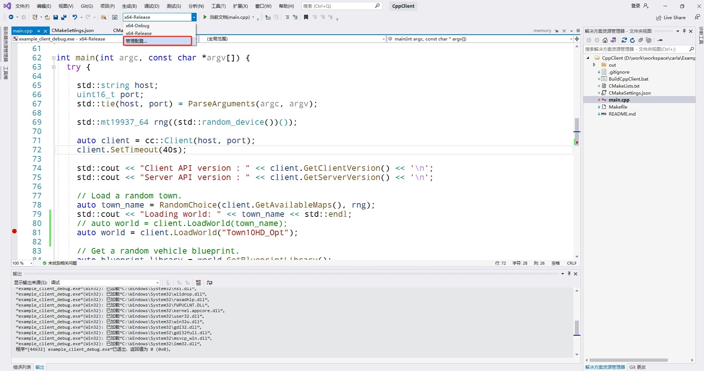

# [C++ 参考](https://carla.readthedocs.io/en/latest/ref_cpp/) 

## C++ 客户端

C++客户端可以在 Linux 上用`make`构建，在Windows上用[`cmake`](https://github.com/OpenHUTB/carla_doc/tree/master/src/cmake/CMakeLists.txt) 构建。`CARLA_ROOT/Examples/CppClient/main.cpp`中的存储库中提供了一个C++客户端示例。这个示例展示了如何将C++客户端连接到CARLA服务器，并使用API执行一些简单的任务。

要构建示例C++客户端，请在存储库的`CARLA_ROOT/Examples/CppClient`目录中打开一个终端。在此文件夹中运行`make`，然后执行 `./bin/cpp_client` 来运行示例。该示例将从可用地图中选择一个随机地图，然后加载它。然后，它将生成一辆车并对该车应用控制。

有关此示例脚本的更多详细信息，请参阅 [C++客户端示例](adv_cpp_client.md) 、[C++客户端](cpp_client.md) 。

## C++ 文档

我们使用 Doxygen 生成 C++ 代码的文档：

[Libcarla/source](https://openhutb.github.io/carla_cpp/dir_b14cdd661f9a7048a44f1771cd402401.html) <br>
[Unreal/CarlaUE4/Source](http://carla.org/Doxygen/html/dir_733e9da672a36443d0957f83d26e7dbf.html) <br>
[Unreal/CarlaUE4/Plugins](https://openhutb.github.io/carla_cpp/dir_8fc34afb5f07a67966c78bf5319f94ae.html)

生成的文档可通过此 [链接](https://openhutb.github.io/carla_cpp/) 获取。

!!! 笔记
    文档更新由 GitHub 自动完成。

### 创建 doxygen 文档

!!! 重要
    需要 [Doxygen](http://www.doxygen.nl/index.html) 来生成文档，需要 [Graphviz](https://www.graphviz.org/) 作为图形绘制工具包。 

1- 使用以下命令安装 doxygen 和 graphviz：

```sh
# linux
sudo apt-get install doxygen graphviz
```

2- 安装后，转到 _Doxyfile_ 文件所在的项目根文件夹并运行以下命令：

```sh
doxygen
```

它将开始构建文档网页。
生成的网页可以在 Doxygen/html/ 中找到

3- 在浏览器中打开 _index.html_ 。现在您已经有了本地 cpp 文档！

## C++客户端运行

1. 在vs2019中点击菜单`文件->打开->CMake`，打开`Examples\CppClient\CMakeLists.txt`；
2. 点击`管理配置`，添加新的配置`x64-release`；（注意：`x64-Debug`还有问题）；
3. 启动Carla服务端后，在vs2019中点击`调试->开始执行`。


## 阅读

**HUD**: Heads-up Displays, 头显。用户界面 （UI）和 头显 （HUD）是游戏向玩家提供游戏信息以及在某些情况下允许玩家与游戏互动的方式。HUD指的是游戏期间在屏幕上覆盖的状态和信息。HUD的目的是告知玩家当前游戏状态，即分数、生命值、游戏剩余时间等。 HUD通常是不可互动的，意味着玩家不能单击HUD的元素，因此 在HUD和用户界面难以分离的某些类型游戏中，这些元素会显示为灰色区域。


- 统计代码的行数
```shell
git ls-files | xargs cat | wc -l
```
指定文件后缀名：
```shell
# 26103行
git ls-files '*.cpp' | xargs wc -l
# 34872行
git ls-files '*.h' | xargs wc -l
```

## C++ 详细信息

* [C++详细信息](./cpp.md)
