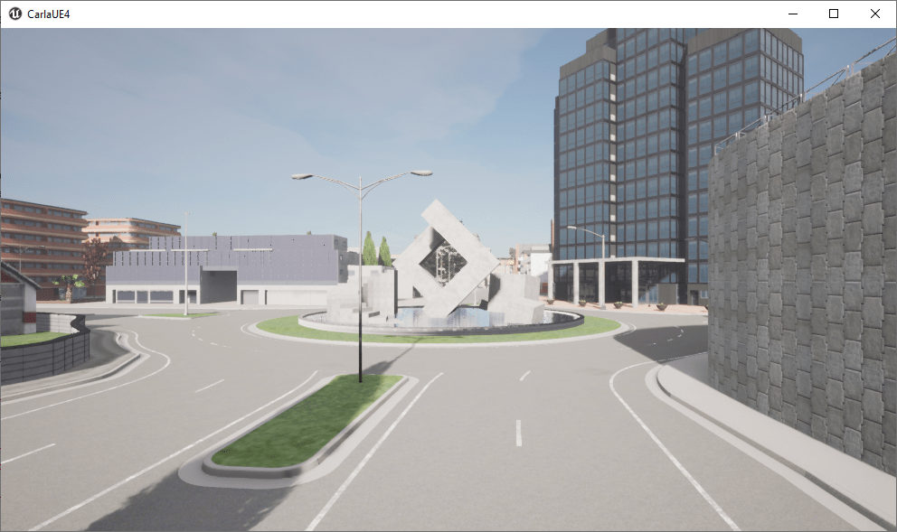
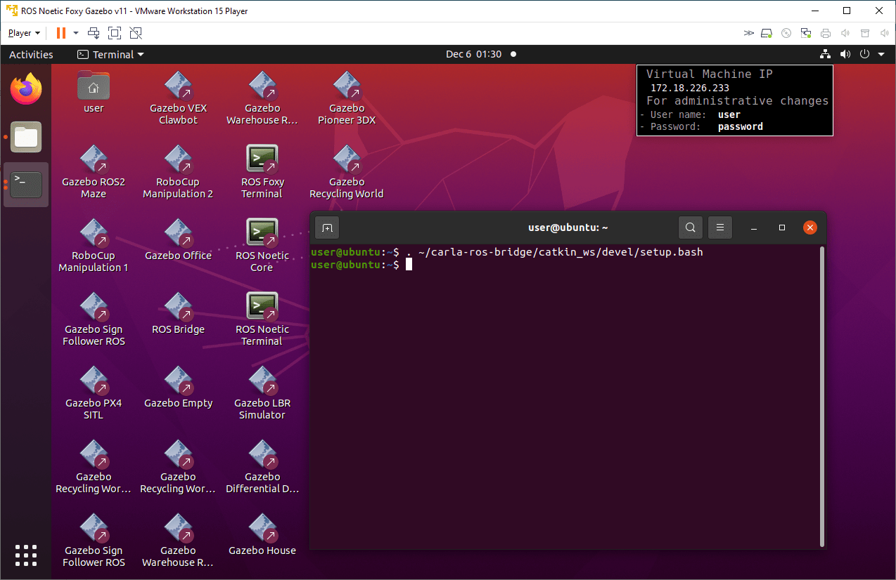
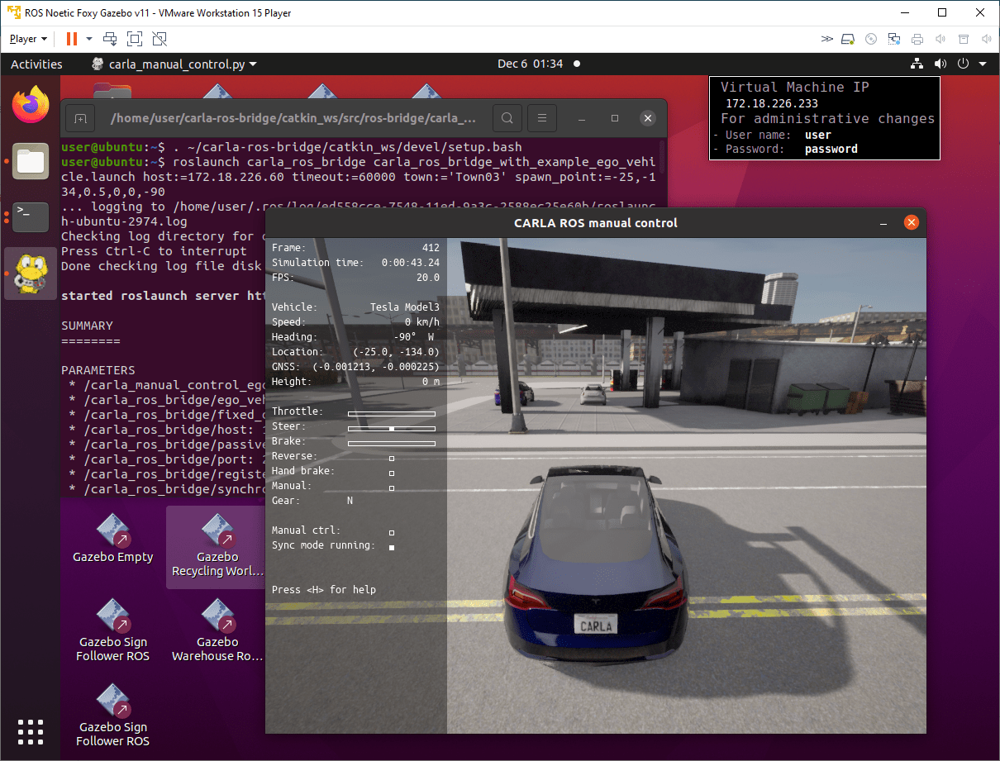

# [设置并连接到 CARLA 模拟器](https://www.mathworks.com/help/ros/ug/set-up-and-connect-to-carla-simulator.html)

此示例展示如何使用 ROS Toolbox 设置并连接到 CARLA 模拟器来模拟自动驾驶应用程序。

您可以利用 CARLA 模拟器复制从城市到高速公路的各种驾驶场景，并在受控虚拟环境中评估其自动驾驶算法的有效性。该模拟器包括各种传感器模型、车辆动力学和交通状况，使用户可以模拟真实世界的设置。您可以使用 Simulink 软件向车辆控制发布者发送转向、制动和油门控制信号，并控制 CARLA Ego 车辆并研究自动驾驶的各种元素。

从 [链接](https://github.com/carla-simulator/carla/releases) 中下载 Carla 0.9.13 版本的模拟器。如果您使用的是 Windows 机器，请同时下载并安装 ROS 虚拟机。此虚拟机基于 Ubuntu Linux 操作系统，并已预先配置为支持使用 ROS Toolbox 构建的应用程序。

此示例在 Windows 主机上演示。

## 启动 CARLA 服务器

要在 Windows 主机上启动 CARLA 服务器，请导航到 CARLA 的安装位置并单击应用程序可执行文件`CarlaUE4.exe`。




## 设置 CARLA ROS Bridge
1.启动虚拟机。

2.在 Ubuntu 桌面上，单击 `ROS Noetic Core Terminal` 快捷方式以启动 ROS 主控。主控启动后，记下 `ROS_MASTER_URI`。

3.在 Ubuntu 桌面上，单击 `ROS Noetic Terminal` 快捷方式以启动 ROS 终端。运行此命令以设置 CARLA ROS 桥接环境。
```shell script
. ~/carla-ros-bridge/catkin_ws/devel/setup.bash
```




## 使用 CARLA 客户端启动 Ego Vehicle
在同一个终端中，运行follow命令以在您喜欢的 CARLA 模拟器环境中启动 Ego 车辆。例如，您可以follow在 CARLA 模拟器的 Town03 环境中运行命令以在加油站附近启动车辆。

运行此命令将主机地址更改为您的机器的主机地址（您的IP地址一般和这里`172.18.226.60`的不一致）。
```shell script
roslaunch carla_ros_bridge carla_ros_bridge_with_example_ego_vehicle.launch host:=172.18.226.60 timeout:=60000 town:='Town03' spawn_point:=-25,-134,0.5,0,0,-90
```
<!-- 192.168.159.129 -->



## 验证 CARLA ROS 连接
将 Simulink 连接到在 VM Ware 中运行的 ROS 主机。
```shell script
rosinit( 'http://172.18.226.233:11311' )
```

通过运行以下自省命令，验证您是否可以访问与 CARLA 模拟器相关的 ROS 主题。
```shell script
rostopic list
```


