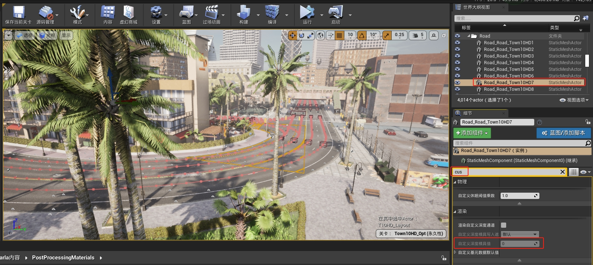

## 自带语义分割传感器实现路径
本文从 Carla 出发，深入UE内部，来理解 Carla 中的视觉传感器及真值系统的实现原理。

### 1、知识铺垫
Carla RGB 摄像头传感器代码分析讲了 Camera 之间的继承关系。下图表达它们的层次关系：


* **ASensor** 完成 Carla 的抽象传感器功能；
* **ASceneCaptureSensor** 实现UE渲染接口，`UTextureRenderTarget2D` 和 `USceneCaptureComponent2D` 的加入，并且 `USceneCaptureComponent2D` 控制着后处理（`FPostProcessingSetting`）参数；
* **AShaderBasedSensor** 主要负责加入后处理材质(PostProcessing Material)，后处理材质也是一种着色器(shader)，对着色有影响，AShaderBasedSensor是抽象类，不是具体的传感器函数，所以只提供功能，供继承子类扩展着色器；
* **ASceneCaptureCamera**，`ASemanticSegmentationCamera`，`AOpticalFlowCamera`，`ASemanticSegmentationCamera` 等其他 camera 均继承自AShaderBasedSensor，它们的逻辑大多都很简单，就是使用 AShaderBasedSensor 提供的 AddPostProcessingMaterial 接口，添加后处理材质，根据不同的传感器类型，有不同的着色需求。

### 2、UE层面理解相机
* 后处理材质放置位置

从代码中去看，拿 [语义分割相机](https://github.com/OpenHUTB/carla/blob/ue4-dev/Unreal/CarlaUE4/Plugins/Carla/Source/Carla/Sensor/SemanticSegmentationCamera.cpp) 举例，该传感器用了两个后处理材质：物理畸变模型、GroundTruth标注。
```cpp
ASemanticSegmentationCamera::ASemanticSegmentationCamera(
    const FObjectInitializer &ObjectInitializer)
  : Super(ObjectInitializer)
{
  // AddPostProcessingMaterial()在给定的路径上加载 UMaterialInstanceDynamic，并将其附加到具有权重的着色器列表中。
  AddPostProcessingMaterial(
      TEXT("Material'/Carla/PostProcessingMaterials/PhysicLensDistortion.PhysicLensDistortion'"));
  AddPostProcessingMaterial(
      TEXT("Material'/Carla/PostProcessingMaterials/GTMaterial.GTMaterial'"));
}
```

从虚幻编辑器里面去找，该文件属于 Carla 插件带的材质，不属于场景内容文件，所以要在视图选项中选上`显示插件内容`，才能在左边的`内容浏览器`目录中看到`CARLA内容`。在`PostProcessingMaterials`路径下就可以看到`PhysicLensDistortion`和`GTMaterial`的材质文件。


点开后可以看到该材质文件的蓝图逻辑：


* 在虚幻编辑器里可视化相机

参考 [UE4场景采集之场景采集2D](https://blog.csdn.net/lei_7103/article/details/106020942) ，很推荐熟练掌握在虚幻编辑器中使用各种Component的方式，因为这样会比重新写代码，编译代码，验证问题整个流程快很多，很多时候我们调整的Component参数可以直接在Editor里面尝试，可视化效果，在传感器开发尤其重要。

下面用视频简单介绍一下 `UTextureRenderTarget2D` 和 `USceneCaptureComponent2D` 到底是什么：

视频里主要做了几个操作：

1.在`放置Actor`中搜索 `场景捕获2D(SceneCapture2D)` 拖入场景，会产生一个类似摄像机的物体；


2.在`内容浏览器`空白处右键，创建一个 `材质和纹理 -> 渲染目标(TextureRenderTarget2D)`，创建后重命名为`RenderTexture2D`。


3.将画布渲染目标 `TextureRenderTarget2D` 指派给场景捕获2D `SceneCapture2D`


4.给画布渲染目标 `TextureRenderTarget2D` 创建材质：右键画布渲染目标，选择


5.双击打开内容浏览器中的`场景捕获2D`(RenderTexture2D)，选择不同的渲染输出内容（可以选法线、底色、LDR、HDR 等）可以看到不同的场景捕获效果。


6.在 `后期处理体积` 里面，添加后处理材质，并选择从现有资产中添加

7.加入不同的后处理材质，查看效果

经过这些操作，大概就了解了它们分别是什么角色：`USceneCaptureComponent2D` 负责设置渲染的视角（FViewInfo）、传感器外参、后处理参数设置（FPostProcessSettings）、捕获源（Capture Source）等渲染需要的参数。
`UTextureRenderTarget2D` 负责记录渲染结果，`捕获源`里面是该场景捕捉器的渲染结果 Texture，然后通过一些取出 Buffer 的方式，将该渲染结果取出，然后通过 Carla 的一些传输数据方式，传给客户端，然后再解码二进制。


### 3、语义分割的实现原理
* 语义分割的后处理材质蓝图

双击打开材质`Carla内容/PostProcessingMaterials/GTMaterial`


首先该材质里引入了两个概念：场景深度、自定义深度。`场景深度`就是用于渲染的 Z-Depth，光栅渲染判断前后关系用的，在GBuffer中也存在；`自定义深度`，`自定义深度模具`值（Custom Depth Stentil Value），Carla 拿来做语义分割的标记，以 Actor 为单位，可以用来区分不同物体，最后根据这个与 Carla 内部逻辑，对图像进行上色（参考 [创建语义标签](../tuto_D_create_semantic_tags.md) ）。

比如，如路面是7，路线是6。




### 参考

- [视觉传感器系列实现原理分析](https://bbs.carla.org.cn/info/532d57cf2725474b8878a67282ef6e3f?csr=1)
- [UE场景捕获2d 简单监视器效果](https://blog.csdn.net/weixin_74205939/article/details/140893454)