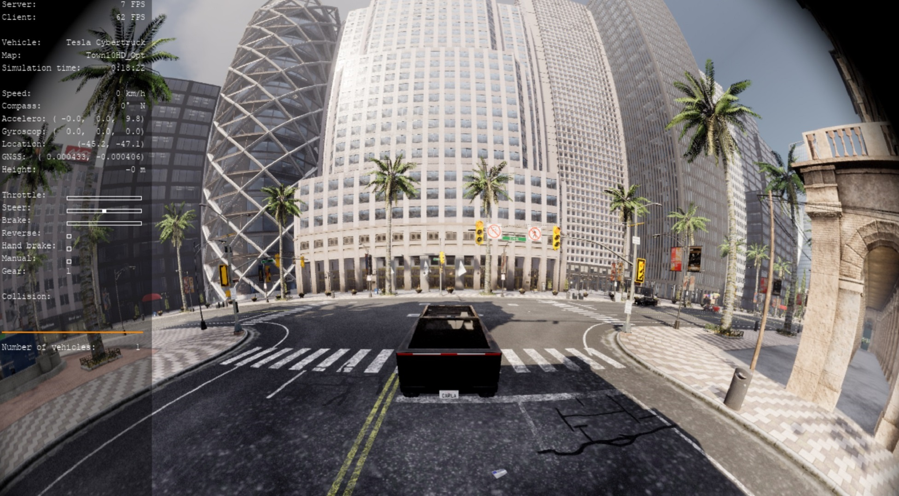

# 鱼眼相机

实现比传统相机视野更广的相机。

## 实现原理
参考 [基于KB模型的相机内参](https://ww2.mathworks.cn/help/vision/ref/cameraintrinsicskb.html) 和 [鱼眼校准基础知识](https://ww2.mathworks.cn/help/vision/ug/fisheye-calibration-basics.html) ，
Kannale-Brandt 模型通过考虑镜头畸变来扩展理想的针孔模型，以代表真实的相机。
畸变点(distorted)为( \(x_{d}, y_{d} \) )，其中
$$
x_{d} = \frac{\theta_d}{\gamma} \times x
$$

$$
y_{d} = \frac{\theta_d}{\gamma} \times y
$$


其中，归一化图像坐标中未失真像素的位置为 \( (x,y) \)：
$$
\gamma = x^2 + y^2
$$

$$
\theta _d = \theta (1 + k_1 \theta^2 + k_2 \theta^4 + k_3 \theta^6 + k_4 \theta^8)
$$

$$
\theta = atan(\gamma)
$$

这里的 \( k_1, k_2, k_3, k_4 \) 是镜头的畸变系数，\(atan\) 为反正切（与\(x\)轴的夹角）。


## 实现步骤

参考 [添加新传感器](../tuto_D_create_sensor.md) 。

### 0- 虚幻引擎端的修改

更新3个虚幻引擎的源代码：

  * [`Engine/Shaders/Private/SimpleElementPixelShader.usf`](https://github.com/OpenHUTB/UnrealEngine/blob/fisheye-camera/Engine/Shaders/Private/SimpleElementPixelShader.usf)
  
    Unreal Shader(.usf, 着色器) 文件。 其中函数`void CubemapTexturePropertiesFisheye()`实现了鱼眼相机的畸变模型：
    $$ 
    x = x_d \frac{r}{\theta _d} = \frac{r}{\theta (1 + k_1 \theta^2 + k_2 \theta^4 + k_3 \theta^6 + k_4 \theta^8)}  
    $$
    [代码实现](https://github.com/OpenHUTB/UnrealEngine/blob/83a7677378ff770073ca9544460a02d264a3ce46/Engine/Shaders/Private/SimpleElementPixelShader.usf#L410) ：`theta = r / (1.0f + d1*th2 + d2*th4 + d3*th6 + d4*th8);`。

  * [`Engine/Source/Runtime/Engine/Private/CubemapUnwrapUtils.cpp`](https://github.com/OpenHUTB/UnrealEngine/blob/fisheye-camera/Engine/Source/Runtime/Engine/Private/CubemapUnwrapUtils.cpp)
  * [`Engine/Source/Runtime/Engine/Public/CubemapUnwrapUtils.h`](https://github.com/OpenHUTB/UnrealEngine/blob/fisheye-camera/Engine/Source/Runtime/Engine/Public/CubemapUnwrapUtils.h)


### 1- 创建新传感器 <span id="1-sensor-actor"></span>

为新的 C++ 类创建两个文件：

  * [`Unreal/CarlaUE4/Plugins/Carla/Source/Carla/Sensor/FisheyeSensor.h`](https://github.com/OpenHUTB/carla/blob/fisheye-camera/Unreal/CarlaUE4/Plugins/Carla/Source/Carla/Sensor/FisheyeSensor.h)
  * [`Unreal/CarlaUE4/Plugins/Carla/Source/Carla/Sensor/FisheyeSensor.cpp`](https://github.com/OpenHUTB/carla/blob/fisheye-camera/Unreal/CarlaUE4/Plugins/Carla/Source/Carla/Sensor/GnssSensor.cpp)


### 2- 传感器数据序列化器 <span id="2-sensor-data-serializer"></span>

这个类只需要有两个静态方法，序列化`Serialize`和反序列化`Deserialize`。我们将为它添加两个文件，这次是位于 `LibCarla` 模块中：

  * [`LibCarla/source/carla/sensor/s11n/ImageSerializerCube.h`](https://github.com/OpenHUTB/carla/blob/fisheye-camera/LibCarla/source/carla/sensor/s11n/ImageSerializerCube.cpp)

序列化函数 Serialize 输入为一个传感器Sensor，返回一个缓冲区Buffer。

```cpp
#pragma pack(push, 1)
    struct ImageHeader {
      unsigned width;
      unsigned height;
      float fov_angle;
    };
#pragma pack(pop)
```
将内存对齐调整为1字节对齐，也就是说结构体中的各个成员会按照1字节对齐，而不是默认的机器字节对齐方式。这样做可以减少内存的浪费。
首先将当前的对齐规则保存在堆栈中。这样，在后续的代码中，可以通过 `#pragma pack(pop)` 恢复之前的对齐方式。
unsigned若省略后一个关键字，大多数编译器都会认为是 unsigned int。

  * [`LibCarla/source/carla/sensor/s11n/ImageSerializerCube.cpp`](https://github.com/OpenHUTB/carla/blob/fisheye-camera/LibCarla/source/carla/sensor/s11n/ImageSerializerCube.h)


### 3- 传感器数据对象 <span id="3-sensor-data-object"></span>

  * [`LibCarla/source/carla/sensor/data/ImageCube.h`](https://github.com/OpenHUTB/carla/blob/fisheye-camera/LibCarla/source/carla/sensor/data/ImageCube.h)
  * [`LibCarla/source/carla/sensor/data/ImageTmplCube.h`](https://github.com/OpenHUTB/carla/blob/fisheye-camera/LibCarla/source/carla/sensor/data/ImageTmpl.h)
  * [`LibCarla/source/carla/image/ImageConverterCube.h`](https://github.com/OpenHUTB/carla/blob/fisheye-camera/LibCarla/source/carla/image/ImageConverterCube.h)
  * [`LibCarla/source/carla/image/ImageViewCube.h`](https://github.com/OpenHUTB/carla/blob/fisheye-camera/LibCarla/source/carla/image/ImageViewCube.h)


### 4- 注册传感器 <span id="4-register-your-sensor"></span>

  * [`LibCarla/source/carla/sensor/SensorRegistry.h`](https://github.com/OpenHUTB/carla/blob/1c60b0f41064f241318c6c3555293e40d150ba5a/LibCarla/source/carla/sensor/SensorRegistry.h#L87)

    将CarlaUE4中的鱼眼相机传感器参与者AFisheyeSensor和LibCarla中的图像序列化器组合成一个单一的对象：`std::pair<AFisheyeSensor *, s11n::ImageSerializerCube>`。

### 5- 使用示例 <span id="5-usage-example"></span>

  * [`fisheye_demo.py`](https://github.com/OpenHUTB/carla_doc/blob/master/src/sensor/fisheye_demo.py)

启动后按数字键`2`，则显示鱼眼相机画面：



## 问题

使用官网中的 [PR](https://github.com/carla-simulator/carla/pull/3755) 的代码进行编译，报错：`D:\work\workspace\carla\Unreal\CarlaUE4\Plugins\Carla\CarlaDependencies\include\carla/streaming/detail/tcp/ServerSession.h(70): error C2338: This function only accepts arguments of type BufferView.`：

解决：需要使用[GimpelZhang](https://github.com/GimpelZhang/carla/tree/fisheye) 的中的[FisherSensor.cpp](https://github.com/carla-simulator/carla/commit/894736b6dbdd5f0a2bc42d9ec3697a0596e7cb75) 


报错：`D:/work/workspace/carla/Unreal/CarlaUE4/Plugins/Carla/Source/Carla/Sensor/V2XSensor.cpp(189): error C2653: “UCarlaStatics”: 不是类或命名空间名称
  D:/work/workspace/carla/Unreal/CarlaUE4/Plugins/Carla/Source/Carla/Sensor/V2XSensor.cpp(189): error C3861: “GetCurrentEpisode”: 找不到标识符`

临时解决办法：注释掉这一块代码，只保留
```cpp
if (!ActorPowerList.empty())
{
}
```

## 参考

* [A generic camera model and calibration method for conventional, wide-angle, and fish-eye lenses](https://users.aalto.fi/~kannalj1/publications/tpami2006.pdf)
