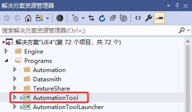

# 如何发布

> _本文档适用于想要发布新版本的开发人员。_

!!! 笔记
    已发布的服务：[Carla C++ 文档](https://openhutb.github.io/carla_cpp/dir_b14cdd661f9a7048a44f1771cd402401.html) 、[神经网络原理](https://openhutb.github.io/neuro/) 、[车辆信息可视化内网访问](http://172.21.108.56:8080/) 、[场景像素流](http://172.21.108.56) 、[DeepSeek大模型内网访问](http://172.21.108.56:3000/) （或 [公网访问](software/llm.md) ） 、[Jenkins 8080](http://172.21.108.56:8080/) 。

1. **确保内容是最新的。**<br>
   请参阅 [升级内容](tuto_D_contribute_assets.md)。

2. **必要时增加 Carla 版本。**<br>
   增加以下文件中的版本： _DefaultGame.ini_, _Carla.uplugin_,
   _setup.py_, _ContentVersions.txt_ 。Grep 查看当前版本，以确保您不会错过任何参考。

3. **清除 CHANGELOG.md。**<br>
   确保变更日志是最新的，必要时重写并重新组织；考虑哪些项目对用户来说更重要。

4. **提交更改并添加新标签。**<br>
   提交所有更改后，添加一个新标签 `git tag -a X.X.X`
   （用最新版本替换 `X.X.X` ）。 添加此版本的变更日志作为标签消息。

5. **标签内容仓库。**<br>
   在确切的提交处将类似的标签添加到内容存储库，如 _ContentVersions.txt_ 中。

6. **推送更改。**<br>
   将所有更改推送到两个存储库，以推送您可能需要使用
   `git push --tags` 的标签。如有必要，创建拉取请求。

7. **编辑 GitHub 版本。**<br>
   转到 [GitHub 发布](https://github.com/carla-simulator/carla/releases) 并在新创建的标签之上创建一个新版本。等到 Jenkins 完成发布最新版本的构建，并将下载链接添加到新创建的版本。

## 发布像素流

* [像素流](ue/pixel_streaming.md)

## [发布可执行游戏](https://blog.csdn.net/zl834205311/article/details/125905705) 
* 安装`pyinstaller`：
```shell
pip install pyinstaller
```
或安装图形窗口打包工具：
```shell
pip install auto-py-to-exe
```
然后运行`auto-py-to-exe`。

## 发布带Carla插件的虚幻编辑器

1.参考 [Windows 下的构建](build_windows.md) 进行带Carla插件的虚幻编辑器的构建；

2.发布安装版本
参考[链接](https://github.com/chiefGui/ue-from-source?tab=readme-ov-file#step-by-step-1) 进行虚幻引擎的发布。

3.使用 Visual Studio 打开 `UE4.shn` 。

4.在右侧边栏，您应该会看到一个`解决方案资源管理器`面板。展开`Programs`文件夹并找到`AutomationTool`项目（`Engine\Source\Programs\AutomationTool`）：


5.右键单击它并选择`生成(Build)`，应该很快。

6.运行安装软件的构建脚本：（如果没有）安装 [Windows 10 SDK](https://developer.microsoft.com/en-us/windows/downloads/windows-10-sdk) ;

将文件 [`GenerateInstalledBuild.bat`](https://github.com/OpenHUTB/carla_doc/tree/master/src/bat/GenerateInstalledBuild.bat) 拷贝到虚幻引擎源代码的根目录，然后点击运行。

如果一切顺利，您应该会看到`LocalBuilds`与该文件夹处于同一级别的`Engine`文件夹，并且控制台中没有错误。(还包括一个 InstalledDDC 文件夹：DerivedDataCache)。

或者到虚幻引擎源代码主目录中运行下面命令：
```shell
cd Engine\Binaries\DotNET
AutomationTool.exe BuildGraph -target="Make Installed Build Win64" -script=Engine/Build/InstalledEngineBuild.xml -set:HostPlatformOnly=true
```


* 运行``GenerateInstalledBuild.bat`时从报错日志中发现的错误：
```text
ERROR: Visual Studio 2017 must be installed in order to build this target.
```
解决：下载 [链接](https://pan.baidu.com/s/1n2fJvWff4pbtMe97GOqtvQ?pwd=hutb) 的`software/Build Binary`中的 `vs_Community_2017.exe` 或 `3d5_VisualStudio20171509.rar`进行安装。


* 运行``GenerateInstalledBuild.bat`时候报错：
```text
Unable to find installation of PDBCOPY.EXE
```
解决：参考 [链接](https://pan.baidu.com/s/1n2fJvWff4pbtMe97GOqtvQ?pwd=hutb) 的`software/Build Binary`目录 或者 [链接](https://arenas0.com/2018/12/03/UE4_Learn_Build_Binary/) 从 [百度网盘](https://pan.baidu.com/s/1Y0PQeHCMQh7Ln12d_p_Rzw) 下载`X64 Debuggers And Tools-x64_en-us.msi`安装。


* 无法启动
```text
无法启动此程序，因为计算机中丢失XINPUT1_3.dll。尝试重新安装该程
```
解决：参考 [链接](http://www.codefaq.cn/category/Windows/) 安装 DirectX Redist (June 2010)。


## 设计
参考[BeamNG](https://baike.baidu.com/item/BeamNG%E8%B5%9B%E8%BD%A6/18880401)

## 自定义发布

### 发布PythonAPI到PyPi

1. 注册pypi账号，并激活。
2. 生成可发布的whl文件
```shell
make PythonAPI ARGS="--chrono"
```
3. 发布到 [PyPi](https://pypi.org/project/hutb/) ：
```shell
# 删除文件 carla/PythonAPI/carla/dist/hutb-1.0.0-py3.7-win-amd64.egg
pip install twine
twine upload dist/*  # 需要使用PyPi的Token
```

### 发布镜像

* [利用GitHub Actions自动构建项目的docker镜像并发布到DockerHub](https://wiki.eryajf.net/pages/5baf0a/#%E5%89%8D%E8%A8%80)


### 发布到商城
[讨论是否可以发布修改代码的插件](https://www.reddit.com/r/unrealengine/comments/w7ndj9/are_plugins_able_to_append_tooverwrite_engine/)

Baidunet Disk Download Link: https://pan.baidu.com/s/1hFngmeAvyUulsiI-JlNHuA?pwd=hutb

A simulator and scene editor for autonomous driving.

## 问题
点击打包后的文件出现错误：
```text
TypeError: expected str, bytes or os.PathLike object, not _io.BytesIO
```
解决：
```python
pygame.font.Font(pygame.font.get_default_font(), 20)
```
获得的字体文件为`freesansbold.ttf`，最后将字体文件拷贝到和exe文件相同的路径，然后执行即可。

## 参考
* [内网穿透](https://natapp.cn/article/config_ini)
