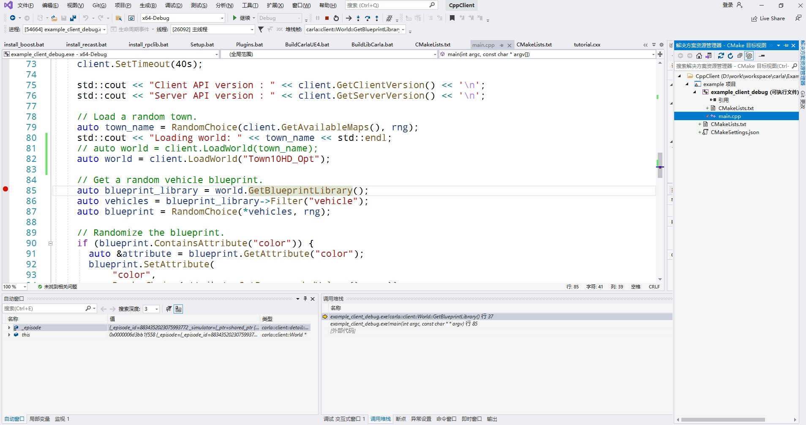
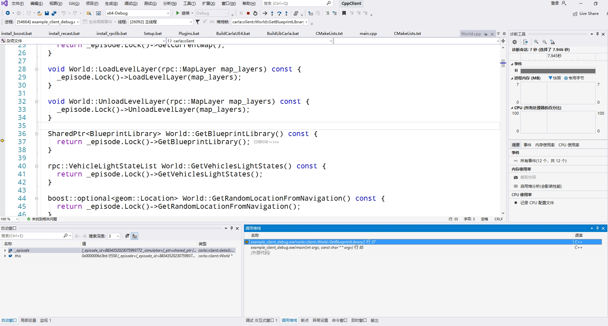
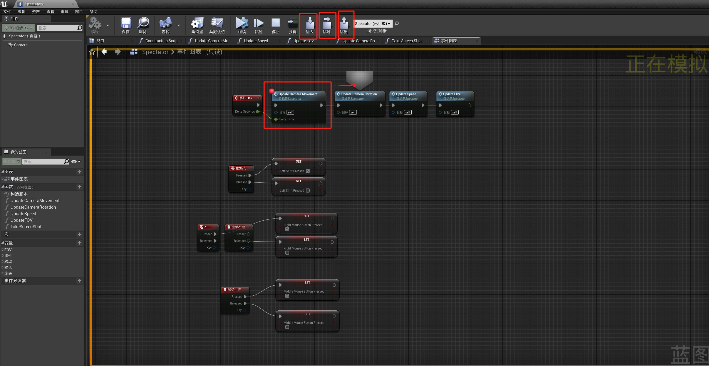

# 在 Windows 上进行 Carla 的调试

- [__虚幻引擎Carla插件的调试__](#debug_CarlaUE4)
- [__C++客户端调试__](#cpp_client_debug)
- [__调试LibCarla__](#debug_LibCarla)
    - [__Python 扩展模块__](#python_extension)
- [__调试PythonAPI__](#debug_Python_API)
    - [__构建调试版本__](#build_debug_version)
- [__调试蓝图__](#debug_blueprint)
- [__其他__](#other)
    - [__检查所依赖dll库的符号是否加载__](#check_dll_loaded)
    - [__VS2019 打开 CarlaUE4 的 Cmake 工程__](#open_cmake_project)
    - [__导入崩溃问题__](#crash_problem)
    - [__VS 调试 UE 项目__](#debug_UE_with_vs2019)
    - [__问题__](#problems)
    - [__技巧__](#trick)
    - [__学习__](#learn)

程序调用流程：Python、libcarla.cp37-win_amd64.pyd、LibCarla、CarlaUE4。

## 虚幻引擎Carla插件的调试 <span id="debug_CarlaUE4"></span>
1. 进入目录`carla/Unreal/CarlaUE4/`，右键文件`CarlaUE4.uproject`，选择运行`Generate Visual Studio project files`，在当前目录中将会生成VS的工程文件，双击打开`CarlaUE4.sln`。


!!! 笔记
    如果右键菜单中未出现`Generate Visual Studio project files`选项，则到虚幻引擎的目录中运双击执行`engine\Engine\Binaries\Win64\UnrealVersionSelector.exe`，将虚幻引擎软件注册到系统中。如果报错：`The current folder does not contain an engine installation`，则检查是不是在Epic Games公司发布的引擎中执行，需要确保在带Carla插件中的虚幻引擎中进行执行。

2. （调试数字孪生工具）在`解决方案`中展开`Games->CarlaUE4`，在想要查看的源代码行的最左侧单击增加断点（比如：`CarlaUE4->Plugins->CarlaTools->Source->CarlaTools->Private`的`OpenDriveToMap.cpp`的`GenerateTileStandalone()`），在菜单运行`调试(D)->开始调试(S)`，程序将在断点出暂停。通过`调式(D)->窗口(W)->监视(W)->监视 1`打开变量监视窗口，查看变量值是否异常。


* 调试**Carla服务端**：断点打在`Carla/Game/CarlaEngine.cpp`的第87行，然后开始调式，在虚幻编辑器中点击`运行`则会在断点处停止。


* 调式 ** 虚幻编辑器启动 **：断点打在`Carla/Vehicle/VehicleSpawnPoint.h`的第16行，通过vs启动调试后启动虚幻便器到75%时候会停止。

* 调试 **Python 调用**：断点打在 `Carla/Server/CarlaServer.cpp`的第 721行，然后运行`manual_control.py`（调用`try_spawn_actor`方法生成参与者）则会在断点处停止。

配置管理器包括：

* **Debug**: 游戏和引擎全都可以调试，无优化，速度慢，没有Editor相关代码功能，资源需要Cook。

* **Debug Editor**：游戏和引擎全部可以调试，无优化，可以使用Editor相关代码功能，资源不需要Cook，可直接启动编辑器。（用`generate_traffic.py`调试会崩溃，`manual_control.py`可以）

* **DebugGame**：游戏代码可调试无优化，Editor相关代码功能不可使用，引擎不可调试，资源需要Cook。

* **DebugGame Editor**：游戏代码可调试无优化，可以使用Editor相关代码功能，引擎不可调试，资源不需要Cook。

* **Development**：游戏、编辑器、引擎都不可调试，Editor相关代码功能不可使用，资源需要Cook。（The global shader cache file 'D:/work/workspace/engine/Engine/GlobalshaderCache-PCD3D_M5.bin' is missing.）

* **Development Editor**：游戏、编辑器、引擎都不可调试，Editor相关代码功能可使用，资源不需要Cook。（默认）

* **Shipping**：发行版，极致优化，估计调试信息都没了。

* **Test**：包含额外的测试代码。


## C++客户端调试 <span id="cpp_client_debug"></span>

* 错误	LNK2038	检测到“_ITERATOR_DEBUG_LEVEL”的不匹配项: 值“0”不匹配值“2”
* 错误	LNK2038	检测到“RuntimeLibrary”的不匹配项: 值“MD_DynamicRelease”不匹配值“MDd_DynamicDebug”

当前工程是Debug版本（0），而引用的库文件时Release版本（2）。

需要将其他的.lib文件编译为debug模式：

0.打开`x64 Native Tools Command for VS 2019`，并切换到目录`Util/Intallers`下。

1.切换到目录`Util/InstallersWin`，将[`install_boost.bat`](https://github.com/OpenHUTB/carla/blob/ue4-dev/Util/InstallersWin/install_boost.bat) 内的b2运行参数改为`variant=debug`（根据`Util/BuildTools/Setup.bat`里的安装Boost命令改编），（或者将 [install_boost_debug.bat](https://github.com/OpenHUTB/doc/blob/master/src/cmake/install_boost_debug.bat) 拷贝到`Util/InstallerWin`目录下），然后运行[`install_boost_debug.bat`](https://github.com/OpenHUTB/doc/tree/master/src/cmake/install_boost_debug.bat) ：
```shell
install_boost_debug.bat --build-dir C:\buf --toolset msvc-14.2 --version 1.80.0 -j 4
```
会自动将boost的库和头文件安装到目录`D:\buffer\boost-1.80.0-install`里面。

将[`install_recast.bat`](https://github.com/carla-simulator/carla/blob/dev/Util/InstallersWin/install_recast.bat) 中的`Relase`改为`Debug`。
将`-DCMAKE_CXX_FLAGS_RELASE="/MD /MP"`改为多线程调试DLL`-DCMAKE_CXX_FLAGS_DEBUG="/MDd /MP"`，（或者将 [install_recast_debug.bat](https://github.com/OpenHUTB/doc/blob/master/src/cmake/install_recast_debug.bat) 拷贝到`Util/InstallerWin`目录下），然后运行[`install_recast_debug.bat`](https://github.com/OpenHUTB/doc/tree/master/src/cmake/install_recast_debug.bat) 。
```shell
install_recast_debug.bat --build-dir C:\buf --generator "Visual Studio 16 2019"
```

将[`install_rpclib.bat`](https://github.com/carla-simulator/carla/blob/dev/Util/InstallersWin/install_rpclib.bat) 中的`Relase`改为`Debug`，运行[`install_rpclib.bat`](https://github.com/OpenHUTB/doc/tree/master/src/cmake/install_rpclib.bat) 。
将`-DCMAKE_CXX_FLAGS_RELASE="/MD /MP"`改为多线程调试DLL`-DCMAKE_CXX_FLAGS_DEBUG="/MDd /MP"`。或者将[install_rpclib_debug.bat](https://github.com/OpenHUTB/doc/blob/master/src/cmake/install_rpclib_debug.bat) 拷贝到`Util/InstallerWin`目录下），然后运行：
```shell
install_rpclib_debug.bat --build-dir C:\buf --generator "Visual Studio 16 2019"
```


2.将第1步生成的安装文件目录配置到`Examples\CppClient\CMakeLists.txt`中（即将 [cpp_client_debug.txt](https://github.com/OpenHUTB/doc/blob/master/src/cmake/cpp_client_debug.txt) 拷贝到`Examples/CppClient`目录下并重命名为`CMakeLists.txt` ），对应的头文件和库文件都改为Debug版本（即将`C:\buf`目录下的`boost-1.80.0-install`、`recast-install`、`rpclib-install`3个文件夹拷贝到`Build\debug`目录下）；

3.在`main.cpp`中增加断点，并开始调试；

```shell
auto world = client.LoadWorld("town_name");
```
改为：
```shell
auto world = client.LoadWorld("Town10HD_Opt");
```
即将[main_debug.cpp](https://github.com/OpenHUTB/doc/blob/master/src/cmake/main_debug.cpp) 拷贝到`Examples/CppClient`目录下。

4.使用VS2019打开`Examples/CppClient/CMakeLists.txt`，程序在断点停止后按F10运行下一步，按F11进入LibCarla中的函数实现。


!!! 注意
    需要先启动Town10HT-Opt场景：需要从vs2019中使用调试模式启动虚幻编辑器并运行场景，如果使用编译后的场景执行`world.GetBlueprintLibrary()`会抛出异常。如果调式报错`错误	LNK1169	找到一个或多个多重定义的符号`，则表明当前工程有多个主函数的代码，需要删除`main.cpp`或者在Cmakelist.txt中指定需要编译包含住函数的的源代码`main_debug.cpp`。


## 调试LibCarla <span id="debug_LibCarla"></span>
该功能已经在 [C++客户端调试](#cpp_client_debug) 中实现，故不再需要，后面的步骤仅做探索使用。**客户端**向服务端调用实现的功能。
* 脚本`BuildLibCarla.bat`调用`cmake`命令进行构建：
```shell
cmake -G %GENERATOR% %PLATFORM%^
  -DCMAKE_BUILD_TYPE=Server^
  -DCMAKE_CXX_FLAGS_RELEASE="/MD /MP"^
  -DCMAKE_INSTALL_PREFIX="%LIBCARLA_SERVER_INSTALL_PATH:\=/%"^
  "%ROOT_PATH%"
```
其中，`-G`表示指定编译器版本（`set GENERATOR="Visual Studio 16 2019"`、`set PLATFORM=-A x64`）；

`-DCMAKE_BUILD_TYPE`的可选项包括：`Client`, `Server`, `Pytorch`, `ros2`；
` -D CMAKE_BUILD_TYPE="Debug"`可选值包括：`Debug`, `Release`, `RelWithDebInfo`, `MinSizeRel`。

`CMAKE_CXX_FLAGS_RELEASE`设置编译类型 Release 时的编译选项；


* 调用以下命令在 `Build` 目录下生成`Makefile`文件：
```shell
cmake --build . --config Release --target install | findstr /V "Up-to-date:"
```

1. 使用VS打开`Build\libcarla-visualstudio\CARLA.sln`。使用命令`make client`打开的就是`LibCarla\cmake\client\CMakeLists.txt`对应的项目。（使用`make server`打开的则是`LibCarla\cmake\server\CMakeLists.txt`对应的项目）

（`Build`目录下还包括`osm2odr-visualstudio/SUMO.sln`的VS工程）。

2. 右键`carla_client_debug`将其`设为启动项目`。

3. 附着到 Python 程序启动调试后，出现`当前不会命中断点 还没有为该文档加载任何符号`的警告。[解决](https://blog.csdn.net/u010821666/article/details/78512900) 

在`BuildLibCarla.bat`中，将 `--config`参数从`Release`修改为`Debug`。

!!! 注意
    在vs2019中生成`carla_client_debug`的解决方案时出现`fatal error C1189: #error :  "Incompatible build options"`错误，因为 [在不指定调试运行时的情况下使用/RTC选项将导致链接器错误](https://www.twblogs.net/a/5ef976a7fa148015395f1c5e/?lang=zh-cn) ，则需要将“项目属性 --> C++ --> 基本运行时检查” 改为 `默认值`，然后重新生成解决方案。或者右键`carla_client_debug`项目进行生成。


!!! 注意
    右键`carla_client_debug`，选择`调试`->`启动新实例`。 且需要在同一个解决方案中新建Python项目用于测试。

参考 [vs调试C++](https://blog.csdn.net/qq_36330274/article/details/128380765) 。

调试`carla_client`时，vs报错：`boost::python::error_already_set`，尝试[捕获具体异常](https://leonlee.wordpress.com/2018/09/24/%E4%BD%BF%E7%94%A8boostpython%E5%9C%A8c%E5%BA%94%E7%94%A8%E7%A8%8B%E5%BA%8F%E4%B8%AD%E5%B5%8C%E5%85%A5python%EF%BC%9A%E7%AC%AC%E4%BA%8C%E9%83%A8%E5%88%86/) 。

### Python 扩展模块 <span id="python_extension"></span>
LibCarla编译后生成`Python37/Lib/site-packages/carla/libcarla.cp37-win_amd64.pyd`给Python进行调用。为了提高运行速度，将当前目录中的`__init__.py`和`command.py`编译为`__pycache__`目录中的 `byte code(字节码)`。


## 调试PythonAPI <span id="debug_Python_API"></span>
boost_python库所在的目录为：`carla\Build\boost-1.80.0-install\lib\libboost_python37-vc142-mt-x64-1_80.lib`，`mt-x64`之间带有`gd`的是对应的调试版本。示例参考 [链接](demo/boost_python.md) 。

列出所有可用的命令：
```shell
python setup.py --help-commands
```

构建命令：
```shell
python setup.py build
```

### 构建调试版本 <span id="build_debug_version"></span>

1. 右键 `CARLA`解决方案，`添加`->`新建项目`->`Python应用程序`；
2. 将`manual_control.py`文件内容复制到新建工程的`PythonApplication.py`文件中；
3. 在.py文件的开始处增加`input()`代码；
4. 右键.py文件，点击`开始执行（调试）`，会弹出命令行界面；
5. 右键`carla_client_debug`项目->`调试`->`启动新实例`；
6. 在第4步弹出的命令行界面中敲回车；

参考[链接](https://stackoverflow.com/questions/61692952/how-to-pass-debug-to-build-ext-when-invoking-setup-py-install) ，效果未知。

## 调式蓝图 <span id="debug_blueprint"></span>

这里以 [Spectator 蓝图](https://bitbucket.org/carla-simulator/carla-content/src/master/Blueprints/Game/Spectator.uasset) 为例进行蓝图调式的说明。

1. 打开蓝图后，在所需要的模块上右键，添加断点；
2. 在虚幻编辑器中运行场景；
3. 会在蓝图断点处停止，可以在菜单栏中进行程序流程的控制和调试，比如进入、跳过、跳出等。


从菜单`窗口->开发者工具`中的`蓝图调试器`，可以查看调用堆栈、变量值等信息，具体操作请查看[蓝图调试](https://dev.epicgames.com/documentation/zh-cn/unreal-engine/blueprint-debugging?application_version=4.27) 。


## 其他 <span id="other"></span>

### 检查所依赖dll库的符号是否加载 <span id="check_dll_loaded"></span>
下断点，F5调试。然后“调试 - 窗口 - 模块”打开模块窗口。


## 使用 Visual Studio 调试引擎代码

1、先从VS工具栏中的第一个下拉菜单中选择设置`Development Editor`

2、在`解决方案`中右键项目`UE4`，选择`调试(Debug) -> 进入单步执行新实例`

3、断点会停在`UnrealEngine\Engine\Source\Runtime\Launch\Private\Windows/LaunchWindows.cpp`主函数入口：
```cpp
int32 WINAPI WinMain( _In_ HINSTANCE hInInstance, _In_opt_ HINSTANCE hPrevInstance, _In_ char*, _In_ int32 nCmdShow )
```


### VS2019 打开 CarlaUE4 的 Cmake 工程 <span id="open_cmake_project"></span>
windows操作系统下通过vs2019打开并编译carla：

1. 开Carla的CMake项目（参考[CMake 入门教程](https://www.jb51.net/article/180463.htm) ）：

从 VS 的菜单中选择 `File-->Open-->CMake`, 在对话框中找到 Carla 所在的本地文件夹（包含CMakeLists），选择CMakeLists.txt文件，打开，Visual studio 会自动加载此仓库，解析 `CMakeLists.txt` 文件，并提取其配置和变量信息。解析完成（需要等会儿或者重启）会从`解决方案资源管理器`中看到`.cpp`文件。

2. 修改配置：

点击`x64-Debug`下拉菜单中的`管理配置`，并在弹出的界面点击`编辑JSON`（该过程在工程根目录下生成`CMakeSettings.json`），将所需要构建的类型改为想编译的类型，比如`Client`。

3. 生成：

点击菜单栏`生成`-`全部生成`或`部分生成`即可。

### 导入崩溃问题 <span id="crash_problem"></span>

1. 例如，导入测试链接：
```text
小地图：
https://overpass-api.de/api/map?bbox=112.9088,28.2221,112.9172,28.2290
大地图：
https://overpass-api.de/api/map?bbox=112.8553,28.1931,112.9396,28.2504
金醴高速：
https://overpass-api.de/api/map?bbox=113.5293,27.6893,113.5516,27.7074
```

2. `CarlaUE4->Plugins->CarlaTools->Source->CarlaTools->Private`的`OpenDriveToMap.cpp`463行`GenerateTileStandalone()` ，然后调用`ExecuteTileCommandlet()` : 

UCommandlet是 Unreal Engine 中用于实现命令行操作的基类。它允许开发者创建自定义的命令行命令，并在引擎启动时执行这些命令。这个类主要用于扩展引擎功能，提供自定义的命令行工具。

3. ExecuteTileCommandlet() 调用的是`carla\Unreal\CarlaUE4\Plugins\CarlaTools\Intermediate\Build\Win64\UE4Editor\Inc\CarlaTools\OpenDriveToMap.gen.cpp`（反射文件gen）194行的
```shell
static FName NAME_UOpenDriveToMap_ExecuteTileCommandlet = FName(TEXT("ExecuteTileCommandlet"));
void UOpenDriveToMap::ExecuteTileCommandlet()
{
	ProcessEvent(FindFunctionChecked(NAME_UOpenDriveToMap_ExecuteTileCommandlet),NULL);
}
```
* 找到名为“ExecuteTileCommandlet”的`UFunction`对象；
* 执行“ProcessEvent”函数，然后从全局函数映射表找到对应的函数指针执行（利用函数名调用UFUNCTION函数）。


[蓝图的字节码](https://neil3d.github.io/unreal/bp_in_depth.html) ：在`engine\Engine\Source\Runtime\CoreUObject\Public\UObject\Script.h`这个文件中有一个`enum EExprToken`，这个枚举就是蓝图的字节码定义。引擎中使用一个全局查找表，把上述字节码映射到函数指针。在运行时，从一个字节码数组中逐个取出字节码，并查找函数指针，进行调用，也就完成了所谓的“字节码解释执行”的过程。


改为
```shell
void UOpenDriveToMap::GenerateTileStandalone(){
  UE_LOG(LogCarlaToolsMapGenerator, Log, TEXT("UOpenDriveToMap::GenerateTileStandalone Function called"));

  // ExecuteTileCommandlet();
  GenerateTile();

  UEditorLoadingAndSavingUtils::SaveDirtyPackages(true, true);
  UEditorLevelLibrary::SaveCurrentLevel();

}
```
注意：大地图也只能生成一小片地图。

报错信息：
```text
D:\work\workspace\engine/Engine/Binanes\Win64\UE4Editor ../../../../carla/Unreal/CaraUE4/CaraUE4.uproject -run=GenerateTileCommandlet " " -FilePath= ../../../../carla/Unreal/CarlaUE4/Content/Custo
[2024.04.30-06.58.10:090][ 0]LogInit: Executing Class /Script/CarlaTools.GenerateTileCommandlet
[2024.04.30-06.58.10:090][ 0]LogOutputDevice: Warning:

(0 frames)
```

崩溃日志：
```text
LoginId:bc22576a452b36c1831fe8942b55e57a
EpicAccountId:77cf3795af004e58a037e9c9d4a5aa0d

Assertion failed: Pair != nullptr [File:D:\work\workspace\engine\Engine\Source\Runtime\Core\Public\Containers/Map.h] [Line: 621]

UE4Editor_Core!AssertFailedImplV() [D:\work\workspace\engine\Engine\Source\Runtime\Core\Private\Misc\AssertionMacros.cpp:104]
UE4Editor_Core!FDebug::CheckVerifyFailedImpl() [D:\work\workspace\engine\Engine\Source\Runtime\Core\Private\Misc\AssertionMacros.cpp:461]
UE4Editor_CarlaTools!UGenerateTileCommandlet::Main() [D:\work\workspace\carla\Unreal\CarlaUE4\Plugins\CarlaTools\Source\CarlaTools\Private\Commandlet\GenerateTileCommandlet.cpp:75]
UE4Editor!FEngineLoop::PreInitPostStartupScreen() [D:\work\workspace\engine\Engine\Source\Runtime\Launch\Private\LaunchEngineLoop.cpp:3369]
UE4Editor!GuardedMain() [D:\work\workspace\engine\Engine\Source\Runtime\Launch\Private\Launch.cpp:127]
UE4Editor!GuardedMainWrapper() [D:\work\workspace\engine\Engine\Source\Runtime\Launch\Private\Windows\LaunchWindows.cpp:137]
UE4Editor!WinMain() [D:\work\workspace\engine\Engine\Source\Runtime\Launch\Private\Windows\LaunchWindows.cpp:268]
UE4Editor!__scrt_common_main_seh() [d:\agent\_work\2\s\src\vctools\crt\vcstartup\src\startup\exe_common.inl:288]
kernel32
ntdll
```
可知：`OpenDriveMap->FilePath = ParamsMap["FilePath"];`报的错，应该是路径下.xodr文件不存在。

崩溃日志位于：`engine\Engine\Binaries\Win64\CommandletParameters.txt`
找到的命令行运行参数为：
```text
 -run=GenerateTileCommandlet " " - F i l e P a t h = . . / . . / . . / . . / c a r l a / U n r e a l / C a r l a U E 4 / C o n t e n t / C u s t o m M a p s / t e s t _ 3 7 / O p e n D r i v e / t e s t _ 3 7 . x o d r " " - B a s e L e v e l N a m e = / G a m e / C u s t o m M a p s / t e s t _ 3 7 / t e s t _ 3 7 " " - G e o C o o r d s X = 2 7 . 6 8 9 3 0 1 " " - G e o C o o r d s Y = 1 1 3 . 5 2 9 2 9 7 " " - C T i l e X = 4 " " - C T i l e Y = 0 " " - A l l o w C o m m a n d l e t R e n d e r i n g
```
参数多了很多空格

正确应该为：
```shell
D:\work\workspace\engine\Engine\Binaries\Win64\UE4Editor ../../../../carla/Unreal/CarlaUE4/CarlaUE4.uproject -run=GenerateTileCommandlet -FilePath=../../../../carla/Unreal/CarlaUE4/Content/CustomMaps/test_37/OpenDrive/test_37.xodr -BaseLevelName=/Game/CustomMaps/test_37/test_37 -GeoCoordsX=27.689301 -GeoCoordsY=113.529297 -CTileX=4 -CTileY=0 -AllowCommandletRendering

D:\work\workspace\engine\Engine\Binaries\Win64\UE4Editor-Cmd D:/work/workspace/carla/Unreal/CarlaUE4/CarlaUE4.uproject -run=GenerateTileCommandlet -FilePath=D:/work/workspace/carla/Unreal/CarlaUE4/Content/CustomMaps/test_37/OpenDrive/test_37.xodr -BaseLevelName=/Game/CustomMaps/test_37/test_37 -GeoCoordsX=27.689301 -GeoCoordsY=113.529297 -CTileX=4 -CTileY=0 -AllowCommandletRendering
```
直接命令行运行报错（必须确保不是Commandlet启动，而必须是Editor启动）：
```text
LogWindows: Error: Assertion failed: !IsRunningCommandlet() [File:D:/work/workspace/engine/Engine/Plugins/Developer/RenderDocPlugin/Source/RenderDocPlugin/Private/SRenderDocPluginEditorExtension.cpp] [Line: 107]
```

问题的根源：Windows不支持使用Commandlet方式，而是可以直接调用`GenerateTile();`生成地图瓦片。

解决办法：使用最新的 `ue4-dev` 分支代码，对应的 [代码修改](https://github.com/OpenHUTB/carla/commit/6886d25c13097dbb94b84afda513bf6ecc4ea73e) 、[空指针问题](https://github.com/OpenHUTB/carla/commit/6ffcdbeec9eaaa6586c5e8a77de13d449acc55da) 。使用 `RemoveFromRoot()` 将其从根对象列表中移除。这允许垃圾回收机制回收该对象所占用的内存。


### [VS 调试 UE 项目](https://ue5wiki.com/wiki/14373/)  <span id="debug_UE_with_vs2019"></span>

* 变量已被优化掉，因而不可用。	

VS菜单中选择`DebugGammingEditor`，然后开始调试，就可以添加要监视的项。


### 问题 <span id="problems"></span>

崩溃于`engine\Engine\Source\Runtime\CoreUObject\Private\UObject\ScriptCore.cpp`1990行`Function->Invoke(this, NewStack, ReturnValueAddress);`
弹出报错信息框：
```text
Failed to open descriptor file ./../../../carla/Unreal/CarlaUE4/CarlaUE4.uproject
```

* [VS跳转代码太慢](http://www.piaoyi.org/c-sharp/Visual-Studio-2019-Intellisense.html) 


* 在VS中点击调试或运行时报错：`错误	C4067	预处理器指令后有意外标记 - 应输入换行符`和`错误	C1012	括号不匹配: 缺少“)”`

解决：在命令行使用`make launch ARGS='--chrono'`进行重新编译后，然后再用VS启动调试。

* 执行`make launch`或者在vs中启动调试时报错：无法打开源文件 "Renderer/Public/GBufferView.h"

表现为打开`CarlaUE4.sln`后没有 `UnrealBuildTool`选项。

因为未在所使用的虚幻引擎代码库（STOCK UNREAL ENGINE）中找到它，可能本地存在多个虚幻引擎的版本。GBuffer 它是添加到 CARLA 分支中的内容。如果您在两个版本的 Unreal 和 Carla 之间执行 git diff，您将看到只有少量更改，并且添加了 GBuffer 视图。 

解决：右键文件`CarlaUE4.uproject`，选择`Switch Unreal Engine version`，并选择需要使用的虚幻引擎版本（如果没有生成新的`CarlaUE4.sln`，则需要先删除再重新生成`CarlaUE4.sln`）。还有可能报错：`预处理器指令后有意外标记 - 应输入换行符`，需要在命令行中先运行`make launch`或者`make launch ARGS="--chrono"`然后再在vs中运行。


* 服务端帧率过低，十多帧，正常有40帧左右

可能是因为编译的时候链接到了libcarla库的调式版本。


### 依赖 <span id="dependency"></span>

#### boost-1.80.0
[Python封装C++库调试](https://blog.csdn.net/ASCE_Python/article/details/105595218) 。


### 发布 <span id="release"></span>
包含所有软件依赖，双击`launch.bat`启动软件。

#### VS2019社区版安装
解压安装包：
```shell
7z x filename.zip -o.
```
新电脑运行`NativeDesktop.exe`出现`此版本的Windows不支持此产品，请尝试升级Windows。`


### 技巧 <span id="trick"></span>

* 进行函数跳转时，vs一致出现`正在进行IntelliSense`：

选择“工具”菜单栏下的“选项”按钮打开选项页面，找到 文本编辑器->C/C++->高级,在右侧的禁用IntelliSense中改为True

* [检查符号是否加载](https://blog.csdn.net/tomwillow/article/details/118387681) 

启动调式并在断点停下，然后“调试 - 窗口 - 模块”打开模块窗口。
找到第三方dll的名字，看“符号文件”一栏是空的。说明这个dll的符号文件没有加载。
把.pdb和.dll放在一起。再次调试。可以看到符号文件已经加载了。

* 改变ubuntu终端显示语言（桌面系统中文，终端提示英文）
```shell
vim ~/.bashrc
export LANGUAGE=en_US 
export LANG=en_US.UTF-8
source ~/.bashrc
```


* 日志记录

`UE_LOG`函数记录的日志位于`carla\Unreal\CarlaUE4\Saved\Logs\CarlaUE4.log`文件中。

### 工具
[VScode调试shell bash脚本](https://blog.csdn.net/helloasimo/article/details/130444217)
在VScode中安装`Bash Debug`，

[VScode远程连接时报错：Bad owner or permissions](https://blog.csdn.net/sxtllll/article/details/135411142)

### PythonAPI说明

`PythonAPI/carla/setup.py`中的 `ext_modules` 参数用于构建 C 和 C++ 扩展扩展包。其是 Extension 实例的列表，每一个 Extension 实例描述了一个独立的扩展模块，扩展模块可以设置扩展包名，头文件、源文件、链接库及其路径、宏定义和编辑参数等。

`package_dir` 选项的值是字典而不是列表。当您的源代码不直接位于与 `setup.py` 相同的文件夹中时，请使用此选项。

### 测试

自动化测试请参考 [链接](./test/tuto_test.md) 。


### 学习 <span id="learn"></span>
* [bat脚本](tuto_D_bat.md)
* [LibCarla 说明](libcarla.md)
* [CarlaUE4 说明](CarlaUE4.md)
