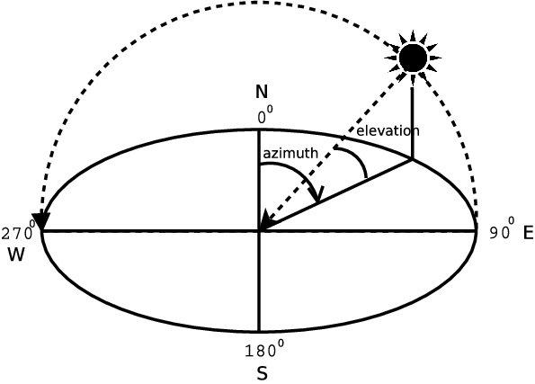

## [基本示例](examples.md)

[流量预测](tuto_G_traffic_prediction.md)


## [Carla 教程 (Python API)](https://github.com/wuhanstudio/carla-tutorial)

请使用 0.9.14 版本或者其他兼容 API 的 Carla 版本。

```
# 开始 Carla 模拟器
./CarlaUE4.sh -quality-level=epic -resx=800 -resy=600

# 如果您没有强大的 GPU
./CarlaUE4.sh -quality-level=low -resx=800 -resy=600
```

### Gallery

[示例 01](https://github.com/OpenHUTB/carla_doc/blob/master/src/tutorial/01_get_started.py) : 开始 (异步：车辆会有抖动感）


[示例 02](https://github.com/OpenHUTB/carla_doc/blob/master/src/tutorial/02_sync_mode.py) : 同步


[示例 03](https://github.com/OpenHUTB/carla_doc/blob/master/src/tutorial/03_RGB_camera.py) : RGB 相机


[示例 04](https://github.com/OpenHUTB/carla_doc/blob/master/src/tutorial/04_more_cameras.py) : 更多相机


[示例 05](https://github.com/OpenHUTB/carla_doc/blob/master/src/tutorial/05_open3d_lidar.py) : Open3D 激光雷达


[示例 06](https://github.com/OpenHUTB/carla_doc/blob/master/src/tutorial/06_trafic_manager.py) : 交通管理器


[示例 07](https://github.com/OpenHUTB/carla_doc/blob/master/src/tutorial/07_3d_bounding_boxes.py) : 3D 边界框，还包括 [2D边界框、服务端垂直视角](https://github.com/OpenHUTB/carla_doc/blob/master/src/tutorial/07_2d_bounding_boxes.py) 、[使用 3D 顶点计算遮挡](https://github.com/OpenHUTB/carla_doc/blob/master/src/tutorial/07_2d_bounding_boxes_occlusion.py)


[示例 08](https://github.com/OpenHUTB/carla_doc/blob/master/src/tutorial/08_draw_waypoints.py) : 绘制路径点


[示例 09](https://github.com/OpenHUTB/carla_doc/blob/master/src/tutorial/09_basic_navigation.py) : 基本导航


[示例 10](https://github.com/OpenHUTB/carla_doc/blob/master/src/tutorial/10_manual_control.py) : 手动控制


[示例 11](https://github.com/OpenHUTB/carla_doc/blob/master/src/examples/dynamic_weather.py) ：太阳高度的快速变化



示例 12 ：[反向AI控制](../src/examples/invertedai_traffic_ue5.py)

报错：`{ProxyError}HTTPSConnectionPool(host='api.inverted.ai', port=443): Max retries exceeded with url: /v0/aws/m1 (Caused by ProxyError('Unable to connect to proxy', SSLError(SSLZeroReturnError(6, 'TLS/SSL connection has been closed (EOF) (_ssl.c:1135)'))))`

解决：
```shell
pip install urllib3==1.25.11
```

## 参考

[shiojiri/tutorial](https://github.com/kodama3008/shiojiri/tree/main/tutorial)
