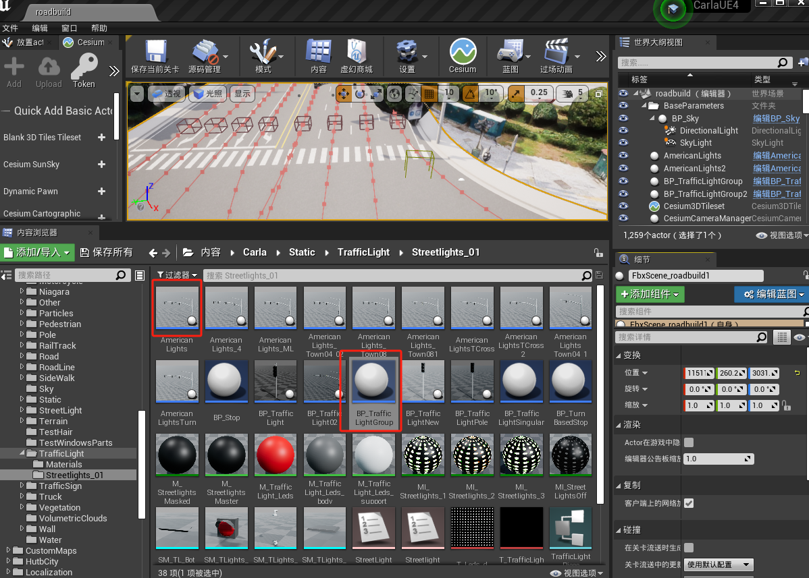
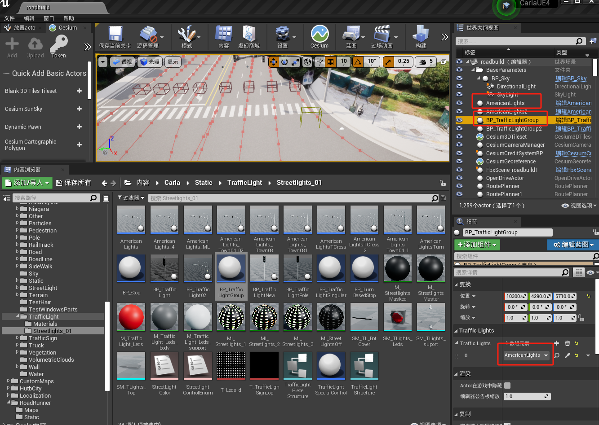
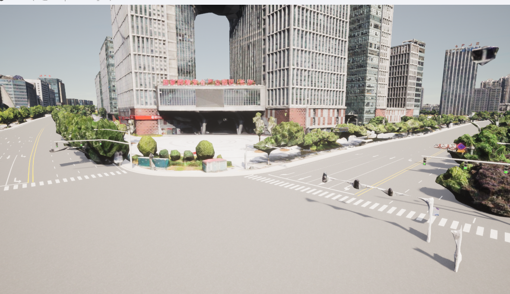
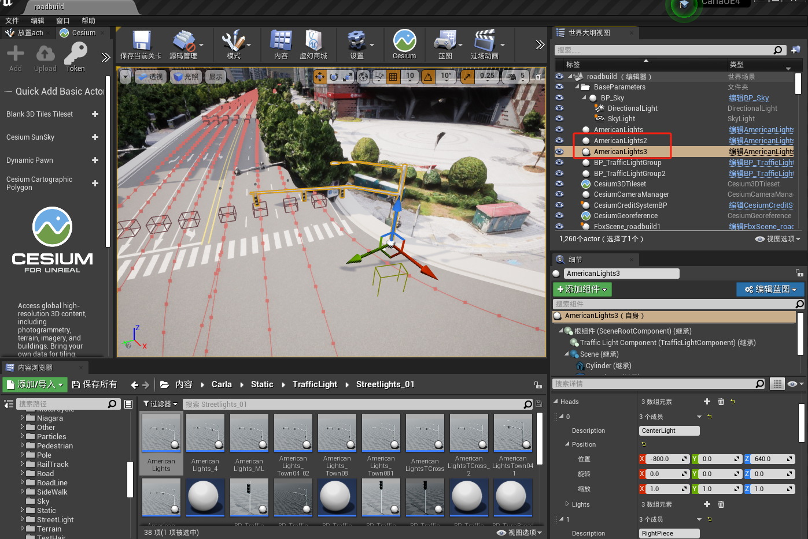
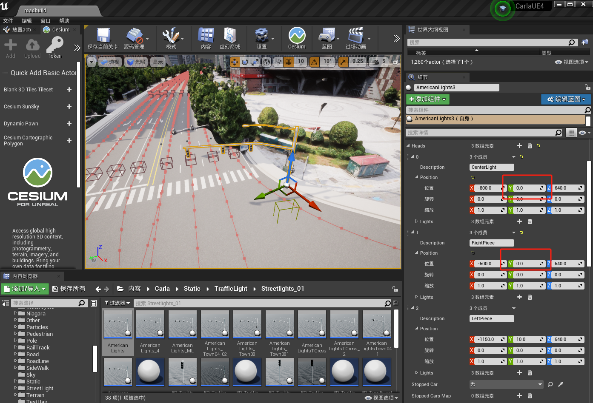
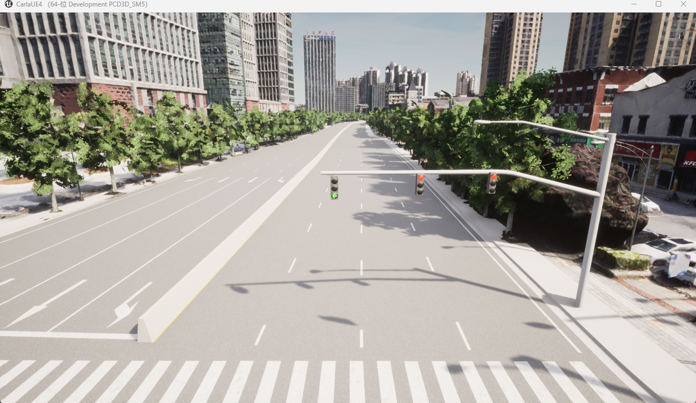

# 修改交通信号灯

### **1.交通信号灯分组**

由于在Carla仿真场景中的一个交叉路口的交通信号灯是分配在一个交通信号灯组内，那么红绿是相互影响的。同一时刻只有一个交通信号灯是处于绿灯状态，并且一个交通信号灯的红灯时间结束后会因为等待其他交通信号灯都显示一次绿灯而继续表现为红灯状态，这些都与现实是不符合的。

那么，我们单独将一个交通信号灯作为一组，如下图所示：

a.将AmericanLights和BP_TrafficLightGroup放入场景中

b.点击BP_TrafficLightGroup，选择AmericanLights作为该组元素，接下来对于每次添加的交通信号灯都单独的成一个分组

c.这样交通信号灯之间便互不影响，按各自配时运转，可以同时为绿灯，如图所示：

### 2.**交通信号灯拆分**

当前交通信号灯的左转、直行和右转是按照同一时间变化的，也就是说直行的同时，该方向车辆的最左侧车道还能在路口左转。因此，为了满足现实需要，要将交通信号灯的左转和直行方案分开。

我们是通过这样来实现这个功能的，如下图所示：

a.通过复制的方式将两个交通信号灯重叠在一起,或者自行设置相同的坐标

b.保留左转方向交通信号灯则调整该交通信号灯的右侧两个灯Y坐标后移暴露另一交通信号灯的右侧直行灯，然后将另一交通信号灯左转灯Y坐标后移，最后将这两个交通信号灯分到同一组内，但也会出现互相影响。

注意：删除某个交通信号灯上不需要的灯也是可行的，就是说不需要调整隐藏这个过程，但是测试显示，要保留左转灯而删除右侧两个灯时，左转灯变成圆形灯光效果！！

c.最后显示结果如下：

