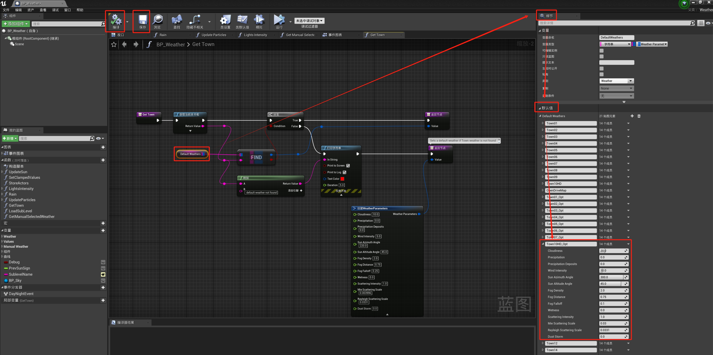

# 自定义地图：天气和景观

Carla 提供了多个蓝图，可帮助您轻松创建地图的默认天气设置，并使用序列化网格（例如路灯、电线等）填充景观。

本指南将解释每个蓝图的位置以及如何使用和配置它们。

- [__天气定制__](#weather-customization)
	- [BP_Sky](#bp_sky)
	- [BP_Weather](#bp_weather)
- [__序列化网格__](#add-serial-meshes)
	- [BP_RepSpline](#bp_repspline)
	- [BP_Spline](#bp_spline)
	- [BP_Wall](#bp_wall)
	- [BP_SplinePoweLine](#bp_splinepoweline)
- [__下一步__](#next-steps)

!!! 重要
    本教程仅适用于使用源代码构建并有权访问虚幻编辑器的用户。

---

## 天气定制

本节介绍如何在设置地图的默认天气之前尝试不同的天气参数，以及在对设置感到满意后如何为地图配置默认天气参数。

### BP_Sky

蓝图`BP_Sky`对于为地图带来光线和天气是必要的。在决定默认天气参数之前，它还可以用于测试不同的天气配置。

`BP_Sky` 蓝图可能已经加载到您的地图中。如果没有，您可以通过`Content/Carla/Blueprints/Weather`将其拖到场景中来添加它。

要尝试不同的天气参数，请转到 `BP_Sky` 参与者的 _Details_ 面板，然后使用 _Parameters_  部分中的值。

!!! 重要
    如果场景中加载了多个 `BP_Sky` 蓝图，天气将会重复，从而产生不良结果，例如，有两个太阳。

### BP_Weather

地图的默认天气在`BP_Weather`蓝图中定义。此蓝图允许您设置与通过 Python API 提供的参数相同的参数。[此处](https://carla.readthedocs.io/en/latest/python_api/#carlaweatherparameters) 描述了这些参数。

要设置地图的默认天气：

__1. 打开 `BP_Weather` 蓝图。__ 

在 _内容浏览器_ 中，导航至 `Content/Carla/Blueprints/Weather` 并双击 `BP_Weather` 。

__2. 添加您的城镇。__

在`BP_Weather`窗口的 _Details_ 面板中，转到 _Weather_ 部分并将您的城镇添加到 _Default Weathers_ 数组中。

__3. 配置默认天气参数。__

对于每个天气参数，设置您想要的值。完成后，按 _Compile_ ，然后按 _Save_ 并关闭。

>>>>> 

<i>包含每个 Carla 地图的默认天气参数的数组。Town01 打开。</i>

 

---

## 添加序列化网格

有四种蓝图可用于添加沿一个方向对齐的道具，例如墙壁、电线、路灯。这些蓝图使用一系列沿贝塞尔曲线分布的网格。每一个都以相同的方式初始化：

__1.  初始化序列。__

将蓝图拖到场景中。您将看到一个元素位于贝塞尔曲线的起点，并有两个节点标记开始和结束。

__2. 定义路径。__

选择元素的方向箭头，然后按 __Alt__  键，同时将元素向您想要移动的方向拖动。这将创建一个可用于定义曲线的新元素。拖动时，曲线的每个节点上或每次`Alt`拖动时按下时都会出现一个新网格，具体取决于蓝图。

__3. 定制图案。__

以下部分将描述每个蓝图可用的不同自定义参数。

### BP_RepSpline

蓝图`BP_RepSpline`可在 `Carla/Blueprints/LevelDesign` 中找到。它用于沿着贝塞尔曲线定义的路径添加 __单个__ 元素。

序列化是通过以下值自定义的：

- _Distance between_ — 设置元素之间的距离。
- _Offset rotation_ — 为不同轴设置固定旋转。
- _Random rotation_ — 设置不同轴的随机旋转范围。
- _Offset translation_ — 设置沿不同轴的一系列随机位置。
- _Max Number of Meshes_ — 设置将放置在曲线节点之间的元素的最大数量。
- _World aligned ZY_ — 如果选择此选项，元素将相对于世界轴垂直对齐。
- _EndPoint_ — 如果选择此选项，将在曲线的终点节点添加一个元素。
- _Collision enabled_ — 设置为网格启用的碰撞类型。

<i>BP_RepSpline 示例。</i>

### BP_Spline

蓝图`BP_Spline`可在 `Carla/Blueprints/LevelDesign` 中找到。它添加严格遵循贝塞尔曲线定义的路径的连接元素。网格将扭曲以适应创建的路径。

可以使用以下值自定义蓝图：

- _Gap distance_ — 在元素之间添加间隔。

<i>BP_Spline example.</i>

### BP_Wall

蓝图`BP_Wall`可在 `Carla/Blueprints/LevelDesign` 中找到。它沿着贝塞尔曲线定义的路径添加连接的元素。网格不会扭曲以适应曲线，但会考虑节点。

- _Distance between_ — 设置元素之间的距离。
- _Vertically aligned_ — 如果选择此选项，元素将相对于世界轴垂直对齐。
- _Scale offset_ — 缩放网格的长度以完善元素之间的连接。

<i>BP_Wall 实例。</i>

### BP_SplinePoweLine

__BP_SplinePoweLine__ 蓝图可在 `Carla/Static/Pole/PoweLine` 中找到。它沿着贝塞尔曲线定义的路径添加 __电线杆(electricity poles)__，并将它们 __与电线连接起来__。

为了提供多样性，您可以为蓝图提供一系列电力线网格来填充路径。去做这个：

1. 在 _Content Browser_ 中双击 __BP_SplinePoweLine__ 蓝图。
2. 在 _Details_ 面板中，转到 _Default_ 部分。
3. 展开 _Array Meshes_ 并根据您的需要添加或更改它。
4. 点击 _Compile_ ，然后保存并关闭窗口。

<i>BP_SplinePowerLine example.</i>

要改变电源线的线张力：

1. 在编辑器场景中选择蓝图参与者，然后转到  _Details_ 面板。
2. 转到 _Default_ 部分。
3. 调整张力 _Tension_ 中的值。 `0` 表示线条将是直的。

增加电线数量：

1. 在 _内容浏览器_ 中，双击其中一个杆网格。
2. 转到 _Socket Manager_ 面板。
3. 配置现有套接字或通过单击 _Create Socket_ 添加新套接字。插座是代表电源线连接点的空网格。在两极之间从插座到插座创建电线。

<i>BP_SplinePowerLine 套接字的可视化。</i>

 

!!! 重要
    各极之间的插座数量及名称应一致。否则，可能会出现可视化问题。

---

## 下一步

使用以下工具和指南继续自定义您的地图：

- [在地图中实现子关卡。](tuto_M_custom_layers.md)
- [添加和配置交通灯和标志。](tuto_M_custom_add_tl.md)
- [使用程序化构建工具添加建筑物。](tuto_M_custom_buildings.md)
- [使用道路画家工具自定义道路。](tuto_M_custom_road_painter.md)
- [使用序列化网格自定义景观。](tuto_M_custom_weather_landscape.md#add-serial-meshes)

完成定制后，您可以 [生成行人导航信息](tuto_M_generate_pedestrian_navigation.md) 。

---

如果您对流程有任何疑问，可以在 [论坛](https://github.com/carla-simulator/carla/discussions) 中提问。

<a href="https://github.com/carla-simulator/carla/discussions" target="_blank" class="btn btn-neutral" title="Go to the CARLA forum">
Carla 论坛</a>

