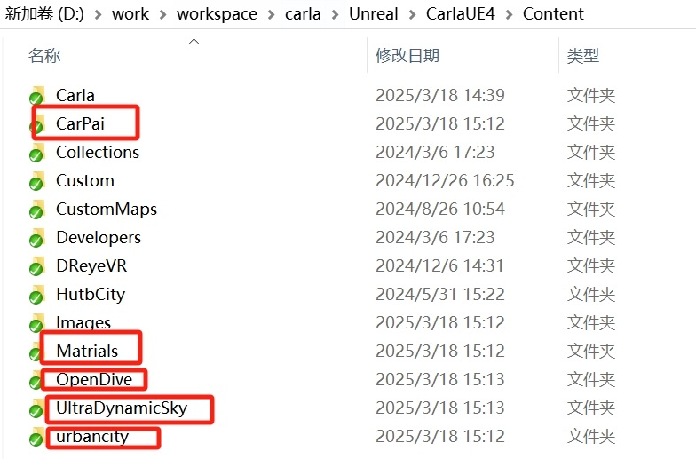
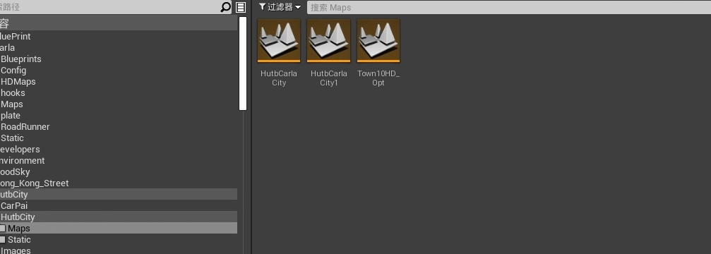
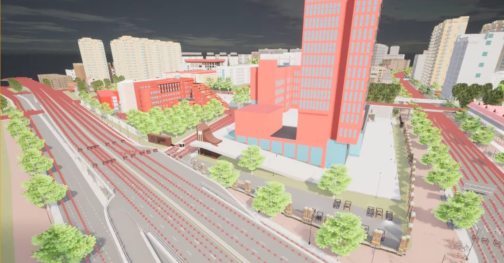

# 导入湖工商地图

将 Content 目录下的 CarPai、Matrials、UltraDynamicSky、urbancity 文件夹拷贝到 `carla\Unreal\CarlaUE4\Content`。



然后进入Carla编辑器
随后可以进入对应的Map即可找到湖工商Map点击即可进入



HUTB场景




## 问题
运行`manual_control.py`报错：
```text
ERROR: unable to parse the OpenDRIVE XML string 
RuntimeError: failed to generate map
  The server could not send the OpenDRIVE (.xodr) file:
  Make sure it exists, has the same name of your town, and is correct.
```

解决：在`Content\Carla\RoadRunner\Maps`目录下新建一个目录`OpenDrive`，把`HutbCarlaCity.xodr`拷贝到此处。

## 参考
* [原始仓库](https://bitbucket.org/hutbcity/openhutbcarla/src/main/) 
