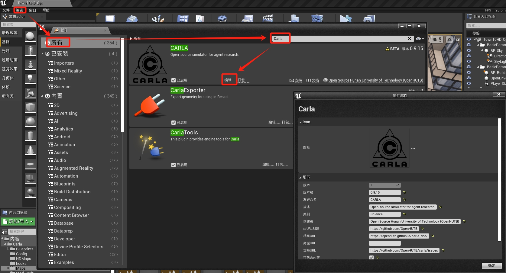

# Carla 插件


`Carla.uplugin`是插件json格式的插件描述文件，可以在插件编辑器中进行修改。



```json
{
	"FileVersion": 3,
	"Version": 1,
	"VersionName": "0.9.15",
	"FriendlyName": "CARLA",
	"Description": "Open-source simulator for autonomous driving research.",
	"Category": "Science",
	"CreatedBy": "Computer Vision Center (CVC) at the Universitat Autonoma de Barcelona (UAB)",
	"CreatedByURL": "http://carla.org",
	"DocsURL": "http://carla.readthedocs.io",
	"MarketplaceURL": "",
	"SupportURL": "https://github.com/carla-simulator/carla/issues",
	"CanContainContent": true,
	"IsBetaVersion": true,
	"Installed": true,
	"Modules": [
		{
			"Name": "Carla",
			"Type": "Runtime",
			"LoadingPhase": "PreDefault",
			"AdditionalDependencies": [
				"Engine"
			]
		}
	],
	"Plugins": [
		{
			"Name": "PhysXVehicles",
			"Enabled": true
		},
		{
			"Name": "ProceduralMeshComponent",
			"Enabled": true
		}
	]
}
```

## 参考

* [Unreal 插件](https://www.jianshu.com/p/e41a810b10ca)