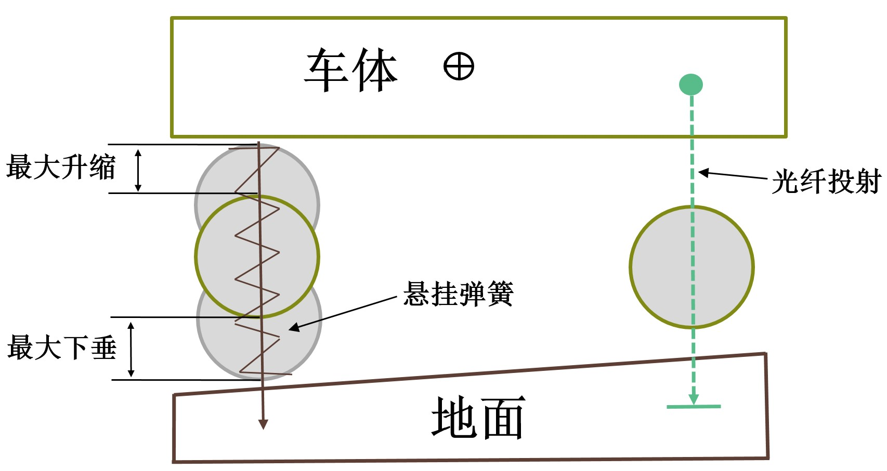

# 车辆模型

Carla 中的车辆模型包括**3D模型**和**动力学模型**两个方面。3D模型用于实现车辆的可视化渲染，可以在3D模型开发软件中设计、开发，并导入到 [虚幻引擎](https://link.zhihu.com/?target=https%3A//docs.unrealengine.com/4.26/en-US/InteractiveExperiences/Vehicles/VehicleUserGuide/) 中使用。动力学模型用于实现车辆逼真的动态效果，Carla 中的车辆采用中的虚幻引擎中的 AWheeledVehicle 模型（核心是 [NVIDIA的PhysX模型](https://developer.nvidia.cn/physx-sdk) ）。

PhysX 考虑了不同的车轮数量，但是为了说明的简单，本节将车辆简化为两轮模型，将车体（簧上质量）简化为前轴质量和后轴质量，并通过悬架与车轮（簧下质量）相连，如下图所示。

在静止状态下，由力平衡和力矩平衡可由以下公式得到：

$$
\left\{
    \begin{array}{**lr**}
    M = M_f + M_r \\
    M \times X_{cm} = M_f \times X_f + M_r \times X_r
    \end{array}
\right.
$$
其中，\( M \)、\( M_f \) 和 \( M_r \) 分别为总质量、前轴质量和后轴质量，\( X_{cm} \)、\( X_f \)、\( X_r \) 分别为质心与几何中心的水平距离、前轴与几何中心的距离、后轴与几何中心的水平距离。

仿真运行进行更新时，首先采用光线投射方法（raycast），进行悬架位置的计算，如下图。将车轮与地面的接触位置简化为一个轮胎触点，光线投射从车轮最高点开始，并沿着悬架舒张方向向下投射到车轮最低点为止，计算出车辆与地面的接触点以及车轮的位置，进而计算悬架的压缩量和弹簧力，并结合驱动力和行驶阻力计算簧上质量和簧下质量所有受到的外力。然后便可建立车辆各部件的方程，对各种状态进行求解。

## 车辆的添加和使用
车辆Vehicle作为交通参与者Actor的重要类型，其使用方式也按照交通参与者Actor的三个步骤，即：选取蓝图并生成（spawning）、操作（handling）、销毁（destruction）。

### （1）选取蓝图并生成（spawning）
生成交通参与者使用World的`try_spawn_actor(blueprint, spwan_point)`方法，该方法需要指定准备生成的交通参与者的蓝图blueprint以及生成的位置spwan_point。

代码的第16行，从蓝图库中获取了 vehicle.tesla.model3 作为我们准备生成的车型。代码的第19~33行通过全局变量SPAWN_POINT可以配置两种不同的生成位置获取方法：

①SPAWN_POINT为“spectator”时，在spectator当前的位置生成。观察者spectator是一个特殊的actor，用于调整CARLA渲染窗口的视角，该视角可以通过键盘上的W/A/S/D和鼠标拖动进行调整，也可以设置其位置和朝向，代码的第58~64行，设置观察者spectator跟随ego车辆的位置和朝向；

②SPAWN_POINT为“random”时，在预先定义的生成点中随机选择。为方便交通参与者的生成，CARLA的地图中提供了很多预先定义的生成点，这些生成点在地图上的所有范围都有分布，可通过代码第28~31行进行可视化，效果下图所示：

### （2）操作（handling）
操作包含仿真运行期间所有对交通参与者的处理，如参数设置、状态获取和控制等。车辆Vehicle的属性和方法既包括交通参与者Actors公有的内容，也包含车辆Vehicle特有的内容。

车辆模型的参数可参照第42~50行获取和设置。bounding_box是车辆的外接长方体，其bounding_box.extent属性中的x/y/z分别是几何中心距离三个面的距离，其实也就是长宽高的一半。`get_physics_control()`可获取车辆模型的物理参数，具体如下表所示：

| **序号** | **参数名**                                      | **内容**                                           |
|--------|----------------------------------------------|--------------------------------------------------|
| 1      | torque_curve                                 | 发动机转矩曲线，\( x \) 为发动机转速(r/min)，\( y \) 为相应的转矩(Nm) | 
| 2      | max_rpm                                      | 发动机的最大转速（r/min）                                  | 
| 3      | moi                                          | 发动机的转动惯量（kg*m2/s）                                | 
| 4      | damping_rate_full_throttle                   | 最大油门开度的阻尼系数（kg*m2/s）                             | 
| 5      | damping_rate_zero_throttle_clutch_engaged    | 零油门开度离合器结合的阻尼系数（kg*m2/s）                         | 
| 6      | damping_rate_zero_throttle_clutch_disengaged | 零油门开度离合器分离的阻尼系数（kg*m2/s）                         | 
| 7      | use_gear_autobox                             | 是否使用自动变速器                                        | 
| 8      | gear_switch_time                             | 换挡时的齿轮切换时间（s）                                    | 
| 9      | clutch_strength                              | 离合器强度（kg*m2/s），该值乘以两个摩擦盘的速度差得到摩擦力矩               | 
| 10     | final_ratio                                  | 主减速器传动比                                          | 
| 11     | forward_gears                                | 前进挡各挡位传动比                                        | 
| 12     | mass                                         | 质量（kg）                                           | 
| 13     | drag_coefficient                             | 空气阻力系数                                           | 
| 14     | center_of_mass                               | 质心位置（相对于几何中心）                                    | 
| 15     | steering_curve                               | 转向曲线，\( x \) 为车速， \( y \) 为该车速下的最大转向角            | 
| 15     | use_sweep_wheel_collision                    | 是否采用车轮碰撞模式，默认禁用，而是采用简单的光线投射计算地点                  | 

Carla 中旋转部件（如发动机、车轮）在只受阻尼力矩时的，新角速度的计算公式为：
$$
w_{new} = w_{old} - \frac{\mu_{damp} \times w_{old}}{M} dt
$$
其中，\( w_{new} \) 和 \( w_{old} \) 分别为当前帧的的新角速度与上一帧的旧角速度，\( \mu_{damp} \) 为阻尼系数，\( M \) 为转动惯量，\( dt \) 为仿真步长。
对于发动机，其阻尼系数根据油门开度的不同进行线性插值得到，如下公式所示：
$$
\mu_{damp} = \mu_{zero} + (\mu_{full} - \mu_{zero}) \times \alpha
$$
其中，\( \mu_{damp} \) 为插值后的阻尼系数，离合器结合时 \( \mu_{zero} \) 为零油门开度离合器结合的阻尼系数 `damping_rate_zero_throttle_clutch_engaged`，离合器分离时 \( \mu_{zero} \) 为零油门开度离合器分离的阻尼系数`damping_rate_zero_throttle_clutch_disengaged`，\( \mu_{full} \)  为最大油门开度的阻尼系数`damping_rate_full_throttle`，\( \alpha \) 为油门开度。

轮胎的侧向力可由下式计算得到：
$$
F_{Y} = K_{Y} \times S_{Y} \times F_{N}
$$
其中，当轮胎的实际负载 \( F_Z \) 不小于饱和负载 \( K_N \times F_N \) 时，\( K_Y \) 为侧向刚度系数 lat_stiff_value，当轮胎的实际负载小于饱和负载时，\( K_Y \) 由平滑的插值得到（暂时没搞明白是怎么插值的）。一个插值的示例如下图所示，该示例中饱和负载时，\( K_N=3，K_Y=18 \)。\( s_Y \) 为弧度表示的侧向滑移角度，\( K_N \) 为饱和负载系数lat_stiff_max_load，\( F_N \) 为车辆完全静止时的车轮负载。

CARLA提供了不同的方法对车辆进行控制，如：

①采用Actor的方法进行控制，如通过set_target_velocity方法设置目标速度、通过set_transform方法设置位姿；

②采用Vehicle的apply_ackermann_control方法设置目标转向角、速度和加速度等；

③采用Vehicle的apply_control方法设置油门、制动和转向比例；

④设置车辆为自动驾驶模式，由Traffic Manager模块对车辆进行控制。

这四种方法在代码的66~83行进行了示例，并可通过全局变量CONTROL_MODE取值进行设置。

仿真运行中可获取车辆运行状态用于计算、显示等后续处理，代码85~91行对车辆的位姿、速度和加速度进行了获取和打印。

### （3）销毁（destruction）
运行帧数大于10000后，跳出53行的while循环，在94行对车辆进行了销毁处理。

需要补充说明的是，本示例中采用了 Carla 默认的异步变步长模式，仿真运行由 Carla 的服务端Server自行触发，这样的话在客户端获取信息或者进行设置时需要等待触发才能生效，这就是代码中`world.wait_for_tick()`的用处所在。

实现代码位于 [wheeled_vehicle_demo.py](https://github.com/OpenHUTB/carla_doc/tree/master/src/vehicle/wheeled_vehicle_demo.py) 。

# 参考

- [CARLA的车辆模型](https://zhuanlan.zhihu.com/p/668724369)