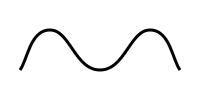
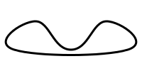

[ENGLISH](./README_EN.md)

<h1 align="center">Bezier Curve Extension</h1>

<p align="center">
    <a href="https://travis-ci.com/jiaming743/bezierCurve"></a>
    <a href="https://github.com/jiaming743/BezierCurve/blob/master/LICENSE"> </a>
    <a href="https://www.npmjs.com/package/@jiaminghi/bezier-curve"> </a>
</p>

### 这是一个提供如下几个方法的三次贝塞尔曲线插件。

- **[bezierCurveToPolyline](#bezierCurveToPolyline)**

  将贝塞尔曲线抽象成由N个**均匀分布**的点构成的折线

- **[getBezierCurveLength](#getBezierCurveLength)**

  获取贝塞尔曲线的长度

- **[polylineToBezierCurve](#polylineToBezierCurve)**

  将由N个点构成的折线抽象成光滑的贝塞尔曲线

### npm安装

```shell
$ npm install @jiaminghi/bezier-curve
```

### 使用

```javascript
import bezierCurve from '@jiaminghi/bezier-curve'

// do something
```

### 快速体验

```html
<!--资源位于个人服务器仅供体验和测试，请勿在生产环境使用-->
<!--调试版-->
<script src="http://lib.jiaminghi.com/bezierCurve/bezierCurve.map.js"></script>
<!--压缩版-->
<script src="http://lib.jiaminghi.com/bezierCurve/bezierCurve.min.js"></script>
<script>
    const { bezierCurveToPolyline, getBezierCurveLength, polylineToBezierCurve } = window.bezierCurve
    // do something
</script>
```

------

<h3 align="center">示例</h3>

#### bezierCurve

```javascript
// 贝塞尔曲线数据结构
const bezierCurve = [
    // 起始点
	[20, 20],
    // 多段贝塞尔曲线
    [
        // 控制点1，控制点2，结束点
        [100, 20],[100, 80],[180,80]
    ],
    // 下一段贝塞尔曲线的起始点是上一段的结束点
    // [...],[...]
]
```

<p align="center">
    
</p>

<p align="center"><i>bezierCurve</i> in <b>SVG</b></p>

#### bezierCurveToPolyline

```javascript
/**
 * @description 通过贝塞尔曲线获取折线
 * @param {Array} bezierCurve 贝塞尔曲线数据
 * @param {Number} precision  计算精度 建议5-10 默认为5
 * @return {Array|Boolean} 构成折线的点集 (无效输入将返回false)
 */
function bezierCurveToPolyline (bezierCurve, precision = 5) {
  // ...
}

const precision = 5

const polyline = bezierCurveToPolyline(bezierCurve, precision)
// polyline = [
// [[20,20],
// [25.998752507628243,20.11632023466343],[31.698106846035834,20.457189096242345],
// [37.11424670004552,21.010468821119716],[42.263355754480024,21.764021645678454],
// ...]
```

<p align="center">
    
</p>

<p align="center"><i>polyline</i> in <b>SVG</b></p>

#### Notice

- *bezierCurveToPolyline*的计算结果是由N个点构成的折线，N取决于设置的精度。
- 理想情况下，计算结果中相邻的两个点的距离等于设置的精度（单位px）。
- 建议精度5-10。
- 如果设置的精度过小或过大（小于1或大于10），可能导致计算异常。
- 设置的精度并不是每次都能达到。


#### getBezierCurveLength

```js
/**
 * @description 获取贝塞尔曲线长度
 * @param {Array} bezierCurve 贝塞尔曲线数据
 * @param {Number} precision  计算精度 建议5-10 默认为5
 * @return {Number|Boolean} 贝塞尔曲线长度 (无效输入将返回false)
 */
export function getBezierCurveLength (bezierCurve, precision = 5) {
  // ...
}

// 通常情况下，默认精度已经能够达到较好的视觉效果。
const length = bezierCurveToPolyline(bezierCurve)
```


#### polyline

```javascript
// 折线数据结构
const polyline = [
    [20, 70],
    [50, 30],
    [100, 70],
    [150, 30],
    [180, 70]
]
```

<p align="center">
    
</p>

<p align="center"><i>polyline</i> in <b>SVG</b></p>


#### polylineToBezierCurve

```javascript
/**
 * @description 将由N个点构成的折线抽象为光滑的贝塞尔曲线
 * @param {Array} polyline 由N个点构成的折线数据
 * @param {Boolean} close  是否闭合
 * @param {Number} offsetA 光滑程度
 * @param {Number} offsetB 光滑程度
 * @return {Array|Boolean} 贝塞尔曲线数据 (无效输入将返回false)
 */
function polylineToBezierCurve (polyline, close = false, offsetA = 0.25, offsetB = 0.25) {
	// ...
}

const bezierCurve = polylineToBezierCurve(polyline)
// bezierCurve = [
// [
// 	[20,70],
// 	[[27.5,60],[30,30],[50,30]],
// 	[[70,30],[75,70],[100,70]],
// 	[[125,70],[130,30],[150,30]],
// 	[[170,30],[172.5,60],[180,70]]]
//]

const closedBezierCurve = polylineToBezierCurve(polyline, true)
// closedBezerCurve = [
// 	[20,70],
// 	[[-12.5,60],[30,30],[50,30]],
// 	[[70,30],[75,70],[100,70]],
// 	[[125,70],[130,30],[150,30]],
// 	[[170,30],[212.5,60],[180,70]],
// 	[[147.5,80],[52.5,80],[20,70]]
// ]
```

<p align="center">
    
</p>

<p align="center"><i>bezierCurve</i> in <b>SVG</b></p>

<p align="center">
    
</p>

<p align="center"><i>closedBezierCurve</i> in <b>SVG</b></p>

